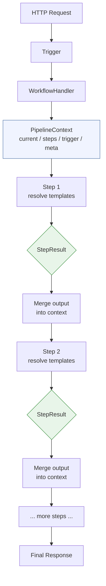

# Workflow Engine Documentation

## Overview

The Workflow Engine is a configuration-driven orchestration platform built in Go. It turns YAML configuration files into running applications with no code changes required. The engine provides 100+ built-in module types, a visual workflow builder UI, a multi-tenant admin platform, AI-assisted configuration generation, and dynamic hot-reload of Go components at runtime.

## Core Engine

The engine is built on the [CrisisTextLine/modular](https://github.com/CrisisTextLine/modular) framework for module lifecycle, dependency injection, and service registry management.

**Key capabilities:**
- YAML-driven configuration with environment variable expansion (`${JWT_SECRET}`)
- Config validation via JSON Schema
- Module factory registry with 50+ built-in types
- Trigger-based workflow dispatch (HTTP, EventBus, cron schedule)
- Graceful lifecycle management (start/stop)

**CLI tools:**
- `cmd/server` -- runs workflow configs as a server process
- `cmd/wfctl` -- validates and inspects workflow configs offline

## Module Types (100+)

All modules are instantiated from YAML config via the plugin factory registry. Organized by category. Each module type is provided by a plugin (see **Plugin** column); all are included when using `plugins/all`.

> **Plugin tiers:** *Core* plugins are loaded by default. Plugin column shows which plugin package registers the type.

### HTTP & Routing
| Type | Description | Plugin |
|------|-------------|--------|
| `http.server` | Configurable web server | http |
| `http.router` | Request routing with path and method matching | http |
| `http.handler` | HTTP request processing with configurable responses | http |
| `http.proxy` | HTTP reverse proxy | http |
| `http.simple_proxy` | Simplified proxy configuration | http |
| `reverseproxy` | Modular framework reverse proxy (v2) | http |
| `static.fileserver` | Static file serving | http |
| `openapi` | OpenAPI v3 spec-driven HTTP route generation with request/response validation and Swagger UI | openapi |

> `httpserver.modular`, `httpclient.modular`, and `chimux.router` were removed in favour of `http.server`, `http.router`, and `reverseproxy`.

### Middleware
| Type | Description | Plugin |
|------|-------------|--------|
| `http.middleware.auth` | Authentication middleware | http |
| `http.middleware.cors` | CORS header management | http |
| `http.middleware.logging` | Request/response logging | http |
| `http.middleware.ratelimit` | Rate limiting | http |
| `http.middleware.requestid` | Request ID injection | http |
| `http.middleware.securityheaders` | Security header injection | http |
| `http.middleware.otel` | OpenTelemetry request tracing middleware | observability |

### Authentication
| Type | Description | Plugin |
|------|-------------|--------|
| `auth.jwt` | JWT authentication with seed users, persistence, token refresh | auth |
| `auth.user-store` | User storage backend | auth |
| `auth.oauth2` | OAuth2 authorization code flow (Google, GitHub, generic OIDC) | auth |
| `auth.m2m` | Machine-to-machine OAuth2: client_credentials grant, JWT-bearer, ES256/HS256, JWKS endpoint | auth |
| `auth.token-blacklist` | Token revocation blacklist backed by SQLite or in-memory store | auth |
| `security.field-protection` | Field-level encryption/decryption for sensitive data fields | auth |

> `auth.modular` was removed in favour of `auth.jwt`.

### API & CQRS
| Type | Description | Plugin |
|------|-------------|--------|
| `api.handler` | Generic REST resource handler | api |
| `api.command` | CQRS command handler with route pipelines | api |
| `api.query` | CQRS query handler with route pipelines | api |
| `api.gateway` | Composable API gateway: routing, auth, rate limiting, CORS, and reverse proxying | api |
| `workflow.registry` | SQLite-backed registry for companies, organizations, projects, and workflows | api |
| `data.transformer` | Data transformation between formats using configurable pipelines | api |
| `processing.step` | Executes a component as a processing step in a workflow, with retry and compensation | api |

### State Machine
| Type | Description | Plugin |
|------|-------------|--------|
| `statemachine.engine` | State definitions, transitions, hooks, auto-transitions | statemachine |
| `state.tracker` | State observation and tracking | statemachine |
| `state.connector` | State machine interconnection | statemachine |

### Messaging
| Type | Description | Plugin |
|------|-------------|--------|
| `messaging.broker` | In-memory message broker | messaging |
| `messaging.broker.eventbus` | EventBus-backed message broker | messaging |
| `messaging.handler` | Message processing handler | messaging |
| `messaging.kafka` | Apache Kafka broker integration | messaging |
| `messaging.nats` | NATS broker integration | messaging |
| `notification.slack` | Slack notification sender | messaging |
| `webhook.sender` | Outbound webhook delivery with retry and dead letter | messaging |

> `eventbus.modular` was removed in favour of `messaging.broker.eventbus`.

### Database & Persistence
| Type | Description | Plugin |
|------|-------------|--------|
| `database.workflow` | Workflow-specific database (SQLite + PostgreSQL) | storage |
| `persistence.store` | Write-through persistence (SQLite/PostgreSQL) | storage |
| `database.partitioned` | PostgreSQL partitioned database for multi-tenant data isolation (LIST/RANGE partitions) | storage |

> `database.modular` was removed in favour of `database.workflow`.

### NoSQL / Datastores
| Type | Description | Plugin |
|------|-------------|--------|
| `nosql.memory` | In-memory key-value NoSQL store for development and testing | datastores |
| `nosql.dynamodb` | AWS DynamoDB NoSQL store | datastores |
| `nosql.mongodb` | MongoDB document store | datastores |
| `nosql.redis` | Redis key-value store | datastores |

### Pipeline Steps

Pipeline execution flow:



| Type | Description | Plugin |
|------|-------------|--------|
| `processing.step` | Configurable processing step | api |
| `step.validate` | Validates pipeline data against required fields or JSON schema | pipelinesteps |
| `step.transform` | Transforms data shape and field mapping | pipelinesteps |
| `step.conditional` | Conditional branching based on field values | pipelinesteps |
| `step.set` | Sets values in pipeline context with template support | pipelinesteps |
| `step.log` | Logs pipeline data for debugging | pipelinesteps |
| `step.publish` | Publishes events to EventBus | pipelinesteps |
| `step.event_publish` | Publishes events to EventBus with full envelope control | pipelinesteps |
| `step.http_call` | Makes outbound HTTP requests | pipelinesteps |
| `step.delegate` | Delegates to a named service | pipelinesteps |
| `step.request_parse` | Extracts path params, query params, and request body from HTTP requests | pipelinesteps |
| `step.db_query` | Executes parameterized SQL SELECT queries against a named database | pipelinesteps |
| `step.db_exec` | Executes parameterized SQL INSERT/UPDATE/DELETE against a named database | pipelinesteps |
| `step.db_query_cached` | Executes a cached SQL SELECT query | pipelinesteps |
| `step.db_create_partition` | Creates a time-based table partition | pipelinesteps |
| `step.db_sync_partitions` | Ensures future partitions exist for a partitioned table | pipelinesteps |
| `step.json_response` | Writes HTTP JSON response with custom status code and headers | pipelinesteps |
| `step.raw_response` | Writes a raw HTTP response with arbitrary content type | pipelinesteps |
| `step.static_file` | Serves a pre-loaded file from disk as an HTTP response | pipelinesteps |
| `step.workflow_call` | Invokes another workflow pipeline by name | pipelinesteps |
| `step.sub_workflow` | Executes a named sub-workflow inline and merges its output | ai |
| `step.validate_path_param` | Validates a URL path parameter against a set of rules | pipelinesteps |
| `step.validate_pagination` | Validates and normalizes pagination query params | pipelinesteps |
| `step.validate_request_body` | Validates request body against a JSON schema | pipelinesteps |
| `step.foreach` | Iterates over a slice and runs sub-steps per element. Optional `concurrency: N` for parallel processing | pipelinesteps |
| `step.parallel` | Executes named sub-steps concurrently and collects results. O(max(branch)) time | pipelinesteps |
| `step.webhook_verify` | Verifies an inbound webhook signature | pipelinesteps |
| `step.base64_decode` | Decodes a base64-encoded field | pipelinesteps |
| `step.cache_get` | Reads a value from the cache module | pipelinesteps |
| `step.cache_set` | Writes a value to the cache module | pipelinesteps |
| `step.cache_delete` | Deletes a value from the cache module | pipelinesteps |
| `step.ui_scaffold` | Generates UI scaffolding from a workflow config | pipelinesteps |
| `step.ui_scaffold_analyze` | Analyzes UI scaffold state for a workflow | pipelinesteps |
| `step.dlq_send` | Sends a message to the dead-letter queue | pipelinesteps |
| `step.dlq_replay` | Replays messages from the dead-letter queue | pipelinesteps |
| `step.retry_with_backoff` | Retries a sub-pipeline with exponential backoff | pipelinesteps |
| `step.resilient_circuit_breaker` | Wraps a sub-pipeline with a circuit breaker | pipelinesteps |
| `step.s3_upload` | Uploads a file or data to an S3-compatible bucket | pipelinesteps |
| `step.auth_validate` | Validates an authentication token and populates claims | pipelinesteps |
| `step.token_revoke` | Revokes an auth token | pipelinesteps |
| `step.field_reencrypt` | Re-encrypts a field with a new key | pipelinesteps |
| `step.sandbox_exec` | Executes a command inside a sandboxed container | pipelinesteps |
| `step.http_proxy` | Proxies an HTTP request to an upstream service | pipelinesteps |
| `step.hash` | Computes a cryptographic hash (md5/sha256/sha512) of a template-resolved input | pipelinesteps |
| `step.regex_match` | Matches a regular expression against a template-resolved input | pipelinesteps |
| `step.jq` | Applies a JQ expression to pipeline data for complex transformations | pipelinesteps |
| `step.ai_complete` | AI text completion using a configured provider | ai |
| `step.ai_classify` | AI text classification into named categories | ai |
| `step.ai_extract` | AI structured data extraction using tool use or prompt-based parsing | ai |
| `step.actor_send` | Sends a fire-and-forget message to an actor pool (Tell) | actors |
| `step.actor_ask` | Sends a request-response message to an actor and returns the response (Ask) | actors |
| `step.rate_limit` | Applies per-client or global rate limiting to a pipeline step | http |
| `step.circuit_breaker` | Wraps a sub-pipeline with a circuit breaker (open/half-open/closed) | http |
| `step.feature_flag` | Evaluates a feature flag and branches based on the result | featureflags |
| `step.ff_gate` | Blocks execution unless a named feature flag is enabled | featureflags |
| `step.authz_check` | Evaluates an authorization policy (OPA, Casbin, or mock) for the current request | policy |
| `step.cli_invoke` | Invokes a registered CLI command by name | scheduler |
| `step.cli_print` | Prints output to stdout (used in CLI workflows) | scheduler |
| `step.statemachine_transition` | Triggers a state machine transition for the given entity | statemachine |
| `step.statemachine_get` | Retrieves the current state and metadata for a state machine entity | statemachine |
| `step.nosql_get` | Reads a document from a NoSQL store by key | datastores |
| `step.nosql_put` | Writes a document to a NoSQL store | datastores |
| `step.nosql_delete` | Deletes a document from a NoSQL store by key | datastores |
| `step.nosql_query` | Queries a NoSQL store with filter expressions | datastores |
| `step.artifact_upload` | Uploads a file to the artifact store | storage |
| `step.artifact_download` | Downloads a file from the artifact store | storage |
| `step.artifact_list` | Lists artifacts in the store for a given prefix | storage |
| `step.artifact_delete` | Deletes an artifact from the store | storage |
| `step.secret_rotate` | Rotates a secret in the configured secrets backend | secrets |
| `step.cloud_validate` | Validates cloud account credentials and configuration | cloud |
| `step.trace_start` | Starts an OpenTelemetry trace span for the current pipeline | observability |
| `step.trace_inject` | Injects trace context headers into outgoing request metadata | observability |
| `step.trace_extract` | Extracts trace context from incoming request headers | observability |
| `step.trace_annotate` | Adds key/value annotations to the current trace span | observability |
| `step.trace_link` | Links the current span to an external span by trace/span ID | observability |
| `step.gitlab_trigger_pipeline` | Triggers a GitLab CI/CD pipeline via the GitLab API | gitlab |
| `step.gitlab_pipeline_status` | Polls a GitLab pipeline until it reaches a terminal state | gitlab |
| `step.gitlab_create_mr` | Creates a GitLab merge request | gitlab |
| `step.gitlab_mr_comment` | Adds a comment to a GitLab merge request | gitlab |
| `step.gitlab_parse_webhook` | Parses and validates an inbound GitLab webhook payload | gitlab |
| `step.policy_evaluate` | Evaluates a named policy with the given input and returns allow/deny | policy |
| `step.policy_load` | Loads a policy definition into the policy engine at runtime | policy |
| `step.policy_list` | Lists all loaded policies in the policy engine | policy |
| `step.policy_test` | Runs a policy against test cases and reports pass/fail | policy |
| `step.marketplace_search` | Searches the plugin marketplace for available extensions | marketplace |
| `step.marketplace_detail` | Fetches detail information for a marketplace plugin | marketplace |
| `step.marketplace_install` | Installs a plugin from the marketplace | marketplace |
| `step.marketplace_installed` | Lists installed marketplace plugins | marketplace |
| `step.marketplace_uninstall` | Uninstalls a marketplace plugin | marketplace |
| `step.marketplace_update` | Updates a marketplace plugin to the latest version | marketplace |

### CI/CD Pipeline Steps
| Type | Description | Plugin |
|------|-------------|--------|
| `step.docker_build` | Builds a Docker image from a context directory and Dockerfile | cicd |
| `step.docker_push` | Pushes a Docker image to a remote registry | cicd |
| `step.docker_run` | Runs a command inside a Docker container via sandbox | cicd |
| `step.scan_sast` | Static Application Security Testing (SAST) via configurable scanner | cicd |
| `step.scan_container` | Container image vulnerability scanning via Trivy | cicd |
| `step.scan_deps` | Dependency vulnerability scanning via Grype | cicd |
| `step.artifact_push` | Stores a file in the artifact store for cross-step sharing | cicd |
| `step.artifact_pull` | Retrieves an artifact from a prior execution, URL, or S3 | cicd |
| `step.shell_exec` | Executes an arbitrary shell command | cicd |
| `step.build_binary` | Builds a Go binary using `go build` | cicd |
| `step.build_from_config` | Builds the workflow server binary from a YAML config | cicd |
| `step.build_ui` | Builds the UI assets from a frontend config | cicd |
| `step.deploy` | Deploys a built artifact to an environment | cicd |
| `step.gate` | Manual approval gate — pauses pipeline until an external signal is received | cicd |
| `step.git_clone` | Clones a Git repository | cicd |
| `step.git_commit` | Commits staged changes in a local Git repository | cicd |
| `step.git_push` | Pushes commits to a remote Git repository | cicd |
| `step.git_tag` | Creates and optionally pushes a Git tag | cicd |
| `step.git_checkout` | Checks out a branch, tag, or commit in a local repository | cicd |
| `step.codebuild_create_project` | Creates an AWS CodeBuild project | cicd |
| `step.codebuild_start` | Starts an AWS CodeBuild build | cicd |
| `step.codebuild_status` | Polls an AWS CodeBuild build until completion | cicd |
| `step.codebuild_logs` | Fetches logs from an AWS CodeBuild build | cicd |
| `step.codebuild_list_builds` | Lists recent AWS CodeBuild builds for a project | cicd |
| `step.codebuild_delete_project` | Deletes an AWS CodeBuild project | cicd |

### Platform & Infrastructure Pipeline Steps
| Type | Description | Plugin |
|------|-------------|--------|
| `step.platform_template` | Renders an infrastructure template (Terraform, Helm, etc.) with pipeline context variables | platform |
| `step.k8s_plan` | Generates a Kubernetes deployment plan (dry-run) | platform |
| `step.k8s_apply` | Applies a Kubernetes manifest or deployment config | platform |
| `step.k8s_status` | Retrieves the status of a Kubernetes workload | platform |
| `step.k8s_destroy` | Tears down a Kubernetes workload | platform |
| `step.ecs_plan` | Generates an ECS task/service deployment plan | platform |
| `step.ecs_apply` | Deploys a task or service to AWS ECS | platform |
| `step.ecs_status` | Retrieves the status of an ECS service | platform |
| `step.ecs_destroy` | Removes an ECS task or service | platform |
| `step.iac_plan` | Plans IaC changes (Terraform plan, Pulumi preview, etc.) | platform |
| `step.iac_apply` | Applies IaC changes | platform |
| `step.iac_status` | Retrieves the current state of an IaC stack | platform |
| `step.iac_destroy` | Destroys all resources in an IaC stack | platform |
| `step.iac_drift_detect` | Detects configuration drift between desired and actual state | platform |
| `step.dns_plan` | Plans DNS record changes | platform |
| `step.dns_apply` | Applies DNS record changes | platform |
| `step.dns_status` | Retrieves the current DNS records for a domain | platform |
| `step.network_plan` | Plans networking resource changes (VPC, subnets, etc.) | platform |
| `step.network_apply` | Applies networking resource changes | platform |
| `step.network_status` | Retrieves the status of networking resources | platform |
| `step.apigw_plan` | Plans API gateway configuration changes | platform |
| `step.apigw_apply` | Applies API gateway configuration changes | platform |
| `step.apigw_status` | Retrieves API gateway deployment status | platform |
| `step.apigw_destroy` | Removes an API gateway configuration | platform |
| `step.scaling_plan` | Plans auto-scaling policy changes | platform |
| `step.scaling_apply` | Applies auto-scaling policies | platform |
| `step.scaling_status` | Retrieves current auto-scaling state | platform |
| `step.scaling_destroy` | Removes auto-scaling policies | platform |
| `step.app_deploy` | Deploys a containerized application | platform |
| `step.app_status` | Retrieves deployment status of an application | platform |
| `step.app_rollback` | Rolls back an application to a previous deployment | platform |
| `step.region_deploy` | Deploys workloads to a specific cloud region | platform |
| `step.region_promote` | Promotes a deployment from staging to production across regions | platform |
| `step.region_failover` | Triggers a regional failover | platform |
| `step.region_status` | Retrieves health and routing status for a region | platform |
| `step.region_weight` | Adjusts traffic weight for a region in the router | platform |
| `step.region_sync` | Synchronizes configuration across regions | platform |
| `step.argo_submit` | Submits an Argo Workflow | platform |
| `step.argo_status` | Polls an Argo Workflow until completion | platform |
| `step.argo_logs` | Retrieves logs from an Argo Workflow | platform |
| `step.argo_delete` | Deletes an Argo Workflow | platform |
| `step.argo_list` | Lists Argo Workflows for a namespace | platform |
| `step.do_deploy` | Deploys to DigitalOcean App Platform | platform |
| `step.do_status` | Retrieves DigitalOcean App Platform deployment status | platform |
| `step.do_logs` | Fetches DigitalOcean App Platform runtime logs | platform |
| `step.do_scale` | Scales a DigitalOcean App Platform component | platform |
| `step.do_destroy` | Destroys a DigitalOcean App Platform deployment | platform |

### Template Functions

Pipeline steps support Go template syntax with these built-in functions:

#### Core

| Function | Signature | Description |
|----------|-----------|-------------|
| `uuid` | `uuid` | Generate UUID v4 |
| `uuidv4` | `uuidv4` | Generate UUID v4 (alias for `uuid`) |
| `now` | `now [layout]` | Current UTC time (default RFC3339); accepts named constants (`RFC3339`, `DateOnly`, etc.) or a Go layout string |
| `lower` | `lower STRING` | Lowercase |
| `default` | `default FALLBACK VALUE` | Return fallback if value is nil/empty |
| `json` | `json VALUE` | Marshal to JSON string |
| `config` | `config KEY` | Look up a value from the config registry (populated by a `config.provider` module) |

#### String

| Function | Signature | Description |
|----------|-----------|-------------|
| `upper` | `upper STRING` | Uppercase |
| `title` | `title STRING` | Title case (first letter of each word capitalized) |
| `replace` | `replace OLD NEW STRING` | Replace all occurrences of OLD with NEW |
| `contains` | `contains SUBSTR STRING` | Check if STRING contains SUBSTR |
| `hasPrefix` | `hasPrefix PREFIX STRING` | Check if STRING starts with PREFIX |
| `hasSuffix` | `hasSuffix SUFFIX STRING` | Check if STRING ends with SUFFIX |
| `split` | `split SEP STRING` | Split STRING by SEP into a slice |
| `join` | `join SEP SLICE` | Join slice elements with SEP |
| `trimSpace` | `trimSpace STRING` | Trim leading and trailing whitespace |
| `trimPrefix` | `trimPrefix PREFIX STRING` | Remove PREFIX from STRING if present |
| `trimSuffix` | `trimSuffix SUFFIX STRING` | Remove SUFFIX from STRING if present |
| `urlEncode` | `urlEncode STRING` | URL percent-encode a string |

#### Math

| Function | Signature | Description |
|----------|-----------|-------------|
| `add` | `add A B` | Addition (int if both ints, float64 otherwise) |
| `sub` | `sub A B` | Subtraction |
| `mul` | `mul A B` | Multiplication |
| `div` | `div A B` | Division as float64; returns 0 on divide-by-zero |

#### Type / Utility

| Function | Signature | Description |
|----------|-----------|-------------|
| `toInt` | `toInt VALUE` | Convert to int64 |
| `toFloat` | `toFloat VALUE` | Convert to float64 |
| `toString` | `toString VALUE` | Convert to string |
| `length` | `length VALUE` | Length of string, slice, array, or map |
| `coalesce` | `coalesce VAL1 VAL2 ...` | First non-nil, non-empty value |

#### Collection Functions

| Function | Signature | Complexity | Description |
|----------|-----------|-----------|-------------|
| `sum` | `sum SLICE [KEY]` | O(n) | Sum numeric values. Optional KEY for maps |
| `pluck` | `pluck SLICE KEY` | O(n) | Extract one field from each map |
| `flatten` | `flatten SLICE` | O(n×m) | Flatten one level of nested slices |
| `unique` | `unique SLICE [KEY]` | O(n) | Deduplicate, preserving insertion order |
| `groupBy` | `groupBy SLICE KEY` | O(n) | Group maps by key → `map[string][]any` |
| `sortBy` | `sortBy SLICE KEY` | O(n log n) | Stable sort ascending by key |
| `first` | `first SLICE` | O(1) | First element, nil if empty |
| `last` | `last SLICE` | O(1) | Last element, nil if empty |
| `min` | `min SLICE [KEY]` | O(n) | Minimum numeric value |
| `max` | `max SLICE [KEY]` | O(n) | Maximum numeric value |

#### Context (added per-pipeline by the engine)

| Function | Signature | Description |
|----------|-----------|-------------|
| `step` | `step NAME KEY...` | Access a prior step's output by step name and nested keys |
| `trigger` | `trigger KEY...` | Access trigger data by keys |

#### Template Data Context

Templates have access to four top-level namespaces:

| Variable | Source | Description |
|----------|--------|-------------|
| `{{ .field }}` | `pc.Current` | Merged trigger data + all prior step outputs (flat) |
| `{{ .steps.NAME.field }}` | `pc.StepOutputs` | Namespaced access to a specific step's output |
| `{{ .trigger.field }}` | `pc.TriggerData` | Original trigger data (immutable) |
| `{{ .meta.field }}` | `pc.Metadata` | Execution metadata (pipeline name, etc.) |

#### Hyphenated Step Names

Step names commonly contain hyphens (e.g., `parse-request`, `fetch-orders`). Go's template parser treats `-` as subtraction, so `{{ .steps.my-step.field }}` would normally fail. The engine handles this automatically:

**Auto-fix (just works):** Write natural dot notation — the engine rewrites it before parsing:
```yaml
value: "{{ .steps.parse-request.path_params.id }}"
```

**Preferred syntax:** The `step` function avoids quoting issues entirely:
```yaml
value: '{{ step "parse-request" "path_params" "id" }}'
```

**Manual alternative:** The `index` function also works:
```yaml
value: '{{ index .steps "parse-request" "path_params" "id" }}'
```

`wfctl template validate --config workflow.yaml` lints template expressions and warns on undefined step references, forward references, and suggests the `step` function for hyphenated names.

### Infrastructure
| Type | Description | Plugin |
|------|-------------|--------|
| `license.validator` | License key validation against a remote server with caching and grace period | license |
| `platform.provider` | Cloud infrastructure provider declaration (e.g., Terraform, Pulumi) | platform |
| `platform.resource` | Infrastructure resource managed by a platform provider | platform |
| `platform.context` | Execution context for platform operations (org, environment, tier) | platform |
| `platform.kubernetes` | Kubernetes cluster deployment target | platform |
| `platform.ecs` | AWS ECS cluster deployment target | platform |
| `platform.dns` | DNS provider for managing records (Route53, CloudFlare, etc.) | platform |
| `platform.networking` | VPC and networking resource management | platform |
| `platform.apigateway` | API gateway resource management (AWS API GW, etc.) | platform |
| `platform.autoscaling` | Auto-scaling policy and target management | platform |
| `platform.region` | Multi-region deployment configuration | platform |
| `platform.region_router` | Routes traffic across regions by weight, latency, or failover | platform |
| `platform.doks` | DigitalOcean Kubernetes Service (DOKS) deployment | platform |
| `platform.do_app` | DigitalOcean App Platform deployment (deploy, scale, logs, destroy) | platform |
| `platform.do_networking` | DigitalOcean VPC and firewall management | platform |
| `platform.do_dns` | DigitalOcean domain and DNS record management | platform |
| `platform.do_database` | DigitalOcean Managed Database (PostgreSQL, MySQL, Redis) | platform |
| `iac.state` | IaC state persistence (memory, filesystem, or spaces/S3-compatible backends) | platform |
| `app.container` | Containerised application deployment descriptor | platform |
| `argo.workflows` | Argo Workflows integration for Kubernetes-native workflow orchestration | platform |
| `aws.codebuild` | AWS CodeBuild project and build management | cicd |

### Observability
| Type | Description | Plugin |
|------|-------------|--------|
| `metrics.collector` | Prometheus metrics collection and `/metrics` endpoint | observability |
| `health.checker` | Health endpoints (`/healthz`, `/readyz`, `/livez`) | observability |
| `log.collector` | Centralized log collection | observability |
| `observability.otel` | OpenTelemetry tracing integration | observability |
| `openapi.generator` | OpenAPI spec generation from workflow config | observability |
| `tracing.propagation` | OpenTelemetry trace-context propagation module | observability |

> `eventlogger.modular` was removed; use `log.collector` or structured slog logging instead.

### Storage
| Type | Description | Plugin |
|------|-------------|--------|
| `storage.s3` | Amazon S3 storage | storage |
| `storage.gcs` | Google Cloud Storage | storage |
| `storage.local` | Local filesystem storage | storage |
| `storage.sqlite` | SQLite storage | storage |
| `storage.artifact` | Artifact store for build artifacts shared across pipeline steps | storage |
| `cache.redis` | Redis-backed cache module | storage |

### Actor Model
| Type | Description | Plugin |
|------|-------------|--------|
| `actor.system` | goakt v4 actor system — manages actor lifecycle and fault recovery | actors |
| `actor.pool` | Defines a group of actors with shared behavior, routing strategy, and recovery policy | actors |

### Scheduling
| Type | Description | Plugin |
|------|-------------|--------|
| `scheduler.modular` | Cron-based job scheduling | modularcompat |

### Integration
| Type | Description | Plugin |
|------|-------------|--------|
| `webhook.sender` | Outbound webhook delivery with retry and dead letter | messaging |
| `notification.slack` | Slack notifications | messaging |
| `openapi.consumer` | OpenAPI spec consumer for external service integration | observability |
| `gitlab.webhook` | GitLab webhook receiver and validator | gitlab |
| `gitlab.client` | GitLab API client (pipelines, MRs, repos) | gitlab |
| `cloud.account` | Cloud account credential holder (AWS, GCP, Azure) | cloud |
| `security.scanner` | Security scanning provider for SAST/container/dependency scans | scanner |
| `policy.mock` | In-memory mock policy engine for testing | policy |

### Secrets
| Type | Description | Plugin |
|------|-------------|--------|
| `secrets.vault` | HashiCorp Vault integration | secrets |
| `secrets.aws` | AWS Secrets Manager integration | secrets |

### Event Sourcing & Messaging Services
| Type | Description | Plugin |
|------|-------------|--------|
| `eventstore.service` | Append-only SQLite event store for execution history | eventstore |
| `dlq.service` | Dead-letter queue service for failed message management | dlq |
| `timeline.service` | Timeline and replay service for execution visualization | timeline |
| `featureflag.service` | Feature flag evaluation engine with SSE change streaming | featureflags |
| `config.provider` | Application configuration registry with schema validation, defaults, and source layering | configprovider |

### Other
| Type | Description | Plugin |
|------|-------------|--------|
| `cache.modular` | Modular framework cache | modularcompat |
| `jsonschema.modular` | JSON Schema validation | modularcompat |
| `dynamic.component` | Yaegi hot-reload Go component | ai |

> `eventbus.modular` was removed in favour of `messaging.broker.eventbus`.
> `data.transformer` and `workflow.registry` are provided by the `api` plugin (see API & CQRS section above).

## Module Type Reference

Detailed configuration reference for module types not covered in the main table above.

---

### `openapi`

Parses an OpenAPI v3 specification file and automatically generates HTTP routes, validates requests and responses against the spec, and optionally serves Swagger UI. Routes are mapped to named pipelines via the `x-pipeline` extension field in the spec.

**Configuration:**

| Key | Type | Default | Description |
|-----|------|---------|-------------|
| `spec_file` | string | — | Path to the OpenAPI v3 YAML or JSON spec file (resolved relative to the config file directory). |
| `router` | string | — | Name of the `http.router` module to register routes on. |
| `base_path` | string | `""` | URL path prefix to strip before matching spec paths. |
| `max_body_bytes` | int | `1048576` | Maximum request body size (bytes). |
| `validation.request` | bool | `true` | Validate incoming request bodies, query params, and headers against the spec. |
| `validation.response` | bool | `false` | Validate outgoing response bodies against the spec. |
| `validation.response_action` | string | `"warn"` | Action on response validation failure: `"warn"` (log only) or `"error"` (return 500). |
| `swagger_ui` | bool | `false` | Serve Swagger UI at `/swagger/` (requires `spec_file`). |

**Route mapping via `x-pipeline`:**

```yaml
# In your OpenAPI spec:
paths:
  /users/{id}:
    get:
      operationId: getUser
      x-pipeline: get-user-pipeline
```

```yaml
# In your workflow config:
modules:
  - name: api-spec
    type: openapi
    config:
      spec_file: ./api/openapi.yaml
      router: main-router
      validation:
        request: true
        response: true
        response_action: warn
      swagger_ui: true
```

---

### `auth.m2m`

Machine-to-machine (M2M) OAuth2 authentication module. Implements the `client_credentials` grant and `urn:ietf:params:oauth:grant-type:jwt-bearer` assertion grant. Issues signed JWTs (ES256 or HS256) and exposes a JWKS endpoint for token verification by third parties.

**Configuration:**

| Key | Type | Default | Description |
|-----|------|---------|-------------|
| `algorithm` | string | `"ES256"` | JWT signing algorithm: `"ES256"` (ECDSA P-256) or `"HS256"` (symmetric HMAC). |
| `secret` | string | — | HMAC secret for HS256 (min 32 bytes). Leave empty when using ES256. |
| `privateKey` | string | — | PEM-encoded EC private key for ES256. If omitted, a key is auto-generated at startup. |
| `tokenExpiry` | duration | `"1h"` | Access token expiration duration (e.g., `"15m"`, `"1h"`). |
| `issuer` | string | `"workflow"` | Token `iss` claim. |
| `clients` | array | `[]` | Registered OAuth2 clients: `[{clientId, clientSecret, scopes, description, claims}]`. |
| `introspect` | object | — | Access-control policy for `POST /oauth/introspect`: `{allowOthers, requiredScope, requiredClaim, requiredClaimVal}`. Default: self-only. |

**HTTP endpoints provided:**

| Endpoint | Description |
|----------|-------------|
| `POST /oauth/token` | Issue access token (client_credentials or jwt-bearer grant) |
| `GET /oauth/jwks` | JWKS endpoint for public key distribution |
| `POST /oauth/introspect` | Token introspection |

**Example:**

```yaml
modules:
  - name: m2m-auth
    type: auth.m2m
    config:
      algorithm: ES256
      tokenExpiry: "1h"
      issuer: "my-api"
      clients:
        - clientId: "service-a"
          clientSecret: "${SERVICE_A_SECRET}"
          scopes: ["read", "write"]
          description: "Internal service A"
```

---

### `api.gateway`

Composable API gateway that combines routing, authentication, rate limiting, CORS, and reverse proxying into a single module. Each route entry specifies a path prefix, backend service, and optional per-route overrides.

**Configuration:**

| Key | Type | Required | Description |
|-----|------|----------|-------------|
| `routes` | array | yes | Route definitions (see below). |
| `globalRateLimit` | object | no | Global rate limit applied to all routes: `{requestsPerMinute, burstSize}`. |
| `cors` | object | no | CORS settings: `{allowOrigins, allowMethods, allowHeaders, maxAge}`. |
| `auth` | object | no | Default auth settings: `{type: bearer\|api_key\|basic, header}`. |

**Route fields:**

| Key | Type | Description |
|-----|------|-------------|
| `pathPrefix` | string | URL path prefix to match (e.g., `/api/v1/orders`). |
| `backend` | string | Backend service name or URL. |
| `stripPrefix` | bool | Strip the path prefix before forwarding. Default: `false`. |
| `auth` | bool | Require authentication for this route. |
| `timeout` | duration | Per-route timeout (e.g., `"30s"`). |
| `methods` | array | Allowed HTTP methods. Empty = all methods. |
| `rateLimit` | object | Per-route rate limit override: `{requestsPerMinute, burstSize}`. |

**Example:**

```yaml
modules:
  - name: gateway
    type: api.gateway
    config:
      globalRateLimit:
        requestsPerMinute: 1000
        burstSize: 50
      cors:
        allowOrigins: ["*"]
        allowMethods: ["GET", "POST", "PUT", "DELETE"]
      routes:
        - pathPrefix: /api/v1/orders
          backend: orders-service
          auth: true
          timeout: "30s"
        - pathPrefix: /api/v1/public
          backend: public-service
          auth: false
```

---

### `database.partitioned`

PostgreSQL partitioned database module for multi-tenant data isolation. Manages LIST or RANGE partition creation and synchronization against a source table of tenant IDs.

**Configuration:**

| Key | Type | Required | Description |
|-----|------|----------|-------------|
| `driver` | string | yes | PostgreSQL driver: `"pgx"`, `"pgx/v5"`, or `"postgres"`. |
| `dsn` | string | yes | PostgreSQL connection string. |
| `partitionKey` | string | yes | Column used for partitioning (e.g., `"tenant_id"`). |
| `tables` | array | yes | Tables to manage partitions for. |
| `partitionType` | string | `"list"` | Partition type: `"list"` (FOR VALUES IN) or `"range"` (FOR VALUES FROM/TO). |
| `partitionNameFormat` | string | `"{table}_{tenant}"` | Template for partition table names. Supports `{table}` and `{tenant}` placeholders. |
| `sourceTable` | string | — | Table containing all tenant IDs for auto-partition sync (e.g., `"tenants"`). |
| `sourceColumn` | string | — | Column in source table to query for tenant values. Defaults to `partitionKey`. |
| `maxOpenConns` | int | `25` | Maximum open database connections. |
| `maxIdleConns` | int | `5` | Maximum idle connections in the pool. |

**Example:**

```yaml
modules:
  - name: tenant-db
    type: database.partitioned
    config:
      driver: pgx
      dsn: "${DATABASE_URL}"
      partitionKey: tenant_id
      tables:
        - orders
        - events
        - sessions
      partitionType: list
      partitionNameFormat: "{table}_{tenant}"
      sourceTable: tenants
      sourceColumn: id
```

---

### `config.provider`

Application configuration registry with schema validation, default values, and source layering. Processes `config.provider` modules before all other modules so that `{{config "key"}}` references in the rest of the YAML are expanded at load time.

**Configuration:**

| Key | Type | Required | Description |
|-----|------|----------|-------------|
| `schema` | array | no | Config key schema definitions: `[{key, type, default, required, description}]`. |
| `sources` | array | no | Value sources loaded in order (later sources override earlier): `[{type: env\|defaults, ...}]`. |

**Template usage:**

```yaml
# In any other module's config, reference config registry values:
config:
  database_url: "{{config \"DATABASE_URL\"}}"
  api_key: "{{config \"API_KEY\"}}"
```

**Example:**

```yaml
modules:
  - name: app-config
    type: config.provider
    config:
      schema:
        - key: DATABASE_URL
          type: string
          required: true
          description: "PostgreSQL connection string"
        - key: API_KEY
          type: string
          required: true
          description: "External API key"
        - key: CACHE_TTL
          type: string
          default: "5m"
          description: "Cache entry TTL"
      sources:
        - type: env
```

---

### `featureflag.service`

Feature flag evaluation engine with SQLite persistence and Server-Sent Events (SSE) change streaming. Flag values can be booleans, strings, JSON, or user-segment-based rollouts.

**Configuration:**

| Key | Type | Default | Description |
|-----|------|---------|-------------|
| `provider` | string | `"sqlite"` | Storage provider: `"sqlite"` or `"memory"`. |
| `db_path` | string | `"data/featureflags.db"` | SQLite database path. |
| `cache_ttl` | duration | `"5m"` | How long to cache flag evaluations. |
| `sse_enabled` | bool | `false` | Enable SSE endpoint for real-time flag change streaming. |

**Example:**

```yaml
modules:
  - name: flags
    type: featureflag.service
    config:
      provider: sqlite
      db_path: ./data/flags.db
      cache_ttl: "1m"
      sse_enabled: true
```

---

### `dlq.service`

Dead-letter queue (DLQ) service for capturing, inspecting, and replaying failed messages. Backed by an in-memory or SQLite store with configurable retention.

**Configuration:**

| Key | Type | Default | Description |
|-----|------|---------|-------------|
| `max_retries` | int | `3` | Maximum delivery attempts before a message is sent to the DLQ. |
| `retention_days` | int | `30` | Number of days to retain dead-lettered messages. |

**Example:**

```yaml
modules:
  - name: dlq
    type: dlq.service
    config:
      max_retries: 5
      retention_days: 7
```

---

### `eventstore.service`

Append-only event store backed by SQLite for recording execution history. Used by the timeline and replay services.

**Configuration:**

| Key | Type | Default | Description |
|-----|------|---------|-------------|
| `db_path` | string | `"data/events.db"` | SQLite database path. |
| `retention_days` | int | `90` | Days to retain recorded events. |

**Example:**

```yaml
modules:
  - name: event-store
    type: eventstore.service
    config:
      db_path: ./data/events.db
      retention_days: 30
```

---

### `timeline.service`

Provides an execution timeline service for step-by-step visualization of past pipeline runs. Reads events from a configured `eventstore.service` module.

**Configuration:**

| Key | Type | Default | Description |
|-----|------|---------|-------------|
| `event_store` | string | `"admin-event-store"` | Name of the `eventstore.service` module to read from. |

**Example:**

```yaml
modules:
  - name: timeline
    type: timeline.service
    config:
      event_store: event-store
```

---

### Audit Logging (`audit/`)

The `audit/` package provides a structured JSON audit logger for recording security-relevant events. It is used internally by the engine and admin platform -- not a YAML module type, but rather a Go library used by other modules.

**Event types:** `auth`, `auth_failure`, `admin_op`, `escalation`, `data_access`, `config_change`, `component_op`

Each audit event is written as a single JSON line containing `timestamp`, `type`, `action`, `actor`, `resource`, `detail`, `source_ip`, `success`, and `metadata` fields.

---

### `license.validator`

Validates license keys against a remote server with local caching and an offline grace period. When no `server_url` is configured the module operates in offline/starter mode and synthesizes a valid starter-tier license locally.

**Configuration:**

| Key | Type | Default | Description |
|-----|------|---------|-------------|
| `server_url` | string | `""` | License validation server URL. Leave empty for offline/starter mode. |
| `license_key` | string | `""` | License key. When empty, falls back to the `WORKFLOW_LICENSE_KEY` environment variable. |
| `cache_ttl` | duration | `1h` | How long to cache a valid license result before re-validating. |
| `grace_period` | duration | `72h` | How long to allow operation when the license server is unreachable. |
| `refresh_interval` | duration | `1h` | How often the background goroutine re-validates the license. |

**Outputs:** Provides the `license-validator` service (`LicenseValidator`).

**Example:**

```yaml
modules:
  - name: license
    type: license.validator
    config:
      server_url: "https://license.gocodalone.com/api/v1"
      license_key: ""  # leave empty to use WORKFLOW_LICENSE_KEY env var
      cache_ttl: "1h"
      grace_period: "72h"
      refresh_interval: "1h"
```

---

### `platform.provider`

Declares a cloud infrastructure provider (e.g., AWS, Docker Compose, GCP) for use with the platform workflow handler and reconciliation trigger.

**Configuration:**

| Key | Type | Required | Description |
|-----|------|----------|-------------|
| `name` | string | yes | Provider identifier (e.g., `aws`, `docker-compose`, `gcp`). Used to construct the service name `platform.provider.<name>`. |
| `config` | map[string]string | no | Provider-specific configuration (credentials, region, etc.). |
| `tiers` | JSON | no | Three-tier infrastructure layout (`infrastructure`, `shared_primitives`, `application`). |

**Example:**

```yaml
modules:
  - name: cloud-provider
    type: platform.provider
    config:
      name: "aws"
      config:
        region: "us-east-1"
```

---

### `platform.resource`

A capability-based resource declaration managed by the platform abstraction layer.

**Configuration:**

| Key | Type | Required | Description |
|-----|------|----------|-------------|
| `name` | string | yes | Unique identifier for this resource within its tier. |
| `type` | string | yes | Abstract capability type (e.g., `container_runtime`, `database`, `message_queue`). |
| `tier` | string | no | Infrastructure tier: `infrastructure`, `shared_primitive`, or `application` (default: `application`). |
| `capabilities` | JSON | no | Provider-agnostic capability properties (replicas, memory, ports, etc.). |
| `constraints` | JSON | no | Hard limits imposed by parent tiers. |

**Example:**

```yaml
modules:
  - name: orders-db
    type: platform.resource
    config:
      name: orders-db
      type: database
      tier: application
      capabilities:
        engine: postgresql
        storage: "10Gi"
```

---

### `platform.context`

Provides the execution context for platform operations. Used to identify the organization, environment, and tier for a deployment.

**Configuration:**

| Key | Type | Required | Description |
|-----|------|----------|-------------|
| `org` | string | yes | Organization identifier. |
| `environment` | string | yes | Deployment environment (e.g., `production`, `staging`, `dev`). |
| `tier` | string | no | Infrastructure tier: `infrastructure`, `shared_primitive`, or `application` (default: `application`). |

**Example:**

```yaml
modules:
  - name: platform-ctx
    type: platform.context
    config:
      org: "acme-corp"
      environment: "production"
      tier: "application"
```

---

### `iac.state`

Persists infrastructure-as-code state records. Supports three backends: `memory` (default, ephemeral), `filesystem` (local JSON files), and `spaces` (DigitalOcean Spaces / any S3-compatible store).

**Configuration (spaces backend):**

| Key | Type | Required | Description |
|-----|------|----------|-------------|
| `backend` | string | no | `memory`, `filesystem`, or `spaces` (default: `memory`). |
| `region` | string | no | DO region (e.g. `nyc3`). Constructs endpoint `https://<region>.digitaloceanspaces.com`. |
| `bucket` | string | yes (spaces) | Spaces bucket name. |
| `prefix` | string | no | Object key prefix (default: `iac-state/`). |
| `accessKey` | string | no | Spaces access key. Falls back to `DO_SPACES_ACCESS_KEY` env var. |
| `secretKey` | string | no | Spaces secret key. Falls back to `DO_SPACES_SECRET_KEY` env var. |
| `endpoint` | string | no | Custom S3-compatible endpoint (overrides region-based URL). |

**Example:**

```yaml
modules:
  - name: iac-state
    type: iac.state
    config:
      backend: spaces
      region: nyc3
      bucket: my-iac-state
      prefix: "prod/"
```

---

### `observability.otel`

Initializes an OpenTelemetry distributed tracing provider that exports spans via OTLP/HTTP to a collector. Sets the global OTel tracer provider so all instrumented code in the process is covered.

**Configuration:**

| Key | Type | Default | Description |
|-----|------|---------|-------------|
| `endpoint` | string | `localhost:4318` | OTLP collector endpoint (host:port). |
| `serviceName` | string | `workflow` | Service name used for trace attribution. |

**Outputs:** Provides the `tracer` service (`trace.Tracer`).

**Example:**

```yaml
modules:
  - name: tracing
    type: observability.otel
    config:
      endpoint: "otel-collector:4318"
      serviceName: "order-api"
```

---

### `step.jq`

Applies a JQ expression to pipeline data for complex transformations. Uses the `gojq` pure-Go JQ implementation, supporting the full JQ language: field access, pipes, `map`/`select`, object construction, arithmetic, conditionals, and more.

The expression is compiled at startup so syntax errors are caught early. When the result is a single object, its keys are merged into the step output so downstream steps can access fields directly.

**Configuration:**

| Key | Type | Required | Description |
|-----|------|----------|-------------|
| `expression` | string | yes | JQ expression to evaluate. |
| `input_from` | string | no | Dotted path to the input value (e.g., `steps.fetch.items`). Defaults to the full current pipeline context. |

**Output fields:** `result` — the JQ result. When the result is a single object, its keys are also promoted to the top level.

**Example:**

```yaml
steps:
  - name: extract-active
    type: step.jq
    config:
      input_from: "steps.fetch-users.users"
      expression: "[.[] | select(.active == true) | {id, email}]"
```

---

### `step.ai_complete`

Invokes an AI provider to produce a text completion. Provider resolution order: explicit `provider` name, then model-based lookup, then first registered provider.

**Configuration:**

| Key | Type | Default | Description |
|-----|------|---------|-------------|
| `provider` | string | `""` | Named AI provider to use. Omit to auto-select. |
| `model` | string | `""` | Model name (e.g., `claude-3-5-sonnet-20241022`). Used for provider lookup if `provider` is unset. |
| `system_prompt` | string | `""` | System prompt. Supports Go template syntax with pipeline context. |
| `input_from` | string | `""` | Template expression to resolve the user message (e.g., `.body`). Falls back to `text` or `body` fields in current context. |
| `max_tokens` | number | `1024` | Maximum tokens in the completion. |
| `temperature` | number | `0` | Sampling temperature (0.0–1.0). |

**Output fields:** `content`, `model`, `finish_reason`, `usage.input_tokens`, `usage.output_tokens`.

**Example:**

```yaml
steps:
  - name: summarize
    type: step.ai_complete
    config:
      model: "claude-3-5-haiku-20241022"
      system_prompt: "You are a helpful assistant. Summarize the following text concisely."
      input_from: ".body"
      max_tokens: 512
```

---

### `step.ai_classify`

Classifies input text into one of a configured set of categories using an AI provider. Returns the winning category, a confidence score (0.0–1.0), and brief reasoning.

**Configuration:**

| Key | Type | Required | Description |
|-----|------|----------|-------------|
| `categories` | array of strings | yes | List of valid classification categories. |
| `provider` | string | no | Named AI provider. Auto-selected if omitted. |
| `model` | string | no | Model name for provider lookup. |
| `input_from` | string | no | Template expression for the input text. Falls back to `text` or `body` fields. |
| `max_tokens` | number | `256` | Maximum tokens for the classification response. |
| `temperature` | number | `0` | Sampling temperature. |

**Output fields:** `category`, `confidence`, `reasoning`, `raw`, `model`, `usage.input_tokens`, `usage.output_tokens`.

**Example:**

```yaml
steps:
  - name: classify-ticket
    type: step.ai_classify
    config:
      input_from: ".body"
      categories:
        - "billing"
        - "technical-support"
        - "account"
        - "general-inquiry"
```

---

### `step.ai_extract`

Extracts structured data from text using an AI provider. When the provider supports tool use, it uses the tool-calling API for reliable structured output. Otherwise it falls back to prompt-based JSON extraction.

**Configuration:**

| Key | Type | Required | Description |
|-----|------|----------|-------------|
| `schema` | object | yes | JSON Schema object describing the fields to extract. |
| `provider` | string | no | Named AI provider. Auto-selected if omitted. |
| `model` | string | no | Model name for provider lookup. |
| `input_from` | string | no | Template expression for the input text. Falls back to `text` or `body` fields. |
| `max_tokens` | number | `1024` | Maximum tokens. |
| `temperature` | number | `0` | Sampling temperature. |

**Output fields:** `extracted` (map of extracted fields), `method` (`tool_use`, `text_parse`, or `prompt`), `model`, `usage.input_tokens`, `usage.output_tokens`.

**Example:**

```yaml
steps:
  - name: extract-order
    type: step.ai_extract
    config:
      input_from: ".body"
      schema:
        type: object
        properties:
          customer_name: {type: string}
          order_items: {type: array, items: {type: string}}
          total_amount: {type: number}
```

---

### `step.docker_build`

Builds a Docker image from a context directory and Dockerfile using the Docker SDK. The context directory is tar-archived and sent to the Docker daemon.

**Configuration:**

| Key | Type | Required | Description |
|-----|------|----------|-------------|
| `context` | string | yes | Path to the build context directory. |
| `dockerfile` | string | `Dockerfile` | Dockerfile path relative to the context directory. |
| `tags` | array of strings | no | Image tags to apply (e.g., `["myapp:latest", "myapp:1.2.3"]`). |
| `build_args` | map | no | Build argument key/value pairs. |
| `cache_from` | array of strings | no | Image references to use as layer cache sources. |

**Output fields:** `image_id`, `tags`, `context`.

**Example:**

```yaml
steps:
  - name: build-image
    type: step.docker_build
    config:
      context: "./src"
      dockerfile: "Dockerfile"
      tags:
        - "myapp:latest"
      build_args:
        APP_VERSION: "1.2.3"
```

---

### `step.docker_push`

Pushes a Docker image to a remote registry.

**Configuration:**

| Key | Type | Required | Description |
|-----|------|----------|-------------|
| `image` | string | yes | Image name/tag to push. |
| `registry` | string | no | Registry hostname prefix (prepended to `image` when constructing the reference). |
| `auth_provider` | string | no | Named auth provider for registry credentials (informational; credentials are read from Docker daemon config). |

**Output fields:** `image`, `registry`, `digest`, `auth_provider`.

**Example:**

```yaml
steps:
  - name: push-image
    type: step.docker_push
    config:
      image: "myapp:latest"
      registry: "ghcr.io/myorg"
```

---

### `step.docker_run`

Runs a command inside a Docker container using the sandbox. Returns exit code, stdout, and stderr.

**Configuration:**

| Key | Type | Required | Description |
|-----|------|----------|-------------|
| `image` | string | yes | Docker image to run. |
| `command` | array of strings | no | Command to execute inside the container. Uses image default entrypoint if omitted. |
| `env` | map | no | Environment variables to set in the container. |
| `wait_for_exit` | boolean | `true` | Whether to wait for the container to exit. |
| `timeout` | duration | `""` | Maximum time to wait for the container. |

**Output fields:** `exit_code`, `stdout`, `stderr`, `image`.

**Example:**

```yaml
steps:
  - name: run-tests
    type: step.docker_run
    config:
      image: "golang:1.25"
      command: ["go", "test", "./..."]
      env:
        CI: "true"
      timeout: "10m"
```

---

### `step.scan_sast`

Runs a Static Application Security Testing (SAST) scanner inside a Docker container and evaluates findings against a severity gate. Supports Semgrep and generic scanner commands.

**Configuration:**

| Key | Type | Required | Description |
|-----|------|----------|-------------|
| `scanner` | string | yes | Scanner to use. Supported: `semgrep`. Generic commands also accepted. |
| `image` | string | `semgrep/semgrep:latest` | Docker image for the scanner. |
| `source_path` | string | `/workspace` | Path to the source code to scan. |
| `rules` | array of strings | no | Semgrep rule configs to apply (e.g., `auto`, `p/owasp-top-ten`). |
| `fail_on_severity` | string | `error` | Minimum severity that causes the step to fail (`error`, `warning`, `info`). |
| `output_format` | string | `sarif` | Output format: `sarif` or `json`. |

**Output fields:** `scan_result`, `command`, `image`.

**Example:**

```yaml
steps:
  - name: sast-scan
    type: step.scan_sast
    config:
      scanner: "semgrep"
      source_path: "/workspace/src"
      rules:
        - "p/owasp-top-ten"
        - "p/golang"
      fail_on_severity: "error"
```

---

### `step.scan_container`

Scans a container image for vulnerabilities using Trivy. Evaluates findings against a configurable severity threshold.

**Configuration:**

| Key | Type | Required | Description |
|-----|------|----------|-------------|
| `target_image` | string | yes | Container image to scan (e.g., `myapp:latest`). |
| `scanner` | string | `trivy` | Scanner to use. |
| `severity_threshold` | string | `HIGH` | Minimum severity to report: `CRITICAL`, `HIGH`, `MEDIUM`, `LOW`, or `INFO`. |
| `ignore_unfixed` | boolean | `false` | Skip vulnerabilities without a known fix. |
| `output_format` | string | `sarif` | Output format: `sarif` or `json`. |

**Output fields:** `scan_result`, `command`, `image`, `target_image`.

**Example:**

```yaml
steps:
  - name: scan-image
    type: step.scan_container
    config:
      target_image: "myapp:latest"
      severity_threshold: "HIGH"
      ignore_unfixed: true
```

---

### `step.scan_deps`

Scans project dependencies for known vulnerabilities using Grype. Evaluates findings against a severity gate.

**Configuration:**

| Key | Type | Required | Description |
|-----|------|----------|-------------|
| `scanner` | string | `grype` | Scanner to use. |
| `image` | string | `anchore/grype:latest` | Docker image for the scanner. |
| `source_path` | string | `/workspace` | Path to the project source to scan. |
| `fail_on_severity` | string | `high` | Minimum severity that causes the step to fail: `critical`, `high`, `medium`, `low`, or `info`. |
| `output_format` | string | `sarif` | Output format: `sarif` or `json`. |

**Output fields:** `scan_result`, `command`, `image`.

**Example:**

```yaml
steps:
  - name: dep-scan
    type: step.scan_deps
    config:
      source_path: "/workspace"
      fail_on_severity: "high"
```

---

### `step.artifact_push`

Reads a file from `source_path` and stores it in the pipeline's artifact store. Computes a SHA-256 checksum of the artifact. Requires `artifact_store` and `execution_id` in pipeline metadata.

**Configuration:**

| Key | Type | Required | Description |
|-----|------|----------|-------------|
| `source_path` | string | yes | Path to the file to store. |
| `key` | string | yes | Artifact key under which to store the file. |
| `dest` | string | `artifact_store` | Destination identifier (informational). |

**Output fields:** `key`, `size`, `checksum`, `dest`.

**Example:**

```yaml
steps:
  - name: upload-binary
    type: step.artifact_push
    config:
      source_path: "./bin/server"
      key: "server-binary"
```

---

### `step.artifact_pull`

Retrieves an artifact from a prior execution, a URL, or S3 and writes it to a local destination path.

**Configuration:**

| Key | Type | Required | Description |
|-----|------|----------|-------------|
| `source` | string | yes | Source type: `previous_execution`, `url`, or `s3`. |
| `dest` | string | yes | Local file path to write the artifact to. |
| `key` | string | yes (for `previous_execution`, `s3`) | Artifact key to retrieve. |
| `execution_id` | string | no | Specific execution ID to pull from. Defaults to current execution. |
| `url` | string | yes (for `url`) | URL to fetch the artifact from. |

**Output fields:** `source`, `key`, `dest`, `size`, `bytes_written`.

**Example:**

```yaml
steps:
  - name: download-binary
    type: step.artifact_pull
    config:
      source: "previous_execution"
      key: "server-binary"
      dest: "./bin/server"
```

---

### Admin Core Plugin (`plugin/admincore/`)

The `admincore` plugin is a NativePlugin that registers the built-in admin UI page definitions. It declares no HTTP routes -- all views are rendered entirely in the React frontend. Registering this plugin ensures navigation is driven by the plugin system with no static fallbacks.

**UI pages declared:**

| ID | Label | Category |
|----|-------|----------|
| `dashboard` | Dashboard | global |
| `editor` | Editor | global |
| `marketplace` | Marketplace | global |
| `templates` | Templates | global |
| `environments` | Environments | global |
| `settings` | Settings | global |
| `executions` | Executions | workflow |
| `logs` | Logs | workflow |
| `events` | Events | workflow |

Global pages appear in the main navigation. Workflow-scoped pages (`executions`, `logs`, `events`) are only shown when a workflow is open.

The plugin is auto-registered via `init()` in `plugin/admincore/plugin.go`. No YAML configuration is required.

---

## Workflow Types

Workflows are configured in YAML and dispatched by the engine through registered handlers (`handlers/` package):

| Type | Description |
|------|-------------|
| **HTTP** | Route definitions, middleware chains, route pipelines with ordered steps |
| **Messaging** | Pub/sub topic subscriptions with message handlers |
| **State Machine** | State definitions, transitions, hooks, auto-transitions |
| **Scheduler** | Cron-based recurring task execution |
| **Integration** | External service composition and orchestration |
| **Actors** | Message-driven stateful actor pools with per-message handler pipelines (goakt v4) |

## Trigger Types

Triggers start workflow execution in response to external events:

| Type | Description |
|------|-------------|
| **HTTP** | Routes mapped to workflow actions |
| **Event** | EventBus subscription triggers workflow action |
| **EventBus** | EventBus topic subscription |
| **Schedule** | Cron expression-based scheduling |

## Configuration Format

```yaml
name: "Example Workflow"
description: "A workflow with HTTP server, JWT auth, and health monitoring"

modules:
  - name: "http-server"
    type: "http.server"
    config:
      address: ":${PORT:-8080}"

  - name: "jwt-auth"
    type: "auth.jwt"
    config:
      secret: "${JWT_SECRET}"
      token_expiry: "24h"

  - name: "health"
    type: "health.checker"
    config:
      path: "/healthz"

  - name: "metrics"
    type: "metrics.collector"
    config:
      path: "/metrics"
      namespace: "myapp"

  - name: "api-router"
    type: "http.router"
    config:
      routes:
        - path: "/api/v1/users"
          method: "GET"
          handler: "user-handler"

workflows:
  - name: "main-workflow"
    type: "http"
    config:
      endpoints:
        - path: "/health"
          method: "GET"
          response:
            statusCode: 200
            body: '{"status": "ok"}'

triggers:
  - name: "http-trigger"
    type: "http"
    config:
      route: "/api/v1/orders"
      method: "POST"
      workflow: "order-workflow"
      action: "create-order"
```

### Config Imports

Large configs can be split into domain-specific files using `imports`. Each imported file is a standard workflow config — no special format required. Imports are recursive (imported files can import other files) with circular import detection.

```yaml
# main.yaml
imports:
  - config/modules.yaml
  - config/routes/agents.yaml
  - config/routes/tasks.yaml
  - config/routes/requests.yaml

modules:
  - name: extra-module
    type: http.server
    config:
      address: ":9090"

pipelines:
  health-check:
    steps:
      - name: respond
        type: step.json_response
        config:
          body: '{"status": "ok"}'
```

```yaml
# config/modules.yaml
modules:
  - name: my-db
    type: storage.sqlite
    config:
      dbPath: ./data/app.db

  - name: my-router
    type: http.router
```

```yaml
# config/routes/agents.yaml
pipelines:
  list-agents:
    steps:
      - name: query
        type: step.db_query
        config:
          query: "SELECT * FROM agents"
      - name: respond
        type: step.json_response

triggers:
  list-agents:
    type: http
    config:
      path: /api/agents
      method: GET
```

**Merge rules:**
- **Modules:** All modules from all files are included. Main file's modules appear first.
- **Pipelines, triggers, workflows, platform:** Main file's definitions take precedence. Imported values only fill in keys not already defined.
- **Recursive imports:** Imported files can themselves use `imports`. Circular imports are detected and produce an error. Diamond imports (multiple files importing a shared dependency) are allowed.
- **Import order:** Depth-first traversal — if main imports [A, B] and A imports C, module order is: main, A, C, B.
- **Relative paths:** Import paths are resolved relative to the importing file's directory.

**Comparison with ApplicationConfig:**

| Feature | `imports` | `ApplicationConfig` |
|---------|-----------|---------------------|
| Format | Standard `WorkflowConfig` with `imports:` field | Separate `application:` top-level format |
| Conflict handling | Main file wins silently | Errors on name conflicts |
| Use case | Splitting a monolith incrementally | Composing independent workflow services |
| Nesting | Files can import other files recursively | Flat list of workflow references |

Both approaches work with `wfctl template validate --config` for validation.

## Visual Workflow Builder (UI)

A React-based visual editor for composing workflow configurations (`ui/` directory).

**Technology stack:** React, ReactFlow, Zustand, TypeScript, Vite

**Features:**
- Drag-and-drop canvas for module composition
- Node palette with search and click-to-add
- Property panel with per-module config forms driven by module schemas
- Array and map field editors for complex config values
- Middleware chain visualization with ordered badges
- Pipeline step visualization with pipeline-flow edges on canvas
- Handler route editor with inline pipeline step editing
- YAML import and export
- Auto-layout using dagre algorithm
- Collapsible side panels
- Connection compatibility rules preventing invalid edges
- Module schemas fetched from `/api/v1/module-schemas` endpoint

## Admin Platform (V1 API)

A multi-tenant administration platform for managing workflows at scale.

**Data model:** Companies -> Organizations -> Projects -> Workflows

**Capabilities:**
- Role-based access control (Owner, Admin, Editor, Viewer)
- JWT authentication with login, register, token refresh, logout
- REST API endpoints for all resource CRUD operations
- Workflow versioning with deploy/stop lifecycle
- Execution tracking with step-level detail
- Audit trail
- Dashboard with system metrics
- IAM provider integration (SAML/OIDC)
- Workspace file management

**Pipeline-native API routes** use declarative step sequences (request_parse -> db_query -> json_response) instead of delegating to monolithic Go handler services. This proves the engine's completeness -- it can express its own admin API using its own primitives.

## AI Integration

Hybrid approach with two providers (`ai/` package):

- **Anthropic Claude** (`ai/llm/`) -- direct API with tool use for component and config generation
- **GitHub Copilot SDK** (`ai/copilot/`) -- session-based integration (Technical Preview)
- **Service layer** (`ai/service.go`, `ai/deploy.go`) -- provider selection, validation loop with retry, deployment to dynamic components
- **Specialized analyzers** -- sentiment analysis, alert classification, content suggestions

## Dynamic Hot-Reload

Yaegi-based runtime loading of Go components (`dynamic/` package):

- Load Go source files as modules at runtime without restart
- Sandbox validates stdlib-only imports for security
- `ModuleAdapter` wraps dynamic components as `modular.Module` instances
- File watcher monitors directories for automatic reload
- Resource limits and contract enforcement
- HTTP API: `POST/GET/DELETE /api/dynamic/components`

## Testing

The project has comprehensive test coverage across multiple layers:

- **Go unit tests** -- 43+ passing test packages including module, handler, engine, config, schema, AI, dynamic, and webhook packages
- **Integration tests** (`tests/integration/`) -- cross-package integration scenarios
- **Regression tests** (`tests/regression/`) -- preventing known bug recurrence
- **Load tests** (`tests/load/`) -- performance and scalability testing
- **Chaos tests** (`tests/chaos/`) -- failure injection and resilience testing
- **UI unit tests** (Vitest) -- 180+ test files covering React components, stores, and utilities
- **E2E tests** (Playwright) -- browser-based end-to-end testing of the UI

## Example Applications (36 configs)

The `example/` directory contains workflow configurations demonstrating different patterns:

**Full applications:**
- **Chat Platform** (`example/chat-platform/`) -- multi-config application with API gateway, conversation management, and state machine (1200+ lines, 13-state machine, 60+ routes)
- **E-commerce App** (`example/ecommerce-app/`) -- order processing, user/product management, API gateway
- **Multi-workflow E-commerce** (`example/multi-workflow-ecommerce/`) -- cross-workflow orchestration with branching, fulfillment, and notifications

**Individual configs:**
- API Gateway, API Server, API Gateway (modular)
- Data Pipeline, Data Sync Pipeline
- Event Processing, Event-Driven Workflow
- Integration Workflow
- Multi-Workflow Orchestration
- Notification Pipeline, Webhook Pipeline
- Order Processing Pipeline
- Realtime Messaging (modular)
- Scheduled Jobs, Advanced Scheduler Workflow
- Simple Workflow, SMS Chat
- State Machine Workflow
- Trigger Workflow, Dependency Injection

## Current Limitations

1. **Single-process execution** -- sharding and worker pool primitives exist, but no distributed mode in production yet
2. **In-memory broker is default** -- Kafka and NATS module types exist but need production hardening
3. **No Kubernetes operator** -- Helm chart exists, but no CRD-based operator for auto-scaling
4. **No infrastructure provisioning** -- platform deploys apps but doesn't provision underlying infrastructure (databases, brokers)
5. **No billing/metering** -- execution tracking exists but no payment integration
6. **No event replay** -- execution history is recorded but cannot be replayed or backfilled
7. **No idempotency store** -- at-least-once delivery without deduplication
8. **In-process state machine locking** -- needs distributed locks for horizontal scaling
9. **Limited observability UI** -- step-level tracking exists in API but no execution timeline visualization

## Platform Roadmap

The roadmap is organized around transforming Workflow from a config-driven app builder into a full platform with event-native execution, infrastructure management, and "Datadog-level" observability. See [PLATFORM_ROADMAP.md](docs/PLATFORM_ROADMAP.md) for the complete plan.

### Phase 1: Durable Execution (Weeks 1-8)
- Event store (append-only execution history as source of truth)
- Idempotency key store for exactly-once effects
- Execution timeline UI (step-by-step view with inputs/outputs/timing)
- Request replay API (replay any past execution)
- Billing integration (Stripe)

### Phase 2: Event-Native Infrastructure (Weeks 9-16)
- Source/sink connector framework with plugin interface
- Database CDC connector (PostgreSQL logical replication)
- Enhanced transforms (JQ expressions, nested operations)
- Dead letter queue UI with inspection and replay
- Event backfill (replay from timestamp through pipeline)
- Step mocking for testing

### Phase 3: Infrastructure & Scale (Weeks 17-24)
- Infrastructure-as-Config (declare databases, brokers, caches in YAML)
- Kubernetes operator with CRDs for auto-scaling
- Distributed state machine (Redis-based distributed locks)
- Blue/green deployment support
- Circuit breaker middleware
- Multi-region data routing

### Phase 4: Enterprise & Ecosystem (Weeks 25-32)
- Saga orchestrator (cross-service transactions with compensation)
- Live request tracing and pipeline breakpoints
- AI-safe orchestration (LLM steps with guardrails)
- Plugin marketplace UI
- Client SDKs (TypeScript, Python, Go)
- SOC2 audit readiness
