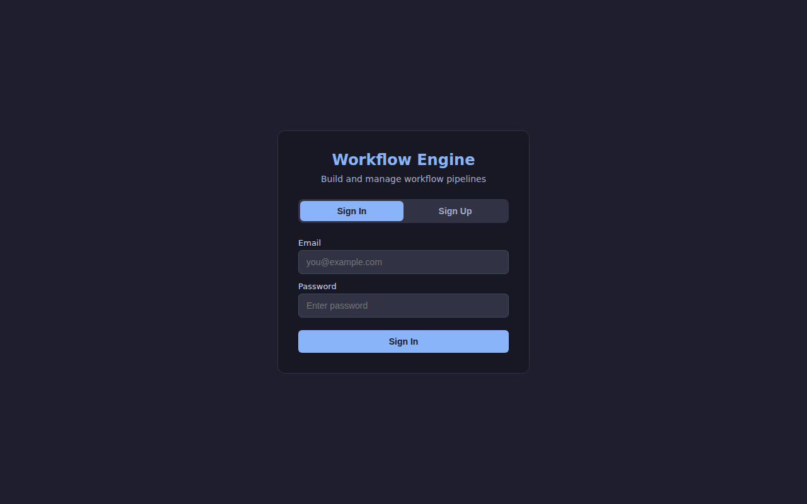
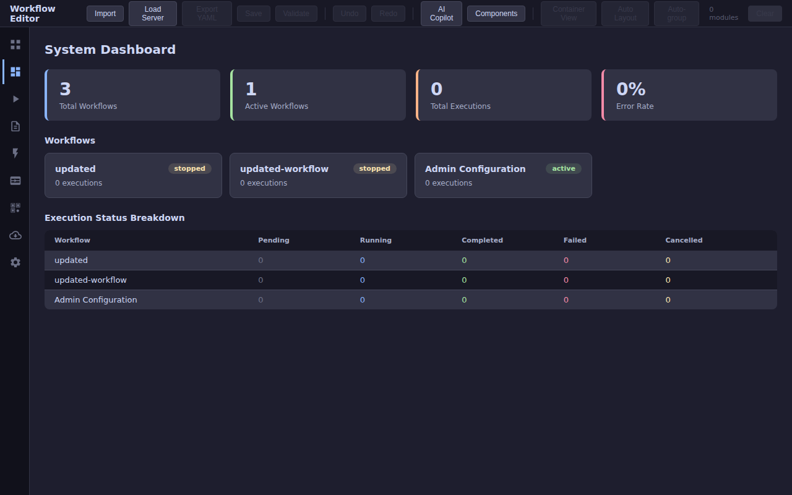
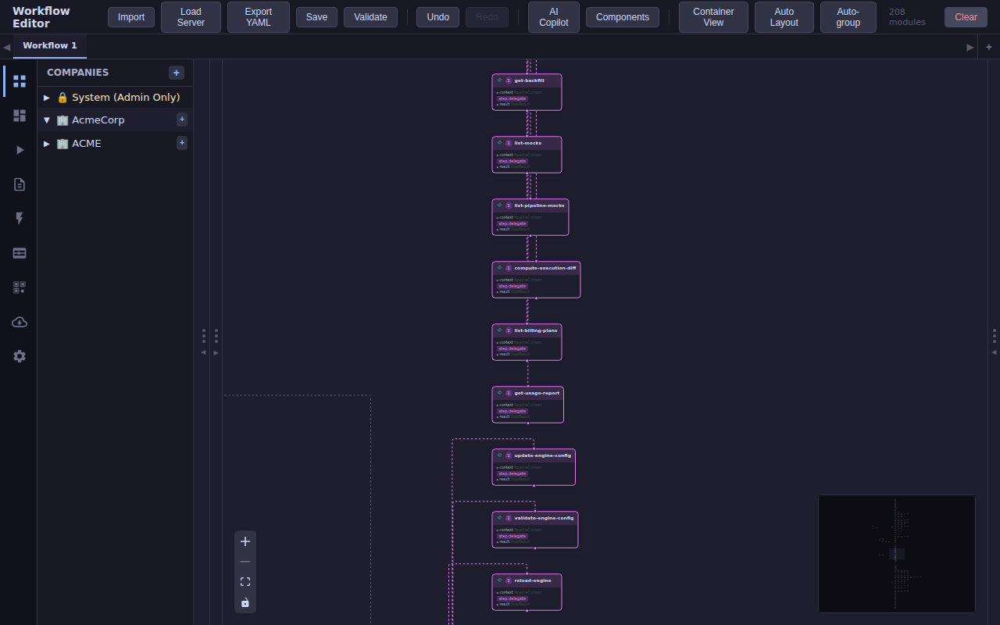
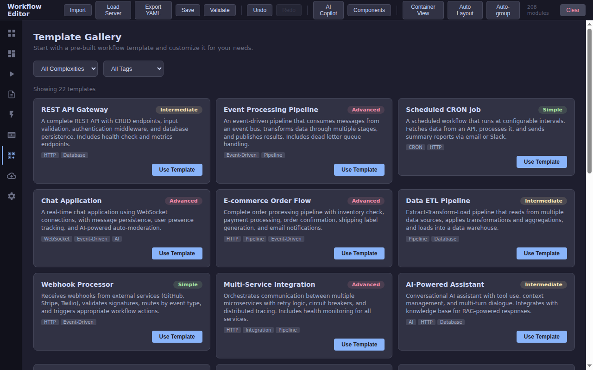
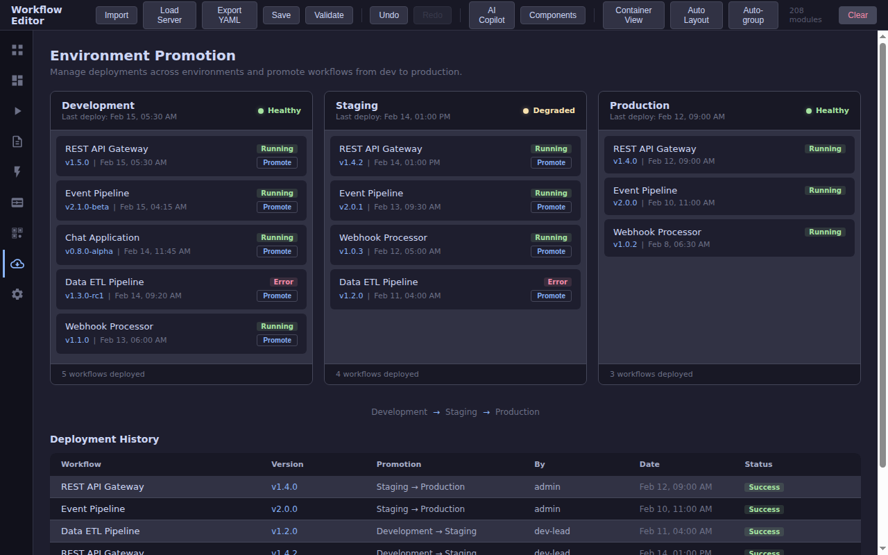
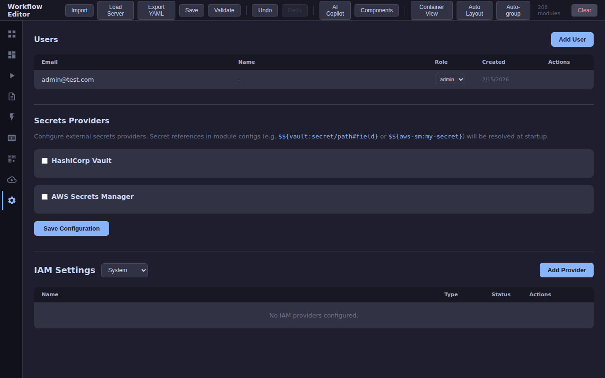

# Admin UI Features & Module Decomposition

This document describes the admin UI pages and how the backend modules are decomposed into pipeline primitives in `admin/config.yaml`.

## Architecture Overview

The admin application uses **2 generic handler modules** instead of 18 domain-specific ones:

| Module | Type | Purpose |
|--------|------|---------|
| `admin-queries` | `api.query` | Handles all GET routes |
| `admin-commands` | `api.command` | Handles all POST/PUT/DELETE routes |

Each route has an inline pipeline that either:
- **Pipeline primitives** (Phase B/C): Uses `step.request_parse`, `step.db_query`, `step.db_exec`, `step.json_response`, `step.conditional`, `step.set`, `step.validate` to handle the full request lifecycle in YAML
- **Delegate steps** (Phase D): Uses `step.delegate` with a meaningful name to forward to a Go service for complex logic

## Module Consolidation (Phase A)

**Before:** 18 handler modules (9 query + 9 command handlers for engine, schema, AI, components, timeline, replay, DLQ, backfill, billing)

**After:** 2 generic handlers (`admin-queries`, `admin-commands`) with per-route pipelines

The `api.query` and `api.command` handlers work without a `delegate` config. When a route has a pipeline, the pipeline runs directly. The delegate is only a fallback.

## Database Schema

The V1Store (`module/api_v1_store.go`) manages these tables:

### Original Tables
| Table | Purpose |
|-------|---------|
| `companies` | Multi-tenant company records |
| `projects` | Projects within companies |
| `workflows` | Workflow definitions with config YAML |
| `workflow_versions` | Version history for workflows |

### New Tables (Phase C)
| Table | Purpose |
|-------|---------|
| `workflow_executions` | Execution tracking (trigger, status, duration) |
| `execution_steps` | Per-step execution data |
| `execution_logs` | Workflow log entries |
| `audit_log` | User action audit trail |
| `iam_provider_configs` | IAM provider configurations |
| `iam_role_mappings` | Role-to-resource mappings |

## Route Categories

### V1 CRUD Routes (Phase B) — Pipeline Primitives

These routes are fully decomposed into pipeline steps with no Go code:

| Route | Steps | Description |
|-------|-------|-------------|
| `POST /admin/companies` | parse, validate, set, db_exec, json_response | Create company |
| `GET /admin/companies` | db_query, json_response | List companies |
| `GET /admin/companies/{id}` | parse, db_query, conditional, json_response | Get company |
| `POST /admin/organizations/{id}/projects` | parse, validate, set, db_exec, json_response | Create project |
| `POST /admin/projects/{id}/workflows` | parse, validate, set, db_exec, json_response | Create workflow under project |
| `POST /admin/workflows` | parse, validate, set, db_exec, json_response | Create standalone workflow |
| `GET /admin/workflows` | db_query, json_response | List workflows |
| `GET /admin/workflows/{id}` | parse, db_query, conditional, json_response, not-found | Get workflow |
| `PUT /admin/workflows/{id}` | parse, check-exists, conditional, set, db_exec (update + version), db_query, json_response | Update workflow with versioning |
| `DELETE /admin/workflows/{id}` | parse, check-exists, conditional, db_exec (versions + workflow), json_response | Delete workflow |
| `POST /admin/workflows/{id}/deploy` | parse, set, db_exec, db_query, json_response | Activate workflow |
| `POST /admin/workflows/{id}/stop` | parse, set, db_exec, db_query, json_response | Stop workflow |

### New Database Routes (Phase C) — Pipeline Primitives

These routes were previously broken (returned 404). Now they work via pipeline primitives with the new DB tables:

| Route | Steps | Description |
|-------|-------|-------------|
| `GET /admin/workflows/{id}/executions` | parse, db_query, json_response | List workflow executions |
| `GET /admin/workflows/{id}/logs` | parse, db_query, json_response | List workflow logs |
| `GET /admin/workflows/{id}/events` | parse, db_query, json_response | List workflow events |
| `GET /admin/workflows/{id}/status` | parse, db_query, conditional, json_response | Get workflow status |
| `GET /admin/workflows/{id}/dashboard` | parse, db_query (workflow + stats), json_response | Workflow dashboard |
| `POST /admin/workflows/{id}/trigger` | parse, set, db_exec, json_response | Trigger workflow execution |
| `GET /admin/executions/{id}` | parse, db_query, conditional, json_response | Get execution details |
| `GET /admin/executions/{id}/steps` | parse, db_query, json_response | Get execution steps |
| `POST /admin/executions/{id}/cancel` | parse, set, db_exec, json_response | Cancel execution |
| `GET /admin/audit` | db_query, json_response | List audit entries |
| `GET /admin/workflows/{id}/permissions` | json_response (stub) | List permissions |
| `POST /admin/workflows/{id}/permissions` | json_response (501 stub) | Set permissions |
| `GET /admin/iam/providers/{id}` | parse, db_query, conditional, json_response | Get IAM provider |
| `POST /admin/iam/providers` | parse, validate, set, db_exec, json_response | Create IAM provider |
| `PUT /admin/iam/providers/{id}` | parse, set, db_exec, json_response | Update IAM provider |
| `DELETE /admin/iam/providers/{id}` | parse, db_exec, json_response | Delete IAM provider |
| `GET /admin/iam/providers/{id}/mappings` | parse, db_query, json_response | List role mappings |
| `POST /admin/iam/providers/{id}/mappings` | parse, validate, set, db_exec, json_response | Create role mapping |
| `DELETE /admin/iam/mappings/{id}` | parse, db_exec, json_response | Delete role mapping |

### Domain Service Routes (Phase D) — Delegate Steps

These routes delegate to specialized Go services with meaningful step names:

#### Engine Management (delegate: `admin-engine-mgmt`)
| Route | Step Name |
|-------|-----------|
| `GET /admin/engine/config` | `get-engine-config` |
| `GET /admin/engine/status` | `get-engine-status` |
| `GET /admin/engine/modules` | `list-engine-modules` |
| `GET /admin/engine/services` | `list-engine-services` |
| `PUT /admin/engine/config` | `update-engine-config` |
| `POST /admin/engine/validate` | `validate-engine-config` |
| `POST /admin/engine/reload` | `reload-engine` |

#### Schema (delegate: `admin-schema-mgmt`)
| Route | Step Name |
|-------|-----------|
| `GET /admin/schemas` | `list-schemas` |
| `GET /admin/schemas/modules` | `list-module-schemas` |

#### AI (delegate: `admin-ai-mgmt`)
| Route | Step Name |
|-------|-----------|
| `GET /admin/ai/providers` | `list-ai-providers` |
| `POST /admin/ai/generate` | `generate-workflow-from-intent` |
| `POST /admin/ai/component` | `generate-component` |
| `POST /admin/ai/suggest` | `suggest-improvements` |
| `POST /admin/ai/deploy` | `deploy-generated-workflow` |
| `POST /admin/ai/deploy/component` | `deploy-generated-component` |

#### Dynamic Components (delegate: `admin-component-mgmt`)
| Route | Step Name |
|-------|-----------|
| `GET /admin/components` | `list-dynamic-components` |
| `GET /admin/components/{id}` | `get-dynamic-component` |
| `POST /admin/components` | `create-dynamic-component` |
| `PUT /admin/components/{id}` | `update-dynamic-component` |
| `DELETE /admin/components/{id}` | `delete-dynamic-component` |

#### Timeline & Replay (delegates: `admin-timeline-mgmt`, `admin-replay-mgmt`)
| Route | Step Name |
|-------|-----------|
| `GET /admin/executions` | `list-all-executions` |
| `GET /admin/executions/{id}/timeline` | `get-execution-timeline` |
| `GET /admin/executions/{id}/events` | `get-execution-events` |
| `POST /admin/executions/{id}/replay` | `replay-execution` |
| `GET /admin/executions/{id}/replay` | `get-replay-history` |

#### DLQ (delegate: `admin-dlq-mgmt`)
| Route | Step Name |
|-------|-----------|
| `GET /admin/dlq` | `list-dlq-entries` |
| `GET /admin/dlq/stats` | `get-dlq-stats` |
| `GET /admin/dlq/{id}` | `get-dlq-entry` |
| `POST /admin/dlq/{id}/retry` | `retry-dlq-entry` |
| `POST /admin/dlq/{id}/discard` | `discard-dlq-entry` |
| `POST /admin/dlq/{id}/resolve` | `resolve-dlq-entry` |
| `DELETE /admin/dlq/purge` | `purge-resolved-dlq` |

#### Backfill, Mock & Diff (delegate: `admin-backfill-mgmt`)
| Route | Step Name |
|-------|-----------|
| `GET /admin/backfill` | `list-backfills` |
| `POST /admin/backfill` | `create-backfill` |
| `GET /admin/backfill/{id}` | `get-backfill` |
| `POST /admin/backfill/{id}/cancel` | `cancel-backfill` |
| `GET /admin/mocks` | `list-all-mocks` |
| `POST /admin/mocks` | `set-step-mock` |
| `DELETE /admin/mocks` | `clear-all-mocks` |
| `GET /admin/mocks/{pipeline}` | `list-pipeline-mocks` |
| `DELETE /admin/mocks/{pipeline}/{step}` | `remove-step-mock` |
| `GET /admin/executions/diff` | `compute-execution-diff` |

#### Billing (delegate: `admin-billing-mgmt`)
| Route | Step Name |
|-------|-----------|
| `GET /admin/billing/plans` | `list-billing-plans` |
| `GET /admin/billing/usage` | `get-usage-report` |
| `POST /admin/billing/subscribe` | `create-subscription` |
| `DELETE /admin/billing/subscribe` | `cancel-subscription` |
| `POST /admin/billing/webhook` | `handle-billing-webhook` |

## Files Modified

| File | Changes |
|------|---------|
| `admin/config.yaml` | Removed 16 modules, kept 2 generic handlers, rewrote ~100 route pipelines |
| `module/api_v1_store.go` | Added 6 new CREATE TABLE statements |
| `module/query_handler.go` | Fixed route key lookup to use Go 1.22+ `r.Pattern` |
| `module/command_handler.go` | Same fix as query_handler.go |
| `module/pipeline_step_conditional.go` | Added `buildFieldTemplate()` for hyphenated field paths |
| `module/pipeline_step_json_response.go` | Added support for non-map response bodies (arrays) |
| `store/dlq_handler.go` | Updated paths to `/api/v1/admin/` prefix |
| `store/timeline_handler.go` | Updated paths to `/api/v1/admin/` prefix |
| `store/backfill_handler.go` | Updated paths to `/api/v1/admin/` prefix |
| `billing/handler.go` | Updated paths to `/api/v1/admin/` prefix |

## Key Technical Decisions

1. **Route key uses `r.Pattern`**: Go 1.22+ ServeMux sets `r.Pattern` on each request. We use this as the pipeline lookup key (`"METHOD /path"`) to avoid collisions when multiple routes share the same last segment.

2. **Hyphenated step names**: Go templates interpret `-` as subtraction. The `buildFieldTemplate()` function auto-detects hyphens and generates `{{index . "seg1" "seg2"}}` syntax instead of `{{.seg1.seg2}}`.

3. **All delegate service paths use `/api/v1/admin/`**: The DLQ, timeline, backfill, billing delegate services register their mux patterns under `/api/v1/admin/` to match the admin config route paths.

4. **Delegate is optional**: QueryHandler and CommandHandler work without a `delegate` config. When a route has a pipeline, the pipeline runs; the delegate is only a fallback for unmatched requests.

## UI Screenshots

Screenshots of each admin UI page are in `docs/screenshots/`:

### Login (`01-login.png`)

Sign In form with email/password fields. First-time setup creates the admin account via `/api/v1/auth/setup`, subsequent visits use `/api/v1/auth/login`. Dark theme with "Workflow Engine" branding.

### Dashboard (`02-dashboard.png`)

System dashboard showing workflow counts (total, active, stopped), execution status breakdown, and metrics cards. Powered by Phase B pipeline routes (`GET /admin/workflows`, `GET /admin/workflows/{id}/dashboard`).

### Workflow Editor (`03-editor.png`)

Visual node-based editor (ReactFlow) showing modules in a workflow pipeline. The company sidebar lists organizations (System, AcmeCorp, etc.). Module schemas are fetched from `GET /admin/schemas/modules` (Phase D delegate).

### Template Gallery (`04-templates.png`)

22 templates displayed in a card grid with complexity badges (Simple/Intermediate/Advanced) and tag filters. Templates include REST API Gateway, Event Processing Pipeline, Chat Application, and more. Templates are created from YAML configs using the `POST /admin/workflows` pipeline primitive.

### Plugin Marketplace (`05-marketplace.png`)

13 plugins with star ratings, download counts, and category badges (Connectors, Transforms, Middleware, Storage, AI, Monitoring). Install/Uninstall buttons interact with dynamic components via `POST /admin/components` (Phase D delegate).

### Environment Promotion (`06-environments.png`)

Three-column pipeline view (Development -> Staging -> Production) with health status indicators, deployed workflow counts, version tracking, and deployment history table. Uses workflow status and execution data from Phase C routes.

### Settings (`07-settings.png`)

Three sections: Users table with role management (admin/viewer roles), Secrets Providers (HashiCorp Vault, AWS Secrets Manager), and IAM Settings with company-scoped provider configuration. IAM providers use Phase C pipeline primitives (`POST/GET/PUT/DELETE /admin/iam/providers`).
