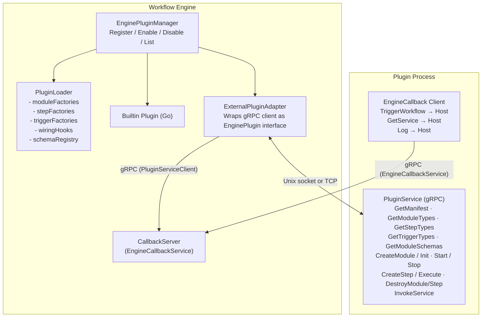

# External Plugin Architecture

## Overview

The workflow engine supports two categories of plugins:

1. **Builtin plugins** -- compiled into the engine binary, communicating via direct Go interface calls.
2. **External plugins** -- separate OS processes communicating via gRPC over Unix sockets or TCP.

Both categories implement the same `EnginePlugin` interface. The engine does not distinguish between them at the orchestration layer. This is achieved through the `ExternalPluginAdapter`, which wraps a gRPC client behind the `EnginePlugin` interface.

### Architecture Diagram



## gRPC Protocol

The plugin protocol is defined in `plugin/external/proto/plugin.proto` using Protocol Buffers v3. Two services define the bidirectional communication:

### PluginService (Plugin implements, Host calls)

The plugin process implements this service. The host (engine) calls it to discover capabilities and manage plugin resources.

| RPC | Description |
|-----|-------------|
| `GetManifest()` | Returns the plugin's name, version, author, and description. |
| `GetModuleTypes()` | Returns the list of module type strings (e.g., `["custom.metrics"]`). |
| `GetStepTypes()` | Returns the list of step type strings (e.g., `["step.uppercase"]`). |
| `GetTriggerTypes()` | Returns the list of trigger type strings. |
| `GetModuleSchemas()` | Returns UI schema definitions for the plugin's module types. |
| `CreateModule(type, name, config)` | Creates a module instance, returns a handle ID. |
| `InitModule(handleID)` | Initializes a previously created module. |
| `StartModule(handleID)` | Starts a module (begin background work). |
| `StopModule(handleID)` | Stops a running module. |
| `DestroyModule(handleID)` | Destroys a module and frees resources. |
| `CreateStep(type, name, config)` | Creates a pipeline step instance, returns a handle ID. |
| `ExecuteStep(handleID, context)` | Executes a step with full pipeline context data. |
| `DestroyStep(handleID)` | Destroys a step and frees resources. |
| `InvokeService(handleID, method, args)` | Calls a named method on a module's service interface. |

### EngineCallbackService (Host implements, Plugin calls)

The host process implements this service. Plugins call it to interact with the engine.

| RPC | Description |
|-----|-------------|
| `TriggerWorkflow(type, action, data)` | Fires a workflow trigger from the plugin side. |
| `GetService(name)` | Checks whether a named service exists in the host's service registry. |
| `Log(level, message, fields)` | Sends a structured log entry to the engine's logger. |

### Data Serialization

All complex data (configurations, pipeline context, step outputs, service invocation args/results) is serialized using `google.protobuf.Struct`. This type represents a JSON-compatible map with the following value types:

- `null`
- `bool`
- `number` (float64)
- `string`
- `list` (array of Values)
- `struct` (nested map)

Conversion functions in `plugin/external/convert.go` handle the mapping between Go `map[string]any` and `protobuf.Struct`:

```go
func mapToStruct(m map[string]any) *structpb.Struct
func structToMap(s *structpb.Struct) map[string]any
```

Module schemas from plugins are converted via `protoSchemaToSchema()` into the engine's `schema.ModuleSchema` type, making them available to the UI schema registry.

### Handle-Based Resource Management

The protocol uses an opaque **handle ID** pattern for managing remote resources:

1. The host calls `CreateModule` or `CreateStep`, receiving a `handle_id` string.
2. All subsequent operations (Init, Start, Stop, Execute, Destroy) reference this handle ID.
3. The plugin maintains an internal map of handle IDs to live objects.
4. `Destroy` calls release the object and invalidate the handle.

This pattern avoids transmitting full object state over the wire. The plugin owns the resource; the host holds only a reference.

## Lifecycle

### 1. Discovery

On startup (or when triggered via API), the engine scans the `data/plugins/` directory:

```
data/plugins/
  my-plugin/
    plugin.json     <- manifest file (parsed with plugin.LoadManifest)
    my-plugin       <- executable binary
```

The engine reads each `plugin.json` to learn the plugin's name, version, and declared types. At this stage, the plugin process is NOT started. The plugin is merely "available."

### 2. Loading (Subprocess Start + Handshake)

When a plugin is loaded (via API or startup configuration), the engine:

1. Starts the plugin binary as a subprocess via `go-plugin.Client`
2. Performs the **magic cookie handshake** to verify protocol compatibility
3. Establishes a gRPC connection to the plugin's `PluginService`
4. Optionally starts a `CallbackServer` and registers it via the gRPC broker so the plugin can call back

The handshake configuration is defined in `plugin/external/handshake.go`:

```go
var Handshake = goplugin.HandshakeConfig{
    ProtocolVersion:  1,
    MagicCookieKey:   "WORKFLOW_PLUGIN",
    MagicCookieValue: "workflow-external-plugin-v1",
}
```

Both host and plugin must use identical handshake values. If they don't match, the connection is refused. This prevents accidental execution of non-plugin binaries.

### 3. Registration (Adapter Creation)

After a successful handshake, the engine creates an `ExternalPluginAdapter`:

```go
adapter, err := NewExternalPluginAdapter(name, pluginClient)
```

The adapter:
- Calls `GetManifest()` to populate Name, Version, Author, Description
- Implements `EnginePlugin` by delegating to the gRPC client
- Returns factory functions for modules and steps that create `RemoteModule` / `RemoteStep` proxies

The adapter is then registered with the `EnginePluginManager` like any other plugin.

### 4. Factory Registration

When the adapter is loaded into the `PluginLoader`, it contributes:

- **Module factories**: One per module type. Each factory calls `CreateModule` over gRPC and wraps the result in a `RemoteModule`.
- **Step factories**: One per step type. Each factory calls `CreateStep` over gRPC and wraps the result in a `RemoteStep`.
- **Module schemas**: Fetched via `GetModuleSchemas` and converted to engine-native `schema.ModuleSchema` objects.

### 5. Execution

When a workflow references a plugin-provided type:

**For steps:**
1. Pipeline engine calls `stepFactory(name, config, app)` which returns a `RemoteStep`
2. Pipeline calls `RemoteStep.Execute(ctx, pipelineContext)`
3. `RemoteStep` serializes the context to protobuf and calls `ExecuteStep` over gRPC
4. Plugin processes the request and returns `ExecuteStepResponse`
5. `RemoteStep` converts the response to a `StepResult`

**For modules:**
1. Engine calls `moduleFactory(name, config)` which returns a `RemoteModule`
2. Engine lifecycle calls flow through: `Init` -> `Start` -> (running) -> `Stop`
3. Each lifecycle call is a gRPC request to the corresponding `PluginService` method
4. Service invocations use `InvokeService(handleID, method, args)`

### 6. Shutdown

When a plugin is unloaded or the engine shuts down:

1. The engine calls `Stop` on all active `RemoteModule` instances
2. The engine calls `Destroy` on all active handles (modules and steps)
3. The go-plugin `Client.Kill()` sends SIGTERM to the plugin process
4. If the process does not exit within the timeout, SIGKILL is sent
5. The adapter and all its factories are removed from the `PluginLoader`

## Builtin vs External Plugins

| Aspect | Builtin Plugins | External Plugins |
|--------|----------------|-----------------|
| **Packaging** | Compiled into engine binary | Separate binary in `data/plugins/` |
| **Communication** | Direct Go function calls | gRPC over Unix socket or TCP |
| **Language** | Go only | Any language (with gRPC proto) |
| **Deployment** | Recompile engine to update | Replace binary, reload via API |
| **Performance** | Zero overhead | gRPC serialization per call |
| **Crash isolation** | Plugin crash = engine crash | Plugin crash does not affect engine |
| **Interface** | Implements `EnginePlugin` directly | `ExternalPluginAdapter` wraps gRPC |
| **Capabilities** | Full: modules, steps, triggers, handlers, wiring hooks, schemas | Modules, steps, schemas (triggers and handlers planned) |
| **Host access** | Direct Go API (full `modular.Application`) | Callback service: TriggerWorkflow, GetService, Log |
| **State management** | In-process memory, shared DB | Plugin-local; use callbacks for host state |

### Why Both?

- **Builtin plugins** are best for core functionality that needs maximum performance and deep engine integration (wiring hooks, workflow handlers, trigger factories).
- **External plugins** are best for user-contributed extensions, third-party integrations, and any component that benefits from independent deployment and crash isolation.

The engine is designed so that a plugin can start as external (for rapid development and testing) and later be "promoted" to builtin by reimplementing it against the Go `EnginePlugin` interface directly.

## Process Isolation

Each external plugin runs as a separate OS process:

```
Engine Process (PID 1000)
  |
  +-- my-plugin (PID 1001)     [gRPC connection A]
  |
  +-- another-plugin (PID 1002) [gRPC connection B]
  |
  +-- metrics-plugin (PID 1003) [gRPC connection C]
```

### Crash Isolation

If a plugin process crashes (segfault, panic, OOM kill), the engine detects the broken gRPC connection and:

1. Marks the plugin as "unloaded"
2. Returns errors for any in-flight requests to that plugin's types
3. Logs the failure with the plugin's stderr output
4. The engine continues running; other plugins and built-in types are unaffected

Crashed plugins can be reloaded via the API (`POST /api/v1/plugins/external/{name}/reload`).

### Resource Limits

Since plugins are OS processes, standard OS mechanisms can control their resource usage:

- **Memory**: cgroups, ulimit
- **CPU**: cgroups, nice/ionice
- **File descriptors**: ulimit
- **Network**: iptables, network namespaces
- **Filesystem**: chroot, read-only mounts

The engine does not currently enforce these limits directly. They must be configured at the OS or container level.

### Communication Channel

go-plugin uses Unix domain sockets by default on Linux/macOS and named pipes on Windows. The socket file is created in a temporary directory and cleaned up when the plugin exits. TCP with mutual TLS is available as an alternative for cross-network plugin hosting (not yet exposed in the engine configuration).

## Performance Considerations

### gRPC Overhead

Every interaction with an external plugin incurs gRPC overhead:

- **Serialization**: Go map -> protobuf Struct -> wire bytes -> protobuf Struct -> Go map
- **Transport**: Unix socket IPC (local) or TCP (network)
- **Latency**: Typically 0.1-1ms per call on local Unix socket

### Optimization Strategies

1. **Keep logic in the plugin**: Do as much work as possible within a single `ExecuteStep` call. Avoid designs that require many small round-trips.

2. **Batch data when possible**: If a step needs to process multiple items, pass them all in the pipeline context rather than making separate calls.

3. **Use modules for stateful services**: If your plugin maintains state (connections, caches, counters), implement it as a module. The module is created once and lives for the engine's lifetime. Service invocations (`InvokeService`) are cheaper than repeated step creation.

4. **Minimize context size**: The entire `PipelineContext` is serialized on every step execution. Keep `Current` and `StepOutputs` lean -- avoid storing large binary blobs in the pipeline state.

5. **Avoid unnecessary schema calls**: `GetModuleSchemas()` is called once during adapter creation, not on every request. Schema data is cached on the engine side.

### Benchmarking

For latency-critical paths, compare:
- Built-in step: ~0 overhead (direct function call)
- External step: ~0.2-1ms overhead per execution (Unix socket gRPC)
- External step over TCP: ~1-5ms overhead per execution (network + TLS)

If sub-millisecond step latency is required, consider implementing the step as a builtin plugin instead.

## Security Model

### Magic Cookie Handshake

The go-plugin handshake prevents the engine from accidentally executing arbitrary binaries as plugins. Both sides must agree on:

- `MagicCookieKey`: `WORKFLOW_PLUGIN`
- `MagicCookieValue`: `workflow-external-plugin-v1`
- `ProtocolVersion`: `1`

This is a **basic integrity check**, not a security boundary. It prevents misconfiguration but does not authenticate the plugin.

### Transport Security

- **Unix socket (default)**: Communication is local-only, protected by filesystem permissions. No eavesdropping from other machines.
- **TCP with TLS**: go-plugin supports mutual TLS for plugins running on remote hosts. Certificates are generated per-session by default.

### Plugin Permissions

External plugins run with the same OS user and permissions as the engine process. A plugin can:

- Read/write any file the engine user can access
- Open network connections
- Execute other processes

**Future improvements planned:**
- Sandboxing via seccomp, AppArmor, or SELinux profiles
- Dropping capabilities after initialization
- Restricting filesystem access to the plugin's own `data/plugins/{name}/` directory
- Network policy enforcement via eBPF or iptables rules per plugin process

### Callback Authorization

The `EngineCallbackService` does not currently perform authorization checks. Any loaded plugin can:

- Trigger any workflow
- Query any service name
- Write log entries at any level

This is acceptable for trusted first-party plugins. For third-party or untrusted plugins, callback authorization (scoped permissions per plugin) should be implemented.

## Key Source Files

| File | Role |
|------|------|
| `plugin/external/proto/plugin.proto` | gRPC service and message definitions |
| `plugin/external/proto/plugin.pb.go` | Generated protobuf Go code |
| `plugin/external/proto/plugin_grpc.pb.go` | Generated gRPC Go code |
| `plugin/external/handshake.go` | Magic cookie and protocol version constants |
| `plugin/external/grpc_plugin.go` | go-plugin bridge (`GRPCPlugin`, `PluginClient`) |
| `plugin/external/adapter.go` | `ExternalPluginAdapter` -- wraps gRPC as `EnginePlugin` |
| `plugin/external/remote_module.go` | `RemoteModule` -- `modular.Module` proxy over gRPC |
| `plugin/external/remote_step.go` | `RemoteStep` -- `module.PipelineStep` proxy over gRPC |
| `plugin/external/callback_server.go` | `CallbackServer` -- host-side `EngineCallbackService` |
| `plugin/external/convert.go` | Protobuf Struct <-> Go map conversion utilities |
| `plugin/engine_plugin.go` | `EnginePlugin` interface and base implementations |
| `plugin/engine_plugin_manager.go` | `EnginePluginManager` -- register/enable/disable lifecycle |
| `plugin/loader.go` | `PluginLoader` -- factory registration and topological sort |
| `plugin/manifest.go` | `PluginManifest` -- metadata, semver, constraints |

## Protocol Buffer Schema Reference

The full `.proto` file is at `plugin/external/proto/plugin.proto`. Key message types:

```protobuf
// Plugin metadata
message Manifest {
  string name = 1;
  string version = 2;
  string author = 3;
  string description = 4;
}

// Step execution request -- carries full pipeline context
message ExecuteStepRequest {
  string handle_id = 1;
  google.protobuf.Struct trigger_data = 2;
  map<string, google.protobuf.Struct> step_outputs = 3;
  google.protobuf.Struct current = 4;
  google.protobuf.Struct metadata = 5;
}

// Step execution response
message ExecuteStepResponse {
  google.protobuf.Struct output = 1;
  string error = 2;
  bool stop_pipeline = 3;
}

// Module creation request
message CreateModuleRequest {
  string type = 1;
  string name = 2;
  google.protobuf.Struct config = 3;
}

// Service invocation (method dispatch on a module)
message InvokeServiceRequest {
  string handle_id = 1;
  string method = 2;
  google.protobuf.Struct args = 3;
}
```

## Future Directions

1. **Trigger factories for external plugins**: Allow plugins to provide custom trigger types (e.g., WebSocket, Kafka consumer).
2. **Workflow handler factories**: Allow plugins to define entirely new workflow execution models.
3. **Plugin sandboxing**: OS-level isolation (seccomp profiles, capability dropping).
4. **Remote plugins over TCP/TLS**: Run plugins on different hosts with mutual TLS authentication.
5. **Plugin SDK for other languages**: Python, Node.js, and Rust SDKs generated from the proto definition.
6. **Scoped callback authorization**: Per-plugin permission grants for engine callbacks.
7. **Plugin marketplace integration**: Discover, download, and install external plugins from a remote registry.
8. **Health checking**: Periodic gRPC health probes to detect unresponsive plugins.
