# wfctl — Workflow Engine CLI Reference

`wfctl` is the command-line tool for the [workflow engine](https://github.com/GoCodeAlone/workflow). It handles offline config validation, project scaffolding, API spec generation, plugin management, deployment, and AI assistant integration — all without requiring a running server.

## Installation

### GitHub Releases (recommended)

```bash
# macOS (Apple Silicon)
curl -sL https://github.com/GoCodeAlone/workflow/releases/latest/download/wfctl-darwin-arm64 -o wfctl && chmod +x wfctl && sudo mv wfctl /usr/local/bin/

# macOS (Intel)
curl -sL https://github.com/GoCodeAlone/workflow/releases/latest/download/wfctl-darwin-amd64 -o wfctl && chmod +x wfctl && sudo mv wfctl /usr/local/bin/

# Linux (x86_64)
curl -sL https://github.com/GoCodeAlone/workflow/releases/latest/download/wfctl-linux-amd64 -o wfctl && chmod +x wfctl && sudo mv wfctl /usr/local/bin/

# Linux (ARM64)
curl -sL https://github.com/GoCodeAlone/workflow/releases/latest/download/wfctl-linux-arm64 -o wfctl && chmod +x wfctl && sudo mv wfctl /usr/local/bin/
```

### From Source

```bash
go install github.com/GoCodeAlone/workflow/cmd/wfctl@latest
```

### Self-Update

```bash
wfctl update          # install latest release
wfctl update --check  # check for updates without installing
```

---

## Command Tree

```mermaid
graph TD
    wfctl --> init
    wfctl --> audit
    wfctl --> validate
    wfctl --> inspect
    wfctl --> run
    wfctl --> plugin
    wfctl --> pipeline
    wfctl --> schema
    wfctl --> snippets
    wfctl --> manifest
    wfctl --> migrate
    wfctl --> build-ui["build-ui"]
    wfctl --> ui
    wfctl --> publish
    wfctl --> deploy
    wfctl --> infra
    wfctl --> api
    wfctl --> diff
    wfctl --> template
    wfctl --> contract
    wfctl --> compat
    wfctl --> generate
    wfctl --> ci
    wfctl --> git
    wfctl --> registry
    wfctl --> plugin-registry["plugin-registry"]
    wfctl --> update
    wfctl --> mcp
    wfctl --> editor-schemas["editor-schemas"]
    wfctl --> dsl-reference["dsl-reference"]
    wfctl --> ports
    wfctl --> security
    wfctl --> dev
    wfctl --> wizard

    dev --> dev-up["up"]
    dev --> dev-down["down"]
    dev --> dev-logs["logs"]
    dev --> dev-status["status"]
    dev --> dev-restart["restart"]

    ports --> ports-list["list"]

    security --> security-audit["audit"]
    security --> security-gennetpol["generate-network-policies"]

    audit --> audit-plans["plans"]
    audit --> audit-plugins["plugins"]

    infra --> infra-plan["plan"]
    infra --> infra-derive["derive"]
    infra --> infra-apply["apply"]
    infra --> infra-destroy["destroy"]
    infra --> infra-status["status"]
    infra --> infra-drift["drift"]
    infra --> infra-import["import"]
    infra --> infra-bootstrap["bootstrap"]
    infra --> infra-state["state"]
    infra --> infra-outputs["outputs"]
    infra --> infra-refresh-outputs["refresh-outputs"]
    infra --> infra-owners["owners"]
    infra --> infra-test["test"]
    infra --> infra-audit-secrets["audit-secrets"]
    infra --> infra-audit-state-secrets["audit-state-secrets"]

    infra-state --> infra-state-list["list"]
    infra-state --> infra-state-export["export"]
    infra-state --> infra-state-import["import"]

    ci --> ci-generate["generate"]

    plugin --> plugin-init["init"]
    plugin --> plugin-docs["docs"]
    plugin --> plugin-test["test"]
    plugin --> plugin-conformance["conformance"]
    plugin --> plugin-search["search"]
    plugin --> plugin-install["install"]
    plugin --> plugin-lock["lock"]
    plugin --> plugin-list["list"]
    plugin --> plugin-update["update"]
    plugin --> plugin-remove["remove"]
    plugin --> plugin-validate["validate"]
    plugin --> plugin-info["info"]

    pipeline --> pipeline-list["list"]
    pipeline --> pipeline-run["run"]

    migrate --> migrate-status["status"]
    migrate --> migrate-diff["diff"]
    migrate --> migrate-apply["apply"]

    ui --> ui-scaffold["scaffold"]
    ui --> ui-build["build"]

    deploy --> deploy-docker["docker"]
    deploy --> deploy-k8s["kubernetes / k8s"]
    deploy --> deploy-helm["helm"]
    deploy --> deploy-cloud["cloud"]

    deploy-k8s --> k8s-generate["generate"]
    deploy-k8s --> k8s-apply["apply"]
    deploy-k8s --> k8s-destroy["destroy"]
    deploy-k8s --> k8s-status["status"]
    deploy-k8s --> k8s-logs["logs"]
    deploy-k8s --> k8s-diff["diff"]

    api --> api-extract["extract"]
    template --> template-validate["validate"]
    contract --> contract-test["test / compare"]
    compat --> compat-check["check"]
    generate --> gen-github["github-actions"]
    git --> git-connect["connect"]
    git --> git-push["push"]
    registry --> registry-list["list"]
    registry --> registry-add["add"]
    registry --> registry-remove["remove"]

    plugin-registry --> plugin-registry-list["list"]
    plugin-registry --> plugin-registry-add["add"]
    plugin-registry --> plugin-registry-remove["remove"]
    plugin-registry --> plugin-registry-compat["compatibility"]
    plugin-registry-compat --> plugin-registry-compat-update["update"]
```



---

## Commands by Category

| Category | Commands |
|----------|----------|
| **Project Setup** | `init`, `run`, `wizard` |
| **Local Development** | `dev up/down/logs/status/restart` (--local, --k8s, --expose) |
| **Validation & Inspection** | `validate`, `inspect`, `schema`, `compat check`, `template validate`, `editor-schemas`, `dsl-reference` |
| **API & Contract** | `api extract`, `contract test`, `diff` |
| **Deployment** | `deploy docker/kubernetes/helm/cloud`, `build-ui`, `generate github-actions` |
| **Infrastructure** | `infra derive/plan/apply/destroy/status/drift/import/bootstrap/outputs/owners/test`, `infra state list/export/import` |
| **CI/CD** | `ci plan`, `ci generate`, `ci run`, `ci init`, `ci validate`, `generate github-actions` |
| **Documentation** | `docs generate` |
| **Plugin Management** | `plugin`, `plugin-registry`, `registry`, `publish` |
| **UI Generation** | `ui scaffold`, `build-ui` |
| **Database Migrations** | `migrate status/diff/apply` |
| **Git Integration** | `git connect`, `git push` |
| **Platform Inspection** | `audit plans`, `audit plugins`, `audit repo`, `ports list`, `security audit`, `security generate-network-policies` |
| **Utilities** | `snippets`, `manifest`, `pipeline`, `update`, `mcp` |

---

## Command Reference

### `audit`

Audit Workflow ecosystem metadata without mutating project code. The command is intended for dogfooding release readiness checks: plans and design docs should carry implementation evidence, plugin repos should expose compatible manifests, and repository files should be portable and safe.

```
wfctl audit <subject> [options]
```

#### `wfctl audit plans`

Scan `docs/plans` Markdown files for tracking metadata and implementation evidence.

```
wfctl audit plans [options]
```

| Flag | Default | Description |
|------|---------|-------------|
| `--dir` | `docs/plans` | Plan directory to scan |
| `--json` | `false` | Emit machine-readable JSON |
| `--stale-after` | `30d` | Warn when verification evidence is older than this duration |
| `--fix-index` | `false` | Regenerate `docs/plans/INDEX.md` from parsed metadata |

The audit warns on legacy docs without frontmatter and fails on unverifiable implementation claims, invalid metadata, broken supersession links, duplicate active designs, or local implementation commits that cannot be found.

New design docs should use this frontmatter shape:

```yaml
---
status: approved
area: wfctl
owner: workflow
implementation_refs: []
external_refs:
  - "#123"
verification:
  last_checked: 2026-04-25
  commands:
    - GOWORK=off go test ./cmd/wfctl
  result: pass
supersedes: []
superseded_by: []
---
```

Status values are `proposed`, `approved`, `planned`, `in_progress`, `implemented`, `superseded`, and `abandoned`. Area values are `ecosystem`, `wfctl`, `plugins`, `editor`, `cloud`, `ide`, `core`, `runtime`, `scenarios`, `workflow`, and `bmw`. A doc marked `implemented` must include implementation refs and verification commands.

Examples:

```bash
wfctl audit plans --dir docs/plans
wfctl audit plans --dir docs/plans --json
wfctl audit plans --dir docs/plans --fix-index
```

#### `wfctl audit plugins`

Scan local `workflow-plugin-*` repositories and classify `plugin.json` manifest shape.

```
wfctl audit plugins [options]
```

| Flag | Default | Description |
|------|---------|-------------|
| `--repo-root` | parent of current repo | Directory containing `workflow-plugin-*` repos |
| `--json` | `false` | Emit machine-readable JSON |
| `--strict` | `false` | Treat warnings and errors as command failures |
| `--strict-contracts` | `false` | Require strict contract descriptors for advertised module, step, trigger, and service method types |

Default mode reports canonical, legacy, missing, invalid manifest counts, and contract coverage by type category but exits 0 so it can be used as an inventory command. When a plugin advertises module, step, trigger, or service method types without strict descriptors, default mode emits warnings. Use `--strict-contracts` to fail on missing or legacy descriptors, or `--strict` to fail on any warning.

Strict contract audit reads descriptors from an optional generated `plugin.contracts.json` file next to `plugin.json`, plus an optional inline `contracts` array in `plugin.json`. The descriptor file accepts the compact shape below and proto-shaped keys such as `module_type`, `step_type`, `trigger_type`, `service_name`, `method`, and `CONTRACT_MODE_STRICT_PROTO`. `mode` is required for a descriptor to count as strict. The top-level `version` field is currently informational; the strict scaffold emits `"version": "v1"`.

```json
{
  "version": "v1",
  "contracts": [
    {
      "kind": "module",
      "type": "storage.example",
      "mode": "strict",
      "config": "workflow.plugins.example.StorageConfig"
    },
    {
      "kind": "step",
      "type": "example.process",
      "mode": "strict",
      "input": "workflow.plugins.example.ProcessInput",
      "output": "workflow.plugins.example.ProcessOutput"
    },
    {
      "kind": "trigger",
      "type": "example.event",
      "mode": "strict",
      "config": "workflow.plugins.example.EventTriggerConfig"
    },
    {
      "kind": "service_method",
      "type": "ExampleService/Call",
      "mode": "strict",
      "input": "workflow.plugins.example.CallRequest",
      "output": "workflow.plugins.example.CallResponse"
    }
  ]
}
```

Examples:

```bash
wfctl audit plugins
wfctl audit plugins --repo-root /path/to/workspace --json
wfctl audit plugins --repo-root /path/to/workspace --strict
wfctl audit plugins --repo-root /path/to/workspace --strict-contracts
```

#### `wfctl audit repo`

Run repository-level quality gate checks. Catches portable-path issues, documentation frontmatter problems, and generated index drift before PR push/merge.

```
wfctl audit repo [options]
```

| Flag | Default | Description |
|------|---------|-------------|
| `--dir` | `.` | Repository root directory to audit |
| `--json` | `false` | Write machine-readable JSON output |
| `--strict` | `false` | Treat warnings as errors (exit non-zero) |
| `--config` | _(none; resolves to `<dir>/.wfctl.yaml`)_ | Explicit path to project config with audit section |

**Built-in checks:**

| Code | Level | Description |
|------|-------|-------------|
| `non_portable_path` | WARN | File path contains non-ASCII, control characters, or Windows-incompatible characters |
| `missing_doc_frontmatter` | WARN | Structured documentation file in `docs/` lacks YAML frontmatter |
| `malformed_frontmatter` | ERROR | Frontmatter opening `---` has no closing delimiter |
| `index_drift` | WARN | Plan file not referenced in `docs/plans/INDEX.md` |

**Project config (`.wfctl.yaml`):**

```yaml
audit:
  checks:
    portable_paths: true
    index_drift: true
    doc_frontmatter: true
  ignores:
    - "vendor/*"
    - "testdata/*"
```

Examples:

```bash
wfctl audit repo
wfctl audit repo --dir /path/to/project --json
wfctl audit repo --strict
wfctl audit repo --config custom-audit.yaml
```

### `editor-bundle`

Export the canonical editor contract bundle for Workflow-aware IDEs and visual editors.

```
wfctl editor-bundle [options]
```

| Flag | Default | Description |
|------|---------|-------------|
| `--output` | _(stdout)_ | Write the bundle JSON to a file |
| `--format` | `json` | Output format; only `json` is supported |
| `--plugin-dir` | _(none)_ | Load strict contract descriptors from one plugin repo or a directory of plugin repos |
| `--registry` | `true` | Include strict contract descriptors from the configured plugin registry |

The bundle includes core module and step schemas, YAML schemas, snippets, DSL reference data, and strict plugin contract metadata. Registry manifests are part of the canonical output by default; unavailable or malformed registry manifests fail the command. Use `--registry=false` for an explicit local-only export.

When `--plugin-dir` is provided, `plugin.contracts.json` is parsed strictly. Invalid or unreadable descriptor files fail the command instead of producing a partial bundle. Service method contracts are keyed by module type when available, using `service:<module-type>/<service-name>/<method>`, so separate module-scoped services can expose the same service and method names without colliding.

Examples:

```bash
wfctl editor-bundle --output editor-bundle.json
wfctl editor-bundle --registry=false --plugin-dir ../workflow-plugin-example --output editor-bundle.json
```

### `init`

Scaffold a new workflow application project from a built-in template.

```
wfctl init [options] <project-name>
```

| Flag | Default | Description |
|------|---------|-------------|
| `-template` | `api-service` | Project template to use |
| `-author` | `your-org` | GitHub username or org (used in go.mod module path) |
| `-description` | _(from template)_ | Project description |
| `-output` | _(project name)_ | Output directory |
| `-list` | `false` | List available templates and exit |

**Available templates:**

| Template | Description |
|----------|-------------|
| `api-service` | HTTP API service with health check and metrics |
| `event-processor` | Event-driven processor with state machine and messaging |
| `full-stack` | API service + React UI (Vite + TypeScript) |
| `plugin` | External workflow engine plugin (gRPC, go-plugin) |
| `ui-plugin` | External plugin with embedded React UI |

**Examples:**

```bash
wfctl init my-api
wfctl init --template full-stack --author myorg my-app
wfctl init --list
```

---

### `validate`

Validate one or more workflow configuration files offline.

```
wfctl validate [options] <config.yaml> [config2.yaml ...]
```

| Flag | Default | Description |
|------|---------|-------------|
| `-strict` | `true` | Enable strict validation (default; retained for compatibility) |
| `-loose` | `false` | Allow legacy loose validation for transitional configs (planned for removal in v1.0) |
| `-non-strict` | `false` | Alias for `--loose` |
| `-skip-unknown-types` | `false` | Skip unknown module/workflow/trigger type checks |
| `-allow-no-entry-points` | `false` | Allow configs with no triggers, routes, subscriptions, or jobs |
| `-dir` | _(none)_ | Validate all `.yaml`/`.yml` files in a directory (recursive) |
| `-plugin-dir` | _(none)_ | Directory of installed external plugins; their types are loaded before validation |
| `-plugin-manifest` | _(none)_ | Path to a `plugin.json` file, a directory containing one, or a directory of plugin checkouts. Repeatable. Loaded before validation so the manifest's module/step/trigger types are recognized. |
| `-no-resolve-plugins` | `false` | Disable automatic resolution of `requires.plugins[]` against sibling/ancestor checkouts of the config file |

**Examples:**

```bash
wfctl validate config.yaml
wfctl validate example/*.yaml
wfctl validate --dir ./example/
wfctl validate --loose legacy/config.yaml
wfctl validate --skip-unknown-types example/*.yaml
wfctl validate --plugin-dir data/plugins config.yaml
wfctl validate --plugin-manifest ../workflow-plugin-foo config.yaml
wfctl validate --plugin-manifest ../workflow-plugin-foo/plugin.json config.yaml
```

Use `wfctl config validate` for `wfctl.yaml` and `.wfctl-lock.yaml`; this
command validates runtime Workflow configs such as `workflow.yaml`.

**Local plugin resolution.** When a config declares `requires.plugins[]`,
`wfctl validate` automatically searches sibling and ancestor directories of the
config file for a matching `plugin.json` so scenario or sample repositories can
be validated without installing every referenced plugin into a registry first.
Each plugin name is looked up at `<dir>/<name>/plugin.json`,
`<dir>/plugins/<name>/plugin.json`, and `<dir>/providers/<name>/plugin.json`,
walking up to three parent directories above the config file. Use
`--plugin-manifest` for an explicit override or `--no-resolve-plugins` to
disable the search entirely.

When validating multiple files, a summary is printed:
```
  PASS example/api-server-config.yaml (5 modules, 3 workflows, 2 triggers)
  FAIL example/broken.yaml
       module "db" uses unknown type "postgres.v2"

--- Validation Summary ---
  2/3 configs passed
```

---

### `inspect`

Inspect modules, workflows, triggers, and the dependency graph of a config.

```
wfctl inspect [options] <config.yaml>
```

| Flag | Default | Description |
|------|---------|-------------|
| `-deps` | `false` | Show module dependency graph |

**Example:**

```bash
wfctl inspect config.yaml
wfctl inspect --deps config.yaml
```

---

### `run`

Run a workflow engine from a config file. Blocks until Ctrl+C or SIGTERM.

```
wfctl run [options] <config.yaml>
```

| Flag | Default | Description |
|------|---------|-------------|
| `-log-level` | `info` | Log level: `debug`, `info`, `warn`, `error` |
| `-env` | _(none)_ | Environment name (sets `WORKFLOW_ENV`) |

**Example:**

```bash
wfctl run workflow.yaml
wfctl run --log-level debug --env staging workflow.yaml
```

---

### `plugin`

Plugin management subcommands.

```
wfctl plugin <subcommand> [options]
```

#### `plugin init`

Scaffold a new plugin project.

```
wfctl plugin init [options] <name>
```

| Flag | Default | Description |
|------|---------|-------------|
| `-author` | _(required)_ | Plugin author |
| `-version` | `0.1.0` | Plugin version |
| `-description` | _(none)_ | Plugin description |
| `-license` | _(none)_ | Plugin license |
| `-output` | _(plugin name)_ | Output directory |
| `-contract` | `false` | Include the legacy dynamic field contract skeleton in `plugin.json` |
| `-legacy-contracts` | `false` | Scaffold legacy map-based step contracts instead of strict typed contracts |

When run from a Workflow source checkout, new plugin scaffolds use strict typed contracts by default. They include `plugin.contracts.json`, a starter proto contract file, typed SDK adapter code, and a local `replace` directive to the current Workflow module. Public installs of `wfctl` scaffold legacy map-based contracts by default until a Workflow module release contains the strict contract APIs. Use `-legacy-contracts` to force compatibility scaffolds that must keep map-based step entrypoints.

```bash
wfctl plugin init --author myorg my-plugin
wfctl plugin init --author myorg --legacy-contracts old-plugin
```

#### `plugin docs`

Generate markdown documentation for an existing plugin from its `plugin.json`.

```
wfctl plugin docs <plugin-dir>
```

```bash
wfctl plugin docs ./my-plugin/
```

#### `plugin test`

Run a plugin through its full lifecycle in a test harness.

```
wfctl plugin test [options]
```

#### `plugin conformance`

Run executable plugin/host compatibility checks and emit strict evidence for registry compatibility indexes. This executes plugin code, so use trusted source trees or CI-built release artifacts.

```
wfctl plugin conformance [options] <plugin-dir>
wfctl plugin conformance --artifact <tar.gz> [options]
```

| Flag | Default | Description |
|------|---------|-------------|
| `--mode` | `typed-iac` | Conformance mode. Only `typed-iac` is accepted; it checks strict typed IaC plugin launch/contract compatibility and is the only mode that satisfies typed-IaC registry readiness for manifests advertising `iacProvider` capability. |
| `--artifact` | _(none)_ | Release artifact tar.gz to test instead of a local plugin directory |
| `--build-package` | `.` | Go package to build when testing a source directory, for example `./cmd/plugin` |
| `--engine-version` | build version or `WFCTL_ENGINE_VERSION` | Workflow engine version recorded in evidence |
| `--format` | `text` | Output format: `text` or `json` |
| `--output` | _(none)_ | Write JSON evidence to a file |
| `--timeout` | `30s` | Plugin launch/check timeout |

**Compatibility evidence modes** (stored in the index; distinct from the `--mode` CLI flag):

`wfctl plugin conformance` only generates `typed-iac` evidence. The `legacy-host-load` mode is an evidence/index mode that appears in compatibility indexes for older host-load smoke checks; it cannot be generated by the conformance command and is rejected as insufficient for manifests advertising `iacProvider` capability.

| Evidence mode | How produced | Satisfies IaC readiness? |
|---------------|-------------|--------------------------|
| `typed-iac` | `wfctl plugin conformance --mode typed-iac` | **Yes** — required for manifests with `iacProvider` capability in first-party registries. |
| `legacy-host-load` | Legacy tooling (not `wfctl plugin conformance`) | **No** — advisory only; never satisfies typed-IaC registry readiness; rejected at index-update time for IaC provider manifests. |

A plugin can pass legacy host-load and still fail `wfctl plugin conformance --mode typed-iac` with:

```
error: iac: plugin uses legacy InvokeService dispatch removed in workflow v1.0.0
```

`plugin-registry compatibility update` for a manifest advertising `iacProvider` capability will reject `legacy-host-load` evidence with an actionable error.

Local directory evidence is useful during development. Registry enforcement should use artifact evidence so `archiveSHA256` can be matched against the registry manifest download checksum.

In artifact mode, `wfctl` discovers the plugin binary from the extracted archive automatically. It first tries the normalised install name (e.g. `digitalocean`), then the full manifest name (e.g. `workflow-plugin-digitalocean`), and finally scans the archive root for any other executable. This supports GoReleaser archives where the binary retains the full project name. Discovery runs the go-plugin handshake on each candidate; a candidate that does not perform the typed-IaC handshake is skipped with a diagnostic logged in the evidence `stderrTail`.

```bash
wfctl plugin conformance --mode typed-iac --format json ./workflow-plugin-digitalocean
wfctl plugin conformance --mode typed-iac --build-package ./cmd/plugin --format json ./workflow-plugin-digitalocean
wfctl plugin conformance --artifact dist/workflow-plugin-digitalocean.tar.gz --engine-version v0.51.2 --output evidence.json
```

#### `plugin search`

Search the plugin registry by name, description, or keyword.

```
wfctl plugin search [options] [<query>]
```

| Flag | Default | Description |
|------|---------|-------------|
| `-config` | _(default registry)_ | Registry config file path |

```bash
wfctl plugin search auth
wfctl plugin search
```

#### `plugin install`

Download and install a plugin from the registry.

```
wfctl plugin install [options] <name>[@<version>]
```

| Flag | Default | Description |
|------|---------|-------------|
| `--plugin-dir` | `data/plugins` | Plugin directory |
| `--data-dir` | `data/plugins` | Deprecated alias for `--plugin-dir` |
| `-config` | _(default registry)_ | Registry config file path |
| `-registry` | _(all registries)_ | Use a specific registry by name |
| `--compat-mode` | `enforce` | Compatibility mode for registry installs: `enforce` or `warn` |
| `--engine-version` | build version or `WFCTL_ENGINE_VERSION` | Workflow engine version used for compatibility resolution |
| `--force` | `false` | Permit known-failing or missing required compatibility evidence while still enforcing archive checksums |
| `--skip-checksum` | `false` | Skip archive integrity verification. Use only for trusted internal URLs |

```bash
wfctl plugin install my-plugin
wfctl plugin install my-plugin@1.2.0
wfctl plugin install --data-dir /opt/plugins my-plugin
```

Registry installs resolve compatibility before selecting a version. Direct URL installs, local installs, GitHub repository fallback, and lockfile installs do not use registry evidence unless they are backed by registry metadata.

#### `plugin lock`

Regenerate `.wfctl-lock.yaml` from `wfctl.yaml` or legacy `requires.plugins[]`.

```
wfctl plugin lock [options]
```

| Flag | Default | Description |
|------|---------|-------------|
| `--config` | `workflow.yaml` | Legacy workflow config path |
| `--manifest` | `wfctl.yaml` | wfctl project manifest path |
| `--lock-file` | `.wfctl-lock.yaml` | Lockfile path to write |
| `--compat-mode` | `enforce` | Compatibility mode for registry lock resolution: `enforce` or `warn` |
| `--engine-version` | build version or `WFCTL_ENGINE_VERSION` | Workflow engine version used for compatibility resolution |
| `--force` | `false` | Permit known-failing or missing required compatibility evidence and record forced metadata in the lockfile |

#### `plugin list`

List installed plugins.

```
wfctl plugin list [options]
```

| Flag | Default | Description |
|------|---------|-------------|
| `-data-dir` | `data/plugins` | Plugin data directory |

#### `plugin update`

Update an installed plugin to its latest version.

```
wfctl plugin update [options] <name>
```

| Flag | Default | Description |
|------|---------|-------------|
| `--plugin-dir` | `data/plugins` | Plugin directory |
| `--data-dir` | `data/plugins` | Deprecated alias for `--plugin-dir` |
| `--config` | _(default registry)_ | Registry config file path |
| `--manifest` | `wfctl.yaml` | wfctl project manifest path |
| `--lock-file` | `.wfctl-lock.yaml` | Lockfile path |
| `--version` | _(none)_ | Pin this exact version in `wfctl.yaml` instead of installing |
| `--compat-mode` | `enforce` | Compatibility mode for registry updates: `enforce` or `warn` |
| `--engine-version` | build version or `WFCTL_ENGINE_VERSION` | Workflow engine version used for compatibility resolution |
| `--force` | `false` | Permit known-failing or missing required compatibility evidence while still enforcing archive checksums |
| `--skip-checksum` | `false` | Skip archive integrity verification. Use only for trusted internal URLs |

#### `plugin remove`

Uninstall a plugin.

```
wfctl plugin remove [options] <name>
```

| Flag | Default | Description |
|------|---------|-------------|
| `-data-dir` | `data/plugins` | Plugin data directory |

#### `plugin validate`

Validate a plugin manifest from the registry or a local file.

```
wfctl plugin validate [options]
```

| Flag | Default | Description |
|------|---------|-------------|
| `--file` | _(none)_ | Validate a local manifest file instead of fetching from the registry |
| `--all` | `false` | Validate all configured registry plugins |
| `--verify-urls` | `false` | HEAD-check download URLs |
| `--strict-contracts` | `false` | Fail when advertised plugin types lack strict contract descriptors |
| `--config` | _(default registry config)_ | Registry config file path |

When `--file` points at a local `plugin.json`, `--strict-contracts` also checks `plugin.contracts.json` in the same directory using the descriptor format documented under `wfctl audit plugins`.

#### `plugin info`

Show details about an installed plugin.

```
wfctl plugin info [options] <name>
```

| Flag | Default | Description |
|------|---------|-------------|
| `-data-dir` | `data/plugins` | Plugin data directory |

---

### `pipeline`

Pipeline management subcommands.

```
wfctl pipeline <subcommand> [options]
```

#### `pipeline list`

List available pipelines in a config file.

```
wfctl pipeline list -c <config.yaml>
```

| Flag | Default | Description |
|------|---------|-------------|
| `-c` | _(required)_ | Path to workflow config YAML file |

#### `pipeline run`

Execute a pipeline locally from a config file (without starting an HTTP server).

```
wfctl pipeline run -c <config.yaml> -p <pipeline-name> [options]
```

| Flag | Default | Description |
|------|---------|-------------|
| `-c` | _(required)_ | Path to workflow config YAML file |
| `-p` | _(required)_ | Name of the pipeline to run |
| `-input` | _(none)_ | Input data as a JSON object |
| `-verbose` | `false` | Show detailed step output |
| `-var` | _(none)_ | Variable in `key=value` format (repeatable) |

**Examples:**

```bash
wfctl pipeline run -c app.yaml -p build-and-deploy
wfctl pipeline run -c app.yaml -p deploy --var env=staging --var version=1.2.3
wfctl pipeline run -c app.yaml -p process-data --input '{"items":[1,2,3]}'
```

---

### `schema`

Generate the JSON Schema for workflow configuration files.

```
wfctl schema [options]
```

| Flag | Default | Description |
|------|---------|-------------|
| `-output` | _(stdout)_ | Write schema to file instead of stdout |

**Example:**

```bash
wfctl schema
wfctl schema --output workflow-schema.json
```

---

### `editor-schemas`

Export module and step type schemas for the visual editor. Outputs JSON with `moduleSchemas`, `stepSchemas`, and `coercionRules`. This is the source of truth consumed by `@gocodealone/workflow-editor` and IDE plugins.

```
wfctl editor-schemas
```

**Output format:**

```json
{
  "moduleSchemas": {
    "http.server": {
      "type": "http.server",
      "label": "HTTP Server",
      "category": "http",
      "configFields": [
        {"key": "address", "type": "string", "label": "Listen Address", "required": true, "defaultValue": ":8080"}
      ],
      "inputs": [...],
      "outputs": [...]
    }
  },
  "stepSchemas": {
    "step.db_query": {
      "type": "step.db_query",
      "configFields": [...],
      "outputs": [...]
    }
  },
  "coercionRules": {
    "http.Request": ["any", "PipelineContext"]
  }
}
```

**Example:**

```bash
wfctl editor-schemas > engine-schemas.json
wfctl editor-schemas | jq '.moduleSchemas | keys | length'  # 279 types
wfctl editor-schemas | jq '.stepSchemas | keys | length'    # 182 types
```

---

### `dsl-reference`

Export the workflow YAML DSL reference as structured JSON. Parses `docs/dsl-reference.md` (embedded in the binary) into sections with field documentation, examples, and relationship descriptions. Consumed by the visual editor's DSL Reference pane and IDE plugins for hover/completion.

```
wfctl dsl-reference
```

**Output format:**

```json
{
  "sections": [
    {
      "id": "modules",
      "title": "Modules",
      "description": "Modules are the building blocks...",
      "requiredFields": [
        {"name": "name", "type": "string", "description": "unique identifier"}
      ],
      "optionalFields": [...],
      "example": "modules:\n  - name: db\n    type: database.workflow\n    ...",
      "relationships": ["Referenced by workflows.http.routes[].handler"],
      "parent": ""
    }
  ]
}
```

**Example:**

```bash
wfctl dsl-reference > dsl-reference.json
wfctl dsl-reference | jq '.sections | length'              # 12 sections
wfctl dsl-reference | jq '.sections[].id'                  # list section IDs
```

---

### `expr-migrate`

Auto-convert Go template expressions (`{{ }}`) to expr syntax (`${ }`) in a workflow config file. Simple patterns are converted automatically; complex templates that cannot be safely rewritten receive a `# TODO: migrate` comment.

```
wfctl expr-migrate [options]
```

| Flag | Default | Description |
|------|---------|-------------|
| `--config` | _(required)_ | Path to workflow YAML config file |
| `--output` | _(stdout)_ | Write converted output to this file |
| `--inplace` | `false` | Rewrite the input file in-place (overrides `--output`) |
| `--dry-run` | `false` | Print conversion stats and preview without writing |

**Conversions applied:**

| Input (Go template) | Output (expr) |
|---------------------|---------------|
| `{{ .field }}` | `${ field }` |
| `{{ .body.name }}` | `${ body.name }` |
| `{{ .steps.name.field }}` | `${ steps["name"]["field"] }` |
| `{{ eq .status "active" }}` | `${ status == "active" }` |
| `{{ ne .x "val" }}` | `${ x != "val" }` |
| `{{ gt .x 5 }}` | `${ x > 5 }` |
| `{{ index .steps "n" "k" }}` | `${ steps["n"]["k"] }` |
| `{{ upper .name }}` | `${ upper(name) }` |
| `{{ and (eq .x "a") ... }}` | `${ x == "a" && ... }` |

**Examples:**

```bash
wfctl expr-migrate --config app.yaml --dry-run
wfctl expr-migrate --config app.yaml --output app-new.yaml
wfctl expr-migrate --config app.yaml --inplace
```

---

### `snippets`

Export workflow configuration snippets for IDE support.

```
wfctl snippets [options]
```

| Flag | Default | Description |
|------|---------|-------------|
| `-format` | `json` | Output format: `json`, `vscode`, `jetbrains` |
| `-output` | _(stdout)_ | Write output to file instead of stdout |

**Examples:**

```bash
wfctl snippets --format vscode --output workflow.code-snippets
wfctl snippets --format jetbrains --output workflow.xml
```

---

### `manifest`

Analyze a workflow configuration and report its infrastructure requirements (databases, services, event buses, ports, resource estimates, etc.).

```
wfctl manifest [options] <config.yaml>
```

| Flag | Default | Description |
|------|---------|-------------|
| `-format` | `json` | Output format: `json` or `yaml` |
| `-name` | _(from config)_ | Override the workflow name in the manifest |

**Examples:**

```bash
wfctl manifest config.yaml
wfctl manifest -format yaml config.yaml
wfctl manifest -name my-service config.yaml
```

---

### `config`

Manage wfctl project configuration.

```
wfctl config <subcommand> [options]
```

#### Subcommands

| Subcommand | Description |
|------------|-------------|
| `validate` | Validate `wfctl.yaml` and `.wfctl-lock.yaml` project config files |
| `migrate` | Manage engine config database schema migrations |

#### `config validate`

Validate the human-edited `wfctl.yaml` plugin manifest and, unless skipped, the
machine-generated `.wfctl-lock.yaml` plugin lockfile.

```
wfctl config validate [options] [wfctl.yaml]
```

| Flag | Default | Description |
|------|---------|-------------|
| `--manifest` | `wfctl.yaml` | Path to the wfctl project manifest |
| `--lock-file` | `.wfctl-lock.yaml` | Path to the plugin lockfile |
| `--skip-lock` | `false` | Skip lockfile validation |

**Examples:**

```bash
wfctl config validate
wfctl config validate wfctl.yaml
wfctl config validate --manifest wfctl.yaml --lock-file .wfctl-lock.yaml
wfctl config validate --skip-lock
```

---

### `migrate`

Manage database schema migrations.

```
wfctl migrate <subcommand> [options]
```

| Flag | Default | Description |
|------|---------|-------------|
| `--db` | `workflow.db` | Path to SQLite database file |

#### Subcommands

| Subcommand | Description |
|------------|-------------|
| `status` | Show applied and pending migrations |
| `diff` | Show pending migration SQL without applying |
| `apply` | Apply all pending migrations |
| `repair-dirty` | Repair a known dirty migration metadata state through an IaC provider job |

**Examples:**

```bash
wfctl migrate status --db workflow.db
wfctl migrate diff --db workflow.db
wfctl migrate apply --db workflow.db
```

#### `migrate repair-dirty`

Run a guarded dirty migration repair inside a provider-managed runtime, such as
an App Platform job or cloud task that already has database access. This avoids
opening managed databases to CI runner IP ranges.

```bash
wfctl migrate repair-dirty --config infra.yaml --env staging \
  --database app-db \
  --app app-service \
  --job-image registry.example.com/app-migrate:${IMAGE_SHA} \
  --expected-dirty-version 20260426000005 \
  --force-version 20260422000001 \
  --then-up \
  --confirm-force FORCE_MIGRATION_METADATA \
  --approve-destructive
```

Required guard flags:

| Flag | Description |
|------|-------------|
| `--expected-dirty-version` | Dirty version that must be present before repair |
| `--force-version` | Version to force metadata to before replaying migrations |
| `--confirm-force` | Must be `FORCE_MIGRATION_METADATA` |
| `--approve-destructive` | Explicitly approves the metadata repair; required for non-dev environments |

For non-dev environments, omitting `--approve-destructive` writes an approval
artifact and exits before provider invocation. The artifact defaults to
`$RUNNER_TEMP/wfctl-destructive-approval.json` on GitHub Actions or
`./wfctl-destructive-approval.json` elsewhere. Use `--approval-artifact` to set
an explicit path.

Pass provider job environment values with repeatable `--job-env KEY=VALUE` or
`--job-env-from-env KEY`. Use `--job-env-from-env` for secrets; wfctl redacts
those values from command output and GitHub step summaries.

---

### `build-ui`

Build the application UI using the detected package manager and framework. Runs `npm install` (or `npm ci`), `npm run build`, and validates the output.

```
wfctl build-ui [options]
```

| Flag | Default | Description |
|------|---------|-------------|
| `--ui-dir` | `ui` | Path to the UI source directory |
| `--output` | _(none)_ | Copy `dist/` contents to this directory after build |
| `--validate` | `false` | Validate the build output without running the build |
| `--config-snippet` | `false` | Print the `static.fileserver` YAML config snippet |

**Examples:**

```bash
wfctl build-ui
wfctl build-ui --ui-dir ./ui
wfctl build-ui --output ./module/ui_dist
wfctl build-ui --validate
wfctl build-ui --config-snippet
```

---

### `ui`

UI tooling subcommands.

```
wfctl ui <subcommand> [options]
```

#### `ui scaffold`

Generate a complete Vite + React + TypeScript SPA from an OpenAPI 3.0 spec. Reads spec from a file or stdin.

```
wfctl ui scaffold [options]
```

| Flag | Default | Description |
|------|---------|-------------|
| `-spec` | _(stdin)_ | Path to OpenAPI spec file (JSON or YAML) |
| `-output` | `ui` | Output directory for the scaffolded UI |
| `-title` | _(from spec)_ | Application title |
| `-auth` | `false` | Include login/register pages |
| `-theme` | `auto` | Color theme: `light`, `dark`, `auto` |

**Examples:**

```bash
wfctl ui scaffold -spec openapi.yaml -output ui
cat openapi.json | wfctl ui scaffold -output ./frontend
wfctl ui scaffold -spec api.yaml -title "My App" -auth -theme dark
```

#### `ui build`

Alias for [`build-ui`](#build-ui).

---

### `publish`

Prepare and publish a plugin manifest to the workflow-registry. Auto-detects manifest from `manifest.json`, `plugin.json`, or Go source (`EngineManifest()` function).

```
wfctl publish [options]
```

| Flag | Default | Description |
|------|---------|-------------|
| `--dir` | `.` | Plugin project directory |
| `--registry` | `GoCodeAlone/workflow-registry` | Registry repo (`owner/repo`) |
| `--dry-run` | `false` | Validate and print manifest without submitting |
| `--output` | _(none)_ | Write manifest to file instead of submitting |
| `--build` | `false` | Build plugin binary for current platform |
| `--type` | `external` | Plugin type: `builtin`, `external`, or `ui` |
| `--tier` | `community` | Plugin tier: `core`, `community`, or `premium` |

**Examples:**

```bash
wfctl publish --dry-run
wfctl publish --output manifest.json
wfctl publish --build --dry-run
wfctl publish --dir ./my-plugin --type external --tier community
```

---

### `deploy`

Deploy the workflow application to a target environment.

```
wfctl deploy <target> [options]
```

#### `deploy docker`

Build a Docker image and run the application locally via docker compose. Generates `Dockerfile` and `docker-compose.yml` if not present.

```
wfctl deploy docker [options]
```

| Flag | Default | Description |
|------|---------|-------------|
| `-config` | `workflow.yaml` | Workflow config file to deploy |
| `-image` | `workflow-app:local` | Docker image name:tag to build |
| `-no-compose` | `false` | Build image only, skip `docker compose up` |

```bash
wfctl deploy docker -config workflow.yaml
```

#### `deploy kubernetes` / `deploy k8s`

Deploy to Kubernetes via client-go (server-side apply).

```
wfctl deploy kubernetes <subcommand> [options]
wfctl deploy k8s <subcommand> [options]
```

**Common flags** (shared across all k8s subcommands):

| Flag | Default | Description |
|------|---------|-------------|
| `-config` | `app.yaml` | Workflow config file |
| `-image` | _(required)_ | Container image name:tag |
| `-namespace` | `default` | Kubernetes namespace |
| `-app` | _(from config)_ | Application name |
| `-replicas` | `1` | Number of replicas |
| `-secret` | _(none)_ | Secret name for environment variables |
| `-command` | _(none)_ | Container command (comma-separated) |
| `-args` | _(none)_ | Container args (comma-separated) |
| `-image-pull-policy` | _(auto)_ | `Never`, `Always`, or `IfNotPresent` |
| `-strategy` | _(none)_ | Deployment strategy: `Recreate` or `RollingUpdate` |
| `-service-account` | _(none)_ | Pod service account name |
| `-health-path` | `/healthz` | Health check path |
| `-configmap-name` | _(auto)_ | Override configmap name |

**`k8s generate`** — produce manifests to a directory:

| Flag | Default | Description |
|------|---------|-------------|
| `-output` | `./k8s-generated/` | Output directory for generated manifests |

**`k8s apply`** — build and apply manifests to cluster:

| Flag | Default | Description |
|------|---------|-------------|
| `--dry-run` | `false` | Server-side dry run without applying |
| `--wait` | `false` | Wait for rollout to complete |
| `--force` | `false` | Force take ownership of fields from other managers |
| `--build` | `false` | Build Docker image and load into cluster before deploying |
| `--dockerfile` | `Dockerfile` | Path to Dockerfile |
| `--build-context` | `.` | Docker build context directory |
| `--build-arg` | _(none)_ | Docker build args (comma-separated `KEY=VALUE`) |
| `--runtime` | _(auto)_ | Override cluster runtime: `minikube`, `kind`, `docker-desktop`, `k3d`, `remote` |
| `--registry` | _(none)_ | Registry for remote clusters (e.g. `ghcr.io/org`) |

**`k8s destroy`** — delete all resources for an app:

| Flag | Default | Description |
|------|---------|-------------|
| `-app` | _(required)_ | Application name |
| `-namespace` | `default` | Kubernetes namespace |

**`k8s status`** — show deployment status and pod health:

| Flag | Default | Description |
|------|---------|-------------|
| `-app` | _(required)_ | Application name |
| `-namespace` | `default` | Kubernetes namespace |

**`k8s logs`** — stream logs from the deployed app:

| Flag | Default | Description |
|------|---------|-------------|
| `-app` | _(required)_ | Application name |
| `-namespace` | `default` | Kubernetes namespace |
| `-container` | _(app name)_ | Container name |
| `--follow` | `false` | Follow log output |
| `--tail` | `100` | Number of lines to show from end of logs |

**`k8s diff`** — compare generated manifests against live cluster state (uses common flags, `-image` required).

**Examples:**

```bash
# One command: build, load into cluster, apply, wait
wfctl deploy k8s apply --build -config app.yaml --force --wait

# Preview manifests without applying
wfctl deploy k8s generate -config app.yaml -image myapp:v1

# Check status
wfctl deploy k8s status -app myapp

# Stream logs
wfctl deploy k8s logs -app myapp --follow

# Remote cluster
wfctl deploy k8s apply --build -config app.yaml --registry ghcr.io/org --wait
```

#### `deploy helm`

Deploy to Kubernetes using Helm. Requires `helm` in `PATH`.

```
wfctl deploy helm [options]
```

| Flag | Default | Description |
|------|---------|-------------|
| `-namespace` | `default` | Kubernetes namespace |
| `-release` | `workflow` | Helm release name |
| `-chart` | _(auto-detected)_ | Path to Helm chart directory |
| `-values` | _(none)_ | Additional Helm values file |
| `-set` | _(none)_ | Comma-separated `key=value` pairs to override |
| `--dry-run` | `false` | Pass `--dry-run` to helm |

```bash
wfctl deploy helm -namespace prod -values custom.yaml
```

#### `deploy cloud`

Deploy infrastructure defined in a workflow config to a cloud environment. Discovers `cloud.account` and `platform.*` modules, validates credentials, and applies changes.

```
wfctl deploy cloud [options]
```

| Flag | Default | Description |
|------|---------|-------------|
| `-target` | _(none)_ | Deployment target: `staging` or `production` |
| `-config` | _(auto-detected)_ | Workflow config file |
| `--dry-run` | `false` | Show plan without applying changes |
| `--yes` | `false` | Skip confirmation prompt |

```bash
wfctl deploy cloud --target staging --dry-run
wfctl deploy cloud --target production --yes
```

---

### `infra`

Manage infrastructure lifecycle defined in a workflow config. Discovers `cloud.account`, `iac.state`, `iac.provider`, and `platform.*` modules, then executes the corresponding IaC pipeline.

```
wfctl infra <action> [options] [config.yaml]
```

| Action | Description |
|--------|-------------|
| `derive` | Expand provider-derived IaC modules into Workflow YAML |
| `plan` | Show planned infrastructure changes |
| `apply` | Apply infrastructure changes |
| `status` | Show current infrastructure status |
| `drift` | Detect configuration drift between desired and actual state |
| `destroy` | Tear down all managed infrastructure |
| `import` | Import existing resources into IaC state |
| `bootstrap` | Generate secrets and initialise state backend before first apply |
| `state` | Manage state storage (list/export/import) |
| `outputs` | Print resource outputs from state (yaml/json/env formats) |
| `refresh-outputs` | Read live outputs from each provider and reconcile state (no cloud writes) |
| `test` | Hermetically validate expected infra config, resolved provider inputs, and plan actions |
| `cleanup` | Tag-based force-cleanup across providers that implement `interfaces.Enumerator` |
| `audit-secrets` | Report `provider_credential` anti-patterns in `secrets.generate` |
| `audit-keys` | List cloud-side resources of `--type` via the provider's `interfaces.EnumeratorAll` |
| `prune` | Destructively delete cloud resources by `--created-before` / `--exclude-access-key` (two-key opt-in) |
| `rotate-and-prune` | All-in-one: rotate the canonical credential, then prune older keys with the new key as exclusion target |

| Flag | Default | Description |
|------|---------|-------------|
| `--config` | _(auto-detected)_ | Config file (searches `infra.yaml`, `config/infra.yaml`) |
| `--env` | `` | Environment name for config and state resolution |
| `--name` | `` | Desired resource name from config (`infra import` only) |
| `--id` | `` | Cloud-provider resource ID (`infra import` only; omitted imports by desired provider ID) |
| `--auto-approve` | `false` | Skip confirmation prompt (apply/destroy only) |
| `--parallelism` | `10` | Number of parallel operations |
| `--lock-timeout` | `0s` | Timeout for state lock acquisition |
| `--force-rotate` | `` | (`bootstrap` only) Comma-separated list of secret names to regenerate, replacing existing values. Repeatable. Use to recover from known-bad secrets (empty value, leaked, dead key). Refuses `provider_credential` types. |
| `--plugin-dir` | _(env `WFCTL_PLUGIN_DIR` or `data/plugins`)_ | Override the plugin directory for plugin-loading commands (plan, apply, status, drift, destroy, import, bootstrap, refresh-outputs, cleanup, align, audit-keys, prune, rotate-and-prune). Useful for isolated CI smoke tests. |

#### `infra derive`

`wfctl infra derive` calculates missing infrastructure requirements from the
Workflow config and asks the selected provider mapper to generate concrete
`infra.*` modules. It is explicit by design: `infra plan` and `infra apply` do
not derive modules at apply time.

```bash
wfctl infra derive --config workflow.yaml --provider digitalocean --runtime do-app-platform --env production --dry-run --non-interactive
wfctl infra derive --config workflow.yaml --provider aws --runtime ecs --write --non-interactive
```

Generated modules include `satisfies` keys so future runs can see that the
requirement has been handled. A user-authored module can opt out of derivation
the same way:

```yaml
modules:
  - name: otel-collector
    type: infra.container_service
    satisfies:
      - observability.telemetry.default
    config:
      image: otel/opentelemetry-collector-contrib:latest
```

`--dry-run` prints the expanded YAML and leaves the file unchanged. `--write`
updates only the root `--config` file, even when imports contributed the
requirements. Use `--non-interactive` in CI or agent workflows so ambiguous
provider/runtime choices fail with a deterministic error instead of prompting.

**State Subcommands:**

```
wfctl infra state <subaction> [options]
```

| Subaction | Description |
|-----------|-------------|
| `list` | List all state snapshots and their metadata |
| `export` | Export current state to file or external system |
| `import` | Import state from file or external system |

**Examples:**

```bash
wfctl infra plan infra.yaml
wfctl infra derive --config workflow.yaml --provider digitalocean --runtime do-app-platform --dry-run --non-interactive
wfctl infra apply --auto-approve infra.yaml
wfctl infra status --config infra.yaml
wfctl infra drift infra.yaml
wfctl infra test tests/infra_test.yaml
wfctl infra destroy --auto-approve infra.yaml
wfctl infra import --config infra.yaml --env staging --name site-dns --id do-domain-123
wfctl infra import --config infra.yaml --name site-dns
wfctl infra state list
wfctl infra state export --output state.json
wfctl infra state import --source state.json

# Recover from a known-bad secret (empty value, leak, dead key) without manually
# deleting it from the secret store first:
wfctl infra bootstrap -c infra.yaml --env staging --force-rotate NATS_AUTH_TOKEN
wfctl infra bootstrap -c infra.yaml --env staging --force-rotate NATS_AUTH_TOKEN,DATABASE_URL
wfctl infra bootstrap -c infra.yaml --force-rotate FOO --force-rotate BAR

# Use an isolated plugin directory for CI smoke tests:
wfctl infra apply --dry-run --plugin-dir /tmp/ci-plugins -c infra.yaml
wfctl infra plan --plugin-dir /tmp/ci-plugins -c infra.yaml
```

#### `infra test`

`wfctl infra test` validates infrastructure expectations without contacting live
providers or reading cloud credentials. Test mode renders the Workflow config,
resolves environment/JIT references against the fixture state, and computes the
plan with the hermetic config-hash differ. It never calls provider `Apply` or
`Destroy`; provider/plugin contracts remain strict for normal `infra plan` and
`infra apply` paths.

```bash
wfctl infra test tests/infra_test.yaml
```

Smallest useful test file:

```yaml
config: ../infra.yaml
env: staging
current_state:
  - name: existing-db
    type: infra.database
    config_hash: 8f2c...
expect:
  resources_count: 3
  resources:
    - name: network
      type: infra.vpc
      config:
        cidr: 10.10.0.0/16
  provider_inputs:
    resources:
      - name: api
        config:
          image: ghcr.io/acme/api:sha
  plan:
    action_counts:
      create: 2
      update: 1
    actions:
      - action: create
        resource:
          name: network
          type: infra.vpc
```

Assertions are partial: listed resources/actions must be present, but configs
may include additional provider-specific keys. Use `resources_count` and
`plan.action_counts` for generated collections such as N subnets or multiple app
components, and use `current_state` fixtures to cover update/delete plan shapes.

#### `infra cleanup`

Tag-based force-cleanup across every provider declared in the config. For each `iac.provider` module, type-asserts to the optional `interfaces.Enumerator`; providers that implement it are queried via `EnumerateByTag`, and the matched resources are either listed (`--dry-run`, default) or deleted (`--fix`). Providers that do **not** implement `Enumerator` are skipped with `skipped <provider>: provider does not implement Enumerator` to stdout so operators see the explicit skip.

Used by the conformance smoke gate (`.github/workflows/conformance-smoke.yml`) to scrub resources orphaned by panicking tests before the hourly leak-scrubber cron picks them up. Safe to call from any operator workstation against any IaC config.

```
wfctl infra cleanup --tag NAME [-c CONFIG] [--env ENV] [--dry-run | --fix]
```

| Flag | Default | Description |
|------|---------|-------------|
| `--tag` | _(required)_ | Tag value to match resources against. Format is provider-specific (DO uses single-string tags). |
| `-c`, `--config` | _(auto-detected)_ | Config file (searches `infra.yaml`, `config/infra.yaml`) |
| `--env` | `` | Environment name for config and state resolution |
| `--dry-run` | `true` | Preview only — list matched resources without deleting. |
| `--fix` | `false` | Opt into deletion. Overrides `--dry-run`. |
| `--plugin-dir` | _(env `WFCTL_PLUGIN_DIR` or `data/plugins`)_ | Override the plugin directory for this invocation. Useful for isolated CI smoke tests. |

**Behaviour:**

- Per-provider failures (enumerate or delete) are collected but do **not** short-circuit the run — one bad provider must not suppress the rest. The exit code is non-zero when any provider failed.
- Skip-on-non-Enumerator is logged to **stdout** (not stderr) so CI step output captures it as run metadata rather than as a failure signal.
- `--dry-run` defaults to `true`. Even when explicitly setting `--dry-run=false`, the safe-default invariant requires `--fix` to actually mutate cloud resources.

**Provider support (workflow v0.21.x):**

| Provider plugin | Implements `Enumerator`? |
|---|---|
| `workflow-plugin-digitalocean` | Yes (PR 6b follow-up; uses `godo.Tags.Get`). |
| `workflow-plugin-aws` | Not yet — skipped. |
| `workflow-plugin-gcp` | Not yet — skipped. |
| `workflow-plugin-azure` | Not yet — skipped. |

When AWS/GCP/Azure providers gain `Enumerator` implementations on their own per-plugin cycles, the cleanup subcommand picks them up automatically — no core change required.

**Example:**

```bash
# Preview what would be deleted for tag "conformance-pr-123":
wfctl infra cleanup --tag conformance-pr-123

# Actually delete:
wfctl infra cleanup --tag conformance-pr-123 --fix
```

#### `infra owners`

List cloud resources that a provider reports as owned by a Workflow owner identity. For each `iac.provider` module, wfctl calls the optional `interfaces.OwnershipProvider` contract. Providers that do not implement ownership are skipped with a visible stdout line.

```
wfctl infra owners --owner NAME [-c CONFIG] [--env ENV] [--type RESOURCE_TYPE]
```

| Flag | Default | Description |
|------|---------|-------------|
| `--owner` | _(required)_ | Owner identity to enumerate, such as a repository, team, or deployment owner. |
| `--type` | `` | Optional resource type filter, e.g. `infra.container_service`. |
| `-c`, `--config` | _(auto-detected)_ | Config file (searches `infra.yaml`, `config/infra.yaml`) |
| `--env` | `` | Environment name for config and state resolution |
| `--plugin-dir` | _(env `WFCTL_PLUGIN_DIR` or `data/plugins`)_ | Override the plugin directory for this invocation. |

Provider plugins map ownership to their native mechanism, such as `managed-by:<owner>` tags, `managed-by=<owner>` labels, or provider-specific metadata. DNS ownership is separate and remains governed by `wfctl dns-policy`.

#### `infra apply`

Reconcile cloud infrastructure to match the desired state declared in the config. Computes a diff plan via each `iac.provider` and dispatches creates/updates/replaces/deletes through the loaded provider plugin. State is persisted after every successful action so the next run sees the cloud-truth.

```
wfctl infra apply [-c CONFIG] [--env ENV] [--auto-approve] [--plan FILE]
                  [--refresh] [--allow-protected-prune] [--skip-refresh]
                  [--skip-bootstrap]
                  [--owner NAME] [--force-owner]
                  [--allow-replace=NAME1,NAME2,...] [--dry-run] [--format FMT]
```

| Flag | Default | Description |
|------|---------|-------------|
| `-c`, `--config` | _(auto-detected)_ | Config file (searches `infra.yaml`, `config/infra.yaml`) |
| `-y`, `--auto-approve` | `false` | Skip the confirmation prompt |
| `-S`, `--show-sensitive` | `false` | Show sensitive values in plaintext |
| `--env` | `` | Environment name (resolves per-module `environments:` overrides) |
| `--plan` | `` | Apply from a pre-emitted `plan.json` (skips `ComputePlan`) |
| `--dry-run` | `false` | Show planned operations without executing provider mutations |
| `--format` | `table` | Dry-run output format: `table`, `json` |
| `--refresh` | `false` | Detect drift and prune ghost-in-state entries before applying |
| `--allow-protected-prune` | `false` | Allow pruning state entries for resources marked `protected: true` (requires `--refresh`) |
| `--skip-refresh` | `false` | Skip the `WFCTL_REFRESH_OUTPUTS` pre-step refresh even if the env var is set |
| `--skip-bootstrap` | `false` | Skip auto-bootstrap before apply when required secrets/state already exist |
| `--owner` | env `WORKFLOW_RESOURCE_OWNER` | Owner identity for generic non-DNS cloud-resource ownership checks. When set, providers with `OwnershipProvider` support block mismatched owners and stamp missing owners; providers without that optional service are skipped. |
| `--force-owner` | `false` | Override a mismatched generic ownership marker for this apply. Requires `--owner` or `WORKFLOW_RESOURCE_OWNER`. |
| `--allow-replace` | `` | Comma-separated list of resource names whose `protected: true` status is overridden for this apply (replace/delete actions only) |
| `--plugin-dir` | _(env `WFCTL_PLUGIN_DIR` or `data/plugins`)_ | Override the plugin directory for this invocation. Useful for isolated CI smoke tests. |

Generic ownership checks do not replace authentication or provider IAM. They are a pre-dispatch safety gate to avoid accidental cross-owner mutation where provider plugins can read/write ownership metadata. DNS resources are excluded from this generic gate and continue to use `wfctl dns-policy`.

**Protected-resource gate:**

Resources annotated `protected: true` cannot be replaced or deleted by `infra apply` without an explicit per-resource opt-in. When a plan would replace or delete a protected resource, `wfctl` aborts before any provider dispatch and prints the full set of blockers in one pass with a copy-paste-ready flag value:

```
plan would require destructive action on 3 protected resource(s):
  coredump-staging-vpc (replace)
  coredump-staging-pg-data (replace)
  coredump-staging-pg (replace)
to authorize, re-run with:
  --allow-replace=coredump-staging-vpc,coredump-staging-pg-data,coredump-staging-pg
```

The gate fires on both dispatch paths — live diff (`apply` without `--plan`) and precomputed plan (`apply --plan plan.json`) — so the safety guarantee holds regardless of plan provenance. The blocker listing and the csv preserve plan-action declaration order so output is deterministic across runs.

To authorize, re-run with the printed flag value. Names not in the list keep their protection; the override is per-invocation and never persisted.

| Knob | Effect |
|------|--------|
| `--allow-replace=name1,name2` | Authorize replace/delete on the listed resources for this apply only. |
| `--allow-protected-prune` (requires `--refresh`) | Older flag — authorizes pruning state entries for **all** protected resources during the refresh phase. Recommended only for state cleanup; for production use prefer `--allow-replace` (intent-explicit per resource). |

**Examples:**

```bash
# Dry-run: preview what apply would do without mutations.
wfctl infra apply --dry-run --env staging -c infra.yaml

# Dry-run with JSON output for automation.
wfctl infra apply --dry-run --format json --env staging -c infra.yaml

# Standard apply.
wfctl infra apply --auto-approve -c infra.yaml --env staging

# Apply from a pre-emitted plan.
wfctl infra plan -c infra.yaml --env staging -o plan.json
wfctl infra apply --auto-approve -c infra.yaml --env staging --plan plan.json

# Authorize a Replace cascade on protected resources.
wfctl infra apply --auto-approve -c infra.yaml --env prod \
  --allow-replace=coredump-prod-vpc,coredump-prod-pg
```

#### Generator metadata

Every plan file (`plan.json`) produced by `wfctl infra plan -o` and the `metadata.json` sidecar written by `wfctl infra apply` (filesystem state backend) record the exact toolchain versions in use at generation time.

**`plan.json`** — the `generator_metadata` field is nested inside the plan object:

```json
{
  "id": "plan-1234567890",
  "actions": [...],
  "generator_metadata": {
    "wfctl_version": "v0.42.0",
    "plugins": [
      { "name": "workflow-plugin-aws", "version": "2.3.1" },
      { "name": "workflow-plugin-gcp", "version": "1.0.5" }
    ]
  }
}
```

**`<state-dir>/metadata.json`** — the file contains only the `generator_metadata` wrapper (no surrounding plan object):

```json
{
  "generator_metadata": {
    "wfctl_version": "v0.42.0",
    "plugins": [
      { "name": "workflow-plugin-aws", "version": "2.3.1" },
      { "name": "workflow-plugin-gcp", "version": "1.0.5" }
    ]
  }
}
```

| Field | Description |
|-------|-------------|
| `wfctl_version` | The wfctl binary version (from `debug.ReadBuildInfo`; `"dev"` for local builds) |
| `plugins[].name` | Plugin name from the plugin's `plugin.json` manifest |
| `plugins[].version` | Plugin version from the plugin's `plugin.json` manifest |

> **Note:** `plugins` lists all IaC provider plugins *installed* in `WFCTL_PLUGIN_DIR` at generation time (those whose `plugin.json` declares `capabilities.iacProvider`). In normal usage this is equivalent to the set that was loaded for the run; extra installed-but-not-used plugins may appear if the directory contains multiple providers.

**Where it is stored:**

- **`plan.json`** — embedded in the `generator_metadata` field when `wfctl infra plan -o plan.json` is used.
- **`<state-dir>/metadata.json`** — written (and overwritten) by `wfctl infra apply` for the filesystem state backend. This persists the toolchain version even when no plan file is requested.

This metadata is useful for:
- Knowing which wfctl and plugin versions produced a given state artifact.
- Identifying version mismatches when re-applying stored plans.
- Understanding what upgrades may be required if behavior has changed between versions.

#### `infra refresh-outputs`

Read live outputs from each `iac.provider` for resources already in state and persist any field-level changes back to the state backend. The contract is strictly read-only at the cloud level — `refresh-outputs` never invokes Update or Replace.

```
wfctl infra refresh-outputs [-c CONFIG] [--env ENV] [--concurrency N]
```

| Flag | Default | Description |
|------|---------|-------------|
| `-c`, `--config` | _(auto-detected)_ | Config file (searches `infra.yaml`, `config/infra.yaml`) |
| `-e`, `--env` | `` | Environment name (resolves per-module overrides; iac.provider modules disabled for the env are skipped) |
| `--concurrency` | `8` | Maximum concurrent Read calls. Values < 1 fall back to the default. |

**Behavior:**

- Discovers `iac.provider` modules with per-env resolution.
- Loads current state from the configured `iac.state` backend.
- Groups state entries by their owning provider module (`provider_ref` first, falling back to provider type when exactly one module of that type is declared).
- Calls each provider's `ResourceDriver.Read` once per resource via the bounded-concurrency `iac/refreshoutputs.Refresh` helper.
- Persists any state entry whose `outputs` map changed — entries whose live outputs equal the persisted outputs are left alone.

**Errors:**

When the resolved config has no usable `iac.provider` module for the requested env, `wfctl` exits 1 with the literal stderr line:

```
error: refresh-outputs: provider not configured for env "<env>"
```

This wording is load-bearing — CI gates and runtime-launch validation pin the exact form. On any provider Read or driver-resolution failure, the command returns the wrapped error from the `iac/refreshoutputs` helper without persisting partial progress.

**Apply-time pre-step (opt-in):**

`wfctl infra apply` can run the same refresh as a pre-plan step, ensuring the planner doesn't make decisions against stale outputs.

| Variable / Flag | Effect |
|------|---------|
| `WFCTL_REFRESH_OUTPUTS=1` (or any `strconv.ParseBool` truthy value) | Enable the apply pre-step. |
| `WFCTL_REFRESH_OUTPUTS=0` (or any falsey value, empty, or unrecognised) | Disable the apply pre-step (default). |
| `wfctl infra apply --skip-refresh` | Suppress the apply pre-step regardless of the env var (CI escape hatch). |

The pre-step only fires for `infra.*` configs; legacy `platform.*` configs are silently skipped.

**Examples:**

```bash
# One-off explicit refresh against the staging env.
wfctl infra refresh-outputs -c infra.yaml --env staging

# Apply with pre-plan refresh enabled.
WFCTL_REFRESH_OUTPUTS=1 wfctl infra apply --auto-approve -c infra.yaml --env staging

# Apply with pre-step suppressed even though CI exports the env var.
WFCTL_REFRESH_OUTPUTS=1 wfctl infra apply --auto-approve --skip-refresh -c infra.yaml
```

#### `infra align`

Run a battery of static alignment checks against a config (and optionally a
plan). Each rule (`R-A1` … `R-A10`) emits findings at one of three severity
tiers:

- `FAIL` — deterministic failure; always non-zero exit (e.g. unresolved env var).
- `ERROR` — hard rule violation; always non-zero exit, equivalent to `FAIL`
  for exit-code purposes. Used by rules that pair the violation with a
  fix-suggestion in the message (e.g. `R-A9`).
- `WARN` — advisory; non-zero exit only with `--strict`.

```
wfctl infra align [--config <file>] [--env <env>] [--plan <plan.json>] [--strict] [--strict-health] [--strict-cidr] [--max-changes N]
```

| Flag | Default | Description |
|------|---------|-------------|
| `--config`, `-c` | _(auto-detected)_ | Config file (searches `infra.yaml`, `config/infra.yaml`) |
| `--env` | `` | Environment name for per-env config resolution |
| `--plan` | `` | Path to a plan JSON file. Enables `R-A7` (plan-output sanity) and `R-A10` (provider `ValidatePlan` dispatch). |
| `--strict` | `false` | Treat all `WARN` findings as failing (exit 1). `FAIL` and `ERROR` always block regardless of this flag. |
| `--strict-health` | `false` | Treat `R-A2` health-check `WARN`s as `FAIL` |
| `--strict-cidr` | `false` | Enable strict CIDR overlap checks (reserved) |
| `--max-changes` | `50` | Warn when the plan has more than N actions |
| `--plugin-dir` | _(env `WFCTL_PLUGIN_DIR` or `data/plugins`)_ | Override the plugin directory for this invocation. Useful for isolated CI smoke tests. |

| Rule | Name | Severity |
|------|------|----------|
| R-A1 | Container/runtime alignment | FAIL |
| R-A2 | Health-check path in source | WARN (FAIL with `--strict-health`) |
| R-A3 | Service-to-service DNS alignment | FAIL |
| R-A4 | Env-var resolution | FAIL |
| R-A5 | Migrations alignment | FAIL |
| R-A6 | Network/exposure alignment | FAIL or WARN |
| R-A7 | Plan-output sanity (requires `--plan`) | FAIL or WARN |
| R-A8 | WebAuthn RP_ID alignment | FAIL |
| R-A9 | Suspicious `provider_credential` key suffix (doubled-create anti-pattern) | ERROR |
| R-A10 | Provider `ValidatePlan` diagnostics (requires `--plan`) | FAIL or WARN |

**R-A10 — provider-side cross-resource validation.** When `--plan` is given,
`infra align` enumerates the `iac.provider` modules in the config, loads each,
and dispatches `interfaces.ProviderValidator.ValidatePlan(plan)` against any
provider that implements that optional interface. Each returned
`PlanDiagnostic` is rendered according to its severity tier:

| `PlanDiagnostic.Severity` | Result |
|---------------------------|--------|
| `PlanDiagnosticError` | `FAIL` AlignFinding (always non-zero exit) |
| `PlanDiagnosticWarning` | `WARN` AlignFinding (non-zero only under `--strict`) |
| `PlanDiagnosticInfo` | Logged to stderr; no AlignFinding emitted; never affects exit code |

`PlanDiagnosticInfo` deliberately does *not* contribute an AlignFinding so
that `--strict` CI gates cannot fail on a purely informational hint. The
log line is prefixed `R-A10 [info] <provider>/<resource>: <message>`.

Providers that do not implement `ProviderValidator` are skipped — the
interface is purely additive (no behaviour change for older plugins).

```bash
# Run all align rules without a plan (R-A10 silent).
wfctl infra align -c infra.yaml --env staging

# Include R-A7 + R-A10 by passing a plan file; --strict promotes WARNs to FAILs.
wfctl infra plan -c infra.yaml --env staging -o plan.json
wfctl infra align -c infra.yaml --env staging --plan plan.json --strict
```

#### `infra audit-keys`

List every cloud-side resource of `--type <T>` via the provider's
optional `interfaces.EnumeratorAll`. Renders Name, ProviderID
(access_key), and CreatedAt as a fixed-width table — the read-only
surface for drift correction before the destructive `infra prune`.

```
wfctl infra audit-keys --type <T> [-c CONFIG] [--env ENV]
```

| Flag | Default | Description |
|------|---------|-------------|
| `--type` | _(required)_ | Resource type to enumerate (e.g. `infra.spaces_key`) |
| `--config`, `-c` | _(auto-detected)_ | Config file (searches `infra.yaml`, `config/infra.yaml`) |
| `--env` | `` | Environment name for config resolution |
| `--plugin-dir` | _(env `WFCTL_PLUGIN_DIR` or `data/plugins`)_ | Override the plugin directory for this invocation. |

`audit-keys` requires the loaded `iac.provider` to implement the optional
`interfaces.EnumeratorAll` interface (per ADR 0016). Providers that don't
are surfaced as a structured error (`audit-keys: no loaded provider
implements EnumeratorAll`); pair with `audit-secrets` for the
config-side equivalent.

```bash
wfctl infra audit-keys --type infra.spaces_key
wfctl infra audit-keys --type infra.spaces_key -c infra.yaml --env staging
```

#### `infra prune`

Destructively delete cloud-side resources matching a time + access_key
discriminator. The command refuses to run unless **all three** opt-ins
are satisfied (`--confirm` flag + `WFCTL_CONFIRM_PRUNE=1` env var +
interactive y/N prompt unless `--non-interactive`), AND the
`--exclude-access-key` flag names the active credential to preserve
(paranoia rail — prevents a typo from nuking the live key).

```
wfctl infra prune --type <T> --created-before <RFC3339> --exclude-access-key <AK> --confirm [--non-interactive] [--preserve-names <regex>] [--recovery-from-last-rotation]
```

| Flag | Default | Description |
|------|---------|-------------|
| `--type` | _(required)_ | Resource type (e.g. `infra.spaces_key`) |
| `--created-before` | _(required)_ | RFC3339 timestamp; only resources older than this are eligible |
| `--exclude-access-key` | _(required)_ | Access key to preserve (paranoia rail) |
| `--preserve-names` | `` | Regex of resource names to preserve (skip during delete; orthogonal to time filter) |
| `--confirm` | `false` | Required: explicit confirmation flag (paired with `WFCTL_CONFIRM_PRUNE=1` env var) |
| `--non-interactive` | `false` | Skip the y/N prompt (CI-friendly) |
| `--recovery-from-last-rotation` | `false` | Read filter args from `${WFCTL_STATE_DIR:-$HOME/.wfctl}/last-rotation.json` (written by `infra rotate-and-prune` for recovery from partial-failure rotations without re-rotating) |
| `--plugin-dir` | _(env `WFCTL_PLUGIN_DIR` or `data/plugins`)_ | Override the plugin directory for this invocation. |

Exit codes:

- `0`: prune succeeded (zero or more deletions; no failures)
- `1`: opt-in/filter validation failed, enumerate failed, or one or more deletes failed
- `2`: argument parse error or missing required `--type`

On success when `--recovery-from-last-rotation` was used, the recovery
file is removed. On failure, it is retained so the operator can re-invoke
after diagnosing.

```bash
WFCTL_CONFIRM_PRUNE=1 wfctl infra prune \
  --type infra.spaces_key \
  --created-before 2026-05-08T00:00:00Z \
  --exclude-access-key AK_ACTIVE \
  --confirm

# Recovery flow after a partial-failure rotate-and-prune:
WFCTL_CONFIRM_PRUNE=1 wfctl infra prune \
  --type infra.spaces_key \
  --recovery-from-last-rotation \
  --confirm
```

#### `infra rotate-and-prune`

All-in-one: rotate the canonical credential for `--name` (mints a new
key, revokes the old credential per ADR 0012), persist a recovery
record, then delegate to `infra prune` with the new access_key as the
exclusion target. On full success, the recovery file is removed (no
durable evidence beyond the new credential itself + pruned-key state).
On prune-step failure, the recovery file is retained at
`${WFCTL_STATE_DIR:-$HOME/.wfctl}/last-rotation.json` (perms `0600`) so
the operator can re-invoke `infra prune --recovery-from-last-rotation`
without re-rotating (which would leak yet another key).

```
wfctl infra rotate-and-prune --type <T> --name <name> --confirm [--non-interactive] [-c CONFIG] [--env ENV] [--preserve-names <regex>]
```

| Flag | Default | Description |
|------|---------|-------------|
| `--type` | _(required)_ | Resource type (e.g. `infra.spaces_key`) |
| `--name` | _(required)_ | Canonical credential name to rotate (matches `secrets.generate[].name`) |
| `--config`, `-c` | _(auto-detected)_ | Config file |
| `--env` | `` | Environment name |
| `--preserve-names` | `` | Regex of resource names to preserve during the prune step (forwarded as `--preserve-names` to `infra prune`) |
| `--confirm` | `false` | Required: paired with `WFCTL_CONFIRM_PRUNE=1` env var |
| `--non-interactive` | `false` | Skip the y/N prompt (forwarded to the prune step) |
| `--plugin-dir` | _(env `WFCTL_PLUGIN_DIR` or `data/plugins`)_ | Override the plugin directory for this invocation. |

```bash
WFCTL_CONFIRM_PRUNE=1 wfctl infra rotate-and-prune \
  --type infra.spaces_key \
  --name SPACES \
  --confirm \
  --non-interactive
```

---

### `docs generate`

Generate Markdown documentation with Mermaid diagrams from a workflow configuration file. Produces a set of `.md` files describing modules, pipelines, workflows, external plugins, and system architecture.

```
wfctl docs generate [options] <config.yaml>
```

| Flag | Default | Description |
|------|---------|-------------|
| `-output` | `./docs/generated/` | Output directory for generated documentation |
| `-plugin-dir` | _(none)_ | Directory containing external plugin manifests (`plugin.json`) |
| `-title` | _(derived from config filename)_ | Application title used in the README |

**Generated files:**

| File | Description |
|------|-------------|
| `README.md` | Application overview with metrics, required plugins, and documentation index |
| `modules.md` | Module inventory table, type breakdown, configuration details, and dependency graph (Mermaid) |
| `pipelines.md` | Pipeline definitions with trigger info, step tables, workflow diagrams (Mermaid), and compensation steps |
| `workflows.md` | HTTP routes with route diagrams (Mermaid), messaging subscriptions/producers, and state machine diagrams (Mermaid) |
| `plugins.md` | External plugin details including version, capabilities, module/step types, and dependencies (only when `-plugin-dir` is provided) |
| `architecture.md` | System architecture diagram with layered subgraphs and plugin architecture (Mermaid) |

**Examples:**

```bash
wfctl docs generate workflow.yaml
wfctl docs generate -output ./docs/ workflow.yaml
wfctl docs generate -output ./docs/ -plugin-dir ./plugins/ workflow.yaml
wfctl docs generate -output ./docs/ -title "Order Service" workflow.yaml
```

---

### `api extract`

Parse a workflow config file offline and output an OpenAPI 3.0 specification of all HTTP endpoints defined in the config.

```
wfctl api extract [options] <config.yaml>
```

| Flag | Default | Description |
|------|---------|-------------|
| `-format` | `json` | Output format: `json` or `yaml` |
| `-title` | _(from config)_ | API title |
| `-version` | `1.0.0` | API version |
| `-server` | _(none)_ | Server URL to include (repeatable) |
| `-output` | _(stdout)_ | Write to file instead of stdout |
| `-include-schemas` | `true` | Infer request/response schemas from step types |

**Examples:**

```bash
wfctl api extract config.yaml
wfctl api extract -format yaml -output openapi.yaml config.yaml
wfctl api extract -title "My API" -version "2.0.0" config.yaml
wfctl api extract -server https://api.example.com config.yaml
```

---

### `diff`

Compare two workflow configuration files and show what changed (modules, pipelines, and breaking changes).

```
wfctl diff [options] <old-config.yaml> <new-config.yaml>
```

| Flag | Default | Description |
|------|---------|-------------|
| `--state` | _(none)_ | Path to deployment state file for resource correlation |
| `--format` | `text` | Output format: `text` or `json` |
| `--check-breaking` | `false` | Exit non-zero if breaking changes are detected |

**Example:**

```bash
wfctl diff config-v1.yaml config-v2.yaml
wfctl diff --check-breaking --format json config-v1.yaml config-v2.yaml
```

Output symbols: `+` added, `-` removed, `~` changed, `=` unchanged.

---

### `template validate`

Validate project templates or a specific config file against the engine's known module and step types.

```
wfctl template validate [options]
```

| Flag | Default | Description |
|------|---------|-------------|
| `--template` | _(all)_ | Validate a specific template by name |
| `--config` | _(none)_ | Validate a specific config file instead of templates |
| `--strict` | `false` | Fail on warnings (not just errors) |
| `--format` | `text` | Output format: `text` or `json` |
| `--plugin-dir` | _(none)_ | Directory of installed external plugins |

**Examples:**

```bash
wfctl template validate
wfctl template validate --template api-service
wfctl template validate --config my-config.yaml
wfctl template validate --strict --format json
```

---

### `contract test`

Generate a contract snapshot from a config and optionally compare it to a baseline to detect breaking changes (removed endpoints, added auth requirements).

```
wfctl contract test [options] <config.yaml>
```

(`compare` is an alias for `test`.)

| Flag | Default | Description |
|------|---------|-------------|
| `--baseline` | _(none)_ | Previous version's contract file for comparison |
| `--output` | _(none)_ | Write contract file to this path |
| `--format` | `text` | Output format: `text` or `json` |

**Examples:**

```bash
# Generate a new contract baseline
wfctl contract test --output contract.json config.yaml

# Compare against baseline
wfctl contract test --baseline contract.json --format text config.yaml
```

---

### `compat check`

Check whether a workflow config is compatible with the current engine version. Reports which module and step types are available.

```
wfctl compat check [options] <config.yaml>
```

| Flag | Default | Description |
|------|---------|-------------|
| `--format` | `text` | Output format: `text` or `json` |

**Example:**

```bash
wfctl compat check config.yaml
wfctl compat check --format json config.yaml
```

---

### `generate github-actions`

Generate GitHub Actions CI/CD workflow files based on analysis of the workflow config. Detects presence of UI, auth, database, plugins, and HTTP features and generates appropriate workflows.

```
wfctl generate github-actions [options] <config.yaml>
```

| Flag | Default | Description |
|------|---------|-------------|
| `--output` | `.github/workflows/` | Output directory for generated workflow files |
| `--ci` | `true` | Generate CI workflow (lint, test, validate) |
| `--cd` | `true` | Generate CD workflow (build, deploy) |
| `--registry` | `ghcr.io` | Container registry for Docker images |
| `--platforms` | `linux/amd64,linux/arm64` | Platforms to build for |

**Examples:**

```bash
wfctl generate github-actions workflow.yaml
wfctl generate github-actions -output .github/workflows/ -registry ghcr.io workflow.yaml
```

Generated files:
- `ci.yml` — validates config, runs tests, optionally builds UI
- `cd.yml` — builds multi-platform Docker image and pushes on tag push
- `release.yml` — _(if plugin detected)_ builds and releases plugin binaries

---

### `ci generate`

Analyze a workflow config with the `cigen` engine (config → `CIPlan` → render) and write CI configuration files for the target platform. All four platforms (`github_actions`, `gitlab_ci`, `jenkins`, `circleci`) are config-derived from the same `CIPlan`. The engine derives:

- A `secrets: env:` block of `${{ secrets.NAME }}` references from declared `secrets.entries`
- A `wfctl plugin install` step when plugin or infra modules are detected
- A two-phase prereq → deploy pipeline when `--phase-config` is provided
- A `wfctl migrations up` step when `ci.migrations` is configured
- A plan-guard job (fails on replace/destroy) for protected resources
- A healthz smoke job when a `/healthz` endpoint is derivable

Emits warnings for secret names that cannot be automatically derived.
Generated artifacts are validated before they are written. GitHub Actions uses
the embedded Go `actionlint` dependency; GitLab CI, Jenkins, and CircleCI use
offline provider-shape checks. Built-in validation does not require external
lint executables or live provider services.

```
wfctl ci generate [options]
```

| Flag | Default | Description |
|------|---------|-------------|
| `--platform` | _(wizard)_ | CI platform: `github_actions`, `gitlab_ci`, `jenkins`, `circleci`. Required in non-interactive mode. |
| `-c`, `--config` | `app.yaml` or `infra.yaml` | Workflow config file to analyze |
| `--output`, `--out` | `.` | Output directory for generated files |
| `--runner` | `ubuntu-latest` | Runner label (GitHub Actions only) |
| `--from-plan` | _(none)_ | Load a `CIPlan` JSON file instead of analyzing — skips the Analyze step |
| `--diff` | `false` | Print unified diff vs on-disk file instead of writing |
| `--exit-code` | `false` | With `--diff`: exit 1 when files differ, 0 when identical |
| `--write` | `false` | Allow overwriting existing files (required when destination files already exist) |
| `--phase-config` | _(none)_ | Prerequisite phase config path; adds a prereq `DeployPhase` before the main deploy |
| `--config-path-alias` | _(relativized real path)_ | Logical repo-relative path for the primary config in generated CI steps |
| `--phase-config-alias` | _(relativized real path)_ | Logical repo-relative path for the prereq config in generated CI steps |
| `--interactive` | `false` | Force the interactive wizard even when `--platform` is set |

When `--platform` is absent and stdin is a TTY, an interactive wizard runs to select the platform and other choices. When stdin is not a TTY and `--platform` is also absent, the command fails with a clear error.

**Examples:**

```bash
# Generate GitHub Actions CI, overwriting existing files
wfctl ci generate -c deploy.yaml --platform github_actions --out .github/workflows --write

# Two-phase pipeline: prereq infra config + main deploy config
wfctl ci generate -c deploy.yaml --phase-config deploy.prereq.yaml \
  --platform github_actions --write

# Diff mode: check what would change (CI-safe, non-destructive)
wfctl ci generate -c deploy.yaml --platform github_actions --diff --exit-code

# Render from a pre-built plan (no re-analysis)
wfctl ci generate --platform github_actions --from-plan plan.json --write

# Jenkins (declarative Jenkinsfile) — requires a Jenkins Multibranch Pipeline job;
# the generated Jenkinsfile carries a header comment listing the required credentials
wfctl ci generate -c deploy.yaml --platform jenkins --write

# CircleCI (.circleci/config.yml) — references project-level env vars (auto-injected)
wfctl ci generate -c deploy.yaml --platform circleci --write
```

---

### `ci plan`

Analyze a workflow config and emit a platform-neutral `CIPlan` as JSON. The plan is suitable for inspection, AI-assisted editing, or passing directly to `wfctl ci generate --from-plan` to render CI files without re-analyzing.

```
wfctl ci plan [options]
```

| Flag | Default | Description |
|------|---------|-------------|
| `-c`, `--config` | `app.yaml` or `infra.yaml` | Workflow config file to analyze |
| `--out` | `-` (stdout) | Output file for the `CIPlan` JSON; `-` writes to stdout |
| `--phase-config` | _(none)_ | Prerequisite phase config path; creates a 2-phase plan |
| `--config-path-alias` | _(relativized real path)_ | Logical repo-relative path for the primary config in the plan |
| `--phase-config-alias` | _(relativized real path)_ | Logical repo-relative path for the prereq config in the plan |
| `--wfctl-version` | `latest` | Pin a specific wfctl version string in the plan |
| `--branch` | `main` | Default branch name embedded in the plan |
| `--runner` | `ubuntu-latest` | GitHub Actions runner label embedded in the plan |

**Examples:**

```bash
# Inspect the plan interactively
wfctl ci plan -c deploy.yaml

# Two-phase plan to a file, then render
wfctl ci plan -c deploy.yaml --phase-config deploy.prereq.yaml --out plan.json
wfctl ci generate --platform github_actions --from-plan plan.json --write
```

---

### `ci validate`

Validate workflow configs for CI use, or validate rendered CI provider artifacts
when `--platform` is supplied. GitHub Actions validation uses the embedded Go
`actionlint` dependency. GitLab CI, Jenkins, and CircleCI validation performs
offline structural checks without requiring provider CLIs or live lint APIs.

```
wfctl ci validate [options] <config.yaml>
wfctl ci validate --platform <platform> <ci-file>
```

| Flag | Default | Description |
|------|---------|-------------|
| `--platform` | _(none)_ | Rendered CI artifact platform: `github_actions`, `gitlab_ci`, `jenkins`, `circleci` |
| `--format` | `text` | Output format: `text` or `json` |
| `--strict` | `false` | Strict workflow-config validation mode |
| `--immutable-config` | `false` | Fail workflow-config validation if the `ci:` section is absent or invalid |
| `--immutable-sections` | _(none)_ | Comma-separated workflow-config sections that must not be empty |
| `--plugin-dir` | _(none)_ | Directory of installed external plugins for workflow-config validation |

Examples:

```bash
wfctl ci validate deploy.yaml
wfctl ci validate --platform github_actions .github/workflows/deploy.yml
wfctl ci validate --platform gitlab_ci .gitlab-ci.yml
wfctl ci validate --platform jenkins Jenkinsfile
wfctl ci validate --platform circleci .circleci/config.yml
```

---

### `ci run`

Execute CI phases (build, test, deploy) defined in the `ci:` section of a workflow config.

```
wfctl ci run [options]
```

| Flag | Default | Description |
|------|---------|-------------|
| `--config` | `app.yaml` | Workflow config file |
| `--phase` | `build,test` | Comma-separated phases: `build`, `test`, `deploy` |
| `--env` | `` | Target environment (required for `deploy` phase) |
| `--verbose` | `false` | Show detailed command output |
| `--dry-run` | `false` | Show planned deploy operations without executing (deploy phase only) |
| `--format` | `table` | Dry-run output format: `table`, `json` |

**Examples:**

```bash
# Run build and test phases
wfctl ci run --phase build,test

# Deploy to staging
wfctl ci run --phase deploy --env staging

# Dry-run deploy: preview what deploy would do without mutations.
wfctl ci run --phase deploy --dry-run --env staging

# Dry-run with JSON output for CI automation.
wfctl ci run --phase deploy --dry-run --format json --env staging

# Full pipeline
wfctl ci run --phase build,test,deploy --env production
```

**Build phase** compiles Go binaries (cross-platform), builds container images, and runs asset build commands.

**Test phase** runs unit, integration, and e2e test phases. For integration/e2e phases with `needs:` declared, ephemeral Docker containers (postgres, redis, mysql) are started before tests and removed after.

**Deploy phase** is a placeholder in Tier 1 — full provider implementations (k8s, aws-ecs, etc.) ship in Tier 2.

#### `step.sandbox_exec` execution environments

`step.sandbox_exec` defaults to local Docker when `exec_env` is omitted or set
to `local-docker`. `exec_env: ephemeral` runs the command as a one-off Argo
Workflow through an `argo.workflows` module. `exec_env: provider-ephemeral`
runs the command through the selected IaC provider's optional
`IaCProviderRunner` capability.

```yaml
steps:
  - name: migrate
    type: step.sandbox_exec
    config:
      exec_env: provider-ephemeral
      provider: digitalocean
      image: registry.example.com/app-migrate:${IMAGE_SHA}
      command: ["./migrate", "up"]
      env:
        DATABASE_URL: secret://app/database-url
```

For `provider-ephemeral`, `provider` is required and must name a registered
`iac.provider` service that advertises `IaCProviderRunner`. Secret references
in `env` are passed through for provider-side resolution; wfctl does not resolve
them to plaintext before the provider job boundary.

---

### `ci init`

Generate a bootstrap CI YAML file for GitHub Actions or GitLab CI. The generated file calls `wfctl ci run` to execute build/test phases, and emits one deploy job per environment declared in `ci.deploy.environments`.

```
wfctl ci init [options]
```

| Flag | Default | Description |
|------|---------|-------------|
| `--platform` | `github-actions` | CI platform: `github-actions`, `gitlab-ci` |
| `--config` | `app.yaml` | Workflow config file |
| `--output` | platform default | Output file path |

**Examples:**

```bash
wfctl ci init --platform github-actions
wfctl ci init --platform gitlab-ci
wfctl ci init --platform github-actions --config my-app.yaml
```

---

### `secrets`

Manage application secret lifecycle. Reads the `secrets:` section of a workflow config.

```
wfctl secrets <action> [options]
```

#### `secrets detect`

Scan a workflow config for secret-like field values (field names matching `token`, `password`, `apiKey`, `dsn`, etc.) and env var references.

```bash
wfctl secrets detect --config app.yaml
```

#### `secrets set`

Set a secret value in the configured provider.

```bash
wfctl secrets set DATABASE_URL --value "postgres://..."
wfctl secrets set TLS_CERT --from-file ./certs/server.crt

# Ad-hoc provider override (no config file needed)
wfctl secrets set --provider keychain --service buymywishlist STRIPE_SECRET_KEY
```

| Flag | Default | Description |
|------|---------|-------------|
| `--value` | _(prompt)_ | Secret value to set |
| `--from-file` | _(none)_ | Read secret value from file (for certificates/keys) |
| `--config` | `app.yaml` | Workflow config file |
| `--provider` | _(from config)_ | Ad-hoc provider override: `keychain`, `env`, `aws` |
| `--service` | _(none)_ | Service name / prefix for the selected provider |

When no `--value` or `--from-file` is given and stdin is a TTY, the value is prompted with hidden input (`read -s` style).

#### `secrets get`

Retrieve a single secret value.

```bash
wfctl secrets get STRIPE_SECRET_KEY
wfctl secrets get --provider keychain --service buymywishlist STRIPE_SECRET_KEY
```

| Flag | Default | Description |
|------|---------|-------------|
| `--config` | `app.yaml` | Workflow config file |
| `--provider` | _(from config)_ | Ad-hoc provider override: `keychain`, `env`, `aws` |
| `--service` | _(none)_ | Service name / prefix for the selected provider |

Returns an error (exit non-zero) when the secret is not set.

#### `secrets list`

List all declared secrets, their store routing, and access-aware set/unset status. For multi-store configs, each secret shows which store it resolves to and whether the store is accessible. Text output includes an **UPDATED** column showing the last-changed timestamp when the store exposes it, and a store-access line. Use `--json` for machine-readable output.

```bash
wfctl secrets list --config app.yaml

# Machine-readable JSON
wfctl secrets list --config app.yaml --json

# Ad-hoc: list all env vars with a given prefix
wfctl secrets list --provider env --service MYAPP_
```

| Flag | Default | Description |
|------|---------|-------------|
| `--config` | `app.yaml` | Workflow config file |
| `--env` | _(none)_ | Environment name for store resolution |
| `--json` | `false` | Output as a JSON array: `[{name, store, state, exists, updatedAt}]` |
| `--provider` | _(from config)_ | Ad-hoc provider override: `keychain`, `env`, `aws`; bypasses `app.yaml` |
| `--service` | _(none)_ | Service name / prefix for the selected provider |

#### `secrets delete`

Remove a secret from the provider. Idempotent — succeeds even when the key does not exist.

```bash
wfctl secrets delete STRIPE_SECRET_KEY
wfctl secrets delete --provider keychain --service buymywishlist STRIPE_SECRET_KEY
```

| Flag | Default | Description |
|------|---------|-------------|
| `--config` | `app.yaml` | Workflow config file |
| `--provider` | _(from config)_ | Ad-hoc provider override: `keychain`, `env`, `aws` |
| `--service` | _(none)_ | Service name / prefix for the selected provider |

#### `secrets export`

Emit all secrets from a provider as a dotenv file or shell export statements. Useful for piping into CI pipelines or bootstrapping other tools.

```bash
# From config-defined provider
wfctl secrets export --config app.yaml --format dotenv > .env

# Ad-hoc: dump all keychain secrets for a service
wfctl secrets export --provider keychain --service buymywishlist --format dotenv

# Shell-eval compatible
wfctl secrets export --provider env --service MYAPP_ --format export
eval "$(wfctl secrets export --provider keychain --service myapp --format export)"
```

| Flag | Default | Description |
|------|---------|-------------|
| `--config` | `app.yaml` | Workflow config file |
| `--provider` | _(from config)_ | Ad-hoc provider override: `keychain`, `env`, `aws` |
| `--service` | _(none)_ | Service name / prefix for the selected provider |
| `--format` | `dotenv` | Output format: `dotenv` (`KEY=value`) or `export` (`export KEY="value"`) |

#### `secrets validate`

Verify that all secrets declared in `secrets.entries` are set in the provider. Exits non-zero if any are missing.

```bash
wfctl secrets validate --config app.yaml
```

#### `secrets init`

Initialize the secrets provider configuration.

```bash
wfctl secrets init --provider env --env staging
```

#### `secrets rotate`

Trigger rotation of a named secret (logs strategy and interval; full provider implementations in Tier 2).

```bash
wfctl secrets rotate DATABASE_URL --env production
```

#### `secrets sync`

Copy secret structure from one environment to another (Tier 2 implementation).

```bash
wfctl secrets sync --from staging --to production
```

#### `secrets setup`

Set secrets declared in the config for a given environment. Automatically selects interactive or non-interactive mode based on whether stdin is a TTY. With `--manifest`, discovers secrets from `wfctl.yaml`, `.wfctl-lock.yaml`, installed plugin `required_secrets[]`, and `${ENV_VAR}` references in workflow configs.

**Interactive mode** (default when stdin is a TTY): lists each declared secret with its current set/unset status, presents a multi-select to choose which secrets to set, prompts to pick a store when none is configured (resolves via `--store` > `secrets.defaultStore` > single-store auto-select > interactive pick), and collects values with masked terminal input for sensitive names.

**Non-interactive mode** (auto when stdin is not a TTY, or forced with `--non-interactive` / `--auto-gen-keys`): reads values from the sources below in priority order:
- `--from-env` — reads `$NAME` for each secret. Recommended for CI; avoids process-table leaks. Secrets whose env var is unset are skipped.
- Piped `KEY=VALUE` lines on stdin.
- `--secret NAME=VALUE` — inline literal. **Warning: leaks to process table. Avoid in CI.**
- `--auto-gen-keys` — generates random values for names ending in `_KEY`, `_SECRET`, `_TOKEN`, or `_SIGNING`.

Every successful `Set` call is appended to an audit log at `${XDG_STATE_HOME:-$HOME/.local/state}/wfctl/plugins/wfctl/secrets-audit.jsonl` (secret names only — values are never written).

```
wfctl secrets setup [options]
```

| Flag | Default | Description |
|------|---------|-------------|
| `--env` | `local` | Target environment name (interactive path) |
| `--config` | `app.yaml` | Workflow config file |
| `--manifest` | _(none)_ | Use a `wfctl.yaml` plugin manifest to discover repo-level plugin and config secrets |
| `--lock-file` | `.wfctl-lock.yaml` | Lockfile to include when `--manifest` is used |
| `--plugin-dir` | `$WFCTL_PLUGIN_DIR` or `./data/plugins` | Installed plugin directory for `required_secrets[]` discovery |
| `--store` | _(config defaultStore)_ | Named store to use; overrides `secrets.defaultStore` |
| `--non-interactive` | `false` | Force non-interactive mode (also auto when stdin is not a TTY) |
| `--from-env` | `false` | Read each secret value from `$NAME`. Recommended for CI. |
| `--secret` | _(none)_ | `NAME=VALUE` literal. **Warning: leaks to process table.** Repeatable. |
| `--all` | `false` | Set all declared secrets (explicit form of the default when `--only` is absent) |
| `--only` | _(all)_ | Comma-separated list of secret names to set; mutually exclusive with `--all` |
| `--skip-existing` | `false` | Skip secrets that already have a value in the store |
| `--auto-gen-keys` | `false` | Auto-generate random values for secrets ending in `_KEY`, `_SECRET`, `_TOKEN`, or `_SIGNING`; implies non-interactive |
| `--scope` | `repo` | GitHub scope for plugin or manifest setup: `repo` \| `env` \| `org` |
| `--org` | _(none)_ | Organization slug for `--scope org` |
| `--visibility` | `all` | Org-scope visibility: `all` \| `selected` \| `private` |
| `--token-env` | `GITHUB_TOKEN` | Env var holding the GitHub PAT |

```bash
# Interactive wizard
wfctl secrets setup --env local
wfctl secrets setup --env staging --config config/staging.yaml

# CI: read values from environment variables, skip already-set secrets
wfctl secrets setup --from-env --skip-existing --non-interactive

# Auto-generate all key/token/signing secrets
wfctl secrets setup --env production --auto-gen-keys

# Set specific secrets only
wfctl secrets setup --only DB_URL,STRIPE_KEY --from-env

# Discover provider plugin secrets from wfctl.yaml/.wfctl-lock.yaml plus config ${ENV_VAR} refs
wfctl secrets setup --manifest wfctl.yaml --config 'infra/*.yaml,deploy.yaml' \
  --plugin-dir data/plugins --scope org --org GoCodeAlone --from-env
```

---

### `git connect`

Connect a workflow project to a GitHub repository. Writes a `.wfctl.yaml` project file and optionally initializes the git repo.

```
wfctl git connect [options]
```

| Flag | Default | Description |
|------|---------|-------------|
| `-repo` | _(required)_ | GitHub repository (`owner/name`) |
| `-token` | _(env: `GITHUB_TOKEN`)_ | GitHub personal access token |
| `-init` | `false` | Initialize git repo and push to GitHub if not already set up |
| `-config` | `workflow.yaml` | Workflow config file for the project |
| `-deploy-target` | `kubernetes` | Deployment target: `docker`, `kubernetes`, `cloud` |
| `-namespace` | `default` | Kubernetes namespace for deployment |
| `-branch` | `main` | Default branch name |

**Examples:**

```bash
wfctl git connect -repo GoCodeAlone/my-api
wfctl git connect -repo GoCodeAlone/my-api -init
```

---

### `git push`

Stage, commit, and push workflow project files to the configured GitHub repository. Reads `.wfctl.yaml` for repository information.

```
wfctl git push [options]
```

| Flag | Default | Description |
|------|---------|-------------|
| `-message` | `chore: update workflow config [wfctl]` | Commit message |
| `-tag` | _(none)_ | Create and push an annotated version tag (e.g. `v1.0.0`) |
| `-config-only` | `false` | Stage only config files (not generated build artifacts) |

**Examples:**

```bash
wfctl git push -message "update config"
wfctl git push -tag v1.0.0
wfctl git push -config-only
```

---

### `plugin-registry`

Plugin catalog registry management. `wfctl registry` remains a compatibility alias for this plugin catalog surface until the container registry dispatcher replaces it.

#### `plugin-registry list`

Show configured plugin registries.

```
wfctl plugin-registry list [options]
```

| Flag | Default | Description |
|------|---------|-------------|
| `--config` | `~/.config/wfctl/config.yaml` | Registry config file path |

---

#### `plugin-registry add`

Add a plugin registry source.

```
wfctl plugin-registry add [options] <name>
```

| Flag | Default | Description |
|------|---------|-------------|
| `--config` | `~/.config/wfctl/config.yaml` | Registry config file path |
| `--type` | `github` | Registry type |
| `--owner` | _(required)_ | GitHub owner/org |
| `--repo` | _(required)_ | GitHub repo name |
| `--branch` | `main` | Git branch |
| `--priority` | `10` | Priority (lower = higher priority) |

```bash
wfctl plugin-registry add --owner myorg --repo my-registry my-registry
```

---

#### `plugin-registry remove`

Remove a plugin registry source. Cannot remove the `default` registry.

```
wfctl plugin-registry remove [options] <name>
```

| Flag | Default | Description |
|------|---------|-------------|
| `--config` | `~/.config/wfctl/config.yaml` | Registry config file path |

```bash
wfctl plugin-registry remove my-registry
```

#### `plugin-registry compatibility update`

Update `compatibility/<plugin>/index.json` in a local plugin registry checkout from one or more conformance evidence files.

```
wfctl plugin-registry compatibility update --registry-dir <dir> --plugin <name> --version <version> --evidence <file> [--evidence <file>]
```

| Flag | Default | Description |
|------|---------|-------------|
| `--registry-dir` | _(required)_ | Local plugin registry checkout |
| `--plugin` | _(required)_ | Plugin name |
| `--version` | _(required)_ | Plugin version |
| `--evidence` | _(required)_ | Compatibility evidence JSON path. Repeat for multiple platforms or engines |
| `--derive-ranges` | `false` | Derive pass ranges from enumerated evidence |
| `--latest-engine` | _(none)_ | Latest engine version used to mark stale evidence metadata |

The updater validates that evidence matches the requested plugin/version, the registry manifest version, current platform fields, and artifact checksum. It writes the compatibility index atomically.

```bash
wfctl plugin-registry compatibility update \
  --registry-dir ../workflow-registry \
  --plugin workflow-plugin-digitalocean \
  --version v1.0.1 \
  --evidence evidence/linux-amd64-v0.51.2.json \
  --latest-engine v0.51.2
```

Registry config can mark whether compatibility evidence is enforceable:

```yaml
compatibility:
  mode: enforce
registries:
  - name: internal
    type: static
    url: https://registry.example.com/workflow/v1
    compatibilityEvidence:
      trust: first_party
```

`compatibilityEvidence.trust: first_party` allows enforcement. User-added registries default to advisory evidence unless trust is set explicitly. `signed` is reserved for a future signature-backed mode and is rejected today. `compatibility.mode` may be `enforce` or `warn`; CLI flags override the environment, which overrides this config.

Compatibility environment variables:

| Variable | Description |
|----------|-------------|
| `WFCTL_PLUGIN_COMPAT_MODE` | Default plugin compatibility mode: `enforce` or `warn` |
| `WFCTL_ENGINE_VERSION` | Workflow engine version used for conformance evidence and resolver decisions |

Plugin CI should generate evidence with the released artifact, then update the registry index:

```yaml
steps:
  - uses: actions/checkout@df4cb1c069e1874edd31b4311f1884172cec0e10 # v6.0.3
  - uses: GoCodeAlone/setup-wfctl@bcd880980f5bbe8d192d0c20ff6279d25331f956 # v1
    with:
      version: v0.51.2
  - run: wfctl plugin conformance --mode typed-iac --artifact dist/plugin.tar.gz --engine-version v0.51.2 --format json --output evidence.json
  - run: wfctl plugin-registry compatibility update --registry-dir ../workflow-registry --plugin workflow-plugin-example --version "$PLUGIN_VERSION" --evidence evidence.json --latest-engine v0.51.2
```

---

### `update`

Download and install the latest version of wfctl, replacing the current binary. Automatically checks for updates in the background after most commands (suppress with `WFCTL_NO_UPDATE_CHECK=1`).

```
wfctl update [options]
```

| Flag | Default | Description |
|------|---------|-------------|
| `--check` | `false` | Only check for updates without installing |

**Examples:**

```bash
wfctl update
wfctl update --check
```

---

### `mcp`

Start the workflow MCP (Model Context Protocol) server over stdio. Exposes workflow engine tools and resources to AI assistants such as Claude Desktop, VS Code with GitHub Copilot, and Cursor.

```
wfctl mcp [options]
```

| Flag | Default | Description |
|------|---------|-------------|
| `-plugin-dir` | `data/plugins` | Plugin data directory |

The MCP server provides tools for listing module types, validating configs, generating schemas, and inspecting workflow YAML configurations.

**Claude Desktop configuration** (`~/.config/claude/claude_desktop_config.json`):

```json
{
  "mcpServers": {
    "workflow": {
      "command": "wfctl",
      "args": ["mcp", "-plugin-dir", "/path/to/data/plugins"]
    }
  }
}
```

See [docs/mcp.md](mcp.md) for full setup instructions.

### `modernize`

Detect and fix known YAML config anti-patterns.

```
wfctl modernize [options] <config.yaml|directory>
```

| Flag | Default | Description |
|------|---------|-------------|
| `--apply` | `false` | Write fixes in-place (default: dry-run) |
| `--list-rules` | `false` | List all available rules |
| `--rules` | all | Comma-separated rule IDs to run |
| `--exclude-rules` | none | Comma-separated rule IDs to skip |
| `--dir` | | Scan all YAML files recursively |
| `--format` | `text` | Output format: text or json |
| `--plugin-dir` | _(none)_ | Directory of installed external plugins; their modernize rules are loaded |

**Rules:**

| ID | Severity | Fixable | Description |
|----|----------|---------|-------------|
| `hyphen-steps` | error | yes | Rename hyphenated step names to underscores |
| `conditional-field` | error | yes | Convert template syntax in conditional field to dot-path |
| `db-config-aliases` | warning | yes | Rewrite DB step aliases (`module`, `args`, `one`, `many`) to canonical config |
| `db-query-mode` | warning | yes | Add mode:single when downstream uses .row/.found |
| `db-query-index` | error | yes | Convert .steps.X.row.Y to index syntax |
| `database-to-sqlite` | warning | yes | Convert database.workflow to storage.sqlite |
| `absolute-dbpath` | warning | no | Warn on absolute dbPath values |
| `empty-routes` | error | no | Detect empty routes in step.conditional |
| `camelcase-config` | warning | no | Detect snake_case config keys |
| `request-parse-config` | warning | no | Detect request parsing config that should be reviewed |

Modernize rewrites accepted compatibility aliases back to canonical config where
a deterministic fix exists. Runtime compatibility remains additive; canonical
docs and generated schemas prefer the stable spelling.

**Plugin-provided rules** are loaded when `--plugin-dir` is specified. Each installed plugin can declare its own migration rules in its `plugin.json` manifest under the `modernizeRules` key. Rules from all plugins in the directory are merged with the built-in rules.

```bash
# Run built-in rules only
wfctl modernize config.yaml

# Include migration rules from installed plugins
wfctl modernize --plugin-dir data/plugins config.yaml

# Apply all fixes (built-in + plugin rules)
wfctl modernize --apply --plugin-dir data/plugins config.yaml

# List all available rules including those from plugins
wfctl modernize --plugin-dir data/plugins --list-rules
```

---

### `ports`

Inspect port usage declared in a workflow config.

```
wfctl ports list [options] [config.yaml]
```

Scans the parsed config for all port-bearing sections (top-level `modules`, `services[*].expose`, and `networking.ingress`) and prints a table with service, module, port, protocol, and exposure classification (`public` / `internal`).

| Flag | Default | Description |
|------|---------|-------------|
| `--config` | _(auto-detect)_ | Config file path |

**Examples:**

```bash
wfctl ports list
wfctl ports list --config config/app.yaml
```

**Sample output:**

```
SERVICE   MODULE       PORT  PROTOCOL  EXPOSURE
-------   ------       ----  --------  --------
(default) api-server   8080  http      public
api       (expose)     8080  http      internal
api       (ingress)    443   https     public
worker    (expose)     9090  grpc      internal
```

---

### `security`

Security audit and policy generation for workflow configs.

#### `wfctl security audit`

Scan a workflow config and report security issues.

```
wfctl security audit [options] [config.yaml]
```

Checks TLS configuration, network isolation policy, ingress TLS termination, auth modules, runtime hardening settings, and scanning configuration. Reports each finding with a severity (`HIGH`, `WARN`, `INFO`). Exits with a non-zero status if any `HIGH` findings are present.

| Flag | Default | Description |
|------|---------|-------------|
| `--config` | _(auto-detect)_ | Config file path |

**Examples:**

```bash
wfctl security audit
wfctl security audit --config config/app.yaml
```

**Sample output:**

```
SEVERITY  CATEGORY  FINDING
--------  --------  -------
HIGH      TLS       security.tls.external is not enabled; external traffic is unencrypted
WARN      Network   security.network.defaultPolicy is "allow"; recommend 'deny' for least-privilege
INFO      Scanning  security.scanning.containerScan is disabled
```

#### `wfctl security generate-network-policies`

Generate Kubernetes `NetworkPolicy` YAML from `networking.policies` and `mesh.routes` config.

```
wfctl security generate-network-policies [options] [config.yaml]
```

For each service, generates a `NetworkPolicy` that allows ingress only from the explicitly declared sources. When `security.network.defaultPolicy: deny` is set, `Egress` is also included in the policy types.

| Flag | Default | Description |
|------|---------|-------------|
| `--config` | _(auto-detect)_ | Config file path |
| `--output` | `k8s` | Output directory for generated YAML files |

**Examples:**

```bash
wfctl security generate-network-policies --output k8s/
wfctl security generate-network-policies --config config/app.yaml --output deploy/k8s/
```

**Generated file per service:** `k8s/netpol-<service>.yaml`

---

### `dev`

Manage a local development cluster for a workflow application. Reads the workflow config, generates the appropriate runtime (docker-compose, process, or minikube), and starts infrastructure + application services.

```
wfctl dev <subcommand> [options]
```

**Subcommands:**

| Subcommand | Description |
|------------|-------------|
| `up` | Start local dev cluster |
| `down` | Stop and remove local dev cluster |
| `logs` | Stream service logs |
| `status` | Show service health |
| `restart` | Restart one or all services |

#### `dev up`

```
wfctl dev up [options]
```

| Flag | Default | Description |
|------|---------|-------------|
| `--config` | `app.yaml` | Workflow config file |
| `--local` | `false` | Run app services as local Go processes with hot-reload (infra still in Docker) |
| `--k8s` | `false` | Deploy to local minikube cluster |
| `--expose` | _(from config)_ | Expose services externally: `tailscale`, `cloudflare`, `ngrok` |
| `--secrets-from` | _(none)_ | Inject secrets from an ad-hoc provider (`keychain`, `env`, `aws`) into the dev cluster via a generated `--env-file` |
| `--secrets-service` | _(none)_ | Service name / prefix passed to the `--secrets-from` provider |
| `--verbose` | `false` | Show detailed output |

When `--secrets-from` is set, all secrets for the named provider/service are written to `.env.wfctl-dev-secrets` (mode `0600`) in the config directory and passed to docker compose as `--env-file`. The file is removed automatically on `wfctl dev down` and on any error during startup.

The default mode generates `docker-compose.dev.yml` from the workflow config, mapping infrastructure module types to Docker images:

| Module type | Docker image |
|-------------|-------------|
| `database.postgres`, `database.workflow` | `postgres:16` |
| `nosql.redis`, `cache.redis` | `redis:7-alpine` |
| `messaging.nats` | `nats:latest` |
| `messaging.kafka` | `confluentinc/cp-kafka:latest` |

**Examples:**

```bash
# Default: docker-compose mode
wfctl dev up

# Process mode: services run as local Go binaries, hot-reload on file change
wfctl dev up --local

# Kubernetes mode: deploy to minikube dev namespace
wfctl dev up --k8s

# Expose via Tailscale Funnel
wfctl dev up --expose tailscale

# Expose via Cloudflare Tunnel
wfctl dev up --expose cloudflare

# Inject Stripe sandbox secrets from macOS Keychain (BMW local-dev flow)
wfctl secrets set --provider keychain --service buymywishlist STRIPE_SECRET_KEY
wfctl dev up --secrets-from keychain --secrets-service buymywishlist

# Inject secrets from environment variables with a shared prefix
wfctl dev up --secrets-from env --secrets-service MYAPP_
```

The `--expose` method can also be configured in the workflow config under `environments.local.exposure.method`.

#### `dev down`

```
wfctl dev down [options]
```

| Flag | Default | Description |
|------|---------|-------------|
| `--k8s` | `false` | Delete the minikube `dev` namespace |
| `--verbose` | `false` | Show detailed output |

#### `dev logs`

```
wfctl dev logs [options]
```

| Flag | Default | Description |
|------|---------|-------------|
| `--service` | _(all)_ | Service name to filter |
| `--follow` | `false` | Follow log output |
| `--k8s` | `false` | Stream from minikube pods |

#### `dev status`

```
wfctl dev status [options]
```

| Flag | Default | Description |
|------|---------|-------------|
| `--k8s` | `false` | Show pod status in minikube dev namespace |

#### `dev restart`

```
wfctl dev restart [options]
```

| Flag | Default | Description |
|------|---------|-------------|
| `--service` | _(all)_ | Service name to restart |
| `--k8s` | `false` | Restart in minikube |

---

### `wizard`

Interactive TUI wizard for generating a `app.yaml` workflow config. Walks through project setup step by step.

```
wfctl wizard
```

No flags. The wizard runs in the terminal and collects:

1. **Project info** — name and description
2. **Services** — single-service or multi-service (comma-separated names)
3. **Infrastructure** — PostgreSQL, Redis cache, NATS message queue (checkboxes)
4. **Infra resolution** — per-environment strategy for each selected infrastructure resource (container/provision/existing); if "existing", prompts for host:port
5. **Environments** — local, staging, production (checkboxes)
6. **Deployment** — provider per environment (Docker Compose, Kubernetes, AWS ECS)
7. **Secret stores** — define named stores (env, Vault, AWS Secrets Manager, GCP Secret Manager); Space to add, Delete to remove, Enter to continue
8. **Secret routing** — assign each required secret to a store (← → to change store)
9. **Secret values** — enter values for required secrets with hidden input; Ctrl+G auto-generates random values for keys/tokens
10. **CI/CD** — generate CI bootstrap and select platform (GitHub Actions, GitLab CI)
11. **Review** — preview generated YAML
12. **Write** — save to `app.yaml`

**Navigation:**

| Key | Action |
|-----|--------|
| `Enter` | Advance to next screen / confirm |
| `Esc` | Go back to previous screen |
| `Tab` | Move focus between fields |
| `Space` | Toggle checkbox / add store |
| `↑` / `↓` | Move cursor in lists |
| `←` / `→` | Change strategy or store selection |
| `Ctrl+G` | Auto-generate a random secret value (bulk secrets screen) |
| `Ctrl+C` | Quit without saving |

**Example:**

```bash
wfctl wizard
# Follow the interactive prompts to generate app.yaml
wfctl validate app.yaml
wfctl secrets setup --env local   # set secret values interactively
wfctl dev up
```

---

## Project Config File (`.wfctl.yaml`)

`wfctl git connect` writes a `.wfctl.yaml` project config. Several deploy commands read defaults from this file.

```yaml
project:
  name: my-api
  version: "1.0.0"
  configFile: workflow.yaml
git:
  repository: GoCodeAlone/my-api
  branch: main
  autoPush: false
  generateActions: true
deploy:
  target: kubernetes
  namespace: default
  build:
    dockerfile: Dockerfile
    context: .
    runtime: minikube       # minikube | kind | docker-desktop | k3d | remote
    registry: ghcr.io/myorg
```

---

## Diff Cache

`wfctl infra plan` consults a per-resource diff cache so a Plan re-run against unchanged inputs can skip the (sometimes network-expensive) provider-side `Diff` call. The cache lives at the package `iac/diffcache/` and is keyed by `(plugin-version, resource-type, provider-id, sha256(config), sha256(outputs))`.

**The cache is purely an amortization optimization, NOT a correctness mechanism.** Apply paths remain correct on a 100 % miss rate, which is exactly what CI sees on every fresh runner. Workflows MUST NOT depend on a cache hit for correctness or reproducibility.

### Backend selection (`WFCTL_DIFFCACHE`)

The env var `WFCTL_DIFFCACHE` selects the cache backend at process start:

| Value         | Backend                                                                                        |
|---------------|------------------------------------------------------------------------------------------------|
| `disabled`    | No-op cache: every `Get` misses; `Put` is a no-op. Use this for fully-deterministic timing or to bypass any disk state. |
| `:memory:`    | In-memory cache that lives only for the current process. **CI workflows in this repo set this explicitly** so containerized runners never write cache data to disk. |
| _(unset)_ or anything else | Filesystem cache rooted at `~/.cache/wfctl/diff/<sha256-of-key>.json` (honors `XDG_CACHE_HOME` on Linux via `os.UserCacheDir`). The default for operators running `wfctl` locally. |

If the user cache directory cannot be resolved, the helper falls back to the in-memory cache automatically — so the caller always gets a working `Cache`.

### Eviction (filesystem backend)

The filesystem cache enforces an LRU eviction policy on each `Put`:

- **By count:** at most 1024 entries.
- **By total size:** at most 64 MiB on disk.

Whichever cap is exceeded first triggers the eviction pass. The pass evicts the oldest 10 % of entries (sorted by mtime; secondary sort by path for determinism) so amortized cost stays bounded.

### Corruption recovery

If a cache file fails to parse on `Get` (truncated, partial-write, JSON syntax error, or a `schemaVersion` mismatch from a wfctl downgrade), the cache silently deletes the corrupt file and returns a miss. No error is surfaced to the caller; a single info-level log line fires the first time corruption is observed in a process so operators have a breadcrumb without log spam.

### Plugin downgrade

`PluginVersion` is part of the cache key, so a plugin downgrade naturally invalidates entries (cache key miss). Old entries persist on disk until the LRU eviction reclaims them; the size cap above bounds the disk waste.

### CI configuration

Per the T3.5 rev3 lifecycle constraint, **all CI workflows in this repository set `WFCTL_DIFFCACHE=:memory:` at the workflow level** so containerized runners never write to disk:

```yaml
env:
  WFCTL_DIFFCACHE: ":memory:"
```

Files: `.github/workflows/ci.yml`, `benchmark.yml`, `pre-release.yml`, `release.yml`, `dependency-update.yml`. New workflow files that invoke `go test` or `wfctl` should add the same env var.

## `infra audit-state-secrets`

Audit `state.Outputs` against the configured `secrets.Provider` for orphan
secrets, missing routed values, legacy plaintext, and mistaken
config-references in state.

```
wfctl infra audit-state-secrets [--config infra.yaml] [--prune]
```

**Findings:**

- **orphan secret** — provider has `<resource>_<key>` but no state
  resource named `<resource>` exists.
- **missing routed value** — state has `secret_ref://...` placeholder
  but provider does not have the secret.
- **legacy plaintext** — state has plaintext value at a key matching
  `secrets.DefaultSensitiveKeys()` (e.g., `secret_key`, `password`).
- **config-reference in state** — state contains `secret://...` (user
  config syntax leaked into a persisted state field).

**Exit codes:** 0 = no findings; 1 = findings; 2 = audit error.

**`--prune`:** delete confirmed orphan secrets from the provider.
Idempotent; safe to rerun.

**Write-only providers** (e.g., GitHub Actions, where `Get` returns
`ErrUnsupported`): emits structured ADVISORY lines for placeholders it
cannot verify, but does not exit non-zero on those alone. Orphan-secret
detection is also skipped on write-only providers (List unsupported).

Distinct from `audit-secrets` which audits the `secrets.generate` config
block for anti-patterns. Run both as part of regular hygiene. See
`DOCUMENTATION.md#sensitive-output-routing-v0270` for the full
sensitive-output routing model.
