# wfctl — Workflow Engine CLI Reference

`wfctl` is the command-line tool for the [workflow engine](https://github.com/GoCodeAlone/workflow). It handles offline config validation, project scaffolding, API spec generation, plugin management, deployment, and AI assistant integration — all without requiring a running server.

## Installation

### GitHub Releases (recommended)

```bash
# macOS (Apple Silicon)
curl -sL https://github.com/GoCodeAlone/workflow/releases/latest/download/wfctl-darwin-arm64 -o wfctl && chmod +x wfctl && sudo mv wfctl /usr/local/bin/

# macOS (Intel)
curl -sL https://github.com/GoCodeAlone/workflow/releases/latest/download/wfctl-darwin-amd64 -o wfctl && chmod +x wfctl && sudo mv wfctl /usr/local/bin/

# Linux (x86_64)
curl -sL https://github.com/GoCodeAlone/workflow/releases/latest/download/wfctl-linux-amd64 -o wfctl && chmod +x wfctl && sudo mv wfctl /usr/local/bin/

# Linux (ARM64)
curl -sL https://github.com/GoCodeAlone/workflow/releases/latest/download/wfctl-linux-arm64 -o wfctl && chmod +x wfctl && sudo mv wfctl /usr/local/bin/
```

### From Source

```bash
go install github.com/GoCodeAlone/workflow/cmd/wfctl@latest
```

### Self-Update

```bash
wfctl update          # install latest release
wfctl update --check  # check for updates without installing
```

---

## Command Tree

```mermaid
graph TD
    wfctl --> init
    wfctl --> audit
    wfctl --> validate
    wfctl --> inspect
    wfctl --> run
    wfctl --> plugin
    wfctl --> pipeline
    wfctl --> schema
    wfctl --> snippets
    wfctl --> manifest
    wfctl --> migrate
    wfctl --> build-ui["build-ui"]
    wfctl --> ui
    wfctl --> publish
    wfctl --> deploy
    wfctl --> infra
    wfctl --> api
    wfctl --> diff
    wfctl --> template
    wfctl --> contract
    wfctl --> compat
    wfctl --> generate
    wfctl --> ci
    wfctl --> git
    wfctl --> registry
    wfctl --> update
    wfctl --> mcp
    wfctl --> editor-schemas["editor-schemas"]
    wfctl --> dsl-reference["dsl-reference"]
    wfctl --> ports
    wfctl --> security
    wfctl --> dev
    wfctl --> wizard

    dev --> dev-up["up"]
    dev --> dev-down["down"]
    dev --> dev-logs["logs"]
    dev --> dev-status["status"]
    dev --> dev-restart["restart"]

    ports --> ports-list["list"]

    security --> security-audit["audit"]
    security --> security-gennetpol["generate-network-policies"]

    audit --> audit-plans["plans"]
    audit --> audit-plugins["plugins"]

    infra --> infra-plan["plan"]
    infra --> infra-apply["apply"]
    infra --> infra-destroy["destroy"]
    infra --> infra-status["status"]
    infra --> infra-drift["drift"]
    infra --> infra-import["import"]
    infra --> infra-bootstrap["bootstrap"]
    infra --> infra-state["state"]
    infra --> infra-outputs["outputs"]

    infra-state --> infra-state-list["list"]
    infra-state --> infra-state-export["export"]
    infra-state --> infra-state-import["import"]

    ci --> ci-generate["generate"]

    plugin --> plugin-init["init"]
    plugin --> plugin-docs["docs"]
    plugin --> plugin-test["test"]
    plugin --> plugin-search["search"]
    plugin --> plugin-install["install"]
    plugin --> plugin-list["list"]
    plugin --> plugin-update["update"]
    plugin --> plugin-remove["remove"]
    plugin --> plugin-validate["validate"]
    plugin --> plugin-info["info"]

    pipeline --> pipeline-list["list"]
    pipeline --> pipeline-run["run"]

    migrate --> migrate-status["status"]
    migrate --> migrate-diff["diff"]
    migrate --> migrate-apply["apply"]

    ui --> ui-scaffold["scaffold"]
    ui --> ui-build["build"]

    deploy --> deploy-docker["docker"]
    deploy --> deploy-k8s["kubernetes / k8s"]
    deploy --> deploy-helm["helm"]
    deploy --> deploy-cloud["cloud"]

    deploy-k8s --> k8s-generate["generate"]
    deploy-k8s --> k8s-apply["apply"]
    deploy-k8s --> k8s-destroy["destroy"]
    deploy-k8s --> k8s-status["status"]
    deploy-k8s --> k8s-logs["logs"]
    deploy-k8s --> k8s-diff["diff"]

    api --> api-extract["extract"]
    template --> template-validate["validate"]
    contract --> contract-test["test / compare"]
    compat --> compat-check["check"]
    generate --> gen-github["github-actions"]
    git --> git-connect["connect"]
    git --> git-push["push"]
    registry --> registry-list["list"]
    registry --> registry-add["add"]
    registry --> registry-remove["remove"]
```



---

## Commands by Category

| Category | Commands |
|----------|----------|
| **Project Setup** | `init`, `run`, `wizard` |
| **Local Development** | `dev up/down/logs/status/restart` (--local, --k8s, --expose) |
| **Validation & Inspection** | `validate`, `inspect`, `schema`, `compat check`, `template validate`, `editor-schemas`, `dsl-reference` |
| **API & Contract** | `api extract`, `contract test`, `diff` |
| **Deployment** | `deploy docker/kubernetes/helm/cloud`, `build-ui`, `generate github-actions` |
| **Infrastructure** | `infra plan/apply/destroy/status/drift/import/bootstrap/outputs`, `infra state list/export/import` |
| **CI/CD** | `ci generate`, `generate github-actions` |
| **Documentation** | `docs generate` |
| **Plugin Management** | `plugin`, `registry`, `publish` |
| **UI Generation** | `ui scaffold`, `build-ui` |
| **Database Migrations** | `migrate status/diff/apply` |
| **Git Integration** | `git connect`, `git push` |
| **Platform Inspection** | `audit plans`, `audit plugins`, `ports list`, `security audit`, `security generate-network-policies` |
| **Utilities** | `snippets`, `manifest`, `pipeline`, `update`, `mcp` |

---

## Command Reference

### `audit`

Audit Workflow ecosystem metadata without mutating project code. The command is intended for dogfooding release readiness checks: plans and design docs should carry implementation evidence, and plugin repos should expose compatible manifests.

```
wfctl audit <subject> [options]
```

#### `wfctl audit plans`

Scan `docs/plans` Markdown files for tracking metadata and implementation evidence.

```
wfctl audit plans [options]
```

| Flag | Default | Description |
|------|---------|-------------|
| `--dir` | `docs/plans` | Plan directory to scan |
| `--json` | `false` | Emit machine-readable JSON |
| `--stale-after` | `30d` | Warn when verification evidence is older than this duration |
| `--fix-index` | `false` | Regenerate `docs/plans/INDEX.md` from parsed metadata |

The audit warns on legacy docs without frontmatter and fails on unverifiable implementation claims, invalid metadata, broken supersession links, duplicate active designs, or local implementation commits that cannot be found.

New design docs should use this frontmatter shape:

```yaml
---
status: approved
area: wfctl
owner: workflow
implementation_refs: []
external_refs:
  - "#123"
verification:
  last_checked: 2026-04-25
  commands:
    - GOWORK=off go test ./cmd/wfctl
  result: pass
supersedes: []
superseded_by: []
---
```

Status values are `proposed`, `approved`, `planned`, `in_progress`, `implemented`, `superseded`, and `abandoned`. Area values are `ecosystem`, `wfctl`, `plugins`, `editor`, `cloud`, `ide`, `core`, `runtime`, `scenarios`, `workflow`, and `bmw`. A doc marked `implemented` must include implementation refs and verification commands.

Examples:

```bash
wfctl audit plans --dir docs/plans
wfctl audit plans --dir docs/plans --json
wfctl audit plans --dir docs/plans --fix-index
```

#### `wfctl audit plugins`

Scan local `workflow-plugin-*` repositories and classify `plugin.json` manifest shape.

```
wfctl audit plugins [options]
```

| Flag | Default | Description |
|------|---------|-------------|
| `--repo-root` | parent of current repo | Directory containing `workflow-plugin-*` repos |
| `--json` | `false` | Emit machine-readable JSON |
| `--strict` | `false` | Treat warnings and errors as command failures |
| `--strict-contracts` | `false` | Require strict contract descriptors for advertised module, step, trigger, and service method types |

Default mode reports canonical, legacy, missing, invalid manifest counts, and contract coverage by type category but exits 0 so it can be used as an inventory command. When a plugin advertises module, step, trigger, or service method types without strict descriptors, default mode emits warnings. Use `--strict-contracts` to fail on missing or legacy descriptors, or `--strict` to fail on any warning.

Strict contract audit reads descriptors from an optional generated `plugin.contracts.json` file next to `plugin.json`, plus an optional inline `contracts` array in `plugin.json`. The descriptor file accepts the compact shape below and proto-shaped keys such as `module_type`, `step_type`, `trigger_type`, `service_name`, `method`, and `CONTRACT_MODE_STRICT_PROTO`. `mode` is required for a descriptor to count as strict. The top-level `version` field is currently informational; the strict scaffold emits `"version": "v1"`.

```json
{
  "version": "v1",
  "contracts": [
    {
      "kind": "module",
      "type": "storage.example",
      "mode": "strict",
      "config": "workflow.plugins.example.StorageConfig"
    },
    {
      "kind": "step",
      "type": "example.process",
      "mode": "strict",
      "input": "workflow.plugins.example.ProcessInput",
      "output": "workflow.plugins.example.ProcessOutput"
    },
    {
      "kind": "trigger",
      "type": "example.event",
      "mode": "strict",
      "config": "workflow.plugins.example.EventTriggerConfig"
    },
    {
      "kind": "service_method",
      "type": "ExampleService/Call",
      "mode": "strict",
      "input": "workflow.plugins.example.CallRequest",
      "output": "workflow.plugins.example.CallResponse"
    }
  ]
}
```

Examples:

```bash
wfctl audit plugins
wfctl audit plugins --repo-root /path/to/workspace --json
wfctl audit plugins --repo-root /path/to/workspace --strict
wfctl audit plugins --repo-root /path/to/workspace --strict-contracts
```

### `init`

Scaffold a new workflow application project from a built-in template.

```
wfctl init [options] <project-name>
```

| Flag | Default | Description |
|------|---------|-------------|
| `-template` | `api-service` | Project template to use |
| `-author` | `your-org` | GitHub username or org (used in go.mod module path) |
| `-description` | _(from template)_ | Project description |
| `-output` | _(project name)_ | Output directory |
| `-list` | `false` | List available templates and exit |

**Available templates:**

| Template | Description |
|----------|-------------|
| `api-service` | HTTP API service with health check and metrics |
| `event-processor` | Event-driven processor with state machine and messaging |
| `full-stack` | API service + React UI (Vite + TypeScript) |
| `plugin` | External workflow engine plugin (gRPC, go-plugin) |
| `ui-plugin` | External plugin with embedded React UI |

**Examples:**

```bash
wfctl init my-api
wfctl init --template full-stack --author myorg my-app
wfctl init --list
```

---

### `validate`

Validate one or more workflow configuration files offline.

```
wfctl validate [options] <config.yaml> [config2.yaml ...]
```

| Flag | Default | Description |
|------|---------|-------------|
| `-strict` | `false` | Enable strict validation (no empty modules allowed) |
| `-skip-unknown-types` | `false` | Skip unknown module/workflow/trigger type checks |
| `-allow-no-entry-points` | `false` | Allow configs with no triggers, routes, subscriptions, or jobs |
| `-dir` | _(none)_ | Validate all `.yaml`/`.yml` files in a directory (recursive) |
| `-plugin-dir` | _(none)_ | Directory of installed external plugins; their types are loaded before validation |

**Examples:**

```bash
wfctl validate config.yaml
wfctl validate example/*.yaml
wfctl validate --dir ./example/
wfctl validate --strict admin/config.yaml
wfctl validate --skip-unknown-types example/*.yaml
wfctl validate --plugin-dir data/plugins config.yaml
```

When validating multiple files, a summary is printed:
```
  PASS example/api-server-config.yaml (5 modules, 3 workflows, 2 triggers)
  FAIL example/broken.yaml
       module "db" uses unknown type "postgres.v2"

--- Validation Summary ---
  2/3 configs passed
```

---

### `inspect`

Inspect modules, workflows, triggers, and the dependency graph of a config.

```
wfctl inspect [options] <config.yaml>
```

| Flag | Default | Description |
|------|---------|-------------|
| `-deps` | `false` | Show module dependency graph |

**Example:**

```bash
wfctl inspect config.yaml
wfctl inspect --deps config.yaml
```

---

### `run`

Run a workflow engine from a config file. Blocks until Ctrl+C or SIGTERM.

```
wfctl run [options] <config.yaml>
```

| Flag | Default | Description |
|------|---------|-------------|
| `-log-level` | `info` | Log level: `debug`, `info`, `warn`, `error` |
| `-env` | _(none)_ | Environment name (sets `WORKFLOW_ENV`) |

**Example:**

```bash
wfctl run workflow.yaml
wfctl run --log-level debug --env staging workflow.yaml
```

---

### `plugin`

Plugin management subcommands.

```
wfctl plugin <subcommand> [options]
```

#### `plugin init`

Scaffold a new plugin project.

```
wfctl plugin init [options] <name>
```

| Flag | Default | Description |
|------|---------|-------------|
| `-author` | _(required)_ | Plugin author |
| `-version` | `0.1.0` | Plugin version |
| `-description` | _(none)_ | Plugin description |
| `-license` | _(none)_ | Plugin license |
| `-output` | _(plugin name)_ | Output directory |
| `-contract` | `false` | Include the legacy dynamic field contract skeleton in `plugin.json` |
| `-legacy-contracts` | `false` | Scaffold legacy map-based step contracts instead of strict typed contracts |

When run from a Workflow source checkout, new plugin scaffolds use strict typed contracts by default. They include `plugin.contracts.json`, a starter proto contract file, typed SDK adapter code, and a local `replace` directive to the current Workflow module. Public installs of `wfctl` scaffold legacy map-based contracts by default until a Workflow module release contains the strict contract APIs. Use `-legacy-contracts` to force compatibility scaffolds that must keep map-based step entrypoints.

```bash
wfctl plugin init --author myorg my-plugin
wfctl plugin init --author myorg --legacy-contracts old-plugin
```

#### `plugin docs`

Generate markdown documentation for an existing plugin from its `plugin.json`.

```
wfctl plugin docs <plugin-dir>
```

```bash
wfctl plugin docs ./my-plugin/
```

#### `plugin test`

Run a plugin through its full lifecycle in a test harness.

```
wfctl plugin test [options]
```

#### `plugin search`

Search the plugin registry by name, description, or keyword.

```
wfctl plugin search [options] [<query>]
```

| Flag | Default | Description |
|------|---------|-------------|
| `-config` | _(default registry)_ | Registry config file path |

```bash
wfctl plugin search auth
wfctl plugin search
```

#### `plugin install`

Download and install a plugin from the registry.

```
wfctl plugin install [options] <name>[@<version>]
```

| Flag | Default | Description |
|------|---------|-------------|
| `-data-dir` | `data/plugins` | Plugin data directory |
| `-config` | _(default registry)_ | Registry config file path |
| `-registry` | _(all registries)_ | Use a specific registry by name |

```bash
wfctl plugin install my-plugin
wfctl plugin install my-plugin@1.2.0
wfctl plugin install --data-dir /opt/plugins my-plugin
```

#### `plugin list`

List installed plugins.

```
wfctl plugin list [options]
```

| Flag | Default | Description |
|------|---------|-------------|
| `-data-dir` | `data/plugins` | Plugin data directory |

#### `plugin update`

Update an installed plugin to its latest version.

```
wfctl plugin update [options] <name>
```

| Flag | Default | Description |
|------|---------|-------------|
| `-data-dir` | `data/plugins` | Plugin data directory |

#### `plugin remove`

Uninstall a plugin.

```
wfctl plugin remove [options] <name>
```

| Flag | Default | Description |
|------|---------|-------------|
| `-data-dir` | `data/plugins` | Plugin data directory |

#### `plugin validate`

Validate a plugin manifest from the registry or a local file.

```
wfctl plugin validate [options]
```

| Flag | Default | Description |
|------|---------|-------------|
| `--file` | _(none)_ | Validate a local manifest file instead of fetching from the registry |
| `--all` | `false` | Validate all configured registry plugins |
| `--verify-urls` | `false` | HEAD-check download URLs |
| `--strict-contracts` | `false` | Fail when advertised plugin types lack strict contract descriptors |
| `--config` | _(default registry config)_ | Registry config file path |

When `--file` points at a local `plugin.json`, `--strict-contracts` also checks `plugin.contracts.json` in the same directory using the descriptor format documented under `wfctl audit plugins`.

#### `plugin info`

Show details about an installed plugin.

```
wfctl plugin info [options] <name>
```

| Flag | Default | Description |
|------|---------|-------------|
| `-data-dir` | `data/plugins` | Plugin data directory |

---

### `pipeline`

Pipeline management subcommands.

```
wfctl pipeline <subcommand> [options]
```

#### `pipeline list`

List available pipelines in a config file.

```
wfctl pipeline list -c <config.yaml>
```

| Flag | Default | Description |
|------|---------|-------------|
| `-c` | _(required)_ | Path to workflow config YAML file |

#### `pipeline run`

Execute a pipeline locally from a config file (without starting an HTTP server).

```
wfctl pipeline run -c <config.yaml> -p <pipeline-name> [options]
```

| Flag | Default | Description |
|------|---------|-------------|
| `-c` | _(required)_ | Path to workflow config YAML file |
| `-p` | _(required)_ | Name of the pipeline to run |
| `-input` | _(none)_ | Input data as a JSON object |
| `-verbose` | `false` | Show detailed step output |
| `-var` | _(none)_ | Variable in `key=value` format (repeatable) |

**Examples:**

```bash
wfctl pipeline run -c app.yaml -p build-and-deploy
wfctl pipeline run -c app.yaml -p deploy --var env=staging --var version=1.2.3
wfctl pipeline run -c app.yaml -p process-data --input '{"items":[1,2,3]}'
```

---

### `schema`

Generate the JSON Schema for workflow configuration files.

```
wfctl schema [options]
```

| Flag | Default | Description |
|------|---------|-------------|
| `-output` | _(stdout)_ | Write schema to file instead of stdout |

**Example:**

```bash
wfctl schema
wfctl schema --output workflow-schema.json
```

---

### `editor-schemas`

Export module and step type schemas for the visual editor. Outputs JSON with `moduleSchemas`, `stepSchemas`, and `coercionRules`. This is the source of truth consumed by `@gocodealone/workflow-editor` and IDE plugins.

```
wfctl editor-schemas
```

**Output format:**

```json
{
  "moduleSchemas": {
    "http.server": {
      "type": "http.server",
      "label": "HTTP Server",
      "category": "http",
      "configFields": [
        {"key": "address", "type": "string", "label": "Listen Address", "required": true, "defaultValue": ":8080"}
      ],
      "inputs": [...],
      "outputs": [...]
    }
  },
  "stepSchemas": {
    "step.db_query": {
      "type": "step.db_query",
      "configFields": [...],
      "outputs": [...]
    }
  },
  "coercionRules": {
    "http.Request": ["any", "PipelineContext"]
  }
}
```

**Example:**

```bash
wfctl editor-schemas > engine-schemas.json
wfctl editor-schemas | jq '.moduleSchemas | keys | length'  # 279 types
wfctl editor-schemas | jq '.stepSchemas | keys | length'    # 182 types
```

---

### `dsl-reference`

Export the workflow YAML DSL reference as structured JSON. Parses `docs/dsl-reference.md` (embedded in the binary) into sections with field documentation, examples, and relationship descriptions. Consumed by the visual editor's DSL Reference pane and IDE plugins for hover/completion.

```
wfctl dsl-reference
```

**Output format:**

```json
{
  "sections": [
    {
      "id": "modules",
      "title": "Modules",
      "description": "Modules are the building blocks...",
      "requiredFields": [
        {"name": "name", "type": "string", "description": "unique identifier"}
      ],
      "optionalFields": [...],
      "example": "modules:\n  - name: db\n    type: database.workflow\n    ...",
      "relationships": ["Referenced by workflows.http.routes[].handler"],
      "parent": ""
    }
  ]
}
```

**Example:**

```bash
wfctl dsl-reference > dsl-reference.json
wfctl dsl-reference | jq '.sections | length'              # 12 sections
wfctl dsl-reference | jq '.sections[].id'                  # list section IDs
```

---

### `expr-migrate`

Auto-convert Go template expressions (`{{ }}`) to expr syntax (`${ }`) in a workflow config file. Simple patterns are converted automatically; complex templates that cannot be safely rewritten receive a `# TODO: migrate` comment.

```
wfctl expr-migrate [options]
```

| Flag | Default | Description |
|------|---------|-------------|
| `--config` | _(required)_ | Path to workflow YAML config file |
| `--output` | _(stdout)_ | Write converted output to this file |
| `--inplace` | `false` | Rewrite the input file in-place (overrides `--output`) |
| `--dry-run` | `false` | Print conversion stats and preview without writing |

**Conversions applied:**

| Input (Go template) | Output (expr) |
|---------------------|---------------|
| `{{ .field }}` | `${ field }` |
| `{{ .body.name }}` | `${ body.name }` |
| `{{ .steps.name.field }}` | `${ steps["name"]["field"] }` |
| `{{ eq .status "active" }}` | `${ status == "active" }` |
| `{{ ne .x "val" }}` | `${ x != "val" }` |
| `{{ gt .x 5 }}` | `${ x > 5 }` |
| `{{ index .steps "n" "k" }}` | `${ steps["n"]["k"] }` |
| `{{ upper .name }}` | `${ upper(name) }` |
| `{{ and (eq .x "a") ... }}` | `${ x == "a" && ... }` |

**Examples:**

```bash
wfctl expr-migrate --config app.yaml --dry-run
wfctl expr-migrate --config app.yaml --output app-new.yaml
wfctl expr-migrate --config app.yaml --inplace
```

---

### `snippets`

Export workflow configuration snippets for IDE support.

```
wfctl snippets [options]
```

| Flag | Default | Description |
|------|---------|-------------|
| `-format` | `json` | Output format: `json`, `vscode`, `jetbrains` |
| `-output` | _(stdout)_ | Write output to file instead of stdout |

**Examples:**

```bash
wfctl snippets --format vscode --output workflow.code-snippets
wfctl snippets --format jetbrains --output workflow.xml
```

---

### `manifest`

Analyze a workflow configuration and report its infrastructure requirements (databases, services, event buses, ports, resource estimates, etc.).

```
wfctl manifest [options] <config.yaml>
```

| Flag | Default | Description |
|------|---------|-------------|
| `-format` | `json` | Output format: `json` or `yaml` |
| `-name` | _(from config)_ | Override the workflow name in the manifest |

**Examples:**

```bash
wfctl manifest config.yaml
wfctl manifest -format yaml config.yaml
wfctl manifest -name my-service config.yaml
```

---

### `migrate`

Manage database schema migrations.

```
wfctl migrate <subcommand> [options]
```

| Flag | Default | Description |
|------|---------|-------------|
| `--db` | `workflow.db` | Path to SQLite database file |

#### Subcommands

| Subcommand | Description |
|------------|-------------|
| `status` | Show applied and pending migrations |
| `diff` | Show pending migration SQL without applying |
| `apply` | Apply all pending migrations |
| `repair-dirty` | Repair a known dirty migration metadata state through an IaC provider job |

**Examples:**

```bash
wfctl migrate status --db workflow.db
wfctl migrate diff --db workflow.db
wfctl migrate apply --db workflow.db
```

#### `migrate repair-dirty`

Run a guarded dirty migration repair inside a provider-managed runtime, such as
an App Platform job or cloud task that already has database access. This avoids
opening managed databases to CI runner IP ranges.

```bash
wfctl migrate repair-dirty --config infra.yaml --env staging \
  --database app-db \
  --app app-service \
  --job-image registry.example.com/app-migrate:${IMAGE_SHA} \
  --expected-dirty-version 20260426000005 \
  --force-version 20260422000001 \
  --then-up \
  --confirm-force FORCE_MIGRATION_METADATA \
  --approve-destructive
```

Required guard flags:

| Flag | Description |
|------|-------------|
| `--expected-dirty-version` | Dirty version that must be present before repair |
| `--force-version` | Version to force metadata to before replaying migrations |
| `--confirm-force` | Must be `FORCE_MIGRATION_METADATA` |
| `--approve-destructive` | Explicitly approves the metadata repair; required for non-dev environments |

For non-dev environments, omitting `--approve-destructive` writes an approval
artifact and exits before provider invocation. The artifact defaults to
`$RUNNER_TEMP/wfctl-destructive-approval.json` on GitHub Actions or
`./wfctl-destructive-approval.json` elsewhere. Use `--approval-artifact` to set
an explicit path.

Pass provider job environment values with repeatable `--job-env KEY=VALUE` or
`--job-env-from-env KEY`. Use `--job-env-from-env` for secrets; wfctl redacts
those values from command output and GitHub step summaries.

---

### `build-ui`

Build the application UI using the detected package manager and framework. Runs `npm install` (or `npm ci`), `npm run build`, and validates the output.

```
wfctl build-ui [options]
```

| Flag | Default | Description |
|------|---------|-------------|
| `--ui-dir` | `ui` | Path to the UI source directory |
| `--output` | _(none)_ | Copy `dist/` contents to this directory after build |
| `--validate` | `false` | Validate the build output without running the build |
| `--config-snippet` | `false` | Print the `static.fileserver` YAML config snippet |

**Examples:**

```bash
wfctl build-ui
wfctl build-ui --ui-dir ./ui
wfctl build-ui --output ./module/ui_dist
wfctl build-ui --validate
wfctl build-ui --config-snippet
```

---

### `ui`

UI tooling subcommands.

```
wfctl ui <subcommand> [options]
```

#### `ui scaffold`

Generate a complete Vite + React + TypeScript SPA from an OpenAPI 3.0 spec. Reads spec from a file or stdin.

```
wfctl ui scaffold [options]
```

| Flag | Default | Description |
|------|---------|-------------|
| `-spec` | _(stdin)_ | Path to OpenAPI spec file (JSON or YAML) |
| `-output` | `ui` | Output directory for the scaffolded UI |
| `-title` | _(from spec)_ | Application title |
| `-auth` | `false` | Include login/register pages |
| `-theme` | `auto` | Color theme: `light`, `dark`, `auto` |

**Examples:**

```bash
wfctl ui scaffold -spec openapi.yaml -output ui
cat openapi.json | wfctl ui scaffold -output ./frontend
wfctl ui scaffold -spec api.yaml -title "My App" -auth -theme dark
```

#### `ui build`

Alias for [`build-ui`](#build-ui).

---

### `publish`

Prepare and publish a plugin manifest to the workflow-registry. Auto-detects manifest from `manifest.json`, `plugin.json`, or Go source (`EngineManifest()` function).

```
wfctl publish [options]
```

| Flag | Default | Description |
|------|---------|-------------|
| `--dir` | `.` | Plugin project directory |
| `--registry` | `GoCodeAlone/workflow-registry` | Registry repo (`owner/repo`) |
| `--dry-run` | `false` | Validate and print manifest without submitting |
| `--output` | _(none)_ | Write manifest to file instead of submitting |
| `--build` | `false` | Build plugin binary for current platform |
| `--type` | `external` | Plugin type: `builtin`, `external`, or `ui` |
| `--tier` | `community` | Plugin tier: `core`, `community`, or `premium` |

**Examples:**

```bash
wfctl publish --dry-run
wfctl publish --output manifest.json
wfctl publish --build --dry-run
wfctl publish --dir ./my-plugin --type external --tier community
```

---

### `deploy`

Deploy the workflow application to a target environment.

```
wfctl deploy <target> [options]
```

#### `deploy docker`

Build a Docker image and run the application locally via docker compose. Generates `Dockerfile` and `docker-compose.yml` if not present.

```
wfctl deploy docker [options]
```

| Flag | Default | Description |
|------|---------|-------------|
| `-config` | `workflow.yaml` | Workflow config file to deploy |
| `-image` | `workflow-app:local` | Docker image name:tag to build |
| `-no-compose` | `false` | Build image only, skip `docker compose up` |

```bash
wfctl deploy docker -config workflow.yaml
```

#### `deploy kubernetes` / `deploy k8s`

Deploy to Kubernetes via client-go (server-side apply).

```
wfctl deploy kubernetes <subcommand> [options]
wfctl deploy k8s <subcommand> [options]
```

**Common flags** (shared across all k8s subcommands):

| Flag | Default | Description |
|------|---------|-------------|
| `-config` | `app.yaml` | Workflow config file |
| `-image` | _(required)_ | Container image name:tag |
| `-namespace` | `default` | Kubernetes namespace |
| `-app` | _(from config)_ | Application name |
| `-replicas` | `1` | Number of replicas |
| `-secret` | _(none)_ | Secret name for environment variables |
| `-command` | _(none)_ | Container command (comma-separated) |
| `-args` | _(none)_ | Container args (comma-separated) |
| `-image-pull-policy` | _(auto)_ | `Never`, `Always`, or `IfNotPresent` |
| `-strategy` | _(none)_ | Deployment strategy: `Recreate` or `RollingUpdate` |
| `-service-account` | _(none)_ | Pod service account name |
| `-health-path` | `/healthz` | Health check path |
| `-configmap-name` | _(auto)_ | Override configmap name |

**`k8s generate`** — produce manifests to a directory:

| Flag | Default | Description |
|------|---------|-------------|
| `-output` | `./k8s-generated/` | Output directory for generated manifests |

**`k8s apply`** — build and apply manifests to cluster:

| Flag | Default | Description |
|------|---------|-------------|
| `--dry-run` | `false` | Server-side dry run without applying |
| `--wait` | `false` | Wait for rollout to complete |
| `--force` | `false` | Force take ownership of fields from other managers |
| `--build` | `false` | Build Docker image and load into cluster before deploying |
| `--dockerfile` | `Dockerfile` | Path to Dockerfile |
| `--build-context` | `.` | Docker build context directory |
| `--build-arg` | _(none)_ | Docker build args (comma-separated `KEY=VALUE`) |
| `--runtime` | _(auto)_ | Override cluster runtime: `minikube`, `kind`, `docker-desktop`, `k3d`, `remote` |
| `--registry` | _(none)_ | Registry for remote clusters (e.g. `ghcr.io/org`) |

**`k8s destroy`** — delete all resources for an app:

| Flag | Default | Description |
|------|---------|-------------|
| `-app` | _(required)_ | Application name |
| `-namespace` | `default` | Kubernetes namespace |

**`k8s status`** — show deployment status and pod health:

| Flag | Default | Description |
|------|---------|-------------|
| `-app` | _(required)_ | Application name |
| `-namespace` | `default` | Kubernetes namespace |

**`k8s logs`** — stream logs from the deployed app:

| Flag | Default | Description |
|------|---------|-------------|
| `-app` | _(required)_ | Application name |
| `-namespace` | `default` | Kubernetes namespace |
| `-container` | _(app name)_ | Container name |
| `--follow` | `false` | Follow log output |
| `--tail` | `100` | Number of lines to show from end of logs |

**`k8s diff`** — compare generated manifests against live cluster state (uses common flags, `-image` required).

**Examples:**

```bash
# One command: build, load into cluster, apply, wait
wfctl deploy k8s apply --build -config app.yaml --force --wait

# Preview manifests without applying
wfctl deploy k8s generate -config app.yaml -image myapp:v1

# Check status
wfctl deploy k8s status -app myapp

# Stream logs
wfctl deploy k8s logs -app myapp --follow

# Remote cluster
wfctl deploy k8s apply --build -config app.yaml --registry ghcr.io/org --wait
```

#### `deploy helm`

Deploy to Kubernetes using Helm. Requires `helm` in `PATH`.

```
wfctl deploy helm [options]
```

| Flag | Default | Description |
|------|---------|-------------|
| `-namespace` | `default` | Kubernetes namespace |
| `-release` | `workflow` | Helm release name |
| `-chart` | _(auto-detected)_ | Path to Helm chart directory |
| `-values` | _(none)_ | Additional Helm values file |
| `-set` | _(none)_ | Comma-separated `key=value` pairs to override |
| `--dry-run` | `false` | Pass `--dry-run` to helm |

```bash
wfctl deploy helm -namespace prod -values custom.yaml
```

#### `deploy cloud`

Deploy infrastructure defined in a workflow config to a cloud environment. Discovers `cloud.account` and `platform.*` modules, validates credentials, and applies changes.

```
wfctl deploy cloud [options]
```

| Flag | Default | Description |
|------|---------|-------------|
| `-target` | _(none)_ | Deployment target: `staging` or `production` |
| `-config` | _(auto-detected)_ | Workflow config file |
| `--dry-run` | `false` | Show plan without applying changes |
| `--yes` | `false` | Skip confirmation prompt |

```bash
wfctl deploy cloud --target staging --dry-run
wfctl deploy cloud --target production --yes
```

---

### `infra`

Manage infrastructure lifecycle defined in a workflow config. Discovers `cloud.account`, `iac.state`, `iac.provider`, and `platform.*` modules, then executes the corresponding IaC pipeline.

```
wfctl infra <action> [options] [config.yaml]
```

| Action | Description |
|--------|-------------|
| `plan` | Show planned infrastructure changes |
| `apply` | Apply infrastructure changes |
| `status` | Show current infrastructure status |
| `drift` | Detect configuration drift between desired and actual state |
| `destroy` | Tear down all managed infrastructure |
| `import` | Import existing resources into IaC state |
| `bootstrap` | Generate secrets and initialise state backend before first apply |
| `state` | Manage state storage (list/export/import) |
| `outputs` | Print resource outputs from state (yaml/json/env formats) |

| Flag | Default | Description |
|------|---------|-------------|
| `--config` | _(auto-detected)_ | Config file (searches `infra.yaml`, `config/infra.yaml`) |
| `--env` | `` | Environment name for config and state resolution |
| `--name` | `` | Desired resource name from config (`infra import` only) |
| `--id` | `` | Cloud-provider resource ID (`infra import` only; omitted imports by desired provider ID) |
| `--auto-approve` | `false` | Skip confirmation prompt (apply/destroy only) |
| `--parallelism` | `10` | Number of parallel operations |
| `--lock-timeout` | `0s` | Timeout for state lock acquisition |

**State Subcommands:**

```
wfctl infra state <subaction> [options]
```

| Subaction | Description |
|-----------|-------------|
| `list` | List all state snapshots and their metadata |
| `export` | Export current state to file or external system |
| `import` | Import state from file or external system |

**Examples:**

```bash
wfctl infra plan infra.yaml
wfctl infra apply --auto-approve infra.yaml
wfctl infra status --config infra.yaml
wfctl infra drift infra.yaml
wfctl infra destroy --auto-approve infra.yaml
wfctl infra import --config infra.yaml --env staging --name site-dns --id do-domain-123
wfctl infra import --config infra.yaml --name site-dns
wfctl infra state list
wfctl infra state export --output state.json
wfctl infra state import --source state.json
```

---

### `docs generate`

Generate Markdown documentation with Mermaid diagrams from a workflow configuration file. Produces a set of `.md` files describing modules, pipelines, workflows, external plugins, and system architecture.

```
wfctl docs generate [options] <config.yaml>
```

| Flag | Default | Description |
|------|---------|-------------|
| `-output` | `./docs/generated/` | Output directory for generated documentation |
| `-plugin-dir` | _(none)_ | Directory containing external plugin manifests (`plugin.json`) |
| `-title` | _(derived from config filename)_ | Application title used in the README |

**Generated files:**

| File | Description |
|------|-------------|
| `README.md` | Application overview with metrics, required plugins, and documentation index |
| `modules.md` | Module inventory table, type breakdown, configuration details, and dependency graph (Mermaid) |
| `pipelines.md` | Pipeline definitions with trigger info, step tables, workflow diagrams (Mermaid), and compensation steps |
| `workflows.md` | HTTP routes with route diagrams (Mermaid), messaging subscriptions/producers, and state machine diagrams (Mermaid) |
| `plugins.md` | External plugin details including version, capabilities, module/step types, and dependencies (only when `-plugin-dir` is provided) |
| `architecture.md` | System architecture diagram with layered subgraphs and plugin architecture (Mermaid) |

**Examples:**

```bash
wfctl docs generate workflow.yaml
wfctl docs generate -output ./docs/ workflow.yaml
wfctl docs generate -output ./docs/ -plugin-dir ./plugins/ workflow.yaml
wfctl docs generate -output ./docs/ -title "Order Service" workflow.yaml
```

---

### `api extract`

Parse a workflow config file offline and output an OpenAPI 3.0 specification of all HTTP endpoints defined in the config.

```
wfctl api extract [options] <config.yaml>
```

| Flag | Default | Description |
|------|---------|-------------|
| `-format` | `json` | Output format: `json` or `yaml` |
| `-title` | _(from config)_ | API title |
| `-version` | `1.0.0` | API version |
| `-server` | _(none)_ | Server URL to include (repeatable) |
| `-output` | _(stdout)_ | Write to file instead of stdout |
| `-include-schemas` | `true` | Infer request/response schemas from step types |

**Examples:**

```bash
wfctl api extract config.yaml
wfctl api extract -format yaml -output openapi.yaml config.yaml
wfctl api extract -title "My API" -version "2.0.0" config.yaml
wfctl api extract -server https://api.example.com config.yaml
```

---

### `diff`

Compare two workflow configuration files and show what changed (modules, pipelines, and breaking changes).

```
wfctl diff [options] <old-config.yaml> <new-config.yaml>
```

| Flag | Default | Description |
|------|---------|-------------|
| `--state` | _(none)_ | Path to deployment state file for resource correlation |
| `--format` | `text` | Output format: `text` or `json` |
| `--check-breaking` | `false` | Exit non-zero if breaking changes are detected |

**Example:**

```bash
wfctl diff config-v1.yaml config-v2.yaml
wfctl diff --check-breaking --format json config-v1.yaml config-v2.yaml
```

Output symbols: `+` added, `-` removed, `~` changed, `=` unchanged.

---

### `template validate`

Validate project templates or a specific config file against the engine's known module and step types.

```
wfctl template validate [options]
```

| Flag | Default | Description |
|------|---------|-------------|
| `--template` | _(all)_ | Validate a specific template by name |
| `--config` | _(none)_ | Validate a specific config file instead of templates |
| `--strict` | `false` | Fail on warnings (not just errors) |
| `--format` | `text` | Output format: `text` or `json` |
| `--plugin-dir` | _(none)_ | Directory of installed external plugins |

**Examples:**

```bash
wfctl template validate
wfctl template validate --template api-service
wfctl template validate --config my-config.yaml
wfctl template validate --strict --format json
```

---

### `contract test`

Generate a contract snapshot from a config and optionally compare it to a baseline to detect breaking changes (removed endpoints, added auth requirements).

```
wfctl contract test [options] <config.yaml>
```

(`compare` is an alias for `test`.)

| Flag | Default | Description |
|------|---------|-------------|
| `--baseline` | _(none)_ | Previous version's contract file for comparison |
| `--output` | _(none)_ | Write contract file to this path |
| `--format` | `text` | Output format: `text` or `json` |

**Examples:**

```bash
# Generate a new contract baseline
wfctl contract test --output contract.json config.yaml

# Compare against baseline
wfctl contract test --baseline contract.json --format text config.yaml
```

---

### `compat check`

Check whether a workflow config is compatible with the current engine version. Reports which module and step types are available.

```
wfctl compat check [options] <config.yaml>
```

| Flag | Default | Description |
|------|---------|-------------|
| `--format` | `text` | Output format: `text` or `json` |

**Example:**

```bash
wfctl compat check config.yaml
wfctl compat check --format json config.yaml
```

---

### `generate github-actions`

Generate GitHub Actions CI/CD workflow files based on analysis of the workflow config. Detects presence of UI, auth, database, plugins, and HTTP features and generates appropriate workflows.

```
wfctl generate github-actions [options] <config.yaml>
```

| Flag | Default | Description |
|------|---------|-------------|
| `--output` | `.github/workflows/` | Output directory for generated workflow files |
| `--ci` | `true` | Generate CI workflow (lint, test, validate) |
| `--cd` | `true` | Generate CD workflow (build, deploy) |
| `--registry` | `ghcr.io` | Container registry for Docker images |
| `--platforms` | `linux/amd64,linux/arm64` | Platforms to build for |

**Examples:**

```bash
wfctl generate github-actions workflow.yaml
wfctl generate github-actions -output .github/workflows/ -registry ghcr.io workflow.yaml
```

Generated files:
- `ci.yml` — validates config, runs tests, optionally builds UI
- `cd.yml` — builds multi-platform Docker image and pushes on tag push
- `release.yml` — _(if plugin detected)_ builds and releases plugin binaries

---

### `ci generate`

Generate CI/CD pipeline configuration from a workflow definition. Detects infrastructure modules, deployment steps, and state management to produce environment-specific CI configurations.

```
wfctl ci generate [options] <config.yaml>
```

| Flag | Default | Description |
|------|---------|-------------|
| `--output` | `./ci/generated/` | Output directory for generated CI configurations |
| `--format` | `yaml` | Output format: `yaml` or `json` |
| `--environments` | `dev,staging,prod` | Comma-separated environments to generate configs for |
| `--include-infra` | `true` | Include infrastructure provisioning steps |
| `--include-tests` | `true` | Include automated test execution steps |
| `--parallelism` | `4` | Maximum concurrent deployment steps |

**Examples:**

```bash
wfctl ci generate workflow.yaml
wfctl ci generate -output ./ci/ -environments dev,staging,prod workflow.yaml
wfctl ci generate -format json -include-infra=true workflow.yaml
```

Generated configuration includes:
- Environment-specific provisioning pipelines (dev/staging/prod)
- Infrastructure validation and drift detection
- Deployment strategy configuration (rolling, blue-green, canary)
- Rollback procedures and health checks
- State management and backup/restore operations

---

### `ci run`

Execute CI phases (build, test, deploy) defined in the `ci:` section of a workflow config.

```
wfctl ci run [options]
```

| Flag | Default | Description |
|------|---------|-------------|
| `--config` | `app.yaml` | Workflow config file |
| `--phase` | `build,test` | Comma-separated phases: `build`, `test`, `deploy` |
| `--env` | `` | Target environment (required for `deploy` phase) |
| `--verbose` | `false` | Show detailed command output |

**Examples:**

```bash
# Run build and test phases
wfctl ci run --phase build,test

# Deploy to staging
wfctl ci run --phase deploy --env staging

# Full pipeline
wfctl ci run --phase build,test,deploy --env production
```

**Build phase** compiles Go binaries (cross-platform), builds container images, and runs asset build commands.

**Test phase** runs unit, integration, and e2e test phases. For integration/e2e phases with `needs:` declared, ephemeral Docker containers (postgres, redis, mysql) are started before tests and removed after.

**Deploy phase** is a placeholder in Tier 1 — full provider implementations (k8s, aws-ecs, etc.) ship in Tier 2.

---

### `ci init`

Generate a bootstrap CI YAML file for GitHub Actions or GitLab CI. The generated file calls `wfctl ci run` to execute build/test phases, and emits one deploy job per environment declared in `ci.deploy.environments`.

```
wfctl ci init [options]
```

| Flag | Default | Description |
|------|---------|-------------|
| `--platform` | `github-actions` | CI platform: `github-actions`, `gitlab-ci` |
| `--config` | `app.yaml` | Workflow config file |
| `--output` | platform default | Output file path |

**Examples:**

```bash
wfctl ci init --platform github-actions
wfctl ci init --platform gitlab-ci
wfctl ci init --platform github-actions --config my-app.yaml
```

---

### `secrets`

Manage application secret lifecycle. Reads the `secrets:` section of a workflow config.

```
wfctl secrets <action> [options]
```

#### `secrets detect`

Scan a workflow config for secret-like field values (field names matching `token`, `password`, `apiKey`, `dsn`, etc.) and env var references.

```bash
wfctl secrets detect --config app.yaml
```

#### `secrets set`

Set a secret value in the configured provider.

```bash
wfctl secrets set DATABASE_URL --value "postgres://..."
wfctl secrets set TLS_CERT --from-file ./certs/server.crt
```

| Flag | Description |
|------|-------------|
| `--value` | Secret value to set |
| `--from-file` | Read secret value from file (for certificates/keys) |
| `--config` | Workflow config file (default: `app.yaml`) |

#### `secrets list`

List all declared secrets, their store routing, and access-aware set/unset status. For multi-store configs, each secret shows which store it resolves to and whether the store is accessible.

```bash
wfctl secrets list --config app.yaml
```

#### `secrets validate`

Verify that all secrets declared in `secrets.entries` are set in the provider. Exits non-zero if any are missing.

```bash
wfctl secrets validate --config app.yaml
```

#### `secrets init`

Initialize the secrets provider configuration.

```bash
wfctl secrets init --provider env --env staging
```

#### `secrets rotate`

Trigger rotation of a named secret (logs strategy and interval; full provider implementations in Tier 2).

```bash
wfctl secrets rotate DATABASE_URL --env production
```

#### `secrets sync`

Copy secret structure from one environment to another (Tier 2 implementation).

```bash
wfctl secrets sync --from staging --to production
```

#### `secrets setup`

Interactively set all secrets declared in the config for a given environment. Prompts for each secret's value with hidden terminal input. Secrets in inaccessible stores are skipped. Use `--auto-gen-keys` to automatically generate random values for secrets whose names end in `_KEY`, `_SECRET`, `_TOKEN`, or `_SIGNING`.

```
wfctl secrets setup [options]
```

| Flag | Default | Description |
|------|---------|-------------|
| `--env` | `local` | Target environment name |
| `--config` | `app.yaml` | Workflow config file |
| `--auto-gen-keys` | `false` | Auto-generate random values for key/token/secret-named entries |

```bash
wfctl secrets setup --env local
wfctl secrets setup --env production --auto-gen-keys
wfctl secrets setup --env staging --config config/staging.yaml
```

---

### `git connect`

Connect a workflow project to a GitHub repository. Writes a `.wfctl.yaml` project file and optionally initializes the git repo.

```
wfctl git connect [options]
```

| Flag | Default | Description |
|------|---------|-------------|
| `-repo` | _(required)_ | GitHub repository (`owner/name`) |
| `-token` | _(env: `GITHUB_TOKEN`)_ | GitHub personal access token |
| `-init` | `false` | Initialize git repo and push to GitHub if not already set up |
| `-config` | `workflow.yaml` | Workflow config file for the project |
| `-deploy-target` | `kubernetes` | Deployment target: `docker`, `kubernetes`, `cloud` |
| `-namespace` | `default` | Kubernetes namespace for deployment |
| `-branch` | `main` | Default branch name |

**Examples:**

```bash
wfctl git connect -repo GoCodeAlone/my-api
wfctl git connect -repo GoCodeAlone/my-api -init
```

---

### `git push`

Stage, commit, and push workflow project files to the configured GitHub repository. Reads `.wfctl.yaml` for repository information.

```
wfctl git push [options]
```

| Flag | Default | Description |
|------|---------|-------------|
| `-message` | `chore: update workflow config [wfctl]` | Commit message |
| `-tag` | _(none)_ | Create and push an annotated version tag (e.g. `v1.0.0`) |
| `-config-only` | `false` | Stage only config files (not generated build artifacts) |

**Examples:**

```bash
wfctl git push -message "update config"
wfctl git push -tag v1.0.0
wfctl git push -config-only
```

---

### `registry list`

Show configured plugin registries.

```
wfctl registry list [options]
```

| Flag | Default | Description |
|------|---------|-------------|
| `--config` | `~/.config/wfctl/config.yaml` | Registry config file path |

---

### `registry add`

Add a plugin registry source.

```
wfctl registry add [options] <name>
```

| Flag | Default | Description |
|------|---------|-------------|
| `--config` | `~/.config/wfctl/config.yaml` | Registry config file path |
| `--type` | `github` | Registry type |
| `--owner` | _(required)_ | GitHub owner/org |
| `--repo` | _(required)_ | GitHub repo name |
| `--branch` | `main` | Git branch |
| `--priority` | `10` | Priority (lower = higher priority) |

```bash
wfctl registry add --owner myorg --repo my-registry my-registry
```

---

### `registry remove`

Remove a plugin registry source. Cannot remove the `default` registry.

```
wfctl registry remove [options] <name>
```

| Flag | Default | Description |
|------|---------|-------------|
| `--config` | `~/.config/wfctl/config.yaml` | Registry config file path |

```bash
wfctl registry remove my-registry
```

---

### `update`

Download and install the latest version of wfctl, replacing the current binary. Automatically checks for updates in the background after most commands (suppress with `WFCTL_NO_UPDATE_CHECK=1`).

```
wfctl update [options]
```

| Flag | Default | Description |
|------|---------|-------------|
| `--check` | `false` | Only check for updates without installing |

**Examples:**

```bash
wfctl update
wfctl update --check
```

---

### `mcp`

Start the workflow MCP (Model Context Protocol) server over stdio. Exposes workflow engine tools and resources to AI assistants such as Claude Desktop, VS Code with GitHub Copilot, and Cursor.

```
wfctl mcp [options]
```

| Flag | Default | Description |
|------|---------|-------------|
| `-plugin-dir` | `data/plugins` | Plugin data directory |

The MCP server provides tools for listing module types, validating configs, generating schemas, and inspecting workflow YAML configurations.

**Claude Desktop configuration** (`~/.config/claude/claude_desktop_config.json`):

```json
{
  "mcpServers": {
    "workflow": {
      "command": "wfctl",
      "args": ["mcp", "-plugin-dir", "/path/to/data/plugins"]
    }
  }
}
```

See [docs/mcp.md](mcp.md) for full setup instructions.

### `modernize`

Detect and fix known YAML config anti-patterns.

```
wfctl modernize [options] <config.yaml|directory>
```

| Flag | Default | Description |
|------|---------|-------------|
| `--apply` | `false` | Write fixes in-place (default: dry-run) |
| `--list-rules` | `false` | List all available rules |
| `--rules` | all | Comma-separated rule IDs to run |
| `--exclude-rules` | none | Comma-separated rule IDs to skip |
| `--dir` | | Scan all YAML files recursively |
| `--format` | `text` | Output format: text or json |
| `--plugin-dir` | _(none)_ | Directory of installed external plugins; their modernize rules are loaded |

**Rules:**

| ID | Severity | Fixable | Description |
|----|----------|---------|-------------|
| `hyphen-steps` | error | yes | Rename hyphenated step names to underscores |
| `conditional-field` | error | yes | Convert template syntax in conditional field to dot-path |
| `db-query-mode` | warning | yes | Add mode:single when downstream uses .row/.found |
| `db-query-index` | error | yes | Convert .steps.X.row.Y to index syntax |
| `database-to-sqlite` | warning | yes | Convert database.workflow to storage.sqlite |
| `absolute-dbpath` | warning | no | Warn on absolute dbPath values |
| `empty-routes` | error | no | Detect empty routes in step.conditional |
| `camelcase-config` | warning | no | Detect snake_case config keys |

**Plugin-provided rules** are loaded when `--plugin-dir` is specified. Each installed plugin can declare its own migration rules in its `plugin.json` manifest under the `modernizeRules` key. Rules from all plugins in the directory are merged with the built-in rules.

```bash
# Run built-in rules only
wfctl modernize config.yaml

# Include migration rules from installed plugins
wfctl modernize --plugin-dir data/plugins config.yaml

# Apply all fixes (built-in + plugin rules)
wfctl modernize --apply --plugin-dir data/plugins config.yaml

# List all available rules including those from plugins
wfctl modernize --plugin-dir data/plugins --list-rules
```

---

### `ports`

Inspect port usage declared in a workflow config.

```
wfctl ports list [options] [config.yaml]
```

Scans the parsed config for all port-bearing sections (top-level `modules`, `services[*].expose`, and `networking.ingress`) and prints a table with service, module, port, protocol, and exposure classification (`public` / `internal`).

| Flag | Default | Description |
|------|---------|-------------|
| `--config` | _(auto-detect)_ | Config file path |

**Examples:**

```bash
wfctl ports list
wfctl ports list --config config/app.yaml
```

**Sample output:**

```
SERVICE   MODULE       PORT  PROTOCOL  EXPOSURE
-------   ------       ----  --------  --------
(default) api-server   8080  http      public
api       (expose)     8080  http      internal
api       (ingress)    443   https     public
worker    (expose)     9090  grpc      internal
```

---

### `security`

Security audit and policy generation for workflow configs.

#### `wfctl security audit`

Scan a workflow config and report security issues.

```
wfctl security audit [options] [config.yaml]
```

Checks TLS configuration, network isolation policy, ingress TLS termination, auth modules, runtime hardening settings, and scanning configuration. Reports each finding with a severity (`HIGH`, `WARN`, `INFO`). Exits with a non-zero status if any `HIGH` findings are present.

| Flag | Default | Description |
|------|---------|-------------|
| `--config` | _(auto-detect)_ | Config file path |

**Examples:**

```bash
wfctl security audit
wfctl security audit --config config/app.yaml
```

**Sample output:**

```
SEVERITY  CATEGORY  FINDING
--------  --------  -------
HIGH      TLS       security.tls.external is not enabled; external traffic is unencrypted
WARN      Network   security.network.defaultPolicy is "allow"; recommend 'deny' for least-privilege
INFO      Scanning  security.scanning.containerScan is disabled
```

#### `wfctl security generate-network-policies`

Generate Kubernetes `NetworkPolicy` YAML from `networking.policies` and `mesh.routes` config.

```
wfctl security generate-network-policies [options] [config.yaml]
```

For each service, generates a `NetworkPolicy` that allows ingress only from the explicitly declared sources. When `security.network.defaultPolicy: deny` is set, `Egress` is also included in the policy types.

| Flag | Default | Description |
|------|---------|-------------|
| `--config` | _(auto-detect)_ | Config file path |
| `--output` | `k8s` | Output directory for generated YAML files |

**Examples:**

```bash
wfctl security generate-network-policies --output k8s/
wfctl security generate-network-policies --config config/app.yaml --output deploy/k8s/
```

**Generated file per service:** `k8s/netpol-<service>.yaml`

---

### `dev`

Manage a local development cluster for a workflow application. Reads the workflow config, generates the appropriate runtime (docker-compose, process, or minikube), and starts infrastructure + application services.

```
wfctl dev <subcommand> [options]
```

**Subcommands:**

| Subcommand | Description |
|------------|-------------|
| `up` | Start local dev cluster |
| `down` | Stop and remove local dev cluster |
| `logs` | Stream service logs |
| `status` | Show service health |
| `restart` | Restart one or all services |

#### `dev up`

```
wfctl dev up [options]
```

| Flag | Default | Description |
|------|---------|-------------|
| `--config` | `app.yaml` | Workflow config file |
| `--local` | `false` | Run app services as local Go processes with hot-reload (infra still in Docker) |
| `--k8s` | `false` | Deploy to local minikube cluster |
| `--expose` | _(from config)_ | Expose services externally: `tailscale`, `cloudflare`, `ngrok` |
| `--verbose` | `false` | Show detailed output |

The default mode generates `docker-compose.dev.yml` from the workflow config, mapping infrastructure module types to Docker images:

| Module type | Docker image |
|-------------|-------------|
| `database.postgres`, `database.workflow` | `postgres:16` |
| `nosql.redis`, `cache.redis` | `redis:7-alpine` |
| `messaging.nats` | `nats:latest` |
| `messaging.kafka` | `confluentinc/cp-kafka:latest` |

**Examples:**

```bash
# Default: docker-compose mode
wfctl dev up

# Process mode: services run as local Go binaries, hot-reload on file change
wfctl dev up --local

# Kubernetes mode: deploy to minikube dev namespace
wfctl dev up --k8s

# Expose via Tailscale Funnel
wfctl dev up --expose tailscale

# Expose via Cloudflare Tunnel
wfctl dev up --expose cloudflare
```

The `--expose` method can also be configured in the workflow config under `environments.local.exposure.method`.

#### `dev down`

```
wfctl dev down [options]
```

| Flag | Default | Description |
|------|---------|-------------|
| `--k8s` | `false` | Delete the minikube `dev` namespace |
| `--verbose` | `false` | Show detailed output |

#### `dev logs`

```
wfctl dev logs [options]
```

| Flag | Default | Description |
|------|---------|-------------|
| `--service` | _(all)_ | Service name to filter |
| `--follow` | `false` | Follow log output |
| `--k8s` | `false` | Stream from minikube pods |

#### `dev status`

```
wfctl dev status [options]
```

| Flag | Default | Description |
|------|---------|-------------|
| `--k8s` | `false` | Show pod status in minikube dev namespace |

#### `dev restart`

```
wfctl dev restart [options]
```

| Flag | Default | Description |
|------|---------|-------------|
| `--service` | _(all)_ | Service name to restart |
| `--k8s` | `false` | Restart in minikube |

---

### `wizard`

Interactive TUI wizard for generating a `app.yaml` workflow config. Walks through project setup step by step.

```
wfctl wizard
```

No flags. The wizard runs in the terminal and collects:

1. **Project info** — name and description
2. **Services** — single-service or multi-service (comma-separated names)
3. **Infrastructure** — PostgreSQL, Redis cache, NATS message queue (checkboxes)
4. **Infra resolution** — per-environment strategy for each selected infrastructure resource (container/provision/existing); if "existing", prompts for host:port
5. **Environments** — local, staging, production (checkboxes)
6. **Deployment** — provider per environment (Docker Compose, Kubernetes, AWS ECS)
7. **Secret stores** — define named stores (env, Vault, AWS Secrets Manager, GCP Secret Manager); Space to add, Delete to remove, Enter to continue
8. **Secret routing** — assign each required secret to a store (← → to change store)
9. **Secret values** — enter values for required secrets with hidden input; Ctrl+G auto-generates random values for keys/tokens
10. **CI/CD** — generate CI bootstrap and select platform (GitHub Actions, GitLab CI)
11. **Review** — preview generated YAML
12. **Write** — save to `app.yaml`

**Navigation:**

| Key | Action |
|-----|--------|
| `Enter` | Advance to next screen / confirm |
| `Esc` | Go back to previous screen |
| `Tab` | Move focus between fields |
| `Space` | Toggle checkbox / add store |
| `↑` / `↓` | Move cursor in lists |
| `←` / `→` | Change strategy or store selection |
| `Ctrl+G` | Auto-generate a random secret value (bulk secrets screen) |
| `Ctrl+C` | Quit without saving |

**Example:**

```bash
wfctl wizard
# Follow the interactive prompts to generate app.yaml
wfctl validate app.yaml
wfctl secrets setup --env local   # set secret values interactively
wfctl dev up
```

---

## Project Config File (`.wfctl.yaml`)

`wfctl git connect` writes a `.wfctl.yaml` project config. Several deploy commands read defaults from this file.

```yaml
project:
  name: my-api
  version: "1.0.0"
  configFile: workflow.yaml
git:
  repository: GoCodeAlone/my-api
  branch: main
  autoPush: false
  generateActions: true
deploy:
  target: kubernetes
  namespace: default
  build:
    dockerfile: Dockerfile
    context: .
    runtime: minikube       # minikube | kind | docker-desktop | k3d | remote
    registry: ghcr.io/myorg
```
