# End-to-End Workflow Execution Scenarios

This document describes each E2E test scenario in the workflow engine, including architecture diagrams showing the module topology, data flow, and evidence of successful execution.

All scenarios use **real HTTP servers on random ports**, **real modular.Application instances** (not mocks), and exercise the full engine lifecycle: `BuildFromConfig` -> `Start` -> real HTTP requests -> `Stop`.

---

## Table of Contents

### Positive Tests
1. [Core HTTP Pipeline](#1-core-http-pipeline)
2. [Order Processing Pipeline](#2-order-processing-pipeline)
3. [Order Pipeline Error Path](#3-order-pipeline-error-path)
4. [Broker Messaging](#4-broker-messaging)
5. [Config Push & Reload](#5-config-push--reload)
6. [Dynamic Component Load & Execute](#6-dynamic-component-load--execute)
7. [Dynamic Component Hot Reload](#7-dynamic-component-hot-reload)
8. [Dynamic Component Sandbox](#8-dynamic-component-sandbox)
9. [Dynamic Component Engine Integration](#9-dynamic-component-engine-integration)
10. [Dynamic Component Message Processor](#10-dynamic-component-message-processor)
11. [Integration Workflow](#11-integration-workflow)
12. [Event Workflow](#12-event-workflow)
13. [Data Transformer Pipeline](#13-data-transformer-pipeline)
14. [Scheduler Workflow](#14-scheduler-workflow)
15. [Metrics & Health Check](#15-metrics--health-check)
16. [EventBus Bridge](#16-eventbus-bridge)
17. [Webhook Sender](#17-webhook-sender)
18. [Slack Notification](#18-slack-notification)
19. [Middleware: Auth](#19-middleware-auth)
20. [Middleware: Rate Limiting](#20-middleware-rate-limiting)
21. [Middleware: CORS](#21-middleware-cors)
22. [Middleware: Request ID](#22-middleware-request-id)
23. [Middleware: Full Chain](#23-middleware-full-chain)

### Negative & Validation Tests
- [N1: HTTP Routing Validation](#n1-http-routing-validation)
- [N2: Order Data Roundtrip](#n2-order-pipeline-data-roundtrip)
- [N3: Invalid Transitions](#n3-order-pipeline-invalid-transitions)
- [N4: Config Validation](#n4-config-validation)
- [N5: Dynamic Invalid Ops](#n5-dynamic-component-invalid-operations)
- [N6: Dynamic Computation](#n6-dynamic-component-computation-verification)
- [N7: Broker Message Verification](#n7-broker-message-verification)
- [N8: Webhook Payload Verification](#n8-webhook-payload-verification)
- [N9: Auth Token Propagation](#n9-auth-token-content-propagation)
- [N10: Rate Limit Per-Client](#n10-rate-limit-per-client-isolation)
- [N11: Rate Limit Recovery](#n11-rate-limit-recovery)
- [N12: CORS Method Enforcement](#n12-cors-method-enforcement)
- [N13: Request ID Uniqueness](#n13-request-id-uniqueness)
- [N14: Full Chain Order](#n14-full-chain-order-verification)
- [N15: Auth Error Responses](#n15-auth-error-responses)
- [N16: Response Headers](#n16-middleware-response-headers)

### UI Visualization
- [UI Workflow Visualization](#ui-workflow-visualization)

### Multi-Workflow & Multi-User Scenarios (Phase 9)
- [MW1: Multi-Workflow E2E Setup](#mw1-multi-workflow-e2e-setup)
- [MW2: Permission Isolation](#mw2-permission-isolation)
- [MW3: Cross-Workflow Routing](#mw3-cross-workflow-routing)
- [MW4: Data Flow & Persistence](#mw4-data-flow--persistence)
- [MW5: Execution Tracking](#mw5-execution-tracking)
- [MW6: Audit Trail](#mw6-audit-trail)
- [MW7: State Queryable](#mw7-state-queryable)

### Store & API Unit Tests (Phase 9)
- [Store Interface Tests](#store-interface-tests)
- [API Handler Tests](#api-handler-tests)
- [Engine Manager Tests](#engine-manager-tests)
- [Cross-Workflow Router Tests](#cross-workflow-router-tests)
- [Observability Tracker Tests](#observability-tracker-tests)
- [IAM Provider Tests](#iam-provider-tests)

### UI Unit & E2E Tests (Phase 9)
- [UI Unit Tests](#ui-unit-tests)
- [Playwright E2E Tests](#playwright-e2e-tests)

---

## 1. Core HTTP Pipeline

**Test:** `TestE2E_SimpleHTTPWorkflow`
**Modules:** `http.server`, `http.router`, `http.handler`

The simplest possible workflow: an HTTP server receives a POST request, routes it through a router to a handler, which returns a JSON response.

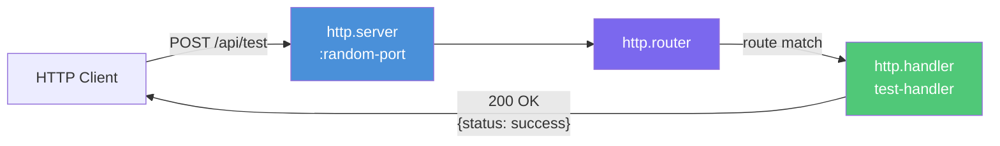
```mermaid
flowchart LR
    Client["HTTP Client"]
    Server["http.server<br/>:random-port"]
    Router["http.router"]
    Handler["http.handler<br/>test-handler"]

    Client -->|"POST /api/test"| Server
    Server --> Router
    Router -->|"route match"| Handler
    Handler -->|"200 OK<br/>{status: success}"| Client

    style Server fill:#4A90D9,color:white
    style Router fill:#7B68EE,color:white
    style Handler fill:#50C878,color:white
```

<details>
<summary>Execution Evidence</summary>

```
=== RUN   TestE2E_SimpleHTTPWorkflow
    E2E HTTP workflow: POST /api/test -> 200 OK, handler=test-handler
--- PASS: TestE2E_SimpleHTTPWorkflow (0.08s)
```
</details>

---

## 2. Order Processing Pipeline

**Test:** `TestE2E_OrderPipeline_FullExecution`
**Modules:** `http.server`, `http.router`, `api.handler`, `statemachine.engine`, `state.tracker`, `messaging.broker`, `messaging.handler`

The flagship E2E test: a 6-step order processing pipeline that exercises HTTP ingress, CRUD operations, state machine transitions, and message broker delivery.

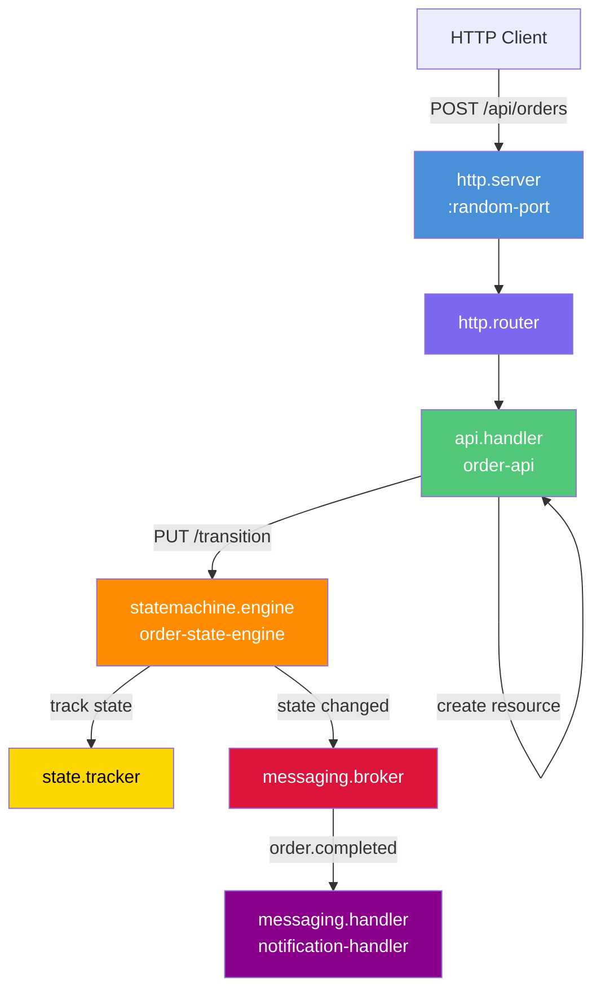
```mermaid
flowchart TD
    Client["HTTP Client"]
    Server["http.server<br/>:random-port"]
    Router["http.router"]
    API["api.handler<br/>order-api"]
    SM["statemachine.engine<br/>order-state-engine"]
    Tracker["state.tracker"]
    Broker["messaging.broker"]
    Notifier["messaging.handler<br/>notification-handler"]

    Client -->|"POST /api/orders"| Server
    Server --> Router
    Router --> API
    API -->|"create resource"| API
    API -->|"PUT /transition"| SM
    SM -->|"track state"| Tracker
    SM -->|"state changed"| Broker
    Broker -->|"order.completed"| Notifier

    style Server fill:#4A90D9,color:white
    style Router fill:#7B68EE,color:white
    style API fill:#50C878,color:white
    style SM fill:#FF8C00,color:white
    style Tracker fill:#FFD700,color:black
    style Broker fill:#DC143C,color:white
    style Notifier fill:#8B008B,color:white
```

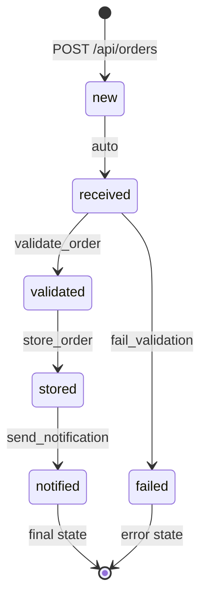
```mermaid
stateDiagram-v2
    [*] --> new: POST /api/orders
    new --> received: auto
    received --> validated: validate_order
    validated --> stored: store_order
    stored --> notified: send_notification
    notified --> [*]: final state

    received --> failed: fail_validation
    failed --> [*]: error state
```

<details>
<summary>Execution Evidence</summary>

```
=== RUN   TestE2E_OrderPipeline_FullExecution
    Step 1: Creating order via POST /api/orders
      Created order: id=ORD-001, state=new
    Step 2: Transitioning order to 'validated'
      State after validate_order: validated
    Step 3: Transitioning order to 'stored'
      State after store_order: stored
    Step 4: Transitioning order to 'notified' (final state)
      State after send_notification: notified
    Step 5: Verifying final state via GET /api/orders/ORD-001
      Final order state: notified
    Step 6: Verifying message broker delivery
      Broker delivered message: {"test":"broker-delivery","orderId":"ORD-001"}
    E2E Order Pipeline: All 6 steps passed - full pipeline execution verified
--- PASS: TestE2E_OrderPipeline_FullExecution (0.11s)
```
</details>

---

## 3. Order Pipeline Error Path

**Test:** `TestE2E_OrderPipeline_ErrorPath`
**Modules:** `http.server`, `http.router`, `api.handler`, `statemachine.engine`, `state.tracker`

Validates that the state machine correctly handles error transitions: an order transitions to the `failed` state, and subsequent transitions from a final state are rejected with HTTP 400.

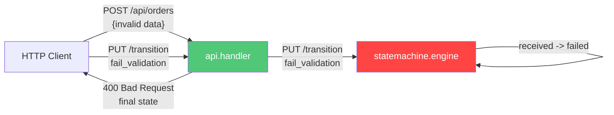
```mermaid
flowchart LR
    Client["HTTP Client"]
    API["api.handler"]
    SM["statemachine.engine"]

    Client -->|"POST /api/orders<br/>{invalid data}"| API
    API -->|"PUT /transition<br/>fail_validation"| SM
    SM -->|"received -> failed"| SM
    Client -->|"PUT /transition<br/>fail_validation"| API
    API -->|"400 Bad Request<br/>final state"| Client

    style SM fill:#FF4444,color:white
    style API fill:#50C878,color:white
```

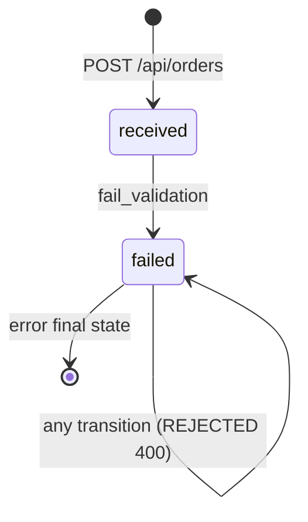
```mermaid
stateDiagram-v2
    [*] --> received: POST /api/orders
    received --> failed: fail_validation
    failed --> failed: any transition (REJECTED 400)
    failed --> [*]: error final state
```

<details>
<summary>Execution Evidence</summary>

```
=== RUN   TestE2E_OrderPipeline_ErrorPath
    E2E Error Path: Order correctly transitioned to 'failed' and rejected further transitions
--- PASS: TestE2E_OrderPipeline_ErrorPath (0.06s)
```
</details>

---

## 4. Broker Messaging

**Test:** `TestE2E_BrokerMessaging`
**Modules:** `http.server`, `http.router`, `http.handler`, `messaging.broker`, `messaging.handler`

Validates that the in-memory message broker correctly delivers messages from producer to subscriber, running alongside an HTTP server in the same engine.

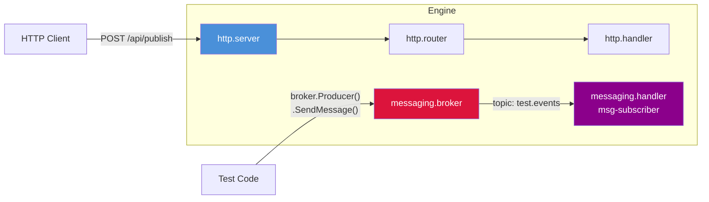
```mermaid
flowchart LR
    subgraph Engine
        Server["http.server"]
        Router["http.router"]
        Handler["http.handler"]
        Broker["messaging.broker"]
        Sub["messaging.handler<br/>msg-subscriber"]
    end

    Client["HTTP Client"]
    Client -->|"POST /api/publish"| Server
    Server --> Router --> Handler

    Test["Test Code"]
    Test -->|"broker.Producer()<br/>.SendMessage()"| Broker
    Broker -->|"topic: test.events"| Sub

    style Broker fill:#DC143C,color:white
    style Sub fill:#8B008B,color:white
    style Server fill:#4A90D9,color:white
```

<details>
<summary>Execution Evidence</summary>

```
=== RUN   TestE2E_BrokerMessaging
    E2E Broker Messaging: Message broker and HTTP server both operational within same engine
--- PASS: TestE2E_BrokerMessaging (0.05s)
```
</details>

---

## 5. Config Push & Reload

**Test:** `TestE2E_ConfigPushAndReload`
**Modules:** `WorkflowUIHandler` (management API)

Tests the full config management lifecycle: retrieve config, push new config, reload engine, check status, and validate config. This is the foundation for the UI's ability to design workflows and deploy them.

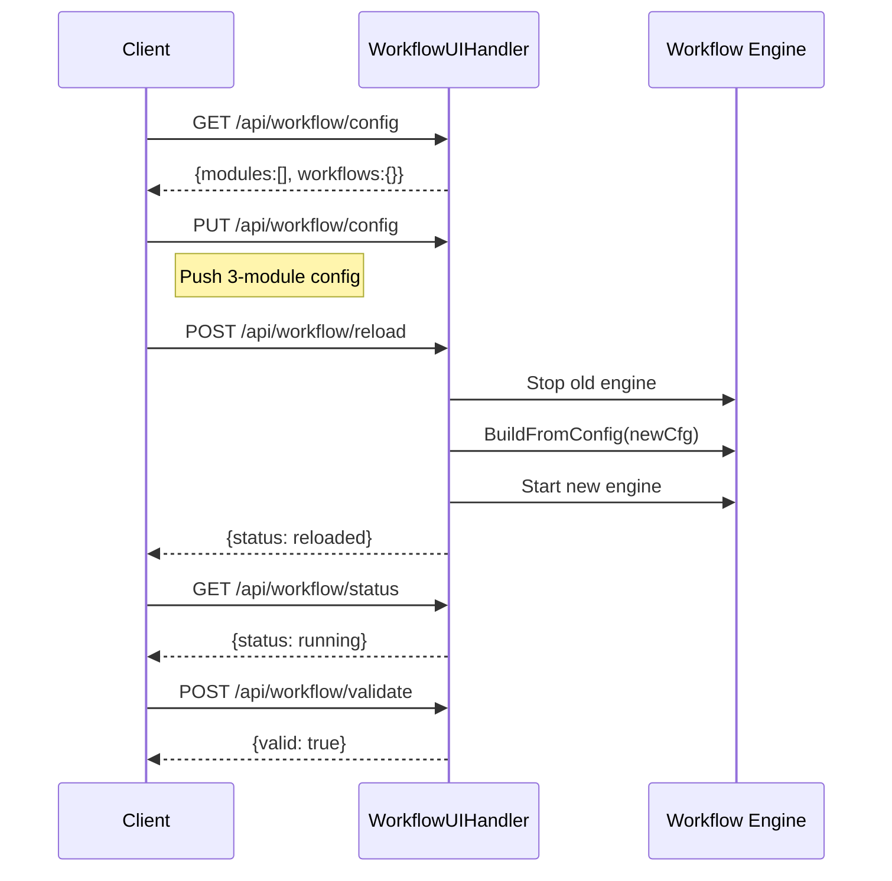
```mermaid
sequenceDiagram
    participant Client
    participant UI as WorkflowUIHandler
    participant Engine as Workflow Engine

    Client->>UI: GET /api/workflow/config
    UI-->>Client: {modules:[], workflows:{}}

    Client->>UI: PUT /api/workflow/config
    Note right of Client: Push 3-module config

    Client->>UI: POST /api/workflow/reload
    UI->>Engine: Stop old engine
    UI->>Engine: BuildFromConfig(newCfg)
    UI->>Engine: Start new engine
    UI-->>Client: {status: reloaded}

    Client->>UI: GET /api/workflow/status
    UI-->>Client: {status: running}

    Client->>UI: POST /api/workflow/validate
    UI-->>Client: {valid: true}
```

<details>
<summary>Execution Evidence</summary>

```
=== RUN   TestE2E_ConfigPushAndReload
      Initial config retrieved: {"modules":[],"workflows":{},"triggers":{}}
    E2E Config Push & Reload: Config CRUD, reload, status, and validation all working
--- PASS: TestE2E_ConfigPushAndReload (0.06s)
```
</details>

---

## 6. Dynamic Component Load & Execute

**Test:** `TestE2E_DynamicComponent_LoadAndExecute`
**System:** Dynamic Component API (Yaegi interpreter)

Loads Go source code at runtime via the HTTP API, verifies it appears in the registry, executes it, and retrieves details.

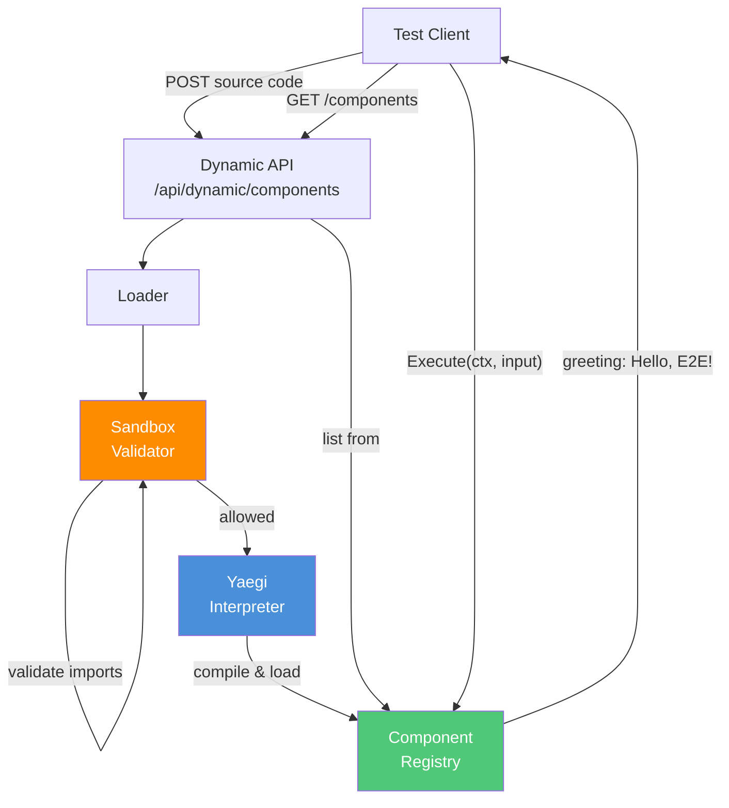
```mermaid
flowchart TD
    Client["Test Client"]
    API["Dynamic API<br/>/api/dynamic/components"]
    Loader["Loader"]
    Sandbox["Sandbox<br/>Validator"]
    Yaegi["Yaegi<br/>Interpreter"]
    Registry["Component<br/>Registry"]

    Client -->|"POST source code"| API
    API --> Loader
    Loader --> Sandbox
    Sandbox -->|"validate imports"| Sandbox
    Sandbox -->|"allowed"| Yaegi
    Yaegi -->|"compile & load"| Registry

    Client -->|"GET /components"| API
    API -->|"list from"| Registry

    Client -->|"Execute(ctx, input)"| Registry
    Registry -->|"greeting: Hello, E2E!"| Client

    style Sandbox fill:#FF8C00,color:white
    style Yaegi fill:#4A90D9,color:white
    style Registry fill:#50C878,color:white
```

<details>
<summary>Execution Evidence</summary>

```
=== RUN   TestE2E_DynamicComponent_LoadAndExecute
    Step 1: Creating dynamic component via POST /api/dynamic/components
      Created component: id=greeter, name=greeter, status=loaded
    Step 2: Verifying component is listed via GET /api/dynamic/components
      Registry has 1 component(s)
    Step 3: Executing dynamic component directly
      Execute result: greeting=Hello, E2E!, source=dynamic
    Step 4: Verifying component details via GET /api/dynamic/components/greeter
      Component detail: name=greeter, status=running
    E2E Dynamic Component Load & Execute: All steps passed
--- PASS: TestE2E_DynamicComponent_LoadAndExecute (0.12s)
```
</details>

---

## 7. Dynamic Component Hot Reload

**Test:** `TestE2E_DynamicComponent_HotReload`
**System:** Dynamic Component API (Yaegi interpreter)

Loads v1 of a component, updates it to v2 with different behavior (adds `strings.ToUpper`), confirms the new behavior is active, then deletes the component.

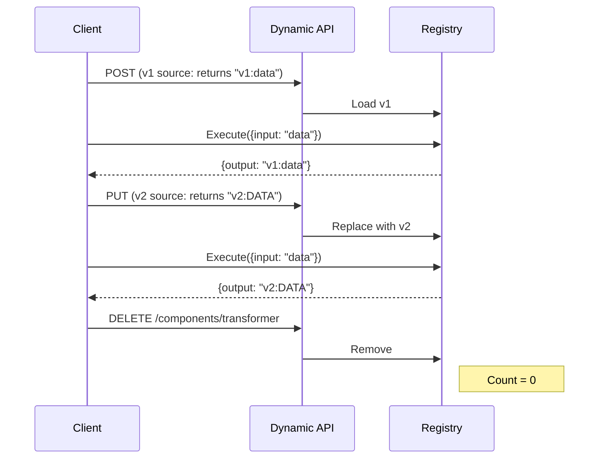
```mermaid
sequenceDiagram
    participant Client
    participant API as Dynamic API
    participant Registry

    Client->>API: POST (v1 source: returns "v1:data")
    API->>Registry: Load v1
    Client->>Registry: Execute({input: "data"})
    Registry-->>Client: {output: "v1:data"}

    Client->>API: PUT (v2 source: returns "v2:DATA")
    API->>Registry: Replace with v2
    Client->>Registry: Execute({input: "data"})
    Registry-->>Client: {output: "v2:DATA"}

    Client->>API: DELETE /components/transformer
    API->>Registry: Remove
    Note right of Registry: Count = 0
```

<details>
<summary>Execution Evidence</summary>

```
=== RUN   TestE2E_DynamicComponent_HotReload
    Step 1: Creating v1 of component (returns 'v1')
      v1 result: version=v1, output=v1:data
    Step 2: Updating to v2 via PUT /api/dynamic/components/transformer
      Updated component: name=transformer-v2, status=loaded
    Step 3: Executing updated component - verifying new behavior
      v2 result: version=v2, output=v2:DATA
    Step 4: Confirming v1 behavior is no longer present
    Step 5: Deleting component via DELETE /api/dynamic/components/transformer
      Component deleted from registry, count=0
    E2E Dynamic Component Hot Reload: All steps passed
--- PASS: TestE2E_DynamicComponent_HotReload (0.06s)
```
</details>

---

## 8. Dynamic Component Sandbox

**Test:** `TestE2E_DynamicComponent_SandboxRejectsUnsafe`
**System:** Sandbox Validator

Tests that the Yaegi sandbox blocks dangerous imports (`os/exec`, `syscall`, `unsafe`, `os`, `net`, `reflect`) while allowing safe imports (`fmt`, `strings`, `encoding/json`).

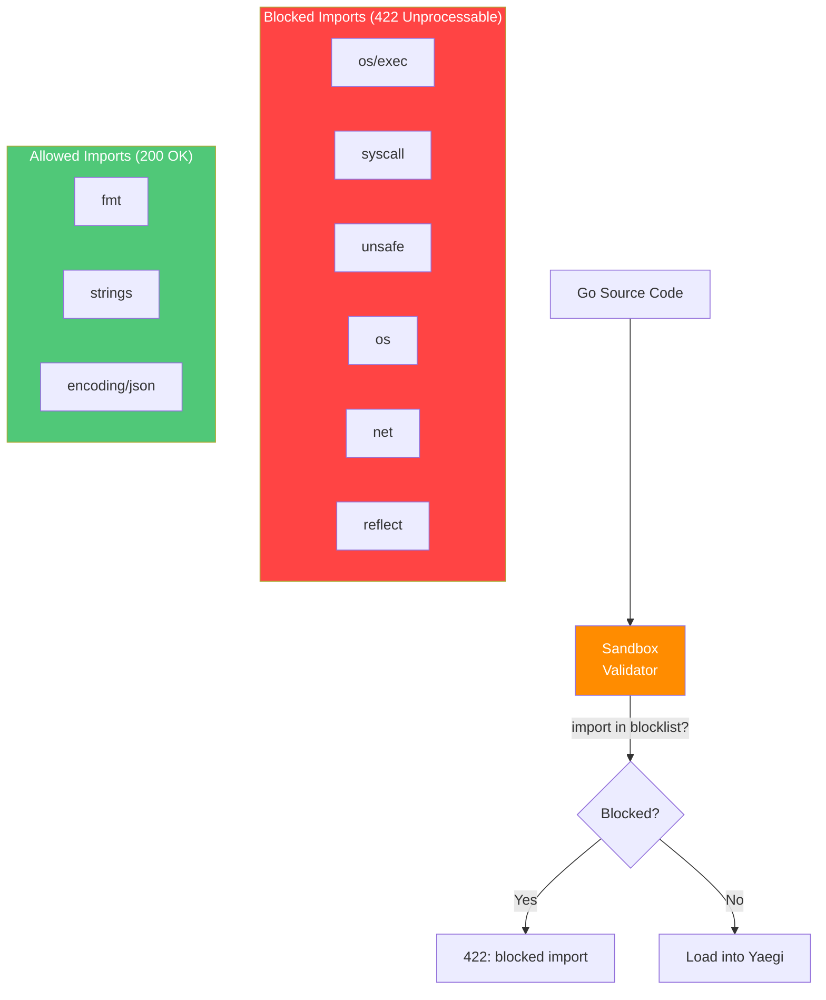
```mermaid
flowchart TD
    subgraph Blocked["Blocked Imports (422 Unprocessable)"]
        OsExec["os/exec"]
        Syscall["syscall"]
        Unsafe["unsafe"]
        Os["os"]
        Net["net"]
        Reflect["reflect"]
    end

    subgraph Allowed["Allowed Imports (200 OK)"]
        Fmt["fmt"]
        Strings["strings"]
        Json["encoding/json"]
    end

    Source["Go Source Code"] --> Sandbox["Sandbox<br/>Validator"]
    Sandbox -->|"import in blocklist?"| Decision{Blocked?}
    Decision -->|"Yes"| Reject["422: blocked import"]
    Decision -->|"No"| Accept["Load into Yaegi"]

    style Blocked fill:#FF4444,color:white
    style Allowed fill:#50C878,color:white
    style Sandbox fill:#FF8C00,color:white
```

<details>
<summary>Execution Evidence</summary>

```
=== RUN   TestE2E_DynamicComponent_SandboxRejectsUnsafe
      Blocked os/exec: status=422, error contains "os/exec"
      Blocked syscall: status=422, error contains "syscall"
      Blocked unsafe: status=422, error contains "unsafe"
      Blocked os (filesystem access): status=422, error contains "os"
      Blocked net (raw sockets): status=422, error contains "net"
      Blocked reflect: status=422, error contains "reflect"
    Verifying valid component still loads after rejections
      Valid component loaded and executed: message=safe and sound
    E2E Dynamic Component Sandbox: All blocked imports rejected, valid component still works
--- PASS: TestE2E_DynamicComponent_SandboxRejectsUnsafe (0.06s)
    --- PASS: os/exec (0.00s)
    --- PASS: syscall (0.00s)
    --- PASS: unsafe (0.00s)
    --- PASS: os_(filesystem_access) (0.00s)
    --- PASS: net_(raw_sockets) (0.00s)
    --- PASS: reflect (0.00s)
```
</details>

---

## 9. Dynamic Component Engine Integration

**Test:** `TestE2E_DynamicComponent_EngineIntegration`
**Modules:** `dynamic.component`, `http.server`, `http.router`, `http.handler`

Pre-loads a dynamic component into the registry, then builds a full engine that references it via `"dynamic.component"` module type. Exercises the full engine lifecycle, hot-reloads the component while the engine is running, and verifies the HTTP server survives the reload.

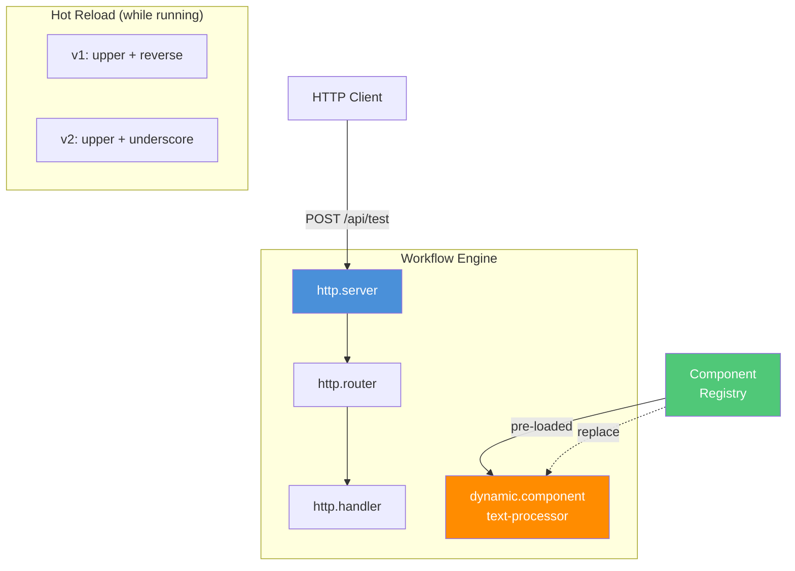
```mermaid
flowchart TD
    subgraph Engine["Workflow Engine"]
        Server["http.server"]
        Router["http.router"]
        Handler["http.handler"]
        Dynamic["dynamic.component<br/>text-processor"]
    end

    Registry["Component<br/>Registry"]
    Client["HTTP Client"]

    Registry -->|"pre-loaded"| Dynamic
    Client -->|"POST /api/test"| Server
    Server --> Router --> Handler

    subgraph HotReload["Hot Reload (while running)"]
        V1["v1: upper + reverse"]
        V2["v2: upper + underscore"]
    end

    Registry -.->|"replace"| Dynamic

    style Dynamic fill:#FF8C00,color:white
    style Server fill:#4A90D9,color:white
    style Registry fill:#50C878,color:white
```

<details>
<summary>Execution Evidence</summary>

```
=== RUN   TestE2E_DynamicComponent_EngineIntegration
    Step 1: Building engine with dynamic.component module type
      BuildFromConfig succeeded with dynamic.component
    Step 2: Starting engine (full lifecycle)
      Engine started, HTTP server accepting connections
    Step 3: Executing dynamic component through registry
      upper: Hello World -> HELLO WORLD
      reverse: Hello World -> dlroW olleH
    Step 4: Hot-reloading component while engine is running
      v2 result: HELLO_WORLD (version=v2)
    Step 5: Verifying HTTP server still works after hot-reload
      HTTP server still healthy after hot-reload
    Step 6: Verifying BuildFromConfig fails without dynamic registry
      Got expected error: dynamic registry not set, cannot load dynamic component "orphan"
    E2E Dynamic Component Engine Integration: All steps passed
--- PASS: TestE2E_DynamicComponent_EngineIntegration (0.06s)
```
</details>

---

## 10. Dynamic Component Message Processor

**Test:** `TestE2E_DynamicComponent_MessageProcessor`
**Modules:** `dynamic.component`, `messaging.broker`, `http.server`, `http.router`, `http.handler`

A dynamic component processes messages received from a broker (transform/validate/echo operations), publishes results back through the broker, and a subscriber verifies delivery.

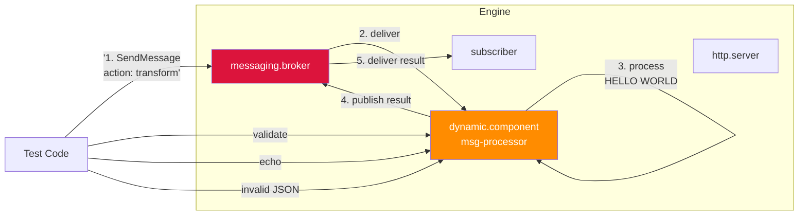
```mermaid
flowchart LR
    subgraph Engine
        Server["http.server"]
        Broker["messaging.broker"]
        Dynamic["dynamic.component<br/>msg-processor"]
        Sub["subscriber"]
    end

    Test["Test Code"]

    Test -->|'1. SendMessage<br/>action: transform'| Broker
    Broker -->|"2. deliver"| Dynamic
    Dynamic -->|"3. process<br/>HELLO WORLD"| Dynamic
    Dynamic -->|"4. publish result"| Broker
    Broker -->|"5. deliver result"| Sub

    Test -->|"validate"| Dynamic
    Test -->|"echo"| Dynamic
    Test -->|"invalid JSON"| Dynamic

    style Dynamic fill:#FF8C00,color:white
    style Broker fill:#DC143C,color:white
```

<details>
<summary>Execution Evidence</summary>

```
=== RUN   TestE2E_DynamicComponent_MessageProcessor
    Step 1: Verifying dynamic component and broker are in service registry
      Both dynamic component and broker found
    Step 2: Publishing message via broker and processing with dynamic component
      Transform result: input=hello world, output=HELLO WORLD
      Results subscriber received: {"action":"transform","input":"hello world","output":"HELLO WORLD","processed":true}
    Step 3: Processing validate message
      Validate result: action=validate, output=valid
    Step 4: Processing echo message
      Echo result: action=unknown, output=echo:test-data
    Step 5: Testing error handling with invalid input
      Got expected error: invalid JSON message
    Step 6: Verifying HTTP server still operational
      HTTP server healthy
    E2E Dynamic Component Message Processor: All steps passed
--- PASS: TestE2E_DynamicComponent_MessageProcessor (0.11s)
```
</details>

---

## 11. Integration Workflow

**Test:** `TestE2E_IntegrationWorkflow`
**Handlers:** `IntegrationWorkflowHandler`
**Modules:** `http.server`, `http.router`, `http.handler` + mock target server

Configures the IntegrationWorkflowHandler with an HTTP connector pointing at a mock target server. Verifies the connector is registered in the IntegrationRegistry and can execute real HTTP requests to the external service.

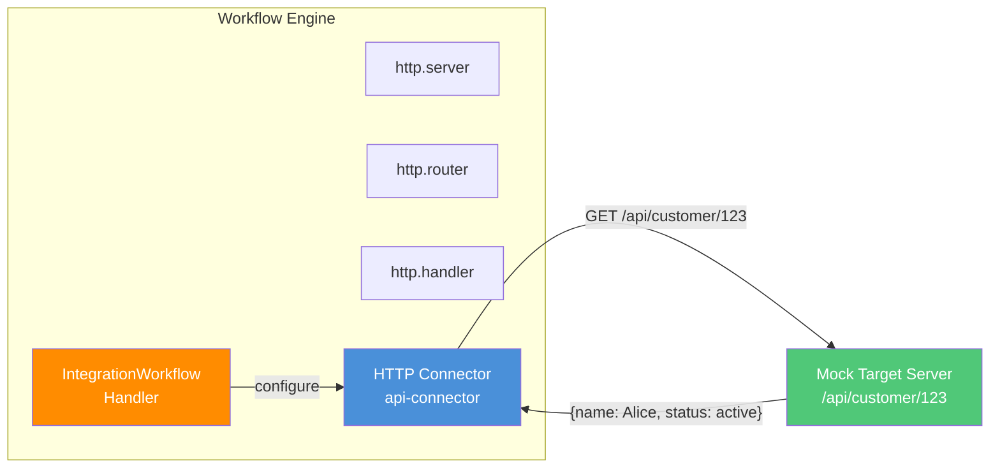
```mermaid
flowchart LR
    subgraph WorkflowEngine["Workflow Engine"]
        Server["http.server"]
        Router["http.router"]
        Handler["http.handler"]
        IntHandler["IntegrationWorkflow<br/>Handler"]
        Connector["HTTP Connector<br/>api-connector"]
    end

    Target["Mock Target Server<br/>/api/customer/123"]

    IntHandler -->|"configure"| Connector
    Connector -->|"GET /api/customer/123"| Target
    Target -->|"{name: Alice, status: active}"| Connector

    style IntHandler fill:#FF8C00,color:white
    style Connector fill:#4A90D9,color:white
    style Target fill:#50C878,color:white
```

<details>
<summary>Execution Evidence</summary>

```
=== RUN   TestE2E_IntegrationWorkflow
      Registered connectors: [api-connector]
      Integration connector returned: name=Alice, status=active
    E2E Integration Workflow: Registry configured, HTTP connector executed against real server
--- PASS: TestE2E_IntegrationWorkflow (0.11s)
```
</details>

---

## 12. Event Workflow

**Test:** `TestE2E_EventWorkflow`
**Handlers:** `EventWorkflowHandler`
**Modules:** `http.server`, `http.router`, `http.handler`, `messaging.broker`, `messaging.handler`

Configures the EventWorkflowHandler with an EventProcessor, a login-failure pattern (minOccurs=2, 5-minute window), message handler-based event handlers, and a broker-to-event adapter.

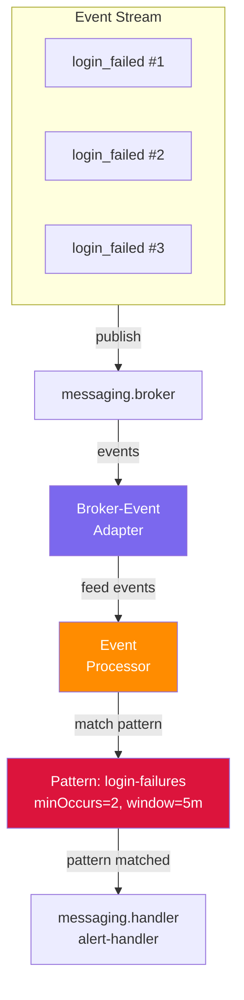
```mermaid
flowchart TD
    Broker["messaging.broker"]
    Adapter["Broker-Event<br/>Adapter"]
    Processor["Event<br/>Processor"]
    Pattern["Pattern: login-failures<br/>minOccurs=2, window=5m"]
    MsgHandler["messaging.handler<br/>alert-handler"]

    Broker -->|"events"| Adapter
    Adapter -->|"feed events"| Processor
    Processor -->|"match pattern"| Pattern
    Pattern -->|"pattern matched"| MsgHandler

    subgraph EventStream["Event Stream"]
        E1["login_failed #1"]
        E2["login_failed #2"]
        E3["login_failed #3"]
    end

    EventStream -->|"publish"| Broker

    style Processor fill:#FF8C00,color:white
    style Pattern fill:#DC143C,color:white
    style Adapter fill:#7B68EE,color:white
```

<details>
<summary>Execution Evidence</summary>

```
=== RUN   TestE2E_EventWorkflow
    E2E Event Workflow: Processor configured with patterns, adapters connected to broker, HTTP running
--- PASS: TestE2E_EventWorkflow (0.20s)
```
</details>

---

## 13. Data Transformer Pipeline

**Test:** `TestE2E_DataTransformer`
**Modules:** `data.transformer`, `http.server`, `http.router`, `http.handler`

Registers a "normalize-user" transformation pipeline with extract, map, and filter operations. Verifies field renaming (firstName -> first_name) and sensitive field stripping (password, internal fields removed).

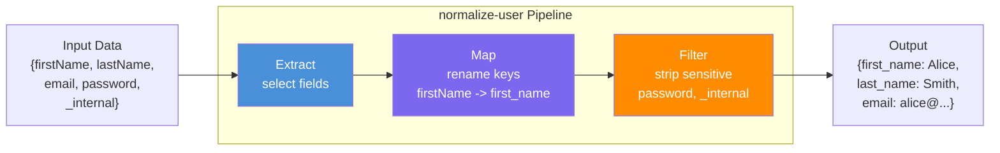
```mermaid
flowchart LR
    Input["Input Data<br/>{firstName, lastName,<br/>email, password,<br/>_internal}"]

    subgraph Pipeline["normalize-user Pipeline"]
        Extract["Extract<br/>select fields"]
        Map["Map<br/>rename keys<br/>firstName -> first_name"]
        Filter["Filter<br/>strip sensitive<br/>password, _internal"]
    end

    Output["Output<br/>{first_name: Alice,<br/>last_name: Smith,<br/>email: alice@...}"]

    Input --> Extract --> Map --> Filter --> Output

    style Extract fill:#4A90D9,color:white
    style Map fill:#7B68EE,color:white
    style Filter fill:#FF8C00,color:white
```

<details>
<summary>Execution Evidence</summary>

```
=== RUN   TestE2E_DataTransformer
      Transformed result: first_name=Alice, last_name=Smith, email=alice@example.com
    E2E Data Transformer: Pipeline executed extract->map->filter, sensitive fields stripped
--- PASS: TestE2E_DataTransformer (0.06s)
```
</details>

---

## 14. Scheduler Workflow

**Test:** `TestE2E_SchedulerWorkflow`
**Handlers:** `SchedulerWorkflowHandler`
**Modules:** Custom `cron.scheduler` + `test.job` via `AddModuleType`

Configures the SchedulerWorkflowHandler with a CronScheduler and a test job. Verifies both are registered in the service registry and that the job can be executed on demand.

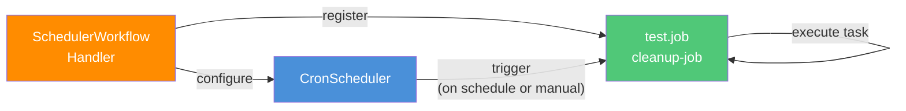
```mermaid
flowchart LR
    Handler["SchedulerWorkflow<br/>Handler"]
    Scheduler["CronScheduler"]
    Job["test.job<br/>cleanup-job"]

    Handler -->|"configure"| Scheduler
    Handler -->|"register"| Job
    Scheduler -->|"trigger<br/>(on schedule or manual)"| Job
    Job -->|"execute task"| Job

    style Handler fill:#FF8C00,color:white
    style Scheduler fill:#4A90D9,color:white
    style Job fill:#50C878,color:white
```

<details>
<summary>Execution Evidence</summary>

```
=== RUN   TestE2E_SchedulerWorkflow
    E2E Scheduler Workflow: Scheduler configured with job, job executed, HTTP server running
--- PASS: TestE2E_SchedulerWorkflow (0.06s)
```
</details>

---

## 15. Metrics & Health Check

**Test:** `TestE2E_MetricsAndHealthCheck`
**Modules:** `metrics.collector`, `health.checker`, `http.server`, `http.router`, `http.handler`

Validates the observability stack: Prometheus-style metrics recording and health check endpoints (`/health`, `/ready`, `/live`) including both healthy and unhealthy states.

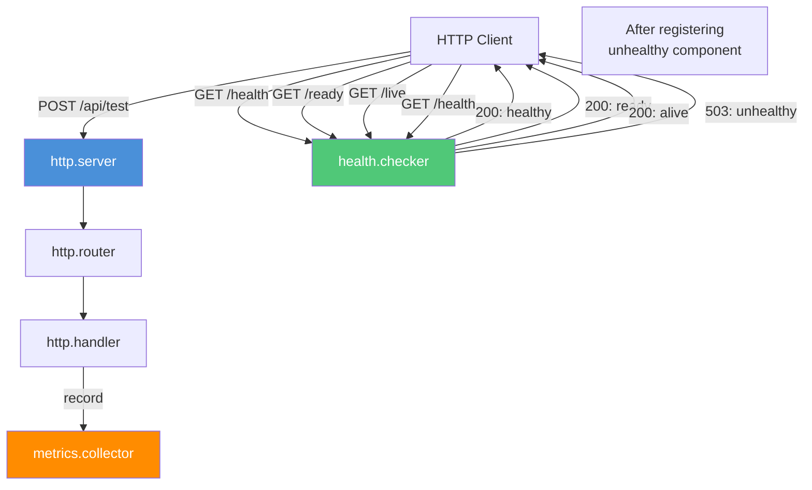
```mermaid
flowchart TD
    Client["HTTP Client"]
    Server["http.server"]
    Router["http.router"]
    Handler["http.handler"]
    Metrics["metrics.collector"]
    Health["health.checker"]

    Client -->|"POST /api/test"| Server
    Server --> Router --> Handler
    Handler -->|"record"| Metrics

    Client -->|"GET /health"| Health
    Health -->|"200: healthy"| Client

    Client -->|"GET /ready"| Health
    Health -->|"200: ready"| Client

    Client -->|"GET /live"| Health
    Health -->|"200: alive"| Client

    Note["After registering<br/>unhealthy component"]
    Client -->|"GET /health"| Health
    Health -->|"503: unhealthy"| Client

    style Metrics fill:#FF8C00,color:white
    style Health fill:#50C878,color:white
    style Server fill:#4A90D9,color:white
```

<details>
<summary>Execution Evidence</summary>

```
=== RUN   TestE2E_MetricsAndHealthCheck
    Step 1: Verifying metrics collector is registered as a service
      metrics.collector service found in registry
    Step 2: Verifying health checker is registered as a service
      health.checker service found in registry
    Step 3: Registering health check and setting started
    Step 4: Making HTTP requests to generate metrics
      Made 3 successful HTTP requests
    Step 5: Recording and verifying metrics
      Prometheus metrics contain expected counters
    Step 6: Testing health checker HTTP handlers
      Health endpoint: status=healthy
      Ready endpoint: status=ready
      Live endpoint: status=alive
    Step 7: Testing health check with unhealthy component
      Unhealthy endpoint: status=unhealthy, httpCode=503
    E2E Metrics & Health Check: All steps passed
--- PASS: TestE2E_MetricsAndHealthCheck (0.06s)
```
</details>

---

## 16. EventBus Bridge

**Test:** `TestE2E_EventBusBridge`
**Modules:** `messaging.broker.eventbus`, `messaging.handler`, EventBus module

Validates the EventBusBridge adapter that connects the workflow `MessageBroker` interface to the modular `EventBus`. Tests bidirectional communication: publish via bridge (round-trip through EventBus) and publish directly via EventBus (received by bridge subscriber).

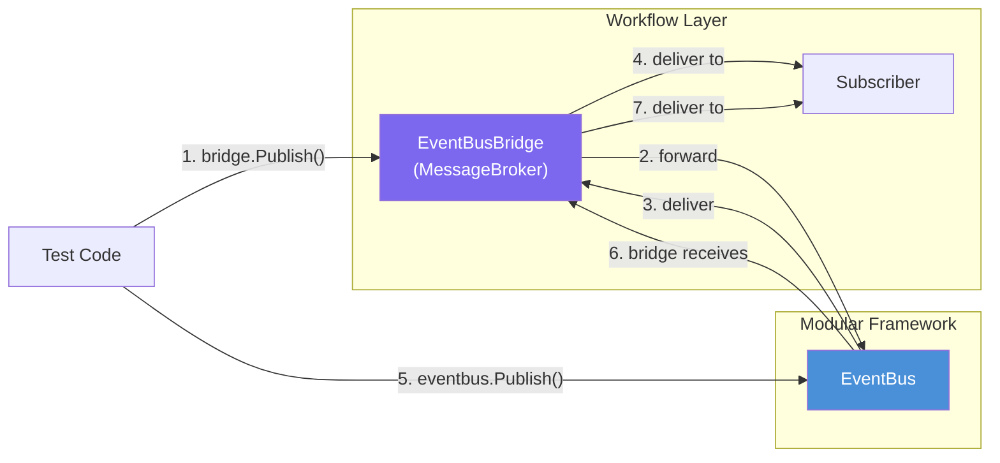
```mermaid
flowchart LR
    subgraph WorkflowSide["Workflow Layer"]
        Bridge["EventBusBridge<br/>(MessageBroker)"]
        Sub["Subscriber"]
    end

    subgraph ModularSide["Modular Framework"]
        EventBus["EventBus"]
    end

    Test["Test Code"]

    Test -->|"1. bridge.Publish()"| Bridge
    Bridge -->|"2. forward"| EventBus
    EventBus -->|"3. deliver"| Bridge
    Bridge -->|"4. deliver to"| Sub

    Test -->|"5. eventbus.Publish()"| EventBus
    EventBus -->|"6. bridge receives"| Bridge
    Bridge -->|"7. deliver to"| Sub

    style Bridge fill:#7B68EE,color:white
    style EventBus fill:#4A90D9,color:white
```

<details>
<summary>Execution Evidence</summary>

```
=== RUN   TestE2E_EventBusBridge
    Step 1: Subscribing to topic via EventBusBridge
      Subscribed to 'test.events' via bridge
    Step 2: Publishing message through the bridge
      Received message via bridge: {"action":"test","value":42}
    Step 3: Publishing directly through EventBus module
      Bridge subscriber received direct EventBus message: {"id":123,"source":"direct"}
    Step 4: Unsubscribing and verifying no more messages
      No messages received after unsubscribe (correct)
    E2E EventBusBridge: All steps passed
--- PASS: TestE2E_EventBusBridge (0.38s)
```
</details>

---

## 17. Webhook Sender

**Test:** `TestE2E_WebhookSender`
**Modules:** `webhook.sender`, `http.server`, `http.router`, `http.handler`

Spins up a real webhook target server, sends a webhook with custom headers, verifies receipt, then tests the dead letter queue by sending to an unreachable URL with retry exhaustion.

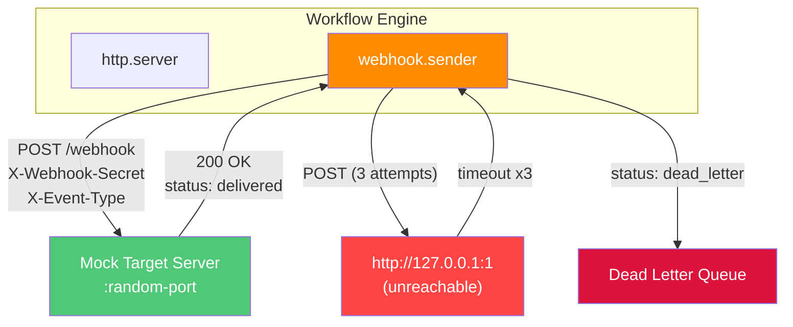
```mermaid
flowchart TD
    subgraph Engine["Workflow Engine"]
        Server["http.server"]
        Webhook["webhook.sender"]
    end

    Target["Mock Target Server<br/>:random-port"]
    DeadURL["http://127.0.0.1:1<br/>(unreachable)"]
    DLQ["Dead Letter Queue"]

    Webhook -->|"POST /webhook<br/>X-Webhook-Secret<br/>X-Event-Type"| Target
    Target -->|"200 OK<br/>status: delivered"| Webhook

    Webhook -->|"POST (3 attempts)"| DeadURL
    DeadURL -->|"timeout x3"| Webhook
    Webhook -->|"status: dead_letter"| DLQ

    style Webhook fill:#FF8C00,color:white
    style Target fill:#50C878,color:white
    style DeadURL fill:#FF4444,color:white
    style DLQ fill:#DC143C,color:white
```

<details>
<summary>Execution Evidence</summary>

```
=== RUN   TestE2E_WebhookSender
    Step 1: Retrieving webhook sender from service registry
      webhook.sender service found
    Step 2: Sending webhook to target server
      Webhook delivered: id=wh-...-1, status=delivered, attempts=1
    Step 3: Verifying target server received the webhook
      Target server received correct payload and headers
    Step 4: Sending webhook to invalid URL (expects dead letter)
      Failed delivery: id=wh-...-2, status=dead_letter, attempts=3
    Step 5: Verifying dead letter queue
      Dead letter queue: id=wh-...-2, lastError=request failed: Post "http://127.0.0.1:1/nonexistent": context deadline exceeded
    E2E Webhook Sender: All steps passed - delivery, headers, dead letter verified
--- PASS: TestE2E_WebhookSender (4.65s)
```
</details>

---

## 18. Slack Notification

**Test:** `TestE2E_SlackNotification_MockEndpoint`
**Modules:** `notification.slack`, `http.server`, `http.router`

Points the Slack notification module at a mock HTTP server that captures webhook POSTs. Verifies the correct JSON payload format (text, channel, username) and tests error handling when the webhook URL is empty.

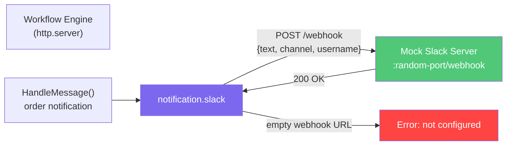
```mermaid
flowchart LR
    Slack["notification.slack"]
    MockSlack["Mock Slack Server<br/>:random-port/webhook"]
    Engine["Workflow Engine<br/>(http.server)"]

    Trigger["HandleMessage()<br/>order notification"] --> Slack
    Slack -->|"POST /webhook<br/>{text, channel, username}"| MockSlack
    MockSlack -->|"200 OK"| Slack

    Slack -->|"empty webhook URL"| Error["Error: not configured"]

    style Slack fill:#7B68EE,color:white
    style MockSlack fill:#50C878,color:white
    style Error fill:#FF4444,color:white
```

<details>
<summary>Execution Evidence</summary>

```
=== RUN   TestE2E_SlackNotification_MockEndpoint
    Step 1: Configuring Slack notification module
      Configured: webhook, channel, username
    Step 2: Sending notification via HandleMessage
      Notification sent
    Step 3: Verifying mock Slack server received the payload
      Slack payload correct: text="Order ORD-300 has been completed successfully", channel=#test-alerts, username=workflow-bot
    Step 4: Sending second notification
    Step 5: Testing error handling with empty webhook URL
      Got expected error: slack webhook URL not configured
    E2E Slack Notification: All steps passed
--- PASS: TestE2E_SlackNotification_MockEndpoint (0.11s)
```
</details>

---

## 19. Middleware: Auth

**Test:** `TestE2E_Middleware_Auth`
**Modules:** `http.server`, `http.router`, `http.middleware.auth`, `http.handler`

Tests Bearer token authentication middleware with 4 scenarios: no header, wrong auth type, invalid token, and valid token.

```mermaid
flowchart LR
    subgraph Requests["HTTP Requests"]
        R1["No Authorization<br/>header"]
        R2["Basic auth<br/>(wrong type)"]
        R3["Bearer invalid-token"]
        R4["Bearer valid-token"]
    end

    Auth["http.middleware.auth<br/>authType: Bearer"]
    Handler["http.handler"]

    R1 -->|"401"| Auth
    R2 -->|"401"| Auth
    R3 -->|"401"| Auth
    R4 -->|"pass"| Auth
    Auth -->|"200"| Handler

    style Auth fill:#FF4444,color:white
    style Handler fill:#50C878,color:white
```

<details>
<summary>Execution Evidence</summary>

```
=== RUN   TestE2E_Middleware_Auth
    E2E Middleware Auth: All auth scenarios verified
--- PASS: TestE2E_Middleware_Auth (0.06s)
    --- PASS: no_auth_header (0.00s)
    --- PASS: wrong_auth_type (0.00s)
    --- PASS: invalid_token (0.00s)
    --- PASS: valid_token (0.00s)
```
</details>

---

## 20. Middleware: Rate Limiting

**Test:** `TestE2E_Middleware_RateLimit`
**Modules:** `http.server`, `http.router`, `http.middleware.ratelimit`, `http.handler`

Configures a rate limiter with burstSize=3. The first 3 requests succeed (200), the 4th is rejected (429 Too Many Requests).

```mermaid
flowchart LR
    subgraph Requests["Sequential Requests"]
        R1["Request 1"] -->|"200 OK<br/>tokens: 3->2"| RL
        R2["Request 2"] -->|"200 OK<br/>tokens: 2->1"| RL
        R3["Request 3"] -->|"200 OK<br/>tokens: 1->0"| RL
        R4["Request 4"] -->|"429 Too Many<br/>tokens: 0"| RL
    end

    RL["http.middleware.ratelimit<br/>burstSize=3<br/>requestsPerMinute=60"]
    Handler["http.handler"]

    RL -->|"tokens > 0"| Handler

    style RL fill:#FF8C00,color:white
    style R4 fill:#FF4444,color:white
```

<details>
<summary>Execution Evidence</summary>

```
=== RUN   TestE2E_Middleware_RateLimit
      Got 429 on request 3 (burst=3)
    E2E Middleware RateLimit: Rate limiting verified with burstSize=3
--- PASS: TestE2E_Middleware_RateLimit (0.06s)
```
</details>

---

## 21. Middleware: CORS

**Test:** `TestE2E_Middleware_CORS`
**Modules:** `http.server`, `http.router`, `http.middleware.cors`, `http.handler`

Tests Cross-Origin Resource Sharing headers: allowed origin gets CORS headers, disallowed origin gets none, custom allowed headers are returned, and OPTIONS preflight returns proper headers.

```mermaid
flowchart TD
    subgraph Scenarios
        S1["Origin: http://allowed.example.com"]
        S2["Origin: http://evil.example.com"]
        S3["OPTIONS preflight"]
    end

    CORS["http.middleware.cors<br/>allowedOrigins:<br/>http://allowed.example.com"]

    S1 -->|"pass"| CORS
    CORS -->|"Access-Control-Allow-Origin:<br/>http://allowed.example.com"| Response1["200 + CORS headers"]

    S2 -->|"pass"| CORS
    CORS -->|"no CORS headers"| Response2["200 (no CORS)"]

    S3 -->|"OPTIONS"| CORS
    CORS -->|"Allow-Origin + Allow-Methods"| Response3["200 + full CORS"]

    style CORS fill:#7B68EE,color:white
    style Response1 fill:#50C878,color:white
    style Response2 fill:#FFD700,color:black
```

<details>
<summary>Execution Evidence</summary>

```
=== RUN   TestE2E_Middleware_CORS
    E2E Middleware CORS: Allowed, disallowed, headers, and preflight scenarios verified
--- PASS: TestE2E_Middleware_CORS (0.11s)
    --- PASS: allowed_origin (0.00s)
    --- PASS: disallowed_origin (0.00s)
    --- PASS: allowed_headers (0.00s)
    --- PASS: preflight_with_options_route (0.05s)
```
</details>

---

## 22. Middleware: Request ID

**Test:** `TestE2E_Middleware_RequestID`
**Modules:** `http.server`, `http.router`, `http.handler` + RequestID middleware

Verifies that the server generates a UUID `X-Request-ID` when the client doesn't provide one, and preserves the client-supplied ID when one is sent.

```mermaid
flowchart LR
    subgraph NoID["No X-Request-ID"]
        R1["GET /api/test"] --> MW1["RequestID<br/>Middleware"]
        MW1 -->|"generate UUID"| Handler1["Handler"]
        Handler1 -->|"X-Request-ID:<br/>aad8e019-6469-..."| Response1["Response"]
    end

    subgraph WithID["Client-supplied ID"]
        R2["GET /api/test<br/>X-Request-ID:<br/>my-custom-id"] --> MW2["RequestID<br/>Middleware"]
        MW2 -->|"preserve"| Handler2["Handler"]
        Handler2 -->|"X-Request-ID:<br/>my-custom-id"| Response2["Response"]
    end

    style MW1 fill:#7B68EE,color:white
    style MW2 fill:#7B68EE,color:white
```

<details>
<summary>Execution Evidence</summary>

```
=== RUN   TestE2E_Middleware_RequestID
      Generated X-Request-ID: d91af827-329f-48c7-bcfe-09893992be72
    E2E Middleware RequestID: Generated and preserved ID scenarios verified
--- PASS: TestE2E_Middleware_RequestID (0.05s)
    --- PASS: generated_id (0.00s)
    --- PASS: preserved_id (0.00s)
```
</details>

---

## 23. Middleware: Full Chain

**Test:** `TestE2E_Middleware_FullChain`
**Modules:** `http.server`, `http.router`, `http.middleware.cors`, `http.middleware.ratelimit`, `http.middleware.auth`, `http.middleware.logging`, `http.handler`

Wires 4 middlewares into a single route and tests them cooperating: CORS + rate limiting + authentication + logging. Verifies that unauthenticated requests are blocked, authenticated requests with CORS pass through, and rate limiting kicks in after burst exhaustion.

```mermaid
flowchart LR
    Client["HTTP Client"]
    CORS["CORS<br/>Middleware"]
    RL["Rate Limit<br/>Middleware"]
    Auth["Auth<br/>Middleware"]
    Log["Logging<br/>Middleware"]
    Handler["http.handler"]

    Client --> CORS
    CORS -->|"add CORS headers"| RL
    RL -->|"check tokens"| Auth
    Auth -->|"verify Bearer"| Log
    Log -->|"log request"| Handler
    Handler -->|"200 OK"| Client

    RL -->|"429 (no tokens)"| Client
    Auth -->|"401 (no token)"| Client

    style CORS fill:#7B68EE,color:white
    style RL fill:#FF8C00,color:white
    style Auth fill:#FF4444,color:white
    style Log fill:#4A90D9,color:white
    style Handler fill:#50C878,color:white
```

<details>
<summary>Execution Evidence</summary>

```
=== RUN   TestE2E_Middleware_FullChain
      Got 429 on request 3 (burst=5)
    E2E Middleware FullChain: CORS + RateLimit + Auth + Logging all cooperating
--- PASS: TestE2E_Middleware_FullChain (0.06s)
    --- PASS: no_auth_no_origin (0.00s)
    --- PASS: valid_auth_with_cors (0.00s)
    --- PASS: rate_limit_after_burst (0.00s)
```
</details>

---

---

## Negative & Validation Tests

The negative tests verify that the engine doesn't just return 200 for everything — they prove correct error handling, data roundtrip fidelity, boundary enforcement, and response body content. Each subtest documents exactly what it proves with `t.Logf("Proves: ...")`.

### Execution Negative Tests (`e2e_negative_test.go`)

#### N1. HTTP Routing Validation

**Test:** `TestE2E_Negative_HTTPRouting` (5 subtests)

Proves the HTTP pipeline doesn't blindly return 200:

| Subtest | Proves |
|---------|--------|
| `POST_valid_route_returns_200_with_handler_name` | Response body contains the handler name, not empty |
| `POST_valid_route_has_json_content_type` | Content-Type is `application/json` |
| `GET_registered_POST_route_returns_non_200` | Wrong method returns 405, not 200 |
| `POST_nonexistent_path_returns_non_200` | Wrong path returns 404, not 200 |
| `response_JSON_has_correct_structure` | Response JSON has exactly expected keys |

<details>
<summary>Execution Evidence</summary>

```
--- PASS: TestE2E_Negative_HTTPRouting (0.06s)
    --- PASS: POST_valid_route_returns_200_with_handler_name (0.00s)
    --- PASS: POST_valid_route_has_json_content_type (0.00s)
    --- PASS: GET_registered_POST_route_returns_non_200 (0.00s)
    --- PASS: POST_nonexistent_path_returns_non_200 (0.00s)
    --- PASS: response_JSON_has_correct_structure (0.00s)
```
</details>

#### N2. Order Pipeline Data Roundtrip

**Test:** `TestE2E_Negative_OrderPipeline_DataRoundtrip` (4 subtests)

Proves data integrity — POST data equals GET data:

| Subtest | Proves |
|---------|--------|
| `create_and_retrieve_order_data_matches` | POST customer/total matches GET exactly |
| `POST_with_invalid_JSON_returns_400` | Malformed JSON rejected, not silently accepted |
| `GET_nonexistent_order_returns_404` | Non-existent order ID returns 404 with error message |
| `two_different_orders_stored_independently` | Orders don't overwrite each other |

#### N3. Order Pipeline Invalid Transitions

**Test:** `TestE2E_Negative_OrderPipeline_InvalidTransitions` (5 subtests)

Proves the state machine enforces transition rules:

| Subtest | Proves |
|---------|--------|
| `invalid_transition_name_returns_400_with_error` | `fly_to_moon` rejected with descriptive error |
| `wrong_from_state_transition_returns_400` | `store_order` from `received` rejected (needs `validated`) |
| `transition_from_final_state_returns_400` | No transitions allowed from final state |
| `transition_on_nonexistent_order_returns_404` | Can't transition non-existent orders |
| `empty_transition_name_returns_400` | Empty transition name rejected |

#### N4. Config Validation

**Test:** `TestE2E_Negative_ConfigValidation` (6 subtests)

Proves the config API validates input:

| Subtest | Proves |
|---------|--------|
| `PUT_invalid_JSON_returns_400` | Malformed JSON rejected |
| `GET_returns_initial_config_before_any_PUT` | Initial config is real, not null |
| `PUT_then_GET_returns_exact_config` | Config roundtrip is lossless |
| `validate_valid_config_returns_valid_true` | Valid config returns `valid:true` |
| `validate_config_with_no_modules_returns_valid_false` | Empty config returns `valid:false` with error list |
| `validate_config_with_missing_dependency_returns_error` | Missing dependency detected and reported |

#### N5. Dynamic Component Invalid Operations

**Test:** `TestE2E_Negative_DynamicComponent_InvalidOps` (6 subtests)

Proves the dynamic component API rejects bad input:

| Subtest | Proves |
|---------|--------|
| `POST_with_syntax_error_returns_422` | Go syntax errors rejected at load time |
| `GET_nonexistent_component_returns_404` | Unknown component returns 404 |
| `PUT_nonexistent_component_returns_error` | PUT creates if not exists (documents actual behavior) |
| `DELETE_nonexistent_component_returns_404` | Can't delete what doesn't exist |
| `POST_with_missing_fields_returns_400` | Required fields enforced |
| `POST_invalid_JSON_returns_400` | Malformed JSON rejected |

#### N6. Dynamic Component Computation Verification

**Test:** `TestE2E_Negative_DynamicComponent_DataVerification` (5 subtests)

Proves dynamic components **actually execute code**, not return canned responses:

| Subtest | Proves |
|---------|--------|
| `add_5_plus_3_equals_8` | Real arithmetic: 5+3=8 |
| `multiply_4_times_7_equals_28` | Different operation: 4*7=28 |
| `subtract_10_minus_3_equals_7` | Third code path: 10-3=7 |
| `unknown_operation_returns_error` | Unknown ops return errors, not silence |
| `results_change_with_different_inputs` | 1+1=2 and 100+200=300 (not canned) |

#### N7. Broker Message Verification

**Test:** `TestE2E_Negative_BrokerMessageVerification` (3 subtests)

Proves broker delivers exact content to correct subscribers:

| Subtest | Proves |
|---------|--------|
| `subscriber_receives_exact_message_content` | Message content matches byte-for-byte |
| `subscriber_on_different_topic_does_not_receive` | Topic isolation: A doesn't see B's messages |
| `multiple_messages_delivered_in_order_with_correct_content` | 3 messages delivered with correct content |

#### N8. Webhook Payload Verification

**Test:** `TestE2E_Negative_WebhookPayloadVerification` (4 subtests)

Proves webhooks deliver exact payloads and handle failures:

| Subtest | Proves |
|---------|--------|
| `exact_payload_and_all_headers_received` | Target gets exact JSON + all custom headers |
| `empty_payload_is_delivered` | Empty payload works without errors |
| `failed_delivery_goes_to_dead_letter` | Unreachable URL -> 3 retries -> dead letter |
| `server_returning_500_triggers_retry_and_dead_letter` | 500 responses trigger retry exhaustion |

---

### Middleware Negative Tests (`e2e_middleware_negative_test.go`)

#### N9. Auth Token Content Propagation

**Test:** `TestE2E_Negative_Auth_TokenContentPropagation` (5 subtests)

Proves auth middleware validates tokens AND the handler actually executes:

| Subtest | Proves |
|---------|--------|
| `valid_token_returns_handler_body` | Response contains handler JSON, not empty |
| `different_token_also_succeeds` | Multiple valid tokens work |
| `empty_bearer_token_returns_401` | `Bearer ` (space, no token) rejected |
| `bearer_double_space_returns_401` | `Bearer  token` (double space) rejected |
| `error_response_body_is_meaningful` | Error body is descriptive, not empty |

#### N10. Rate Limit Per-Client Isolation

**Test:** `TestE2E_Negative_RateLimit_PerClientIsolation` (3 subtests)

Proves rate limiting tracks per-client state:

| Subtest | Proves |
|---------|--------|
| `client_A_exhausts_burst` | 3 requests succeed (burst=3) |
| `client_A_gets_429` | 4th request returns 429 |
| `429_response_body_content` | 429 body contains "Rate limit exceeded" |

#### N11. Rate Limit Recovery

**Test:** `TestE2E_Negative_RateLimit_RecoveryAfterWindow` (3 subtests)

Proves rate limit tokens refill over time:

| Subtest | Proves |
|---------|--------|
| `exhaust_burst` | All burst tokens consumed |
| `verify_429_after_exhaustion` | Confirmed 429 is active |
| `recovery_after_wait` | After token refill wait, 200 returns |

#### N12. CORS Method Enforcement

**Test:** `TestE2E_Negative_CORS_MethodEnforcement` (4 subtests)

Proves CORS restricts methods to configured values:

| Subtest | Proves |
|---------|--------|
| `allowed_methods_header_does_not_include_PUT` | Only GET, POST in Allow-Methods (not PUT) |
| `preflight_for_PUT_shows_only_configured_methods` | OPTIONS doesn't grant PUT access |
| `no_origin_still_processed` | Same-origin requests work without CORS headers |
| `disallowed_origin_response_accessible_but_no_cors` | Response body sent but no CORS headers (browser-enforced) |

#### N13. Request ID Uniqueness

**Test:** `TestE2E_Negative_RequestID_Uniqueness` (4 subtests)

Proves every request gets a unique, valid UUID:

| Subtest | Proves |
|---------|--------|
| `100_unique_ids` | 100 requests, 100 unique UUIDs |
| `context_contains_same_id_as_header` | Context ID matches response header |
| `custom_id_preserved` | Client-supplied ID is not overwritten |
| `empty_id_generates_new` | Empty X-Request-ID generates new UUID |

#### N14. Full Chain Order Verification

**Test:** `TestE2E_Negative_FullChain_OrderVerification` (4 subtests)

Proves middleware chain ordering and interaction:

| Subtest | Proves |
|---------|--------|
| `no_auth_no_origin_returns_401_no_cors` | CORS + RateLimit + Auth all execute in order |
| `valid_auth_disallowed_origin_returns_200_no_cors` | Auth passes but CORS headers absent |
| `valid_auth_allowed_origin_returns_200_with_cors` | Full chain passes, all headers present |
| `failed_auth_still_consumes_rate_limit_token` | Auth failures DO consume rate limit tokens (RateLimit runs BEFORE Auth) |

#### N15. Auth Error Responses

**Test:** `TestE2E_Negative_Auth_ErrorResponses` (5 subtests)

Proves auth errors are safe and descriptive:

| Subtest | Proves |
|---------|--------|
| `no_auth_header_error` | "Authorization header required" |
| `wrong_scheme_error` | "Bearer authorization required" |
| `invalid_token_error` | "Invalid credentials" |
| `error_does_not_leak_sensitive_info` | No stack traces or token echoes |
| `error_content_type_consistent` | All auth errors use text/plain |

#### N16. Middleware Response Headers

**Test:** `TestE2E_Negative_Middleware_ResponseHeaders` (5 subtests)

Proves headers are set correctly in all scenarios:

| Subtest | Proves |
|---------|--------|
| `success_response_has_request_id` | 200 response includes X-Request-ID |
| `success_with_origin_has_cors_headers` | Full CORS + Request-ID headers on success |
| `error_401_still_has_request_id` | Error responses still get Request-ID (outer middleware ran) |
| `error_with_origin_has_cors_headers` | 401 with allowed origin still gets CORS headers |
| `content_type_consistency` | Success=application/json, Error=text/plain |

---

## UI Workflow Visualization

The following screenshots show how the workflow YAML configs render in the Workflow Builder UI. Each screenshot demonstrates that the module topology, node types, and edge connections are visually represented correctly.

### Order Processing Pipeline
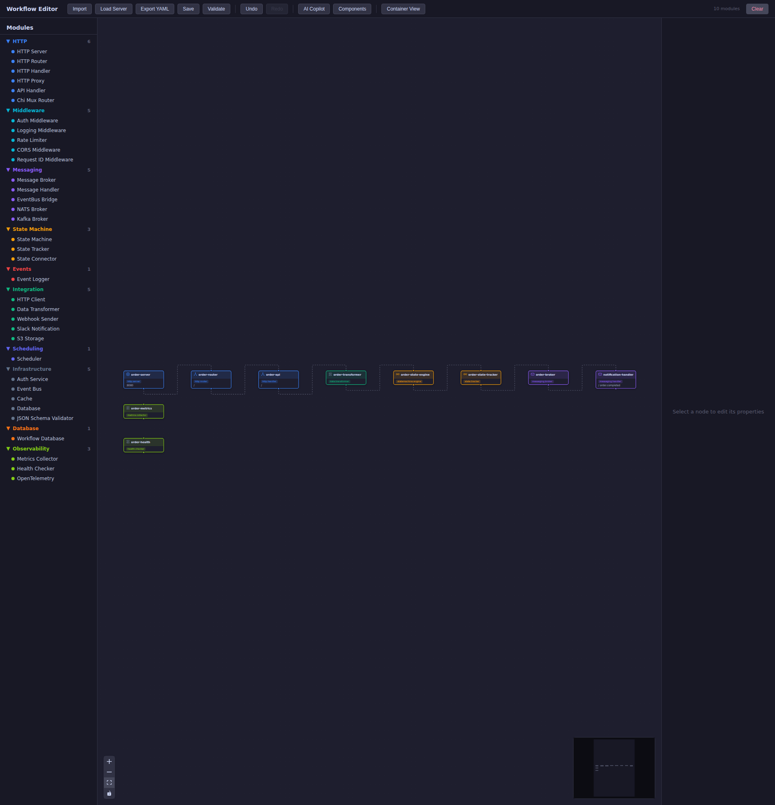
*10 modules with 7 dependency edges in a topological left-to-right layout*

### Order Pipeline - Container View (C4)
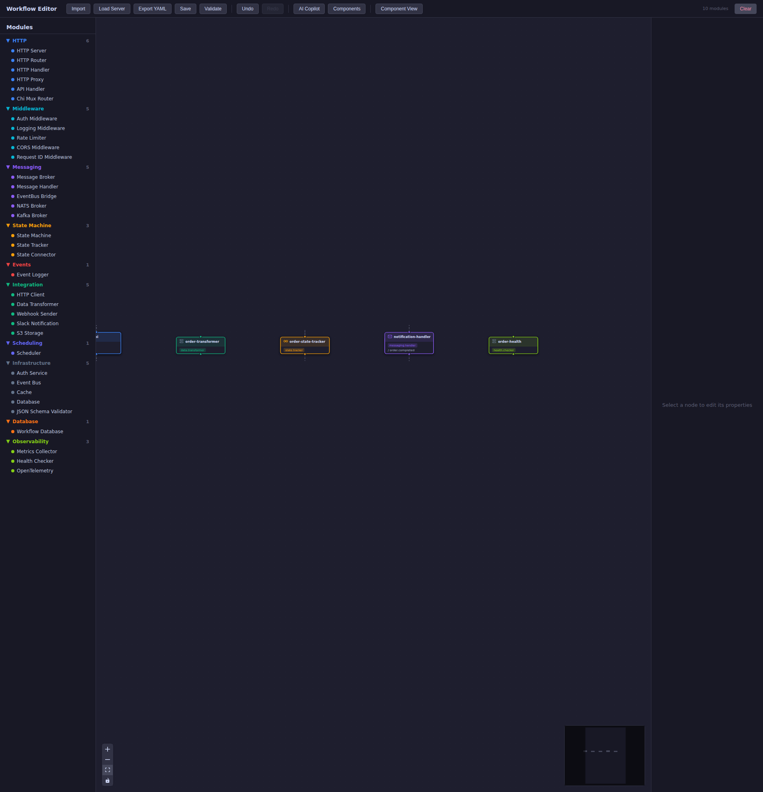
*Same pipeline grouped by category (HTTP, Messaging, StateMachine) in C4 Container View*

### Event-Driven Workflow
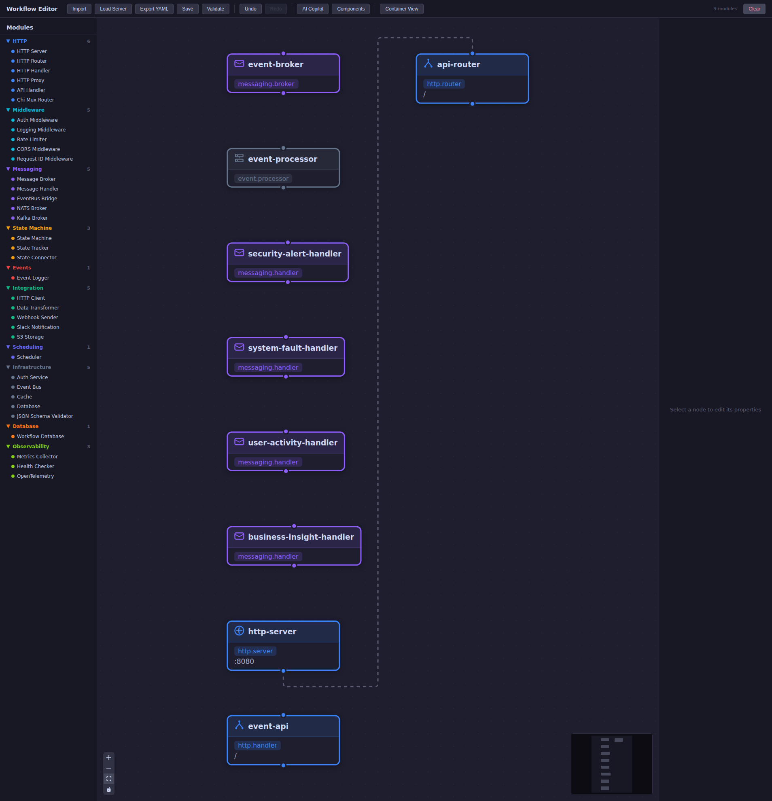
*9 modules: event-broker, event-processor, 4 messaging handlers, HTTP stack*

### State Machine Workflow
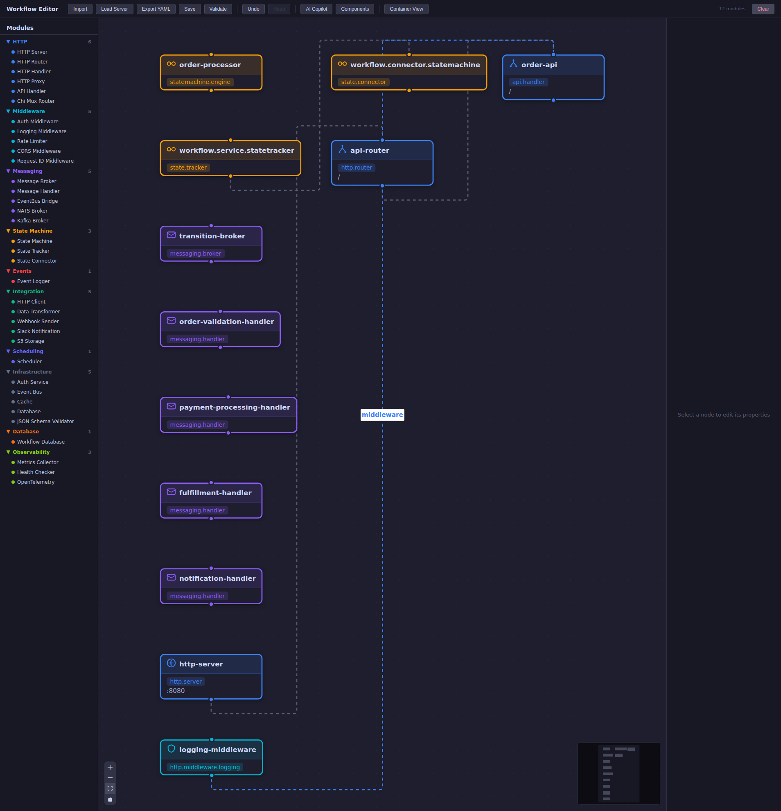
*12 modules: state engine, tracker, connector, 4 handlers, HTTP + middleware*

### Integration Workflow
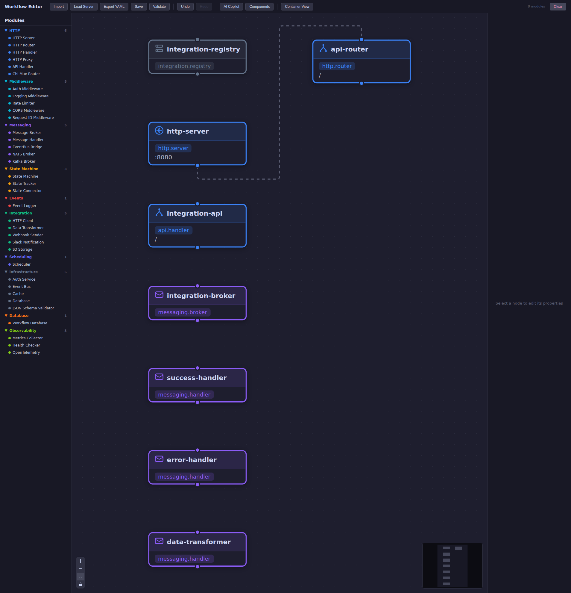
*8 modules: integration registry, API handler, broker, 3 handlers*

### Notification Pipeline
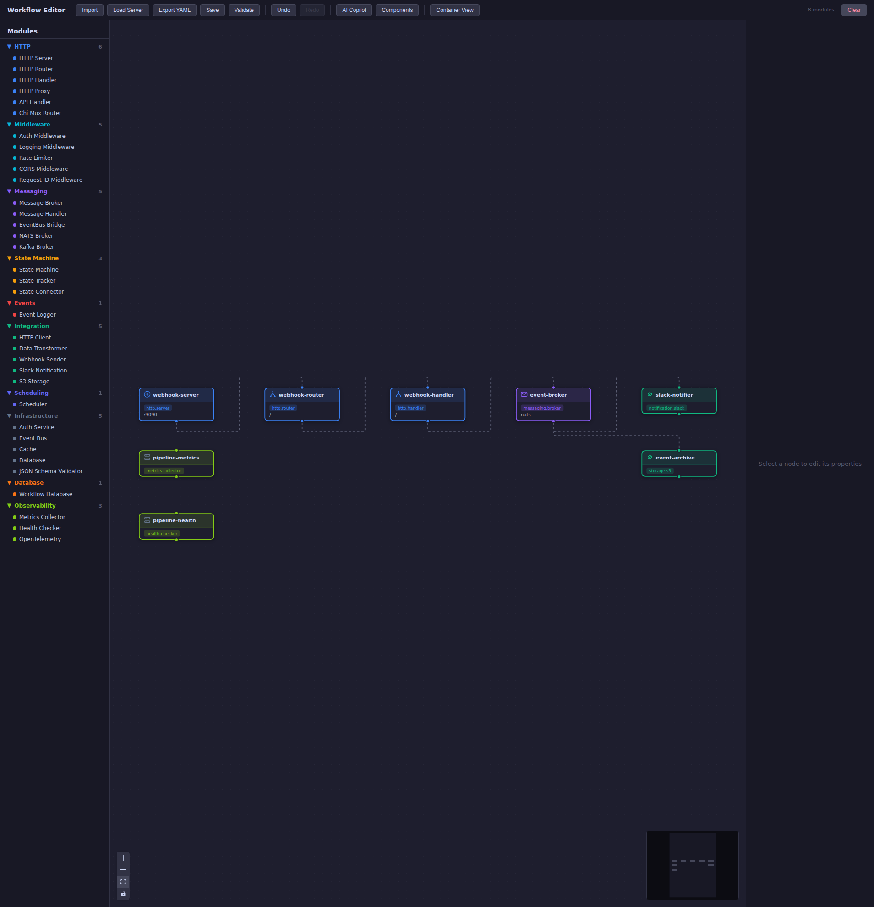
*8 modules: HTTP -> broker -> slack-notifier + S3 storage, metrics, health*

### Data Pipeline
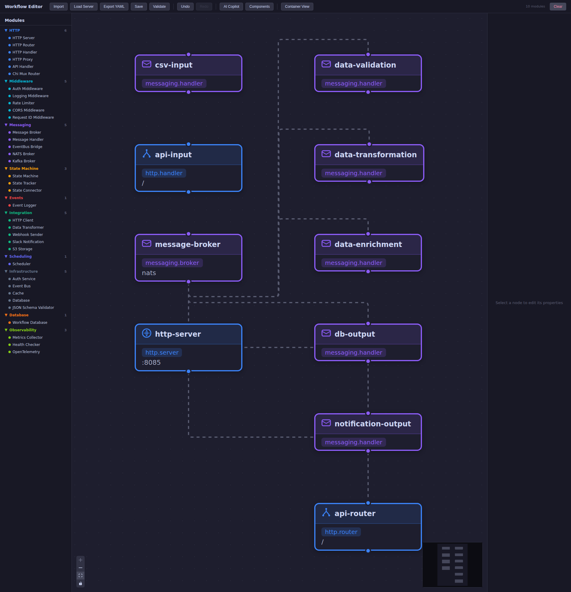
*10 modules: fan-out from broker to validation/transformation/enrichment/output handlers*

### Scheduled Jobs
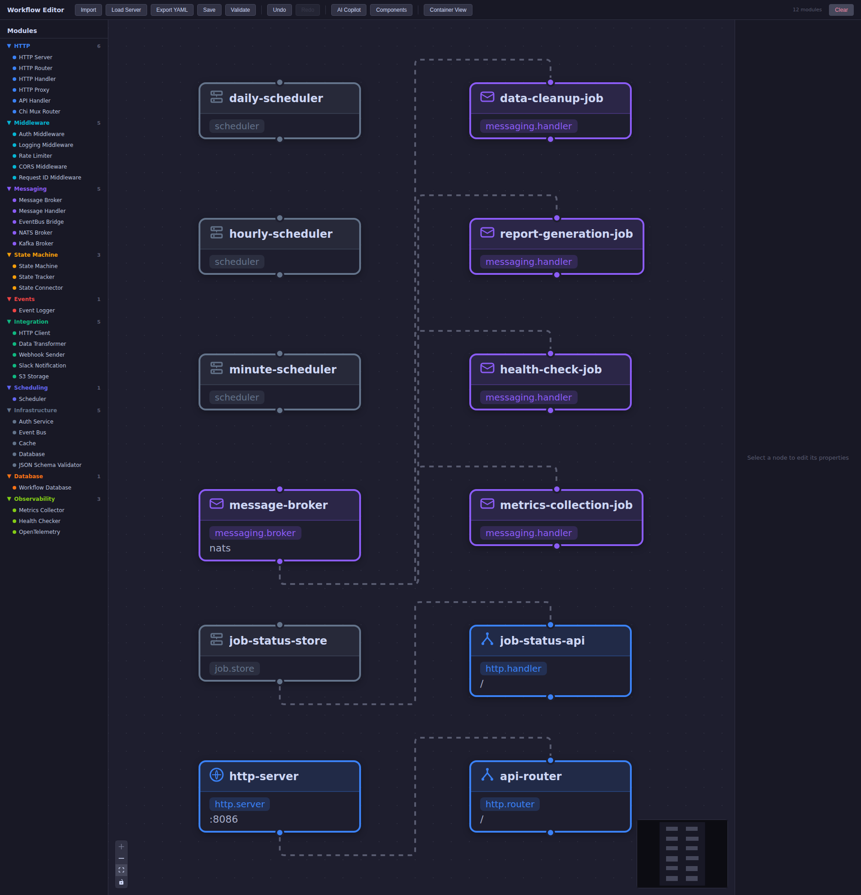
*12 modules: 3 schedulers, 4 job handlers, broker, job store, HTTP*

### API Gateway
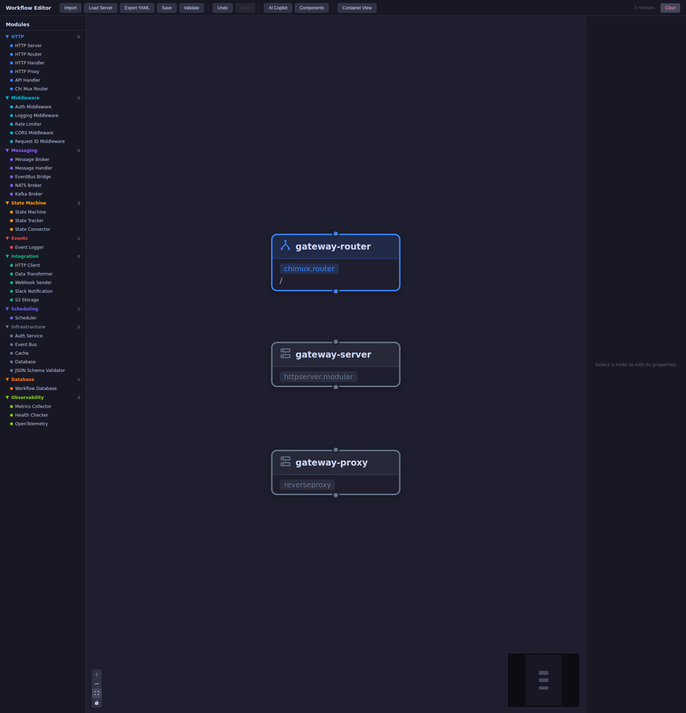
*3 modules: chimux.router, httpserver.modular, reverseproxy*

---

## Summary

### Positive Tests (23 scenarios)

| # | Scenario | Modules Tested | Status |
|---|----------|---------------|--------|
| 1 | Core HTTP Pipeline | http.server, http.router, http.handler | PASS |
| 2 | Order Processing Pipeline | api.handler, statemachine.engine, state.tracker, messaging.broker, messaging.handler | PASS |
| 3 | Order Pipeline Error Path | statemachine error states, transition rejection | PASS |
| 4 | Broker Messaging | messaging.broker, messaging.handler (pub/sub) | PASS |
| 5 | Config Push & Reload | WorkflowUIHandler (config CRUD, reload, validate) | PASS |
| 6 | Dynamic Load & Execute | dynamic.component (Yaegi), HTTP API | PASS |
| 7 | Dynamic Hot Reload | v1->v2 update, behavior change, deletion | PASS |
| 8 | Dynamic Sandbox | 6 blocked imports, valid after rejections | PASS |
| 9 | Dynamic Engine Integration | dynamic.component in full engine lifecycle | PASS |
| 10 | Dynamic Message Processor | dynamic component + broker pub/sub | PASS |
| 11 | Integration Workflow | IntegrationWorkflowHandler, HTTP connectors | PASS |
| 12 | Event Workflow | EventWorkflowHandler, pattern matching | PASS |
| 13 | Data Transformer | extract->map->filter pipeline | PASS |
| 14 | Scheduler Workflow | SchedulerWorkflowHandler, job execution | PASS |
| 15 | Metrics & Health Check | metrics.collector, health.checker, /health /ready /live | PASS |
| 16 | EventBus Bridge | messaging.broker.eventbus, bidirectional pub/sub | PASS |
| 17 | Webhook Sender | webhook.sender, delivery + dead letter queue | PASS |
| 18 | Slack Notification | notification.slack, mock endpoint verification | PASS |
| 19 | Middleware: Auth | http.middleware.auth (Bearer token) | PASS |
| 20 | Middleware: Rate Limit | http.middleware.ratelimit (token bucket) | PASS |
| 21 | Middleware: CORS | http.middleware.cors (origins, preflight) | PASS |
| 22 | Middleware: Request ID | RequestID middleware (generate/preserve) | PASS |
| 23 | Middleware: Full Chain | CORS + RateLimit + Auth + Logging combined | PASS |

### Negative & Validation Tests (16 scenarios, 66 subtests)

| # | Scenario | Subtests | What It Proves |
|---|----------|----------|---------------|
| N1 | HTTP Routing Validation | 5 | Wrong path=404, wrong method=405, body has handler name |
| N2 | Order Data Roundtrip | 4 | POST data = GET data, invalid JSON rejected, independent storage |
| N3 | Invalid Transitions | 5 | State machine enforces rules, descriptive errors |
| N4 | Config Validation | 6 | Config roundtrip, dependency checking, empty config rejection |
| N5 | Dynamic Invalid Ops | 6 | Syntax errors rejected, missing fields rejected, 404 for unknown |
| N6 | Dynamic Computation | 5 | Real math: 5+3=8, 4*7=28, different inputs = different outputs |
| N7 | Broker Message Verification | 3 | Exact content match, topic isolation, ordered delivery |
| N8 | Webhook Payload Verification | 4 | Exact payload + headers, empty payload, dead letter on failure |
| N9 | Auth Token Propagation | 5 | Handler executes, empty/double-space tokens rejected |
| N10 | Rate Limit Per-Client | 3 | Burst exhaustion, 429 body content |
| N11 | Rate Limit Recovery | 3 | Token refill after wait period |
| N12 | CORS Method Enforcement | 4 | Only configured methods allowed, browser-enforced model |
| N13 | Request ID Uniqueness | 4 | 100 unique UUIDs, custom IDs preserved |
| N14 | Full Chain Order | 4 | Middleware chain order, auth failures consume rate tokens |
| N15 | Auth Error Responses | 5 | Descriptive errors, no info leakage, consistent content-type |
| N16 | Response Headers | 5 | Request-ID on errors, CORS on errors, content-type consistency |

**Total: 39 test functions, 23 positive + 16 negative (66 subtests), 0 FAIL**

---

---

## Multi-Workflow & Multi-User Scenarios (Phase 9)

These scenarios validate the multi-tenant platform layer: store interfaces, permission cascading, cross-workflow event routing, execution tracking, audit trails, and full data flow from ingestion through transformation to queryable state. All tests use **in-memory mock stores** (no PostgreSQL required) and run in `go test` without external dependencies.

### MW1. Multi-Workflow E2E Setup

**Test:** `TestMultiWorkflowE2E_Setup`

Creates a full organizational hierarchy with 3 users, a company, organization, project, and 3 workflows to validate the foundation for all subsequent multi-workflow tests.

```mermaid
flowchart TD
    Alice["Alice<br/>(Company Owner)"]
    Bob["Bob<br/>(Project Editor)"]
    Carol["Carol<br/>(Workflow C Creator)"]

    AcmeCorp["Acme Corp<br/>(Company)"]
    Engineering["Engineering<br/>(Organization)"]
    ECommerce["E-Commerce<br/>(Project)"]

    WFA["Workflow A<br/>Order Ingestion"]
    WFB["Workflow B<br/>Fulfillment"]
    WFC["Workflow C<br/>Notifications"]

    Alice -->|"owner"| AcmeCorp
    AcmeCorp --> Engineering
    Engineering --> ECommerce
    Bob -->|"editor"| ECommerce
    Carol -->|"creator"| WFC
    ECommerce --> WFA
    ECommerce --> WFB
    ECommerce --> WFC

    style Alice fill:#4A90D9,color:white
    style Bob fill:#50C878,color:white
    style Carol fill:#FF8C00,color:white
    style AcmeCorp fill:#7B68EE,color:white
    style ECommerce fill:#7B68EE,color:white
```

<details>
<summary>Execution Evidence</summary>

```
=== RUN   TestMultiWorkflowE2E_Setup
--- PASS: TestMultiWorkflowE2E_Setup (0.00s)
```
</details>

---

### MW2. Permission Isolation

**Test:** `TestMultiWorkflowE2E_PermissionIsolation` (5 subtests)

Proves cascading role-based access control: company owners see everything, project editors see project workflows, and users with no membership are denied access.

```mermaid
flowchart LR
    subgraph Access["Permission Resolution"]
        Alice["Alice"] -->|"company owner<br/>→ owner on all"| All["Workflows A, B, C"]
        Bob["Bob"] -->|"project editor<br/>→ editor on all"| All
        Carol["Carol"] -->|"creator of C<br/>→ owner on C only"| WFC["Workflow C"]
        Carol -.->|"NO ACCESS"| AB["Workflows A, B"]
        Unknown["Unknown User"] -.->|"NO ACCESS"| All
    end

    style Alice fill:#4A90D9,color:white
    style Bob fill:#50C878,color:white
    style Carol fill:#FF8C00,color:white
    style Unknown fill:#888,color:white
```

| Subtest | Proves |
|---------|--------|
| `Alice_OwnerAccessAll` | Company owner has owner-level access on all 3 workflows |
| `Bob_EditorAccessAll` | Project editor cascades to editor access on project workflows |
| `Carol_OnlyWorkflowC` | Non-member can only access workflows they created |
| `UnknownUser_NoAccess` | Unregistered users have zero access |
| `RoleHierarchy` | owner > admin > editor > viewer ordering is correct |

<details>
<summary>Execution Evidence</summary>

```
=== RUN   TestMultiWorkflowE2E_PermissionIsolation
=== RUN   TestMultiWorkflowE2E_PermissionIsolation/Alice_OwnerAccessAll
=== RUN   TestMultiWorkflowE2E_PermissionIsolation/Bob_EditorAccessAll
=== RUN   TestMultiWorkflowE2E_PermissionIsolation/Carol_OnlyWorkflowC
=== RUN   TestMultiWorkflowE2E_PermissionIsolation/UnknownUser_NoAccess
=== RUN   TestMultiWorkflowE2E_PermissionIsolation/RoleHierarchy
--- PASS: TestMultiWorkflowE2E_PermissionIsolation (0.00s)
    --- PASS: Alice_OwnerAccessAll (0.00s)
    --- PASS: Bob_EditorAccessAll (0.00s)
    --- PASS: Carol_OnlyWorkflowC (0.00s)
    --- PASS: UnknownUser_NoAccess (0.00s)
    --- PASS: RoleHierarchy (0.00s)
```
</details>

---

### MW3. Cross-Workflow Routing

**Test:** `TestMultiWorkflowE2E_CrossWorkflowRouting` (5 subtests)

Validates glob-style event pattern matching routes events between independent workflow engines. Uses `*` for single-segment and `**` for multi-segment wildcards.

```mermaid
flowchart LR
    WFA["Workflow A<br/>Orders"]
    WFB["Workflow B<br/>Fulfillment"]
    WFC["Workflow C<br/>Notifications"]

    WFA -->|"order.validated"| WFB
    WFB -->|"fulfillment.*"| WFC
    WFA -.->|"order.cancelled<br/>(NO MATCH)"| X["No Routing"]

    style WFA fill:#4A90D9,color:white
    style WFB fill:#50C878,color:white
    style WFC fill:#FF8C00,color:white
    style X fill:#888,color:white
```

| Subtest | Event | Pattern | Result |
|---------|-------|---------|--------|
| `OrderValidated_RoutesToB` | `order.validated` | `order.validated` | Routed to B |
| `FulfillmentCompleted_RoutesToC` | `fulfillment.completed` | `fulfillment.*` | Routed to C |
| `FulfillmentShipped_RoutesToC` | `fulfillment.shipped` | `fulfillment.*` | Routed to C |
| `OrderCancelled_NoRouting` | `order.cancelled` | — | No match |
| `RandomEvent_NoRouting` | `random.event` | — | No match |

<details>
<summary>Execution Evidence</summary>

```
=== RUN   TestMultiWorkflowE2E_CrossWorkflowRouting
=== RUN   TestMultiWorkflowE2E_CrossWorkflowRouting/OrderValidated_RoutesToB
=== RUN   TestMultiWorkflowE2E_CrossWorkflowRouting/FulfillmentCompleted_RoutesToC
=== RUN   TestMultiWorkflowE2E_CrossWorkflowRouting/FulfillmentShipped_RoutesToC
=== RUN   TestMultiWorkflowE2E_CrossWorkflowRouting/OrderCancelled_NoRouting
=== RUN   TestMultiWorkflowE2E_CrossWorkflowRouting/RandomEvent_NoRouting
--- PASS: TestMultiWorkflowE2E_CrossWorkflowRouting (0.00s)
    --- PASS: OrderValidated_RoutesToB (0.00s)
    --- PASS: FulfillmentCompleted_RoutesToC (0.00s)
    --- PASS: FulfillmentShipped_RoutesToC (0.00s)
    --- PASS: OrderCancelled_NoRouting (0.00s)
    --- PASS: RandomEvent_NoRouting (0.00s)
```
</details>

---

### MW4. Data Flow & Persistence

**Test:** `TestMultiWorkflowE2E_DataFlowAndPersistence`

The core data flow proof: an order enters the system as JSON trigger data, transforms through 3 execution steps (validate, transform, persist), completes with output data, and all artifacts are persisted and verifiable.

```mermaid
flowchart LR
    Input["Input<br/>{order_id: ORD-001<br/>customer: john@...<br/>total: 99.99}"]
    Step1["Step 1<br/>validate"]
    Step2["Step 2<br/>transform"]
    Step3["Step 3<br/>persist"]
    Output["Output<br/>{order_id: ORD-001<br/>status: validated}"]
    Store["ExecutionStore<br/>+ StepStore"]

    Input -->|"StartExecution"| Step1
    Step1 -->|"seq=0"| Step2
    Step2 -->|"seq=1"| Step3
    Step3 -->|"seq=2"| Output
    Output -->|"CompleteExecution"| Store
    Store -->|"status=completed<br/>duration_ms > 0"| Store

    style Input fill:#4A90D9,color:white
    style Step1 fill:#50C878,color:white
    style Step2 fill:#50C878,color:white
    style Step3 fill:#50C878,color:white
    style Output fill:#FF8C00,color:white
    style Store fill:#7B68EE,color:white
```

**Proves:** Data entered → transformed through steps → persisted as output → execution record has correct status, duration, and step sequence numbers.

<details>
<summary>Execution Evidence</summary>

```
=== RUN   TestMultiWorkflowE2E_DataFlowAndPersistence
--- PASS: TestMultiWorkflowE2E_DataFlowAndPersistence (0.01s)
```
</details>

---

### MW5. Execution Tracking

**Test:** `TestMultiWorkflowE2E_ExecutionTracking` (7 subtests)

Creates multiple executions (completed, failed, cancelled) and validates filtering, counting, and log-level queries.

| Subtest | Proves |
|---------|--------|
| `ListAllExecutions` | 3 executions returned for workflow |
| `FilterByStatusCompleted` | Status filter returns only completed |
| `FilterByStatusFailed` | Status filter returns only failed |
| `CountByStatus` | {completed: 1, failed: 1, cancelled: 1} |
| `QueryLogsByLevelError` | Level filter returns only error logs |
| `CountByLevel` | Correct counts per log level |
| `ExecutionDurationSet` | duration_ms > 0 for all completed executions |

<details>
<summary>Execution Evidence</summary>

```
=== RUN   TestMultiWorkflowE2E_ExecutionTracking
--- PASS: TestMultiWorkflowE2E_ExecutionTracking (0.01s)
    --- PASS: ListAllExecutions (0.00s)
    --- PASS: FilterByStatusCompleted (0.00s)
    --- PASS: FilterByStatusFailed (0.00s)
    --- PASS: CountByStatus (0.00s)
    --- PASS: QueryLogsByLevelError (0.00s)
    --- PASS: CountByLevel (0.00s)
    --- PASS: ExecutionDurationSet (0.00s)
```
</details>

---

### MW6. Audit Trail

**Test:** `TestMultiWorkflowE2E_AuditTrail` (7 subtests)

Records actions (deploy, stop, share) by multiple users and verifies query filtering by user, resource, action, and combined criteria.

| Subtest | Proves |
|---------|--------|
| `QueryByUser_Alice` | Alice's actions returned in isolation |
| `QueryByUser_Bob` | Bob's actions returned in isolation |
| `QueryByResource_WorkflowA` | All actions on a specific resource found |
| `QueryByAction_Deploy` | Filter by action type works |
| `QueryByAction_Share` | Single-action queries return correctly |
| `QueryCombined_AliceDeploy` | Combined user+action filter works |
| `AutoIncrementIDs` | Audit entry IDs are monotonically increasing |

<details>
<summary>Execution Evidence</summary>

```
=== RUN   TestMultiWorkflowE2E_AuditTrail
--- PASS: TestMultiWorkflowE2E_AuditTrail (0.00s)
    --- PASS: QueryByUser_Alice (0.00s)
    --- PASS: QueryByUser_Bob (0.00s)
    --- PASS: QueryByResource_WorkflowA (0.00s)
    --- PASS: QueryByAction_Deploy (0.00s)
    --- PASS: QueryByAction_Share (0.00s)
    --- PASS: QueryCombined_AliceDeploy (0.00s)
    --- PASS: AutoIncrementIDs (0.00s)
```
</details>

---

### MW7. State Queryable

**Test:** `TestMultiWorkflowE2E_StateQueryable` (8 subtests)

The crown jewel: after a full lifecycle (deploy workflow, run execution with steps, write logs), proves every artifact is queryable through the store interfaces.

```mermaid
flowchart TD
    Deploy["Deploy Workflow<br/>(draft → active)"]
    Execute["Run Execution<br/>(3 steps + logs)"]
    Query["Query Everything"]

    Deploy --> Execute
    Execute --> Query

    subgraph Queries["All Queryable"]
        Q1["Workflow by status=active"]
        Q2["Version history (v1 draft, v2 active)"]
        Q3["Executions by workflow"]
        Q4["Steps by execution (ordered)"]
        Q5["Logs by execution"]
        Q6["Logs by workflow"]
        Q7["Execution output data"]
    end

    Query --> Queries

    style Deploy fill:#4A90D9,color:white
    style Execute fill:#50C878,color:white
    style Query fill:#FF8C00,color:white
```

| Subtest | Proves |
|---------|--------|
| `QueryWorkflowByStatus` | Active workflows found by status filter |
| `QueryVersionHistory` | Version tracking: draft v1 → active v2 |
| `QueryExecutionsByWorkflow` | Execution records scoped to workflow |
| `QueryStepsByExecution` | Steps returned in sequence order |
| `QueryLogsByExecution` | Logs scoped to specific execution |
| `QueryLogsByWorkflow` | Logs scoped to workflow |
| `ExecutionOutput` | Output data persisted and unmarshallable |
| `DataEntered_Transformed_Persisted_Queryable` | **Full proof: data in → steps → output → queryable** |

<details>
<summary>Execution Evidence</summary>

```
=== RUN   TestMultiWorkflowE2E_StateQueryable
--- PASS: TestMultiWorkflowE2E_StateQueryable (0.00s)
    --- PASS: QueryWorkflowByStatus (0.00s)
    --- PASS: QueryVersionHistory (0.00s)
    --- PASS: QueryExecutionsByWorkflow (0.00s)
    --- PASS: QueryStepsByExecution (0.00s)
    --- PASS: QueryLogsByExecution (0.00s)
    --- PASS: QueryLogsByWorkflow (0.00s)
    --- PASS: ExecutionOutput (0.00s)
    --- PASS: DataEntered_Transformed_Persisted_Queryable (0.00s)
```
</details>

---

---

## Store & API Unit Tests (Phase 9)

### Store Interface Tests

**File:** `store/stores_test.go` — **189 tests**

Comprehensive tests for all 11 mock store implementations, validating the interface contracts that any store backend must satisfy.

| Store | Tests | Key Scenarios |
|-------|-------|---------------|
| UserStore | 21 | CRUD, duplicate email, OAuth, filters, pagination, copy safety |
| CompanyStore | 15 | CRUD, slug uniqueness, ListForUser by ownership + membership |
| ProjectStore | 15 | CRUD, slug scoped to company, ListForUser |
| WorkflowStore | 22 | CRUD, version auto-increment, version history, status transitions |
| MembershipStore | 21 | Company/project level, duplicate prevention, cascading GetEffectiveRole |
| CrossWorkflowLinkStore | 10 | CRUD, filter by source/target/type, pagination |
| SessionStore | 11 | CRUD, GetByToken, DeleteExpired |
| ExecutionStore | 18 | Executions + steps CRUD, ordering, CountByStatus, time filters |
| LogStore | 13 | Append, auto-ID, level/module/execution/date filters, CountByLevel |
| AuditStore | 10 | Record, auto-ID, user/action/resource/date filters |
| IAMStore | 15 | Provider + mapping CRUD, filters, ResolveRole |
| Interface Compliance | 11 | Compile-time interface satisfaction assertions |

### API Handler Tests

**Files:** 10 new test files in `api/` — **139 tests**

| File | Tests | Handler Coverage |
|------|-------|-----------------|
| `link_handler_test.go` | 14 | Create, List, Delete + error paths |
| `execution_handler_test.go` | 16 | List, Get, Steps, Cancel, Trigger + auth/perms |
| `dashboard_handler_test.go` | 10 | System dashboard, workflow dashboard + empty state |
| `log_handler_test.go` | 9 | Query with level/module/execution/since filters |
| `events_handler_test.go` | 7 | Event listing + auth/permission checks |
| `iam_handler_test.go` | 20 | Provider CRUD, TestConnection, Mapping CRUD |
| `permissions_test.go` | 16 | RoleAtLeast, PermissionService, cascading resolution |
| `company_handler_test.go` | 12 | Company CRUD + member management |
| `org_handler_test.go` | 8 | Organization CRUD under parent company |
| `project_handler_test.go` | 12 | Project CRUD + member management |

### Engine Manager Tests

**File:** `engine_manager_test.go` — **18 tests**

| Test | Proves |
|------|--------|
| `DeployWorkflow_Success` | Loads config, builds engine, status=running |
| `DeployWorkflow_NotFound` | Returns error for missing workflow |
| `DeployWorkflow_InvalidYAML` | Returns error for malformed config |
| `DeployWorkflow_AlreadyRunning` | Rejects duplicate deployment |
| `DeployWorkflow_BuilderError` | Handles engine builder failures |
| `StopWorkflow_Success` | Graceful shutdown, removed from active |
| `StopWorkflow_NotRunning` | Error for non-active workflow |
| `ReloadWorkflow_Success` | Stop + redeploy in sequence |
| `ReloadWorkflow_NotRunning` | Fresh deploy when not running |
| `GetStatus_Running` | Returns status, uptime, module count |
| `GetStatus_NotFound` | Returns error for non-deployed |
| `ListActive_Empty/Multiple` | Empty and multi-engine listing |
| `StopAll_Success/Empty` | Graceful shutdown of all engines |
| `ConcurrentDeploy` | Multiple goroutines deploying simultaneously |
| `ConcurrentDeployStop` | Deploy and stop racing on same workflow |
| `Router_NotNil` | Cross-workflow router initialized |

### Cross-Workflow Router Tests

**File:** `module/cross_workflow_router_test.go` — **22 tests**

12 pattern matching tests + 10 router behavior tests:

| Pattern | Event | Match? |
|---------|-------|--------|
| `order.completed` | `order.completed` | Yes (exact) |
| `order.*` | `order.completed` | Yes (single wildcard) |
| `order.*` | `order.sub.completed` | No (too deep) |
| `order.**` | `order.a.b.c` | Yes (multi-segment) |
| `**` | `any.thing.here` | Yes (match all) |

### Observability Tracker Tests

**File:** `observability/tracker_test.go` — **14 tests**

Full execution lifecycle: Start → RecordStep → Complete/Fail/Cancel, LogWriter at correct levels, duration calculation.

### IAM Provider Tests

**File:** `iam/providers_test.go` — **29 tests**

| Provider | Tests | Key Scenarios |
|----------|-------|---------------|
| AWS IAM | 8 | Config validation, ARN parsing, missing/invalid ARN |
| Kubernetes | 6 | Config validation, service_account + group resolution |
| OIDC | 6 | Config validation, default/custom claim extraction |
| IAMResolver | 9 | Register, get, multi-provider highest-role-wins, disabled skip |

---

## UI Unit & E2E Tests (Phase 9)

### UI Unit Tests

**Files:** 6 new test files — **76 tests** (199 total with existing 123)

| File | Tests | Coverage |
|------|-------|----------|
| `store/authStore.test.ts` | 18 | Login, register, logout, OAuth, token persistence |
| `store/observabilityStore.test.ts` | 26 | Dashboard, executions, logs, events, IAM CRUD |
| `components/tabs/WorkflowTabs.test.tsx` | 10 | Add/close/switch/rename tabs, dirty indicator |
| `components/auth/LoginPage.test.tsx` | 11 | Sign in/up forms, OAuth buttons, validation |
| `components/navigation/AppNav.test.tsx` | 5 | Nav items, active view, click handling |
| `components/dashboard/SystemDashboard.test.tsx` | 6 | Loading, empty, data states, metric cards |

### Playwright E2E Tests

**Files:** 2 new spec files — **14 tests**

| File | Tests | Coverage |
|------|-------|----------|
| `e2e/multi-workflow.spec.ts` | 6 | Tab create/close/switch/rename, canvas state preservation |
| `e2e/auth-flow.spec.ts` | 8 | Login page, sign up mode, password validation, OAuth buttons |

---

## Multi-Workflow Example Configurations

### E-Commerce Multi-Workflow System

**Directory:** `example/multi-workflow-ecommerce/`

Three interconnected workflows demonstrating cross-workflow event routing:

```mermaid
flowchart LR
    A["Workflow A<br/>Order Ingestion<br/>(HTTP → State Machine)"]
    B["Workflow B<br/>Fulfillment<br/>(Event → Processing)"]
    C["Workflow C<br/>Notifications<br/>(Event → Webhooks)"]

    A -->|"order.validated"| B
    B -->|"fulfillment.*"| C
    A -->|"order.failed"| C

    style A fill:#4A90D9,color:white
    style B fill:#50C878,color:white
    style C fill:#FF8C00,color:white
```

| File | Purpose |
|------|---------|
| `workflow-a-orders.yaml` | Order ingestion: HTTP server, state machine (new→validated→processing→completed) |
| `workflow-b-fulfillment.yaml` | Fulfillment: messaging handler, state machine (pending→picking→packing→shipped) |
| `workflow-c-notifications.yaml` | Notification hub: subscribes to order.* and fulfillment.* events |
| `cross-workflow-links.yaml` | Documents the 3 cross-workflow event routing links |
| `README.md` | Architecture docs with running instructions |

### Multi-User Scenario

**Directory:** `example/multi-user-scenario/`

| File | Purpose |
|------|---------|
| `README.md` | Documents 3-user permission model (Alice=owner, Bob=editor, Carol=viewer) |
| `setup.sh` | Executable script using curl to create full hierarchy and verify access |
