# End-to-End Workflow Execution Scenarios

This document describes each E2E test scenario in the workflow engine, including architecture diagrams showing the module topology, data flow, and evidence of successful execution.

All scenarios use **real HTTP servers on random ports**, **real modular.Application instances** (not mocks), and exercise the full engine lifecycle: `BuildFromConfig` -> `Start` -> real HTTP requests -> `Stop`.

---

## Table of Contents

1. [Core HTTP Pipeline](#1-core-http-pipeline)
2. [Order Processing Pipeline](#2-order-processing-pipeline)
3. [Order Pipeline Error Path](#3-order-pipeline-error-path)
4. [Broker Messaging](#4-broker-messaging)
5. [Config Push & Reload](#5-config-push--reload)
6. [Dynamic Component Load & Execute](#6-dynamic-component-load--execute)
7. [Dynamic Component Hot Reload](#7-dynamic-component-hot-reload)
8. [Dynamic Component Sandbox](#8-dynamic-component-sandbox)
9. [Dynamic Component Engine Integration](#9-dynamic-component-engine-integration)
10. [Dynamic Component Message Processor](#10-dynamic-component-message-processor)
11. [Integration Workflow](#11-integration-workflow)
12. [Event Workflow](#12-event-workflow)
13. [Data Transformer Pipeline](#13-data-transformer-pipeline)
14. [Scheduler Workflow](#14-scheduler-workflow)
15. [Metrics & Health Check](#15-metrics--health-check)
16. [EventBus Bridge](#16-eventbus-bridge)
17. [Webhook Sender](#17-webhook-sender)
18. [Slack Notification](#18-slack-notification)
19. [Middleware: Auth](#19-middleware-auth)
20. [Middleware: Rate Limiting](#20-middleware-rate-limiting)
21. [Middleware: CORS](#21-middleware-cors)
22. [Middleware: Request ID](#22-middleware-request-id)
23. [Middleware: Full Chain](#23-middleware-full-chain)

---

## 1. Core HTTP Pipeline

**Test:** `TestE2E_SimpleHTTPWorkflow`
**Modules:** `http.server`, `http.router`, `http.handler`

The simplest possible workflow: an HTTP server receives a POST request, routes it through a router to a handler, which returns a JSON response.

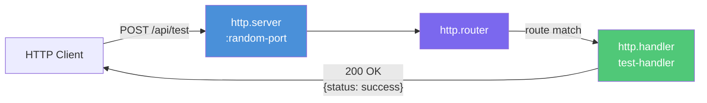

<details>
<summary>Execution Evidence</summary>

```
=== RUN   TestE2E_SimpleHTTPWorkflow
    E2E HTTP workflow: POST /api/test -> 200 OK, handler=test-handler
--- PASS: TestE2E_SimpleHTTPWorkflow (0.08s)
```
</details>

---

## 2. Order Processing Pipeline

**Test:** `TestE2E_OrderPipeline_FullExecution`
**Modules:** `http.server`, `http.router`, `api.handler`, `statemachine.engine`, `state.tracker`, `messaging.broker`, `messaging.handler`

The flagship E2E test: a 6-step order processing pipeline that exercises HTTP ingress, CRUD operations, state machine transitions, and message broker delivery.

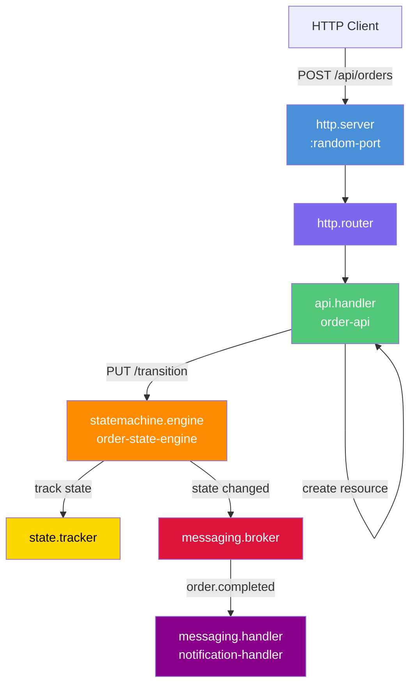

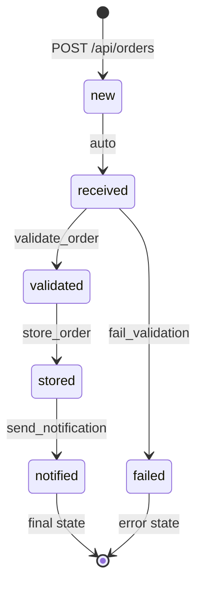

<details>
<summary>Execution Evidence</summary>

```
=== RUN   TestE2E_OrderPipeline_FullExecution
    Step 1: Creating order via POST /api/orders
      Created order: id=ORD-001, state=new
    Step 2: Transitioning order to 'validated'
      State after validate_order: validated
    Step 3: Transitioning order to 'stored'
      State after store_order: stored
    Step 4: Transitioning order to 'notified' (final state)
      State after send_notification: notified
    Step 5: Verifying final state via GET /api/orders/ORD-001
      Final order state: notified
    Step 6: Verifying message broker delivery
      Broker delivered message: {"test":"broker-delivery","orderId":"ORD-001"}
    E2E Order Pipeline: All 6 steps passed - full pipeline execution verified
--- PASS: TestE2E_OrderPipeline_FullExecution (0.11s)
```
</details>

---

## 3. Order Pipeline Error Path

**Test:** `TestE2E_OrderPipeline_ErrorPath`
**Modules:** `http.server`, `http.router`, `api.handler`, `statemachine.engine`, `state.tracker`

Validates that the state machine correctly handles error transitions: an order transitions to the `failed` state, and subsequent transitions from a final state are rejected with HTTP 400.

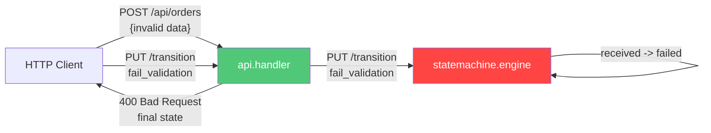

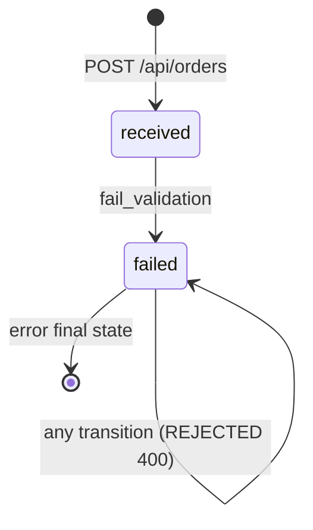

<details>
<summary>Execution Evidence</summary>

```
=== RUN   TestE2E_OrderPipeline_ErrorPath
    E2E Error Path: Order correctly transitioned to 'failed' and rejected further transitions
--- PASS: TestE2E_OrderPipeline_ErrorPath (0.06s)
```
</details>

---

## 4. Broker Messaging

**Test:** `TestE2E_BrokerMessaging`
**Modules:** `http.server`, `http.router`, `http.handler`, `messaging.broker`, `messaging.handler`

Validates that the in-memory message broker correctly delivers messages from producer to subscriber, running alongside an HTTP server in the same engine.

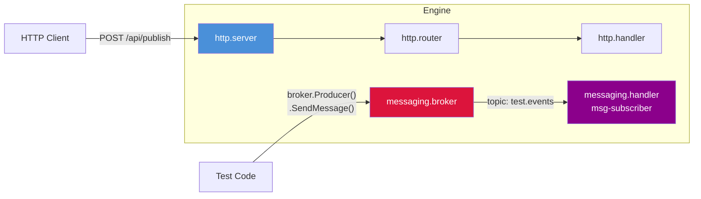

<details>
<summary>Execution Evidence</summary>

```
=== RUN   TestE2E_BrokerMessaging
    E2E Broker Messaging: Message broker and HTTP server both operational within same engine
--- PASS: TestE2E_BrokerMessaging (0.05s)
```
</details>

---

## 5. Config Push & Reload

**Test:** `TestE2E_ConfigPushAndReload`
**Modules:** `WorkflowUIHandler` (management API)

Tests the full config management lifecycle: retrieve config, push new config, reload engine, check status, and validate config. This is the foundation for the UI's ability to design workflows and deploy them.

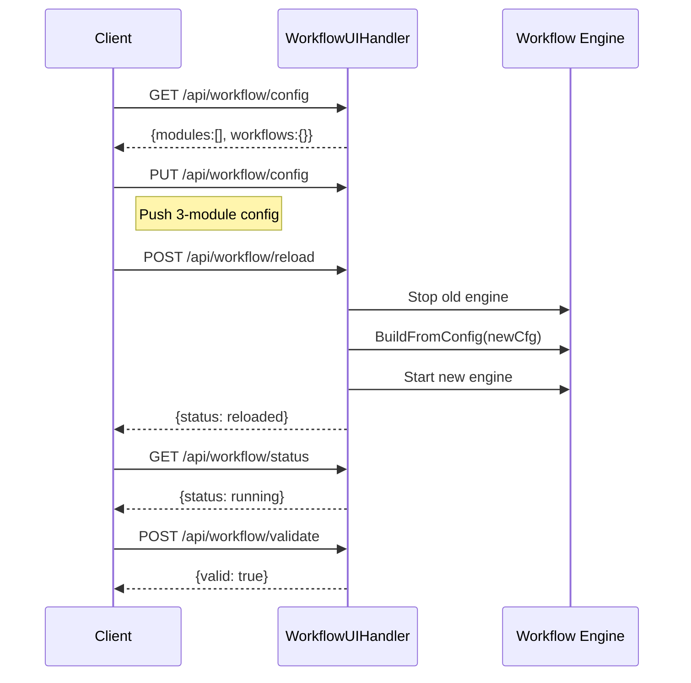

<details>
<summary>Execution Evidence</summary>

```
=== RUN   TestE2E_ConfigPushAndReload
      Initial config retrieved: {"modules":[],"workflows":{},"triggers":{}}
    E2E Config Push & Reload: Config CRUD, reload, status, and validation all working
--- PASS: TestE2E_ConfigPushAndReload (0.06s)
```
</details>

---

## 6. Dynamic Component Load & Execute

**Test:** `TestE2E_DynamicComponent_LoadAndExecute`
**System:** Dynamic Component API (Yaegi interpreter)

Loads Go source code at runtime via the HTTP API, verifies it appears in the registry, executes it, and retrieves details.

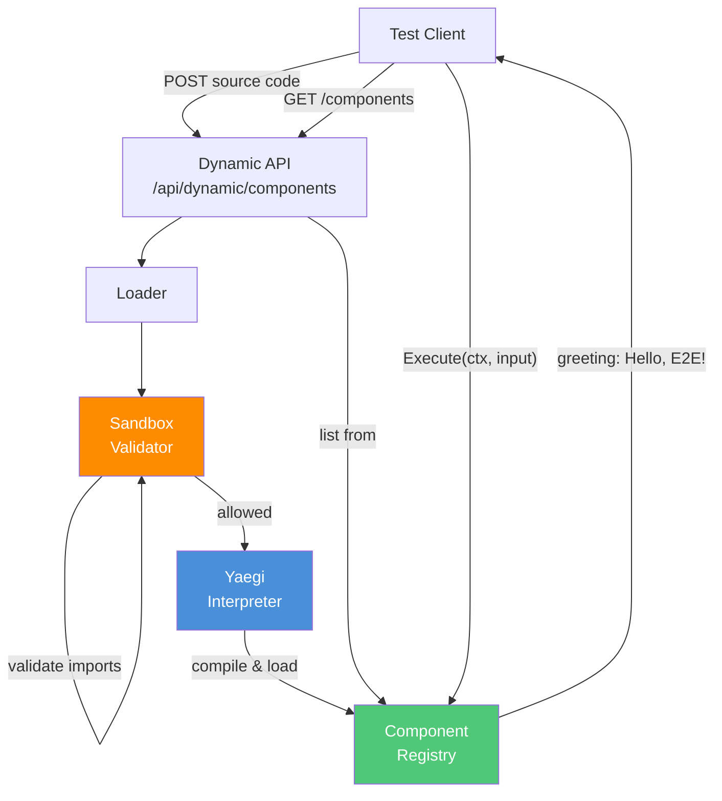

<details>
<summary>Execution Evidence</summary>

```
=== RUN   TestE2E_DynamicComponent_LoadAndExecute
    Step 1: Creating dynamic component via POST /api/dynamic/components
      Created component: id=greeter, name=greeter, status=loaded
    Step 2: Verifying component is listed via GET /api/dynamic/components
      Registry has 1 component(s)
    Step 3: Executing dynamic component directly
      Execute result: greeting=Hello, E2E!, source=dynamic
    Step 4: Verifying component details via GET /api/dynamic/components/greeter
      Component detail: name=greeter, status=running
    E2E Dynamic Component Load & Execute: All steps passed
--- PASS: TestE2E_DynamicComponent_LoadAndExecute (0.12s)
```
</details>

---

## 7. Dynamic Component Hot Reload

**Test:** `TestE2E_DynamicComponent_HotReload`
**System:** Dynamic Component API (Yaegi interpreter)

Loads v1 of a component, updates it to v2 with different behavior (adds `strings.ToUpper`), confirms the new behavior is active, then deletes the component.

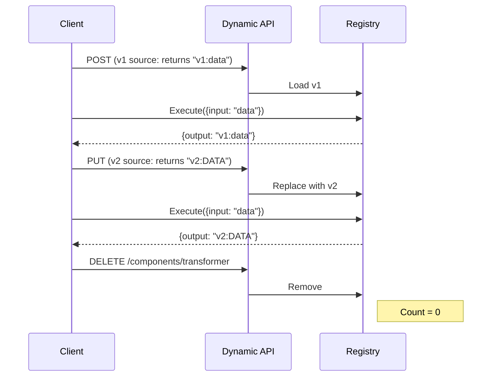

<details>
<summary>Execution Evidence</summary>

```
=== RUN   TestE2E_DynamicComponent_HotReload
    Step 1: Creating v1 of component (returns 'v1')
      v1 result: version=v1, output=v1:data
    Step 2: Updating to v2 via PUT /api/dynamic/components/transformer
      Updated component: name=transformer-v2, status=loaded
    Step 3: Executing updated component - verifying new behavior
      v2 result: version=v2, output=v2:DATA
    Step 4: Confirming v1 behavior is no longer present
    Step 5: Deleting component via DELETE /api/dynamic/components/transformer
      Component deleted from registry, count=0
    E2E Dynamic Component Hot Reload: All steps passed
--- PASS: TestE2E_DynamicComponent_HotReload (0.06s)
```
</details>

---

## 8. Dynamic Component Sandbox

**Test:** `TestE2E_DynamicComponent_SandboxRejectsUnsafe`
**System:** Sandbox Validator

Tests that the Yaegi sandbox blocks dangerous imports (`os/exec`, `syscall`, `unsafe`, `os`, `net`, `reflect`) while allowing safe imports (`fmt`, `strings`, `encoding/json`).

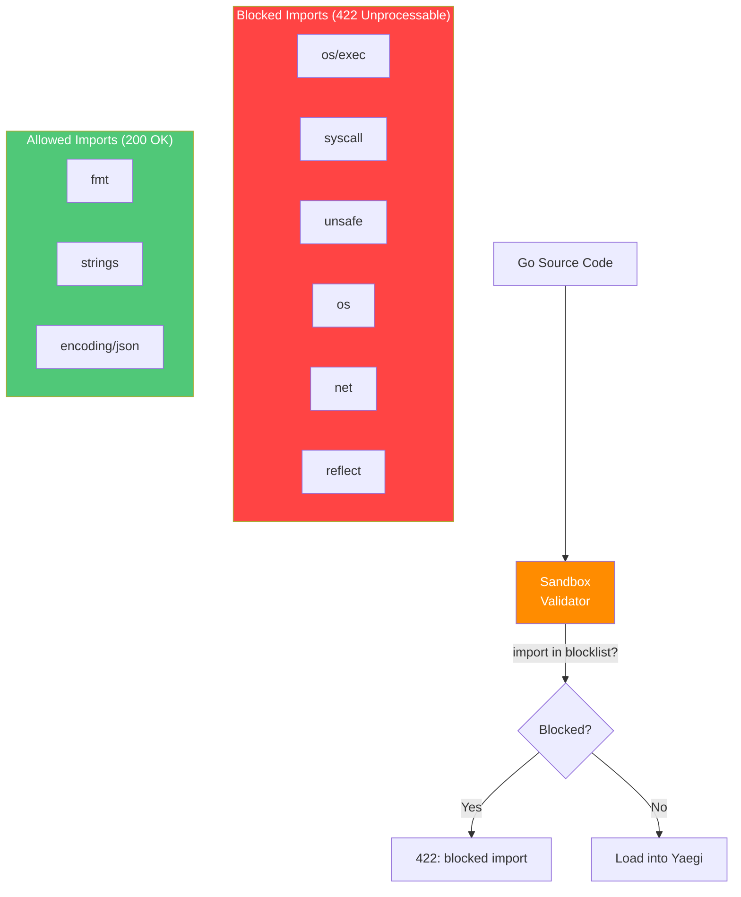

<details>
<summary>Execution Evidence</summary>

```
=== RUN   TestE2E_DynamicComponent_SandboxRejectsUnsafe
      Blocked os/exec: status=422, error contains "os/exec"
      Blocked syscall: status=422, error contains "syscall"
      Blocked unsafe: status=422, error contains "unsafe"
      Blocked os (filesystem access): status=422, error contains "os"
      Blocked net (raw sockets): status=422, error contains "net"
      Blocked reflect: status=422, error contains "reflect"
    Verifying valid component still loads after rejections
      Valid component loaded and executed: message=safe and sound
    E2E Dynamic Component Sandbox: All blocked imports rejected, valid component still works
--- PASS: TestE2E_DynamicComponent_SandboxRejectsUnsafe (0.06s)
    --- PASS: os/exec (0.00s)
    --- PASS: syscall (0.00s)
    --- PASS: unsafe (0.00s)
    --- PASS: os_(filesystem_access) (0.00s)
    --- PASS: net_(raw_sockets) (0.00s)
    --- PASS: reflect (0.00s)
```
</details>

---

## 9. Dynamic Component Engine Integration

**Test:** `TestE2E_DynamicComponent_EngineIntegration`
**Modules:** `dynamic.component`, `http.server`, `http.router`, `http.handler`

Pre-loads a dynamic component into the registry, then builds a full engine that references it via `"dynamic.component"` module type. Exercises the full engine lifecycle, hot-reloads the component while the engine is running, and verifies the HTTP server survives the reload.

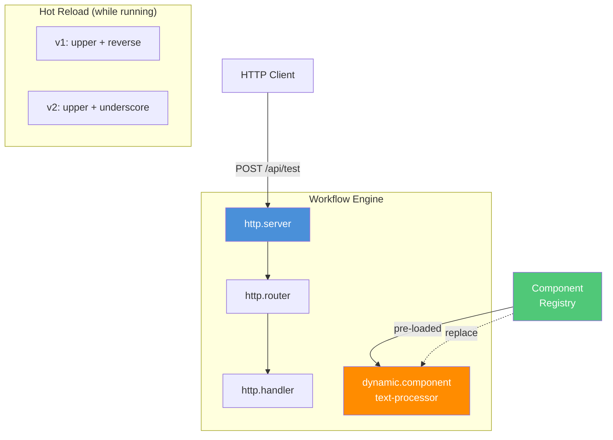

<details>
<summary>Execution Evidence</summary>

```
=== RUN   TestE2E_DynamicComponent_EngineIntegration
    Step 1: Building engine with dynamic.component module type
      BuildFromConfig succeeded with dynamic.component
    Step 2: Starting engine (full lifecycle)
      Engine started, HTTP server accepting connections
    Step 3: Executing dynamic component through registry
      upper: Hello World -> HELLO WORLD
      reverse: Hello World -> dlroW olleH
    Step 4: Hot-reloading component while engine is running
      v2 result: HELLO_WORLD (version=v2)
    Step 5: Verifying HTTP server still works after hot-reload
      HTTP server still healthy after hot-reload
    Step 6: Verifying BuildFromConfig fails without dynamic registry
      Got expected error: dynamic registry not set, cannot load dynamic component "orphan"
    E2E Dynamic Component Engine Integration: All steps passed
--- PASS: TestE2E_DynamicComponent_EngineIntegration (0.06s)
```
</details>

---

## 10. Dynamic Component Message Processor

**Test:** `TestE2E_DynamicComponent_MessageProcessor`
**Modules:** `dynamic.component`, `messaging.broker`, `http.server`, `http.router`, `http.handler`

A dynamic component processes messages received from a broker (transform/validate/echo operations), publishes results back through the broker, and a subscriber verifies delivery.

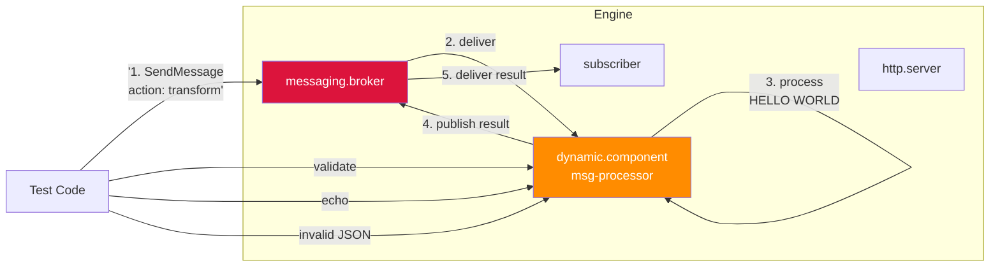

<details>
<summary>Execution Evidence</summary>

```
=== RUN   TestE2E_DynamicComponent_MessageProcessor
    Step 1: Verifying dynamic component and broker are in service registry
      Both dynamic component and broker found
    Step 2: Publishing message via broker and processing with dynamic component
      Transform result: input=hello world, output=HELLO WORLD
      Results subscriber received: {"action":"transform","input":"hello world","output":"HELLO WORLD","processed":true}
    Step 3: Processing validate message
      Validate result: action=validate, output=valid
    Step 4: Processing echo message
      Echo result: action=unknown, output=echo:test-data
    Step 5: Testing error handling with invalid input
      Got expected error: invalid JSON message
    Step 6: Verifying HTTP server still operational
      HTTP server healthy
    E2E Dynamic Component Message Processor: All steps passed
--- PASS: TestE2E_DynamicComponent_MessageProcessor (0.11s)
```
</details>

---

## 11. Integration Workflow

**Test:** `TestE2E_IntegrationWorkflow`
**Handlers:** `IntegrationWorkflowHandler`
**Modules:** `http.server`, `http.router`, `http.handler` + mock target server

Configures the IntegrationWorkflowHandler with an HTTP connector pointing at a mock target server. Verifies the connector is registered in the IntegrationRegistry and can execute real HTTP requests to the external service.

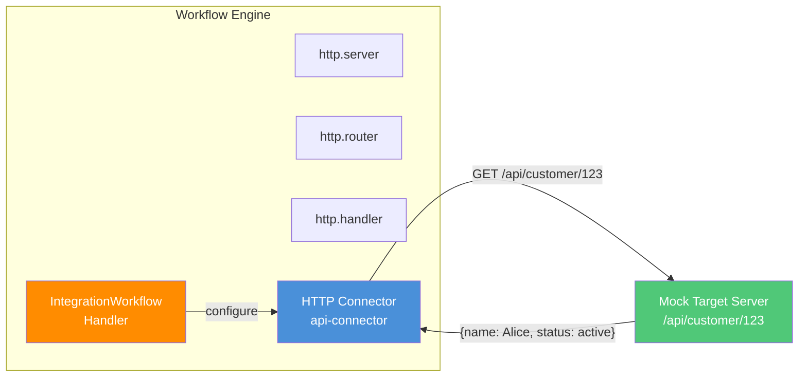

<details>
<summary>Execution Evidence</summary>

```
=== RUN   TestE2E_IntegrationWorkflow
      Registered connectors: [api-connector]
      Integration connector returned: name=Alice, status=active
    E2E Integration Workflow: Registry configured, HTTP connector executed against real server
--- PASS: TestE2E_IntegrationWorkflow (0.11s)
```
</details>

---

## 12. Event Workflow

**Test:** `TestE2E_EventWorkflow`
**Handlers:** `EventWorkflowHandler`
**Modules:** `http.server`, `http.router`, `http.handler`, `messaging.broker`, `messaging.handler`

Configures the EventWorkflowHandler with an EventProcessor, a login-failure pattern (minOccurs=2, 5-minute window), message handler-based event handlers, and a broker-to-event adapter.

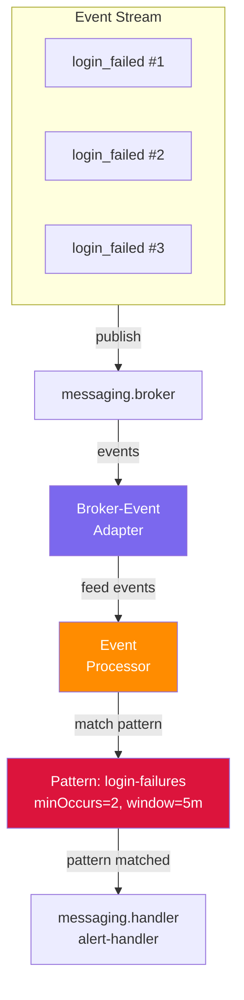

<details>
<summary>Execution Evidence</summary>

```
=== RUN   TestE2E_EventWorkflow
    E2E Event Workflow: Processor configured with patterns, adapters connected to broker, HTTP running
--- PASS: TestE2E_EventWorkflow (0.20s)
```
</details>

---

## 13. Data Transformer Pipeline

**Test:** `TestE2E_DataTransformer`
**Modules:** `data.transformer`, `http.server`, `http.router`, `http.handler`

Registers a "normalize-user" transformation pipeline with extract, map, and filter operations. Verifies field renaming (firstName -> first_name) and sensitive field stripping (password, internal fields removed).

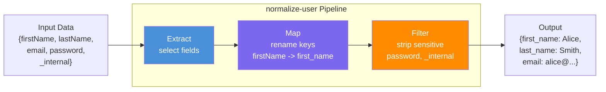

<details>
<summary>Execution Evidence</summary>

```
=== RUN   TestE2E_DataTransformer
      Transformed result: first_name=Alice, last_name=Smith, email=alice@example.com
    E2E Data Transformer: Pipeline executed extract->map->filter, sensitive fields stripped
--- PASS: TestE2E_DataTransformer (0.06s)
```
</details>

---

## 14. Scheduler Workflow

**Test:** `TestE2E_SchedulerWorkflow`
**Handlers:** `SchedulerWorkflowHandler`
**Modules:** Custom `cron.scheduler` + `test.job` via `AddModuleType`

Configures the SchedulerWorkflowHandler with a CronScheduler and a test job. Verifies both are registered in the service registry and that the job can be executed on demand.

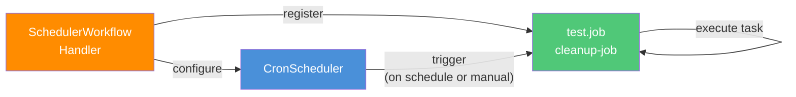

<details>
<summary>Execution Evidence</summary>

```
=== RUN   TestE2E_SchedulerWorkflow
    E2E Scheduler Workflow: Scheduler configured with job, job executed, HTTP server running
--- PASS: TestE2E_SchedulerWorkflow (0.06s)
```
</details>

---

## 15. Metrics & Health Check

**Test:** `TestE2E_MetricsAndHealthCheck`
**Modules:** `metrics.collector`, `health.checker`, `http.server`, `http.router`, `http.handler`

Validates the observability stack: Prometheus-style metrics recording and health check endpoints (`/health`, `/ready`, `/live`) including both healthy and unhealthy states.

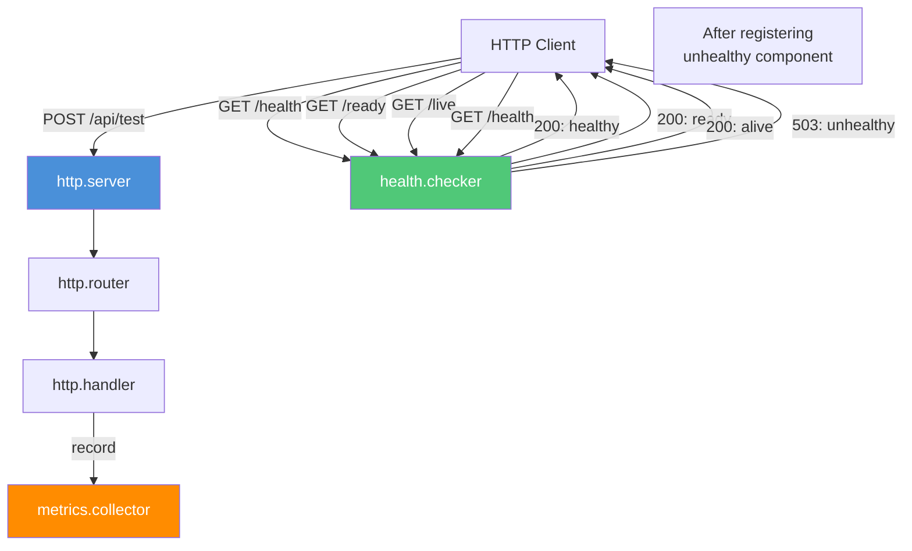

<details>
<summary>Execution Evidence</summary>

```
=== RUN   TestE2E_MetricsAndHealthCheck
    Step 1: Verifying metrics collector is registered as a service
      metrics.collector service found in registry
    Step 2: Verifying health checker is registered as a service
      health.checker service found in registry
    Step 3: Registering health check and setting started
    Step 4: Making HTTP requests to generate metrics
      Made 3 successful HTTP requests
    Step 5: Recording and verifying metrics
      Prometheus metrics contain expected counters
    Step 6: Testing health checker HTTP handlers
      Health endpoint: status=healthy
      Ready endpoint: status=ready
      Live endpoint: status=alive
    Step 7: Testing health check with unhealthy component
      Unhealthy endpoint: status=unhealthy, httpCode=503
    E2E Metrics & Health Check: All steps passed
--- PASS: TestE2E_MetricsAndHealthCheck (0.06s)
```
</details>

---

## 16. EventBus Bridge

**Test:** `TestE2E_EventBusBridge`
**Modules:** `messaging.broker.eventbus`, `messaging.handler`, EventBus module

Validates the EventBusBridge adapter that connects the workflow `MessageBroker` interface to the modular `EventBus`. Tests bidirectional communication: publish via bridge (round-trip through EventBus) and publish directly via EventBus (received by bridge subscriber).

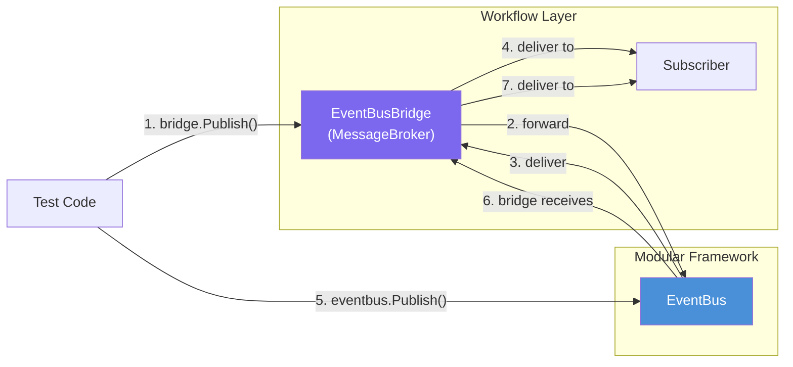

<details>
<summary>Execution Evidence</summary>

```
=== RUN   TestE2E_EventBusBridge
    Step 1: Subscribing to topic via EventBusBridge
      Subscribed to 'test.events' via bridge
    Step 2: Publishing message through the bridge
      Received message via bridge: {"action":"test","value":42}
    Step 3: Publishing directly through EventBus module
      Bridge subscriber received direct EventBus message: {"id":123,"source":"direct"}
    Step 4: Unsubscribing and verifying no more messages
      No messages received after unsubscribe (correct)
    E2E EventBusBridge: All steps passed
--- PASS: TestE2E_EventBusBridge (0.38s)
```
</details>

---

## 17. Webhook Sender

**Test:** `TestE2E_WebhookSender`
**Modules:** `webhook.sender`, `http.server`, `http.router`, `http.handler`

Spins up a real webhook target server, sends a webhook with custom headers, verifies receipt, then tests the dead letter queue by sending to an unreachable URL with retry exhaustion.

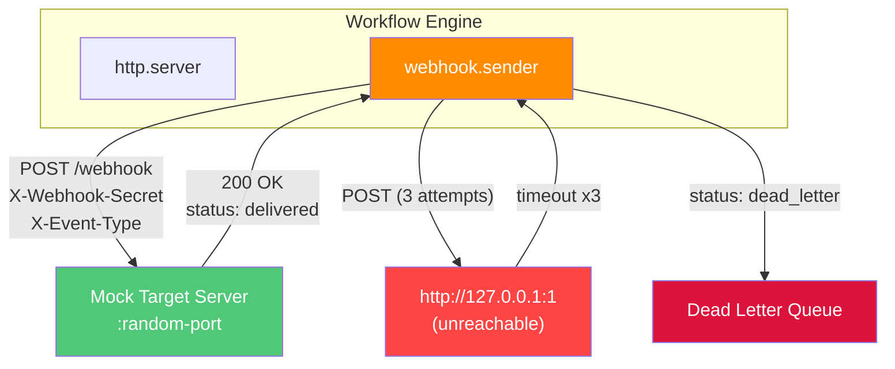

<details>
<summary>Execution Evidence</summary>

```
=== RUN   TestE2E_WebhookSender
    Step 1: Retrieving webhook sender from service registry
      webhook.sender service found
    Step 2: Sending webhook to target server
      Webhook delivered: id=wh-...-1, status=delivered, attempts=1
    Step 3: Verifying target server received the webhook
      Target server received correct payload and headers
    Step 4: Sending webhook to invalid URL (expects dead letter)
      Failed delivery: id=wh-...-2, status=dead_letter, attempts=3
    Step 5: Verifying dead letter queue
      Dead letter queue: id=wh-...-2, lastError=request failed: Post "http://127.0.0.1:1/nonexistent": context deadline exceeded
    E2E Webhook Sender: All steps passed - delivery, headers, dead letter verified
--- PASS: TestE2E_WebhookSender (4.65s)
```
</details>

---

## 18. Slack Notification

**Test:** `TestE2E_SlackNotification_MockEndpoint`
**Modules:** `notification.slack`, `http.server`, `http.router`

Points the Slack notification module at a mock HTTP server that captures webhook POSTs. Verifies the correct JSON payload format (text, channel, username) and tests error handling when the webhook URL is empty.

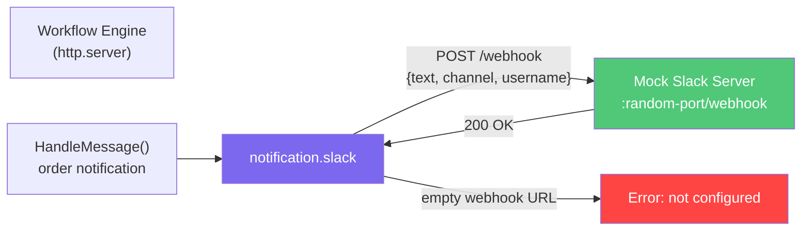

<details>
<summary>Execution Evidence</summary>

```
=== RUN   TestE2E_SlackNotification_MockEndpoint
    Step 1: Configuring Slack notification module
      Configured: webhook, channel, username
    Step 2: Sending notification via HandleMessage
      Notification sent
    Step 3: Verifying mock Slack server received the payload
      Slack payload correct: text="Order ORD-300 has been completed successfully", channel=#test-alerts, username=workflow-bot
    Step 4: Sending second notification
    Step 5: Testing error handling with empty webhook URL
      Got expected error: slack webhook URL not configured
    E2E Slack Notification: All steps passed
--- PASS: TestE2E_SlackNotification_MockEndpoint (0.11s)
```
</details>

---

## 19. Middleware: Auth

**Test:** `TestE2E_Middleware_Auth`
**Modules:** `http.server`, `http.router`, `http.middleware.auth`, `http.handler`

Tests Bearer token authentication middleware with 4 scenarios: no header, wrong auth type, invalid token, and valid token.

```mermaid
flowchart LR
    subgraph Requests["HTTP Requests"]
        R1["No Authorization<br/>header"]
        R2["Basic auth<br/>(wrong type)"]
        R3["Bearer invalid-token"]
        R4["Bearer valid-token"]
    end

    Auth["http.middleware.auth<br/>authType: Bearer"]
    Handler["http.handler"]

    R1 -->|"401"| Auth
    R2 -->|"401"| Auth
    R3 -->|"401"| Auth
    R4 -->|"pass"| Auth
    Auth -->|"200"| Handler

    style Auth fill:#FF4444,color:white
    style Handler fill:#50C878,color:white
```

<details>
<summary>Execution Evidence</summary>

```
=== RUN   TestE2E_Middleware_Auth
    E2E Middleware Auth: All auth scenarios verified
--- PASS: TestE2E_Middleware_Auth (0.06s)
    --- PASS: no_auth_header (0.00s)
    --- PASS: wrong_auth_type (0.00s)
    --- PASS: invalid_token (0.00s)
    --- PASS: valid_token (0.00s)
```
</details>

---

## 20. Middleware: Rate Limiting

**Test:** `TestE2E_Middleware_RateLimit`
**Modules:** `http.server`, `http.router`, `http.middleware.ratelimit`, `http.handler`

Configures a rate limiter with burstSize=3. The first 3 requests succeed (200), the 4th is rejected (429 Too Many Requests).

```mermaid
flowchart LR
    subgraph Requests["Sequential Requests"]
        R1["Request 1"] -->|"200 OK<br/>tokens: 3->2"| RL
        R2["Request 2"] -->|"200 OK<br/>tokens: 2->1"| RL
        R3["Request 3"] -->|"200 OK<br/>tokens: 1->0"| RL
        R4["Request 4"] -->|"429 Too Many<br/>tokens: 0"| RL
    end

    RL["http.middleware.ratelimit<br/>burstSize=3<br/>requestsPerMinute=60"]
    Handler["http.handler"]

    RL -->|"tokens > 0"| Handler

    style RL fill:#FF8C00,color:white
    style R4 fill:#FF4444,color:white
```

<details>
<summary>Execution Evidence</summary>

```
=== RUN   TestE2E_Middleware_RateLimit
      Got 429 on request 3 (burst=3)
    E2E Middleware RateLimit: Rate limiting verified with burstSize=3
--- PASS: TestE2E_Middleware_RateLimit (0.06s)
```
</details>

---

## 21. Middleware: CORS

**Test:** `TestE2E_Middleware_CORS`
**Modules:** `http.server`, `http.router`, `http.middleware.cors`, `http.handler`

Tests Cross-Origin Resource Sharing headers: allowed origin gets CORS headers, disallowed origin gets none, custom allowed headers are returned, and OPTIONS preflight returns proper headers.

```mermaid
flowchart TD
    subgraph Scenarios
        S1["Origin: http://allowed.example.com"]
        S2["Origin: http://evil.example.com"]
        S3["OPTIONS preflight"]
    end

    CORS["http.middleware.cors<br/>allowedOrigins:<br/>http://allowed.example.com"]

    S1 -->|"pass"| CORS
    CORS -->|"Access-Control-Allow-Origin:<br/>http://allowed.example.com"| Response1["200 + CORS headers"]

    S2 -->|"pass"| CORS
    CORS -->|"no CORS headers"| Response2["200 (no CORS)"]

    S3 -->|"OPTIONS"| CORS
    CORS -->|"Allow-Origin + Allow-Methods"| Response3["200 + full CORS"]

    style CORS fill:#7B68EE,color:white
    style Response1 fill:#50C878,color:white
    style Response2 fill:#FFD700,color:black
```

<details>
<summary>Execution Evidence</summary>

```
=== RUN   TestE2E_Middleware_CORS
    E2E Middleware CORS: Allowed, disallowed, headers, and preflight scenarios verified
--- PASS: TestE2E_Middleware_CORS (0.11s)
    --- PASS: allowed_origin (0.00s)
    --- PASS: disallowed_origin (0.00s)
    --- PASS: allowed_headers (0.00s)
    --- PASS: preflight_with_options_route (0.05s)
```
</details>

---

## 22. Middleware: Request ID

**Test:** `TestE2E_Middleware_RequestID`
**Modules:** `http.server`, `http.router`, `http.handler` + RequestID middleware

Verifies that the server generates a UUID `X-Request-ID` when the client doesn't provide one, and preserves the client-supplied ID when one is sent.

```mermaid
flowchart LR
    subgraph NoID["No X-Request-ID"]
        R1["GET /api/test"] --> MW1["RequestID<br/>Middleware"]
        MW1 -->|"generate UUID"| Handler1["Handler"]
        Handler1 -->|"X-Request-ID:<br/>aad8e019-6469-..."| Response1["Response"]
    end

    subgraph WithID["Client-supplied ID"]
        R2["GET /api/test<br/>X-Request-ID:<br/>my-custom-id"] --> MW2["RequestID<br/>Middleware"]
        MW2 -->|"preserve"| Handler2["Handler"]
        Handler2 -->|"X-Request-ID:<br/>my-custom-id"| Response2["Response"]
    end

    style MW1 fill:#7B68EE,color:white
    style MW2 fill:#7B68EE,color:white
```

<details>
<summary>Execution Evidence</summary>

```
=== RUN   TestE2E_Middleware_RequestID
      Generated X-Request-ID: d91af827-329f-48c7-bcfe-09893992be72
    E2E Middleware RequestID: Generated and preserved ID scenarios verified
--- PASS: TestE2E_Middleware_RequestID (0.05s)
    --- PASS: generated_id (0.00s)
    --- PASS: preserved_id (0.00s)
```
</details>

---

## 23. Middleware: Full Chain

**Test:** `TestE2E_Middleware_FullChain`
**Modules:** `http.server`, `http.router`, `http.middleware.cors`, `http.middleware.ratelimit`, `http.middleware.auth`, `http.middleware.logging`, `http.handler`

Wires 4 middlewares into a single route and tests them cooperating: CORS + rate limiting + authentication + logging. Verifies that unauthenticated requests are blocked, authenticated requests with CORS pass through, and rate limiting kicks in after burst exhaustion.

```mermaid
flowchart LR
    Client["HTTP Client"]
    CORS["CORS<br/>Middleware"]
    RL["Rate Limit<br/>Middleware"]
    Auth["Auth<br/>Middleware"]
    Log["Logging<br/>Middleware"]
    Handler["http.handler"]

    Client --> CORS
    CORS -->|"add CORS headers"| RL
    RL -->|"check tokens"| Auth
    Auth -->|"verify Bearer"| Log
    Log -->|"log request"| Handler
    Handler -->|"200 OK"| Client

    RL -->|"429 (no tokens)"| Client
    Auth -->|"401 (no token)"| Client

    style CORS fill:#7B68EE,color:white
    style RL fill:#FF8C00,color:white
    style Auth fill:#FF4444,color:white
    style Log fill:#4A90D9,color:white
    style Handler fill:#50C878,color:white
```

<details>
<summary>Execution Evidence</summary>

```
=== RUN   TestE2E_Middleware_FullChain
      Got 429 on request 3 (burst=5)
    E2E Middleware FullChain: CORS + RateLimit + Auth + Logging all cooperating
--- PASS: TestE2E_Middleware_FullChain (0.06s)
    --- PASS: no_auth_no_origin (0.00s)
    --- PASS: valid_auth_with_cors (0.00s)
    --- PASS: rate_limit_after_burst (0.00s)
```
</details>

---

## Summary

| # | Scenario | Modules Tested | Status |
|---|----------|---------------|--------|
| 1 | Core HTTP Pipeline | http.server, http.router, http.handler | PASS |
| 2 | Order Processing Pipeline | api.handler, statemachine.engine, state.tracker, messaging.broker, messaging.handler | PASS |
| 3 | Order Pipeline Error Path | statemachine error states, transition rejection | PASS |
| 4 | Broker Messaging | messaging.broker, messaging.handler (pub/sub) | PASS |
| 5 | Config Push & Reload | WorkflowUIHandler (config CRUD, reload, validate) | PASS |
| 6 | Dynamic Load & Execute | dynamic.component (Yaegi), HTTP API | PASS |
| 7 | Dynamic Hot Reload | v1->v2 update, behavior change, deletion | PASS |
| 8 | Dynamic Sandbox | 6 blocked imports, valid after rejections | PASS |
| 9 | Dynamic Engine Integration | dynamic.component in full engine lifecycle | PASS |
| 10 | Dynamic Message Processor | dynamic component + broker pub/sub | PASS |
| 11 | Integration Workflow | IntegrationWorkflowHandler, HTTP connectors | PASS |
| 12 | Event Workflow | EventWorkflowHandler, pattern matching | PASS |
| 13 | Data Transformer | extract->map->filter pipeline | PASS |
| 14 | Scheduler Workflow | SchedulerWorkflowHandler, job execution | PASS |
| 15 | Metrics & Health Check | metrics.collector, health.checker, /health /ready /live | PASS |
| 16 | EventBus Bridge | messaging.broker.eventbus, bidirectional pub/sub | PASS |
| 17 | Webhook Sender | webhook.sender, delivery + dead letter queue | PASS |
| 18 | Slack Notification | notification.slack, mock endpoint verification | PASS |
| 19 | Middleware: Auth | http.middleware.auth (Bearer token) | PASS |
| 20 | Middleware: Rate Limit | http.middleware.ratelimit (token bucket) | PASS |
| 21 | Middleware: CORS | http.middleware.cors (origins, preflight) | PASS |
| 22 | Middleware: Request ID | RequestID middleware (generate/preserve) | PASS |
| 23 | Middleware: Full Chain | CORS + RateLimit + Auth + Logging combined | PASS |

**Total: 23 scenarios, 23 PASS, 0 FAIL**
