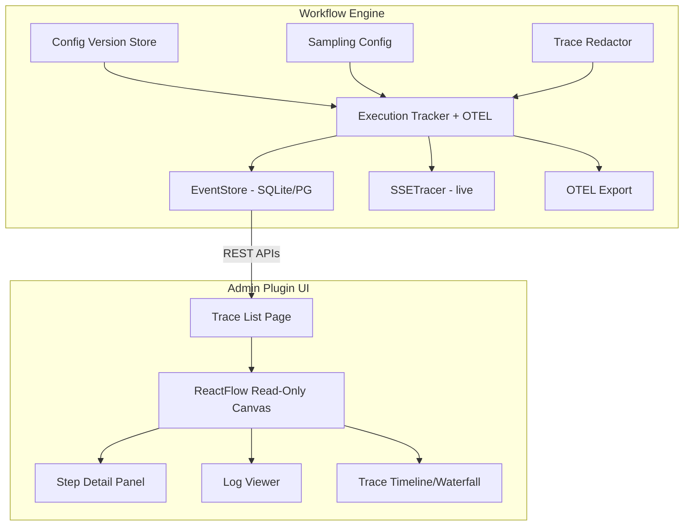

# Workflow Tracing & Visualization — Design Document

## Goal

Enable tracing of pipeline step execution with a read-only ReactFlow canvas for visualization, config-driven sampling, config versioning, PII protection, and step-level input/output inspection.

## Architecture

Engine-first approach: build trace capture enhancements and config versioning into the workflow engine core, build trace visualization into workflow-plugin-admin's React UI. Every workflow engine application (ratchet, cloud, BMW, scenarios) gets tracing automatically.



## Tech Stack

- Go 1.26, workflow engine v0.3.12+
- SQLite (WAL) / PostgreSQL (pgx) for trace storage
- OpenTelemetry Go SDK for span export
- @xyflow/react v12.10.0 for trace canvas
- Zustand for UI state management
- dagre for graph layout
- Playwright for UI validation

---

## 1. Config Versioning

### Store

Content-addressed by SHA-256 hash of normalized YAML:

```sql
CREATE TABLE IF NOT EXISTS config_versions (
    hash TEXT PRIMARY KEY,
    config_yaml TEXT NOT NULL,
    source_files TEXT,      -- JSON array of individual file hashes
    created_at DATETIME NOT NULL DEFAULT (datetime('now')),
    metadata TEXT            -- JSON: labels, app name, etc.
);
CREATE INDEX idx_config_versions_created ON config_versions(created_at DESC);
```

### Interface

```go
type ConfigVersionStore interface {
    Store(ctx context.Context, configYAML string, meta map[string]any) (hash string, err error)
    Get(ctx context.Context, hash string) (*ConfigVersion, error)
    List(ctx context.Context, limit int) ([]ConfigVersion, error)
    Diff(ctx context.Context, hashA, hashB string) (string, error)
}
```

### Behavior

- On `engine.BuildFromConfig()`, hash the merged config and store it
- Hash injected into every `ExecutionTracker.Metadata` as `config_version`
- Multi-config apps: individual file hashes stored in `source_files`, composite hash as primary key
- Deduplication: same config content produces same hash (INSERT OR IGNORE)

---

## 2. Trace Capture & Sampling

### What Exists

- `ExecutionTracker` records to V1Store + OTEL spans
- `EventStore` captures step-level events (started, completed, failed, input_recorded, output_recorded)
- `SSETracer` streams events in real-time
- Timeline Handler serves execution list, timeline, events, replay APIs

### Enhancements

**Sampling configuration** in `observability.otel` module:

```yaml
- name: tracing
  type: observability.otel
  config:
    endpoint: '{{config "otel_endpoint"}}'
    serviceName: "my-app"
    sampling:
      rate: 1.0              # 0.0-1.0 (1.0 = 100%, 0.01 = 1%)
      alwaysSampleErrors: true
    tracing:
      captureStepIO: true     # record step inputs/outputs
      maxIOSize: 10240        # max bytes per I/O field (truncate beyond)
```

**Sampling implementation:**
- Head-based using `TraceIDRatioBased` sampler (deterministic per trace ID)
- `alwaysSampleErrors: true` implemented via post-execution check: if execution fails and wasn't sampled, retroactively store it
- Sampling decision stored in execution metadata for UI filtering

**Step I/O capture:**
- When `captureStepIO: true`, `ExecutionTracker.RecordEvent()` stores step input/output in `execution_steps.input_data` and `execution_steps.output_data`
- Size-limited: truncate to `maxIOSize` bytes with `[truncated]` marker
- Default: `captureStepIO: false` for backward compatibility

---

## 3. PII/PHI Protection

### Application-Level Redaction

Optional `TraceRedactor` interface called before persisting step I/O:

```go
type TraceRedactor interface {
    Redact(ctx context.Context, data map[string]any) (map[string]any, error)
}
```

Configuration:

```yaml
    tracing:
      redaction:
        enabled: true
        module: "pii"         # data.pii module name from service registry
        strategy: "hash"      # redact | hash | partial
        scanFields: []        # empty = scan all fields
```

If `data.pii` module is in the service registry, engine creates an adapter that calls its detection + masking before storage. If not present (no data-protection plugin), redaction is skipped.

### Collector-Level Defense

Standard OTEL Collector redaction processor as external defense-in-depth (not part of this implementation).

---

## 4. ReactFlow Trace Canvas

### Read-Only Mode

Reuse existing admin plugin ReactFlow components with disabled interaction:

```typescript
// TraceCanvas.tsx
<ReactFlow
  nodes={traceNodes}
  edges={traceEdges}
  nodeTypes={nodeTypes}        // reuse existing node type registry
  edgeTypes={edgeTypes}
  onNodesChange={undefined}    // disable editing
  onEdgesChange={undefined}
  onConnect={undefined}
  nodesDraggable={false}
  nodesConnectable={false}
  elementsSelectable={true}    // allow clicking for detail view
  fitView
>
  <Background variant={BackgroundVariant.Dots} />
  <Controls showInteractive={false} />
  <MiniMap pannable zoomable />
</ReactFlow>
```

### Node Rendering

Each node from the config gets an execution status overlay:
- **Completed**: green border + checkmark + duration badge
- **Failed**: red border + X icon + error indicator
- **Skipped**: gray/dimmed + skip icon
- **Running**: blue border + pulse animation (for live traces)
- **Not reached**: standard appearance, no overlay

### Edge Highlighting

- **Taken path**: bold edges (3px), full opacity, category color
- **Not taken**: thin edges (1px), 20% opacity, gray
- **Conditional branches**: label shows which condition matched

### Execution Path Detection

From `conditional.routed` events in EventStore:
```json
{
  "event_type": "conditional.routed",
  "event_data": {
    "step_name": "check-found",
    "route_taken": "respond",
    "field_value": "true"
  }
}
```

Map route decisions to edges to determine taken vs untaken paths.

---

## 5. Step Detail Panel

Right-side panel (collapsible) showing selected step details:

- **Header**: Step name, type, status badge
- **Timing**: Started at, duration, position in sequence
- **Input data**: JSON tree viewer of step input (from `execution_steps.input_data`)
- **Output data**: JSON tree viewer of step output (from `execution_steps.output_data`)
- **Error**: Error message with stack trace (if failed)
- **Conditional**: Which route was taken and why (field value, matched route)
- **PII indicators**: Fields that were redacted shown with lock icon

---

## 6. Trace List Page

New page at `/traces`:

- **Table columns**: Execution ID, Pipeline Name, Status, Duration, Config Version (short hash), Timestamp
- **Filters**: Pipeline name (dropdown), Status (completed/failed/running), Date range, Config version
- **Sort**: By timestamp (default desc), duration, status
- **Pagination**: Using existing `ListExecutions` API with limit/offset
- **Actions**: Click row → navigate to `/traces/{executionId}`
- **Live indicator**: SSE connection shows new executions appearing in real-time

---

## 7. Log Viewer

Within trace detail page, below the canvas:

- Chronological log entries from `execution_logs` table
- Level coloring: debug=gray, info=blue, warn=yellow, error=red
- Filter by level, search by message text
- Each log entry linked to its step — click → highlights step in canvas + opens detail panel
- Auto-scroll to first error entry

---

## 8. Trace Timeline (Waterfall)

Horizontal bar chart below the canvas showing step timing:

- Each step = horizontal bar, positioned by start time, width = duration
- Color-coded by status (green/red/gray)
- Click bar → selects step in canvas + opens detail panel
- Shows critical path (longest sequential chain)
- Hover → tooltip with step name, type, duration

---

## 9. Multi-Config Support

- Each imported YAML file hashed individually
- Composite (merged) config gets its own hash
- `config_versions.source_files` stores JSON array: `[{"file": "modules.yaml", "hash": "sha256:..."}, ...]`
- API: `GET /api/v1/admin/config-versions/{hash}` returns full config + source file breakdown
- Diff: `GET /api/v1/admin/config-versions/diff?a={hash}&b={hash}` returns unified diff

---

## 10. API Endpoints

### Existing (in workflow engine, via Timeline Handler)
- `GET /api/v1/admin/executions` — list with filters
- `GET /api/v1/admin/executions/{id}/timeline` — materialized execution
- `GET /api/v1/admin/executions/{id}/events` — raw event stream
- `POST /api/v1/admin/executions/{id}/replay` — replay execution

### New
- `GET /api/v1/admin/config-versions` — list config versions
- `GET /api/v1/admin/config-versions/{hash}` — get config by hash
- `GET /api/v1/admin/config-versions/diff` — diff two versions
- `GET /api/v1/admin/executions/{id}/logs` — execution logs (separate from events)
- `GET /api/v1/admin/tracing/config` — current tracing configuration

---

## 11. Testing Strategy

### Go Unit Tests
- ConfigVersionStore: store/retrieve/list/dedup/diff
- Sampling decision logic (rate-based, error override)
- TraceRedactor with mock PII detector
- Step I/O truncation at maxIOSize
- Config hash determinism (same content = same hash)

### Go Integration Tests
- Full pipeline execution with tracing → verify events in EventStore
- Sampling at 50% → verify approximately 50% traced (statistical)
- PII redaction → verify sensitive data masked in stored traces
- Multi-config hashing → verify composite + individual hashes

### API Tests
- Timeline APIs return correct execution data
- Config version CRUD
- Execution filtering by config version, status, pipeline
- Log retrieval with level filtering

### Playwright UI Tests
- Trace list page: renders table, filters work, pagination works
- Click trace → canvas loads with correct nodes from config
- Node status overlays: completed (green), failed (red), skipped (gray)
- Edge highlighting: taken path bold, untaken dimmed
- Click step → detail panel opens with inputs/outputs
- Log viewer: entries render, level filtering works, click-to-step works
- Timeline waterfall: bars render, click selects step
- Read-only enforcement: no drag, no connect, no edit operations possible
- Live trace: new execution appears in list via SSE
- Failed execution: error states displayed correctly throughout

---

## 12. Repos & Scope

| Repo | Changes | Estimated Tasks |
|------|---------|----------------|
| `workflow` | ConfigVersionStore, sampling config enhancement, step I/O capture toggle, TraceRedactor hook, new API endpoints, config hash on startup | 6-8 |
| `workflow-plugin-admin` | TraceCanvas, TraceList, StepDetailPanel, LogViewer, TraceTimeline, read-only ReactFlow, routing | 8-10 |
| `workflow-plugin-data-protection` | TraceRedactor adapter implementation | 1-2 |
| `ratchet` (+ other apps) | Update observability config, verify tracing works | 1-2 |
| Testing | Go unit/integration tests, API tests, Playwright UI tests | 4-6 |

**Total: ~22-28 implementation tasks**, suitable for 2-3 implementer agent team.

---

## 13. Risks

| Risk | Mitigation |
|------|-----------|
| Step I/O capture increases DB size | Default off, maxIOSize cap, TTL-based cleanup |
| PII in traces despite redaction | Defense-in-depth: app-level + collector-level |
| ReactFlow performance with large configs | Virtualization, limit visible nodes, collapse groups |
| Sampling accuracy at low rates | Head-based sampling is deterministic per trace ID |
| Config hash collision (SHA-256) | Astronomically unlikely; store full content for verification |
| Admin plugin UI bundle size growth | Code-split trace pages, lazy load ReactFlow |
