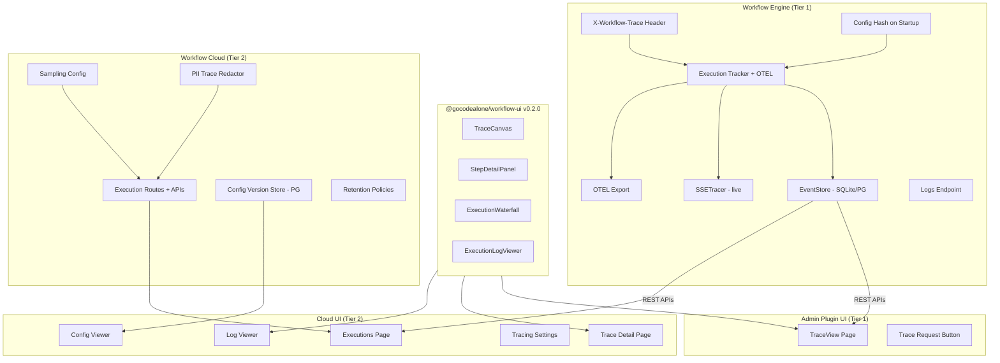

# Workflow Tracing & Visualization — Design Document

## Goal

Enable tracing of pipeline step execution with a read-only ReactFlow canvas for visualization, config versioning, PII protection, and step-level input/output inspection. Two-tier model: basic test-trace in engine/admin (free), full historical tracing with sampling and retention in workflow-cloud (premium).

## Architecture

Two-tier approach:

- **Tier 1 (Engine + Admin UI):** Explicit test-request tracing via `X-Workflow-Trace` header. Admin user sends a request with the header to force full step I/O capture for that single execution. Basic trace canvas in admin UI for inspecting test results. Config hash injected into execution metadata. Execution logs query endpoint.

- **Tier 2 (Cloud + Cloud UI):** Full historical execution tracking with configurable sampling rates, data retention policies, config versioning store (PostgreSQL), PII redaction, and premium trace visualization. Cloud UI incorporates all admin UI capabilities via shared component library.

**Key principle:** Everything in workflow-plugin-admin must also exist in workflow-cloud. Shared UI components are extracted to `@gocodealone/workflow-ui` so both admin and cloud UIs reuse them.



## Tech Stack

- Go 1.26, workflow engine v0.3.12+
- SQLite (WAL) / PostgreSQL (pgx) for trace storage
- OpenTelemetry Go SDK for span export
- @xyflow/react v12.10.0 for trace canvas
- Zustand for UI state management
- dagre for graph layout
- Playwright for UI validation
- @gocodealone/workflow-ui for shared components

---

## 1. Tier 1: X-Workflow-Trace Header

### Explicit Test Tracing

Admin users trigger full step I/O capture for a single request by passing `X-Workflow-Trace: true` header. This is the engine-level tracing mechanism — no config-driven sampling in the engine itself.

**Behavior:**
- Pipeline executor checks for `X-Workflow-Trace` header in request context
- When present, `ExecutionTracker.RecordEvent()` captures step input/output into `execution_steps.input_data` and `execution_steps.output_data`
- Size-limited: truncate to 10KB with `[truncated]` marker
- Default (no header): step I/O is NOT captured (backward compatible)
- Header-triggered traces always recorded regardless of OTEL sampling

### Config Hash on Startup

On `engine.BuildFromConfig()`, compute SHA-256 hash of the merged YAML config and inject into every `ExecutionTracker.Metadata` as `config_version`. This links executions to the config that produced them.

Multi-config apps: hash the composite merged config.

---

## 2. Tier 2: Sampling & Historical Tracing (Cloud)

### Sampling Configuration

Cloud manages sampling via a `tracing_config` database table (per-tenant):

```sql
CREATE TABLE tracing_config (
    tenant_id TEXT PRIMARY KEY,
    sample_rate REAL NOT NULL DEFAULT 1.0,
    capture_step_io BOOLEAN NOT NULL DEFAULT false,
    max_io_size INTEGER NOT NULL DEFAULT 10240,
    always_sample_errors BOOLEAN NOT NULL DEFAULT true,
    retention_days INTEGER NOT NULL DEFAULT 30,
    max_traces INTEGER NOT NULL DEFAULT 100000,
    updated_at TIMESTAMP NOT NULL DEFAULT NOW()
);
```

**Sampling implementation:**
- Head-based using `TraceIDRatioBased` sampler (deterministic per trace ID)
- `alwaysSampleErrors: true` implemented via post-execution check
- Sampling decision stored in execution metadata for UI filtering

### Config Version Store (PostgreSQL)

Content-addressed by SHA-256 hash:

```sql
CREATE TABLE config_versions (
    hash TEXT PRIMARY KEY,
    tenant_id TEXT NOT NULL REFERENCES tenants(id),
    config_yaml TEXT NOT NULL,
    source_files JSONB,
    created_at TIMESTAMP NOT NULL DEFAULT NOW(),
    metadata JSONB
);
```

**Interface:**
```go
type ConfigVersionStore interface {
    Store(ctx context.Context, tenantID, configYAML string, meta map[string]any) (hash string, err error)
    Get(ctx context.Context, hash string) (*ConfigVersion, error)
    List(ctx context.Context, tenantID string, limit int) ([]ConfigVersion, error)
    Diff(ctx context.Context, hashA, hashB string) (string, error)
}
```

### Data Retention Policies

Configurable retention per tenant:
- `retention_days`: traces older than N days are purged (default 30)
- `max_traces`: cap on total stored traces per tenant (default 100K)
- Purge runs on a scheduled cron job (daily)
- API: `PUT /api/v1/me/tracing/config` to update retention settings

### Cloud API Endpoints

- `GET /api/v1/me/executions` — list with filters (pipeline, status, date range, config version)
- `GET /api/v1/me/executions/{id}/timeline` — materialized execution with step I/O
- `GET /api/v1/me/executions/{id}/events` — raw event stream
- `GET /api/v1/me/executions/{id}/logs` — execution logs with level filtering
- `GET /api/v1/me/config-versions` — list config versions
- `GET /api/v1/me/config-versions/{hash}` — get config by hash
- `GET /api/v1/me/config-versions/diff?a={hash}&b={hash}` — unified diff
- `GET /api/v1/me/tracing/config` — current tracing configuration
- `PUT /api/v1/me/tracing/config` — update tracing settings
- `POST /api/v1/me/tracing/purge` — trigger manual purge

---

## 3. PII/PHI Protection (Cloud)

### Built-in Regex Redactor

Cloud-side `TraceRedactor` with built-in patterns for common PII:
- Email addresses, SSN, credit card numbers, phone numbers
- Applied before persisting step I/O data
- Strategy: replace with `[REDACTED]`
- Configurable enable/disable per tenant

### Data Protection Plugin Integration (Future)

Optional adapter to `workflow-plugin-data-protection`'s `data.pii` module for advanced detection + masking (hash, partial, tokenize strategies). Not part of this implementation — the built-in regex covers the core requirement.

### Collector-Level Defense

Standard OTEL Collector redaction processor as external defense-in-depth (not part of this implementation).

---

## 4. Shared UI Components (@gocodealone/workflow-ui v0.2.0)

Extract trace visualization components from the admin UI into the shared library so both admin and cloud UIs can use them:

### TraceCanvas

Read-only ReactFlow canvas with execution overlay:

```typescript
<ReactFlow
  nodes={traceNodes}
  edges={traceEdges}
  nodeTypes={nodeTypes}
  edgeTypes={edgeTypes}
  onNodesChange={undefined}
  onEdgesChange={undefined}
  onConnect={undefined}
  nodesDraggable={false}
  nodesConnectable={false}
  elementsSelectable={true}
  fitView
>
  <Background variant={BackgroundVariant.Dots} />
  <Controls showInteractive={false} />
  <MiniMap pannable zoomable />
</ReactFlow>
```

### Node Status Overlays

- **Completed**: green border + checkmark + duration badge
- **Failed**: red border + X icon + error indicator
- **Skipped**: gray/dimmed + skip icon
- **Running**: blue border + pulse animation (for live traces)
- **Not reached**: standard appearance, no overlay

### Edge Highlighting

- **Taken path**: bold edges (3px), full opacity, category color
- **Not taken**: thin edges (1px), 20% opacity, gray
- **Conditional branches**: label shows which condition matched

### Execution Path Detection

From `conditional.routed` events in EventStore:
```json
{
  "event_type": "conditional.routed",
  "event_data": {
    "step_name": "check-found",
    "route_taken": "respond",
    "field_value": "true"
  }
}
```

### StepDetailPanel

Right-side panel (collapsible) showing selected step details:
- **Header**: Step name, type, status badge
- **Timing**: Started at, duration, position in sequence
- **Input data**: JSON tree viewer
- **Output data**: JSON tree viewer
- **Error**: Error message with stack trace (if failed)
- **Conditional**: Which route was taken and why
- **PII indicators**: Fields that were redacted shown with lock icon

### ExecutionWaterfall

Horizontal bar chart showing step timing:
- Each step = horizontal bar, positioned by start time, width = duration
- Color-coded by status (green/red/gray)
- Click bar → selects step in canvas + opens detail panel
- Shows critical path (longest sequential chain)
- Hover → tooltip with step name, type, duration

### ExecutionLogViewer

Chronological log entries:
- Level coloring: debug=gray, info=blue, warn=yellow, error=red
- Filter by level, search by message text
- Each log entry linked to its step — click → highlights step in canvas
- Auto-scroll to first error entry

---

## 5. Admin UI (Tier 1)

### Trace View Page

New page in admin UI at `/traces/{executionId}`:
- TraceCanvas (from shared lib) showing pipeline topology with execution overlay
- StepDetailPanel (from shared lib) on right side
- ExecutionWaterfall (from shared lib) below canvas
- ExecutionLogViewer (from shared lib) below waterfall

### Trace Request Button

In the admin config editor, a "Trace Request" button/modal:
- User enters HTTP method, path, headers, body
- Sends request to the application's HTTP endpoint with `X-Workflow-Trace: true` header injected
- On response, navigates to `/traces/{executionId}` to view the traced execution

### Navigation

- Add "Trace" button on execution list rows → navigates to trace view
- Wire into existing admin navigation via VIEW_REGISTRY

### Engine Logs Endpoint

New endpoint in timeline_handler.go:
- `GET /api/v1/admin/executions/{id}/logs` — execution logs with level filtering (`?level=error`)

---

## 6. Cloud UI (Tier 2)

### Shared Library Integration

Cloud UI adds `@gocodealone/workflow-ui` v0.2.0 dependency to get all shared trace components.

### Executions Page

New page at `/executions`:
- Table: Execution ID, Pipeline, Status, Duration, Config Version, Timestamp
- Filters: Pipeline name, Status, Date range, Config version
- Sort: timestamp (desc), duration, status
- Pagination with limit/offset
- Live indicator: SSE shows new executions in real-time
- Click row → navigate to trace detail

### Trace Detail Page

At `/executions/{id}`:
- TraceCanvas with execution overlay
- StepDetailPanel
- ExecutionWaterfall
- ExecutionLogViewer
- All using shared components

### Config Viewer Page

At `/config-versions`:
- List all config versions with hash, created date, metadata
- Click → view full YAML
- Diff view: select two versions → side-by-side unified diff

### Tracing Settings Page

At `/settings/tracing`:
- Sample rate slider (0-100%)
- Capture step I/O toggle
- Max I/O size input
- Always sample errors toggle
- Retention days input
- Max traces input
- Manual purge button

### Log Viewer

Admin-equivalent log viewer in cloud UI using shared `ExecutionLogViewer` component.

---

## 7. Testing Strategy

### Go Unit Tests (Engine)
- Step I/O capture with X-Workflow-Trace header
- Step I/O truncation at 10KB
- Config hash determinism (same content = same hash)
- Execution logs query with level filtering

### Go Unit Tests (Cloud)
- ConfigVersionStore: store/retrieve/list/dedup/diff
- TraceRedactor: regex patterns for email, SSN, CC, phone
- Sampling decision logic (rate-based, error override)
- Data retention purge logic
- Tracing config CRUD

### Go Integration Tests
- Full pipeline execution with X-Workflow-Trace → verify step I/O in DB
- Config hash appears in execution metadata
- Cloud: sampling at 50% → verify approximately 50% traced
- Cloud: PII redaction → verify sensitive data masked
- Cloud: retention purge → verify old traces deleted

### API Tests
- Engine: execution logs endpoint with level filtering
- Cloud: execution list with filters (pipeline, status, config version, date range)
- Cloud: config version CRUD
- Cloud: tracing config update + retrieve
- Cloud: retention purge trigger

### Playwright UI Tests (Admin)
- Trace view: canvas loads with correct nodes
- Node status overlays: completed (green), failed (red), skipped (gray)
- Edge highlighting: taken path bold, untaken dimmed
- Click step → detail panel opens with inputs/outputs
- Log viewer: level filtering, click-to-step
- Timeline waterfall: bars render, click selects step
- Read-only enforcement: no drag, no connect
- Trace Request button: sends request, navigates to trace view
- Live trace: new execution appears via SSE
- Failed execution: error states displayed correctly

### Playwright UI Tests (Cloud)
- Executions page: table renders, filters work, pagination
- Click execution → trace detail loads
- Trace canvas + step detail panel work
- Config versions page: list, view, diff
- Tracing settings: update and verify
- Log viewer works with shared component
- Live execution appears via SSE

---

## 8. Repos & Scope

| Repo | Changes | Estimated Tasks |
|------|---------|----------------|
| `workflow` | X-Workflow-Trace header, step I/O capture, logs endpoint, config hash | 4 |
| `workflow-ui` | Extract TraceCanvas, StepDetailPanel, ExecutionWaterfall, ExecutionLogViewer, publish v0.2.0 | 5 |
| `workflow` (admin UI) | TraceView page, Trace Request button, navigation wiring | 3 |
| `workflow-cloud` | Execution routes, sampling config, config versions, retention, PII redaction | 5 |
| `workflow-cloud-ui` | Add shared lib, executions page, trace detail, config viewer, tracing settings, log viewer | 6 |
| `ratchet` | Update observability config | 1 |
| Testing | Go unit/integration, API, Playwright (admin + cloud) | 6 |

**Total: ~30 implementation tasks**, suitable for 2-3 implementer agent team.

---

## 9. Risks

| Risk | Mitigation |
|------|-----------|
| Step I/O capture increases DB size | Default off (header-triggered only in engine), maxIOSize cap, retention policies in cloud |
| PII in traces despite redaction | Built-in regex + optional data-protection plugin adapter (future) |
| ReactFlow performance with large configs | Virtualization, code-split trace pages, lazy load ReactFlow |
| Sampling accuracy at low rates | Head-based sampling is deterministic per trace ID |
| Config hash collision (SHA-256) | Astronomically unlikely; store full content for verification |
| Shared library version sync | Pin @gocodealone/workflow-ui version in both UIs |
| Cloud UI bundle size with shared lib | Code-split, tree-shake unused components |
