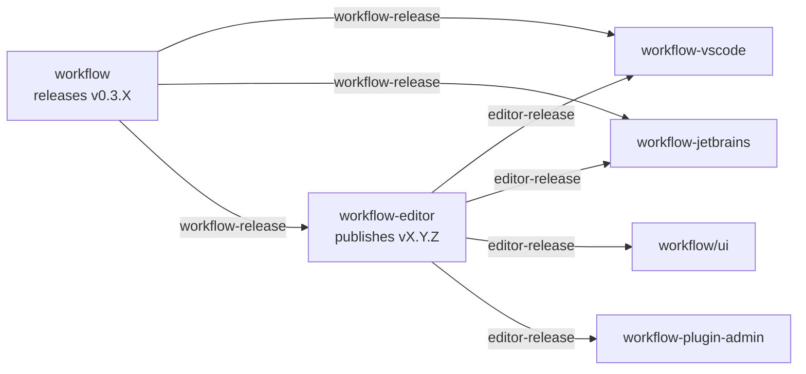

# Design: Visual Workflow Editor for IDE Plugins

**Date:** 2026-03-12
**Status:** Approved
**Scope:** `workflow-editor` package extraction + VS Code extension + JetBrains plugin

## Summary

Extract the ReactFlow-based visual workflow editor from `workflow/ui` into a standalone npm package (`@gocodealone/workflow-editor`), published to GitHub Packages. Embed it in VS Code (Webview) and JetBrains (JCEF) as a split-pane preview alongside the YAML text editor. Reuse the same package in workflow-cloud and workflow-plugin-admin.

## Motivation

- The visual editor already exists in `workflow/ui` (180+ components, 13 node types, 9 edge types, property panels, serialization, auto-layout) but is locked inside the admin app
- No IDE support for visually editing workflow YAML configs
- Users must mentally map YAML structure to pipeline flow — error-prone for complex configs with 144 step types and 88 module types
- External plugin types (30 manifests in workflow-registry) are invisible without the visual palette

## Architecture

### Package Extraction

**New repo:** `workflow-editor` → publishes `@gocodealone/workflow-editor` to GitHub Packages npm

**Extractable components (from `workflow/ui/src/`):**

| Component | Path | Coupling Fix |
|-----------|------|-------------|
| WorkflowCanvas | `components/canvas/WorkflowCanvas.tsx` | Replace `saveWorkflowConfig` with `onSave` callback |
| 13 node types | `components/nodes/` | None — pure display |
| 9 edge types + context menus | `components/canvas/Deletable/Edge/NodeContextMenu` | None |
| ConnectionPicklist | `components/canvas/ConnectionPicklist.tsx` | None |
| PropertyPanel + sub-editors | `components/properties/` | None — reads from store |
| NodePalette | `components/sidebar/NodePalette.tsx` | None — degrades gracefully |
| Toolbar | `components/toolbar/Toolbar.tsx` | Replace API calls with callback props |
| workflowStore | `store/workflowStore.ts` | Remove `ApiWorkflowRecord` import, use generic type |
| moduleSchemaStore | `store/moduleSchemaStore.ts` | Expose `loadSchemas()` for host injection |
| uiLayoutStore | `store/uiLayoutStore.ts` | None |
| serialization utils | `utils/serialization.ts` | Pass `moduleTypeMap` as param instead of `useModuleSchemaStore.getState()` |
| autoLayout | `utils/autoLayout.ts` | None |
| connectionCompatibility | `utils/connectionCompatibility.ts` | None |
| grouping | `utils/grouping.ts` | None |
| snapToConnect | `utils/snapToConnect.ts` | None |
| TypeScript types | `types/workflow.ts` | None |

**Stays in `workflow/ui` (app-shell):**
- `App.tsx`, routing, auth, plugin store, observability store
- `utils/api.ts` (500+ lines of app-specific API calls)
- All non-editor views (dashboard, logs, events, IAM, marketplace, etc.)

### Public API

```typescript
// Main component
<WorkflowEditor
  initialYaml={yamlContent}
  onSave={(yaml: string) => hostSaveFile(yaml)}
  onNavigateToSource={(line: number, col: number) => hostGoToLine(line, col)}
  onSchemaRequest={() => hostGetSchemas()}
  onChange={(yaml: string) => hostNotifyDirty(yaml)}
/>

// Individual components
export { WorkflowCanvas, NodePalette, PropertyPanel, Toolbar }

// Serialization
export { configToNodes, nodesToConfig, parseYaml, configToYaml }

// Stores
export { workflowStore, moduleSchemaStore }

// Schema injection
moduleSchemaStore.getState().loadSchemas(schemas)
moduleSchemaStore.getState().loadPluginSchemas(pluginSchemas)
```

**Package dependencies:**
- `peerDependencies`: `react`, `react-dom`, `@xyflow/react`, `zustand`
- `dependencies`: `js-yaml`, `dagre`

### Consumers

| Consumer | How it uses the package |
|----------|----------------------|
| `workflow/ui` | Replaces inline editor code with import |
| `workflow-vscode` | Loads in Webview panel |
| `workflow-jetbrains` | Loads in JCEF panel |
| `workflow-plugin-admin` | Embeds via `ui_dist` (which now uses the package) |

## CI/CD Notification Chain



**Two dispatch events:**
- `workflow-release` (existing) — workflow engine releases → IDE plugins update schemas + workflow-editor updates type catalogue
- `editor-release` (new) — workflow-editor publishes → IDE plugins update editor dep, workflow/ui updates dep, admin plugin updates embedded UI

**workflow-editor CI:**
- `publish.yml` — on tag push: build library → publish to GitHub Packages → dispatch `editor-release` to consumers
- `sync-schema.yml` — listens for `workflow-release`: run `wfctl schema` to regenerate type catalogue, bump version, publish

## VS Code Extension

**Extension type:** Webview panel (split view alongside standard YAML text editor, not a replacement)

**UX:**
- User opens workflow YAML → normal text editor
- Command: "Workflow: Open Visual Editor" (or editor title bar button)
- Webview panel opens to the right (like Markdown preview)
- Bidirectional sync: edit YAML → graph updates; edit graph → YAML updates
- Click node in graph → cursor jumps to YAML line
- Cursor in YAML → highlights corresponding node

**Message protocol (VS Code ↔ Webview):**

| Direction | Message | Purpose |
|-----------|---------|---------|
| host→editor | `yamlChanged(content)` | YAML file was edited in text editor |
| host→editor | `cursorMoved(line, col)` | Cursor position changed in text editor |
| host→editor | `schemasLoaded(schemas)` | Schema data from local JSON files |
| editor→host | `yamlUpdated(content)` | Graph edit produced new YAML |
| editor→host | `navigateToLine(line, col)` | User clicked a node, go to its YAML line |
| editor→host | `requestSchemas()` | Editor needs schema data |

**File layout:**
```
workflow-vscode/
├── src/
│   ├── extension.ts        — registers command, file watcher, webview provider
│   ├── bridge.ts           — VS Code ↔ editor message protocol
│   └── webview/            — bundles @gocodealone/workflow-editor with Vite
├── schemas/                — auto-synced workflow config JSON schema
└── .github/workflows/
    ├── sync-schema.yml     — existing: listen for workflow-release
    └── sync-editor.yml     — new: listen for editor-release
```

## JetBrains Plugin

**Plugin type:** Kotlin/Gradle using JCEF (JetBrains Chromium Embedded Framework)

**UX:** Identical to VS Code — split panel, bidirectional sync, same message protocol.

**File layout:**
```
workflow-jetbrains/
├── src/main/kotlin/com/gocodealone/workflow/
│   ├── WorkflowEditorProvider.kt   — registers split panel action
│   ├── WorkflowBridge.kt           — Kotlin ↔ JCEF message bridge
│   └── WorkflowFileDetector.kt     — content detection + settings activation
├── src/main/resources/editor/      — bundled @gocodealone/workflow-editor dist
└── .github/workflows/
    ├── sync-schema.yml              — existing: listen for workflow-release
    └── sync-editor.yml              — new: listen for editor-release
```

**Bridge:** Uses `JBCefBrowser` + `CefMessageRouter` for host ↔ editor communication. Same protocol as VS Code — the editor package is host-agnostic.

## File Activation

Two-layer activation for detecting workflow YAML files:

### Layer 1: Explicit paths (per-project setting)

**VS Code** (`.vscode/settings.json`):
```jsonc
{
  "workflow.configPaths": [
    "config/app.yaml",
    "config/routes-*.yaml"
  ]
}
```

**JetBrains** (`.idea/workflow.xml`):
```xml
<component name="WorkflowSettings">
  <configPaths>
    <path>config/app.yaml</path>
    <path>config/routes-*.yaml</path>
  </configPaths>
</component>
```

Files matching these globs show the visual editor button immediately.

### Layer 2: Content detection (fallback)

When any `.yaml`/`.yml` file is opened, check for `modules:` + `workflows:` as top-level keys (regex on first ~50 lines). The pair together is a distinctive fingerprint for workflow configs.

If detected, show a non-intrusive notification: "This looks like a Workflow config" with "Open Visual Editor" + "Always for this file" + "Don't ask again". "Always for this file" auto-adds to `configPaths`.

**Priority:** explicit match → activate immediately; content match → prompt once; neither → no activation.

## Schema-Aware Features

**Three-tier schema loading:**

1. **Built-in types** — shipped with editor package (144 steps, 88 modules). Updated on `workflow-release`.
2. **Installed plugins** — host resolves project dependencies:
   - IDE: parse `go.mod` / plugin config → fetch manifests from `workflow-registry` → inject via `loadPluginSchemas()`
   - workflow-cloud: serves merged schema via API
3. **Registry lookup** — `workflow-registry` manifests (30 plugins) declare `stepTypes`/`moduleTypes` with JSON Schema definitions

**Capabilities:**
- Autocompletion for all step/module types in node palette
- Schema-driven property forms (required fields, enums, defaults)
- Validation indicators on nodes with invalid config

**Visual distinction in palette:**
- Built-in types: grouped by category
- Plugin types: grouped under plugin name with icon/color
- Private plugins: shown only if detected in project dependencies

**Caching:** IDE plugins cache registry manifests locally, refresh on `workflow-release` or manual reload.

## Repo Structure

```
workflow-editor/
├── src/
│   ├── components/
│   │   ├── canvas/          # WorkflowCanvas, edges, context menus, connection picklist
│   │   ├── nodes/           # 13 node types (BaseNode, HTTPServer, Router, etc.)
│   │   ├── properties/      # PropertyPanel, SqlEditor, ArrayField, MapField, etc.
│   │   ├── sidebar/         # NodePalette
│   │   └── toolbar/         # Toolbar (callback-based, no direct API calls)
│   ├── store/               # workflowStore, moduleSchemaStore, uiLayoutStore
│   ├── utils/               # serialization, autoLayout, connectionCompatibility, grouping, snapToConnect
│   ├── types/               # TypeScript types (workflow config, edge types, module types)
│   └── index.ts             # Public API exports
├── package.json             # peerDeps: react, react-dom, @xyflow/react, zustand
├── tsconfig.json
├── vite.config.ts           # Library mode build
└── .github/workflows/
    ├── publish.yml           # Tag → build → publish to GitHub Packages npm → dispatch editor-release
    └── sync-schema.yml       # Listen for workflow-release → update type catalogue → publish
```

## Testing Strategy

- Unit tests for serialization utils (YAML ↔ graph round-trip)
- Component tests for node types, property panel, palette (React Testing Library)
- Integration tests for the full editor (render, add node, connect, serialize, verify YAML output)
- VS Code extension: integration tests with `@vscode/test-electron`
- JetBrains plugin: IDE test framework with `intellij-test-framework`
- E2E: Playwright tests for the editor in a browser context (workflow/ui consuming the package)

## Decisions

- **Webview over Custom Editor API (VS Code)**: Custom Editor replaces the text editor — we want split view alongside it, like Markdown preview
- **JCEF over Swing (JetBrains)**: Reuses the same React/ReactFlow editor bundle, zero duplication
- **Standalone package over monorepo**: JetBrains is Kotlin/Gradle, VS Code is TypeScript — mixing build systems in one repo is painful. Shared code lives in the npm package.
- **GitHub Packages over npmjs**: consistent with existing `@gocodealone/workflow-ui` publishing, keeps everything in the GitHub ecosystem
- **Callback props over embedded API calls**: makes the editor host-agnostic — IDE, browser, or cloud platform all provide their own implementations
- **Two-layer file activation over filename matching**: `app.yaml` is too generic. Explicit paths per-project + content detection covers all cases without false positives.
