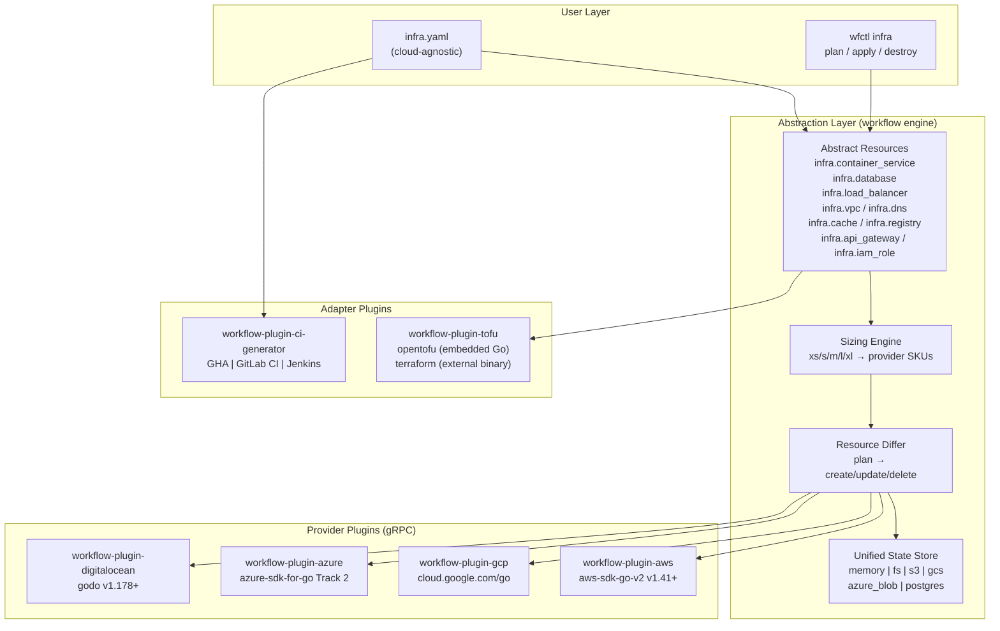

# Workflow IaC Strategy — Design Document

**Date:** 2026-03-21
**Status:** Approved
**Goal:** Replace/negate the need for Terraform and OpenTofu with direct API integration via workflow engine, while also supporting TF/Tofu as an adapter for teams that need it.

## Overview

Define application infrastructure in YAML using cloud-agnostic abstract resource types. Select the cloud provider at deploy time. Preview changes in CI (PR), apply on merge. Complete with state tracking, drift detection, and deployment orchestration (rolling, blue/green, canary).



## Key Design Decisions

1. **Crossplane-style YAML compositions** — abstract resource types map to provider-specific implementations via YAML config, not Go code
2. **All four providers simultaneously** — AWS, GCP, Azure, DO built in parallel to validate abstraction from day one
3. **OpenTofu/Terraform adapter** — generate HCL, execute (OpenTofu embedded as Go library, Terraform via external binary), state import/export
4. **CI generator as a plugin** — extensible to GHA, GitLab CI, Jenkins, CircleCI. Generated CI files delegate to `wfctl` so the CI platform is just a trigger shell
5. **5-tier sizing + resource hints** — xs/s/m/l/xl with optional cpu/memory overrides, provider maps to closest match
6. **Unified state store + provider adapters** — single state backend with TF/Tofu state import/export
7. **Deployment as pipeline steps** — step.deploy_rolling, step.deploy_blue_green, step.deploy_canary

## Abstract Resource Types

Each type maps to concrete cloud resources via provider compositions:

| Abstract Type | Description | AWS | GCP | Azure | DO |
|---|---|---|---|---|---|
| `infra.container_service` | Serverless containers | ECS Fargate | Cloud Run | ACI | App Platform |
| `infra.k8s_cluster` | Managed Kubernetes | EKS | GKE | AKS | DOKS |
| `infra.database` | Managed database | RDS | Cloud SQL | Azure DB | Managed DB |
| `infra.cache` | Managed cache | ElastiCache | Memorystore | Azure Cache | Managed Redis |
| `infra.vpc` | Virtual network | VPC + Subnets + IGW/NAT | VPC Network + Subnets | VNet + Subnets | VPC |
| `infra.load_balancer` | Load balancer | ALB/NLB | Cloud LB | Azure LB/AppGW | DO LB |
| `infra.dns` | DNS zone + records | Route 53 | Cloud DNS | Azure DNS | DO DNS |
| `infra.registry` | Container registry | ECR | Artifact Registry | ACR | DOCR |
| `infra.api_gateway` | API gateway | API Gateway v2 | Cloud Endpoints | APIM | App Platform routing |
| `infra.firewall` | Network security | Security Groups | Firewall Rules | NSGs | DO Firewall |
| `infra.iam_role` | Identity/access | IAM Role + Policy | Service Account | Managed Identity | API Token |
| `infra.storage` | Object storage | S3 | GCS | Blob Storage | Spaces |
| `infra.certificate` | TLS certificate | ACM | Managed SSL | App Service Cert | DO Cert |

## Example infra.yaml

```yaml
modules:
    - name: cloud
      type: iac.provider
      config:
        provider: aws          # swap to: gcp, azure, digitalocean
        region: us-east-1
        credentials:
            source: env        # env, file, instance_metadata, vault

    - name: state
      type: iac.state
      config:
        backend: s3
        bucket: my-infra-state
        prefix: prod/

    - name: network
      type: infra.vpc
      config:
        cidr: 10.0.0.0/16
        subnets:
            - name: public
              type: public
              cidrs: [10.0.1.0/24, 10.0.2.0/24]
            - name: private
              type: private
              cidrs: [10.0.10.0/24, 10.0.11.0/24]

    - name: db
      type: infra.database
      config:
        engine: postgres
        version: "16"
        size: m
        storage_gb: 100
        ha: true
        vpc: network

    - name: cache
      type: infra.cache
      config:
        engine: redis
        version: "7"
        size: s
        vpc: network

    - name: app
      type: infra.container_service
      config:
        image: myorg/myapp:latest
        registry: registry
        port: 8080
        size: m
        replicas: 3
        deployment:
            strategy: rolling
            max_surge: 1
            max_unavailable: 0
        vpc: network
        load_balancer:
            type: http
            health_check:
                path: /healthz
                interval: 10s

    - name: dns
      type: infra.dns
      config:
        zone: myapp.com
        records:
            - name: api
              type: A
              target: app       # resolves to container_service LB IP
```

## Sizing Engine

5-tier t-shirt sizing with optional resource hints:

| Size | vCPU | Memory | DB Storage | Cache Memory |
|---|---|---|---|---|
| xs | 0.25 | 512Mi | 10GB | 256Mi |
| s | 1 | 2Gi | 50GB | 1Gi |
| m | 2 | 4Gi | 100GB | 4Gi |
| l | 4 | 16Gi | 500GB | 16Gi |
| xl | 8 | 32Gi | 1TB | 64Gi |

Override with hints: `size: m` + `resources: { cpu: 3, memory: 8Gi }` → provider finds closest match ≥ specified.

Each provider plugin implements `ResolveSizing()` which maps abstract sizes to provider-specific SKUs (e.g., `m` database → AWS `db.r6g.large`, GCP `db-custom-2-8192`, Azure `GP_Gen5_2`, DO `db-s-2vcpu-4gb`).

## Provider Plugin Architecture

### IaCProvider Interface

```go
// workflow/interfaces/iac.go
type IaCProvider interface {
    Plan(ctx context.Context, desired []ResourceSpec, current *State) (*Plan, error)
    Apply(ctx context.Context, plan *Plan) (*ApplyResult, error)
    Destroy(ctx context.Context, resources []ResourceRef) (*DestroyResult, error)
    Status(ctx context.Context, resources []ResourceRef) ([]ResourceStatus, error)
    Import(ctx context.Context, cloudID string, resourceType string) (*ResourceState, error)
    ResolveSizing(resourceType string, size Size, hints *ResourceHints) (*ProviderSizing, error)
    DetectDrift(ctx context.Context, resources []ResourceRef) ([]DriftResult, error)
}

type ResourceSpec struct {
    Name         string
    Type         string            // infra.container_service, infra.database, etc.
    Config       map[string]any
    Size         Size
    Hints        *ResourceHints
    DependsOn    []string
}

type Size string
const (
    SizeXS Size = "xs"
    SizeS  Size = "s"
    SizeM  Size = "m"
    SizeL  Size = "l"
    SizeXL Size = "xl"
)

type ResourceHints struct {
    CPU     string // e.g., "2" or "500m"
    Memory  string // e.g., "4Gi"
    Storage string // e.g., "100Gi"
}
```

### Official Go SDKs (latest versions)

| Plugin | License | SDK | Module Path | Version |
|---|---|---|---|---|
| `workflow-plugin-aws` | MIT | AWS SDK for Go v2 | `github.com/aws/aws-sdk-go-v2` | v1.41.4+ |
| `workflow-plugin-gcp` | MIT | Google Cloud Go | `cloud.google.com/go` + `google.golang.org/api` | v0.272.0+ |
| `workflow-plugin-azure` | MIT | Azure SDK Track 2 | `github.com/Azure/azure-sdk-for-go/sdk` | azcore v1.21.0+ |
| `workflow-plugin-digitalocean` | MIT | godo | `github.com/digitalocean/godo` | v1.178.0+ |

### AWS SDK v2 Service Modules

```
github.com/aws/aws-sdk-go-v2/service/ec2          # VPC, Subnets, Security Groups
github.com/aws/aws-sdk-go-v2/service/ecs          # Fargate, Services, Task Defs
github.com/aws/aws-sdk-go-v2/service/eks          # EKS clusters
github.com/aws/aws-sdk-go-v2/service/rds          # RDS instances, Aurora
github.com/aws/aws-sdk-go-v2/service/elasticloadbalancingv2  # ALB, NLB
github.com/aws/aws-sdk-go-v2/service/elasticache  # Redis, Memcached
github.com/aws/aws-sdk-go-v2/service/ecr          # Container registry
github.com/aws/aws-sdk-go-v2/service/route53      # DNS
github.com/aws/aws-sdk-go-v2/service/apigatewayv2 # HTTP API, WebSocket
github.com/aws/aws-sdk-go-v2/service/iam          # Roles, Policies
github.com/aws/aws-sdk-go-v2/service/s3           # Object storage
github.com/aws/aws-sdk-go-v2/service/acm          # Certificates
```

### GCP Client Libraries

```
cloud.google.com/go/compute        # VMs, Networks, Firewalls, LBs
cloud.google.com/go/container      # GKE
cloud.google.com/go/run            # Cloud Run
cloud.google.com/go/redis          # Memorystore
cloud.google.com/go/artifactregistry  # Container/artifact registry
cloud.google.com/go/apigateway     # API Gateway
google.golang.org/api/sqladmin/v1  # Cloud SQL
google.golang.org/api/dns/v1       # Cloud DNS
google.golang.org/api/iam/v1       # IAM
```

### Azure SDK Track 2 Modules

```
github.com/Azure/azure-sdk-for-go/sdk/azidentity                         # Auth
github.com/Azure/azure-sdk-for-go/sdk/resourcemanager/network/armnetwork  # VNet, LB, NSG
github.com/Azure/azure-sdk-for-go/sdk/resourcemanager/containerinstance/armcontainerinstance  # ACI
github.com/Azure/azure-sdk-for-go/sdk/resourcemanager/containerservice/armcontainerservice    # AKS
github.com/Azure/azure-sdk-for-go/sdk/resourcemanager/sql/armsql          # Azure SQL
github.com/Azure/azure-sdk-for-go/sdk/resourcemanager/dns/armdns          # DNS
github.com/Azure/azure-sdk-for-go/sdk/resourcemanager/containerregistry/armcontainerregistry  # ACR
github.com/Azure/azure-sdk-for-go/sdk/resourcemanager/redis/armredis      # Redis Cache
```

### DigitalOcean (single SDK)

```
github.com/digitalocean/godo  # All resources: Droplets, Apps, Databases, VPCs, LBs, DNS, DOCR, Spaces, Firewalls, Certs
```

## OpenTofu/Terraform Adapter

### Capabilities

1. **Generate HCL** — convert `infra.yaml` → `.tf` files using `hclwrite` (github.com/hashicorp/hcl/v2 v2.24.0)
2. **Execute** — `step.tofu_plan` / `step.tofu_apply` embed OpenTofu as Go library (github.com/opentofu/opentofu v1.11.5)
3. **State import** — `step.tofu_state_import` reads `.tfstate` into workflow's unified state
4. **State export** — `step.tofu_state_export` writes workflow state to `.tfstate` format

OpenTofu is Go and can be embedded directly. Terraform (BSL-licensed) requires an external binary path.

### Step Types

```yaml
- name: generate
  type: step.iac_generate_hcl
  config:
    source: infra.yaml
    output_dir: ./terraform/
    format: hcl              # or: json

- name: plan
  type: step.tofu_plan
  config:
    working_dir: ./terraform/
    var_file: prod.tfvars

- name: apply
  type: step.tofu_apply
  config:
    plan_file: '{{ index .steps "plan" "plan_file" }}'

- name: import_state
  type: step.tofu_state_import
  config:
    state_file: ./terraform/terraform.tfstate
    target_store: state      # iac.state module name
```

## CI Generator Plugin

The CI generator is a plugin (`workflow-plugin-ci-generator`) that generates CI/CD config files for various platforms. The generated files delegate to `wfctl` so the CI platform is just a trigger/scheduler — workflow engine does the real work.

### Supported Platforms

| Platform | Config Format | Current Spec Version |
|---|---|---|
| GitHub Actions | `.github/workflows/*.yml` | Workflow syntax v2 (uses: actions/checkout@v4, setup-go@v5) |
| GitLab CI | `.gitlab-ci.yml` | GitLab CI/CD v17+ (rules: syntax, needs: for DAG) |
| Jenkins | `Jenkinsfile` | Declarative Pipeline (pipeline { agent { } stages { } }) |
| CircleCI | `.circleci/config.yml` | v2.1 (orbs, executors, workflows) |

### CLI

```bash
wfctl ci generate --platform github_actions --config infra.yaml --output .github/workflows/
wfctl ci generate --platform gitlab_ci --config infra.yaml --output .
```

### Generated Output Pattern (GHA example)

```yaml
# .github/workflows/infra.yml
name: Infrastructure
on:
  pull_request:
    paths: [infra.yaml, 'infra/**']
  push:
    branches: [main]
    paths: [infra.yaml, 'infra/**']
permissions:
  contents: read
  pull-requests: write
jobs:
  plan:
    if: github.event_name == 'pull_request'
    runs-on: [self-hosted, Linux, X64]
    steps:
      - uses: actions/checkout@v4
      - uses: GoCodeAlone/setup-wfctl@v1
      - run: wfctl infra plan -c infra.yaml --output plan.json
      - run: wfctl infra plan -c infra.yaml --format markdown > plan.md
      - uses: actions/github-script@v7
        with:
          script: |
            const fs = require('fs');
            const plan = fs.readFileSync('plan.md', 'utf8');
            github.rest.issues.createComment({
              issue_number: context.issue.number,
              owner: context.repo.owner,
              repo: context.repo.repo,
              body: `## Infrastructure Plan\n\n${plan}`
            });
  apply:
    if: github.event_name == 'push' && github.ref == 'refs/heads/main'
    runs-on: [self-hosted, Linux, X64]
    steps:
      - uses: actions/checkout@v4
      - uses: GoCodeAlone/setup-wfctl@v1
      - run: wfctl infra apply -c infra.yaml --auto-approve
```

## Deployment Pipeline Steps

```yaml
pipelines:
    deploy-app:
        trigger: { type: http, config: { path: /deploy, method: POST } }
        steps:
            - name: plan
              type: step.iac_plan
              config:
                config_file: infra.yaml

            - name: apply_infra
              type: step.iac_apply
              config:
                plan: '{{ index .steps "plan" "plan_id" }}'

            - name: build
              type: step.container_build
              config:
                dockerfile: Dockerfile
                registry: registry
                tag: '{{ .commit_sha }}'

            - name: deploy
              type: step.deploy_rolling
              config:
                service: app
                image: '{{ index .steps "build" "image" }}'
                max_surge: 1
                max_unavailable: 0
                health_check:
                    path: /healthz
                    interval: 5s
                    timeout: 30s
                rollback_on_failure: true

            - name: verify
              type: step.deploy_verify
              config:
                service: app
                checks:
                    - type: http
                      path: /healthz
                      expected_status: 200
                    - type: metrics
                      query: error_rate < 0.01
                      window: 5m
```

### Deployment Step Types

| Step | Description |
|---|---|
| `step.deploy_rolling` | Incremental pod/instance replacement with health checks |
| `step.deploy_blue_green` | Parallel environment, traffic cutover, old environment teardown |
| `step.deploy_canary` | Progressive traffic shift (1% → 10% → 50% → 100%) with metric gates |
| `step.deploy_verify` | Post-deploy health + metric verification |
| `step.deploy_rollback` | Revert to previous version |
| `step.container_build` | Build + push container image |

## State Management

### Unified State Store

All providers write to the same state store. Existing `iac.state` module extended with new backends:

| Backend | Implementation | Locking |
|---|---|---|
| memory | In-process map | sync.Mutex |
| filesystem | JSON files | File locks (flock) |
| s3 | AWS S3 / DO Spaces | S3 conditional writes (If-None-Match) |
| gcs | Google Cloud Storage | GCS generation-match |
| azure_blob | Azure Blob Storage | Blob leases |
| postgres | PostgreSQL | Advisory locks |

### State Schema

```go
type ResourceState struct {
    ID            string
    Name          string
    Type          string            // infra.container_service, etc.
    Provider      string            // aws, gcp, azure, digitalocean
    ProviderID    string            // cloud-side resource ID
    ConfigHash    string            // SHA-256 of applied config
    AppliedConfig map[string]any    // last-applied config
    Outputs       map[string]any    // cloud-side metadata (IPs, endpoints, etc.)
    Dependencies  []string          // resource names this depends on
    CreatedAt     time.Time
    UpdatedAt     time.Time
    LastDriftCheck time.Time
}
```

### State Adapters

- **TF/Tofu import**: Read `.tfstate` → convert resource entries to `ResourceState`
- **TF/Tofu export**: Write `ResourceState` → `.tfstate` format for migration
- **Pulumi import**: Read Pulumi checkpoint JSON → convert to `ResourceState`

## wfctl infra CLI

```bash
wfctl infra plan    -c infra.yaml                    # Preview changes
wfctl infra plan    -c infra.yaml --format markdown   # PR-friendly output
wfctl infra apply   -c infra.yaml --auto-approve      # Apply changes
wfctl infra destroy -c infra.yaml --auto-approve      # Tear down
wfctl infra status  -c infra.yaml                    # Current state
wfctl infra drift   -c infra.yaml                    # Detect drift
wfctl infra import  --provider aws --type infra.database --id db-abc123
wfctl infra state   list                              # List tracked resources
wfctl infra state   export --format tfstate > terraform.tfstate
wfctl infra state   import --from tfstate terraform.tfstate
```

## Implementation Phases

### Phase 1: Core Interfaces + Engine Changes
- Extract IaC interfaces to `workflow/interfaces/iac.go`
- Extend `iac.state` with S3 (conditional writes), GCS, Azure Blob, PostgreSQL backends
- Resource differ (plan computation from desired vs current state)
- Sizing engine (size → resource hints → provider query)
- `wfctl infra` CLI (plan/apply/destroy/status/drift/import)

### Phase 2: Four Provider Plugins (parallel)
- `workflow-plugin-aws` — all 13 resource types via aws-sdk-go-v2
- `workflow-plugin-gcp` — all 13 resource types via cloud.google.com/go
- `workflow-plugin-azure` — all 13 resource types via azure-sdk-for-go Track 2
- `workflow-plugin-digitalocean` — all 13 resource types via godo (extraction from engine branch)

### Phase 3: OpenTofu/Terraform Adapter
- `workflow-plugin-tofu` — HCL generation (hclwrite), embedded OpenTofu execution, TF external binary support
- State import/export adapters

### Phase 4: CI Generator + Deployment Steps
- `workflow-plugin-ci-generator` — GHA, GitLab CI, Jenkins, CircleCI generators
- Deployment step types (rolling, blue/green, canary, verify, rollback)

### Phase 5: Polish
- `GoCodeAlone/setup-wfctl` GHA action
- Registry manifests for all new plugins
- Scenario tests (workflow-scenarios)
- Documentation
