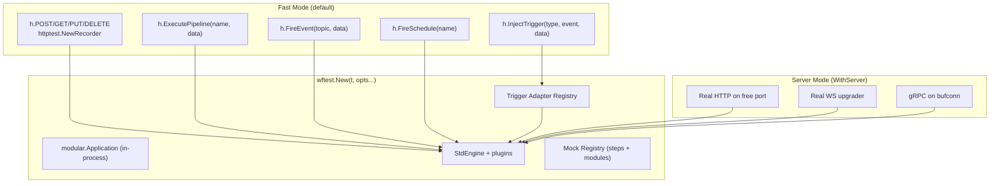

# Workflow Test Harness (`wftest`) — Design Document

**Date:** 2026-03-23
**Status:** Approved

## Overview

An integration test harness for the workflow engine that enables testing pipelines end-to-end without a full server build and deploy. Supports both Go-based tests and declarative YAML test files.

## Goals

1. Test pipeline behavior from trigger → steps → response without starting a real server
2. Support all built-in triggers (HTTP, Pipeline, EventBus, Scheduler) plus extensible external triggers
3. Allow mocking at both step and module levels
4. Support real plugin loading for full integration tests
5. Provide a YAML test file format for declarative testing alongside configs
6. Document patterns for Go-based and YAML-based testing

## Architecture



## Go API

### Harness Creation

```go
// Minimal — pipeline-only testing
h := wftest.New(t, wftest.WithConfig("config/app.yaml"))

// With mocks
h := wftest.New(t,
    wftest.WithConfig("config/app.yaml"),
    wftest.MockStep("step.db_query", func(ctx wftest.StepContext) map[string]any {
        return map[string]any{"rows": []any{}, "count": 0}
    }),
    wftest.MockModule("database", "db", &MockDB{...}),
)

// With real plugins
h := wftest.New(t,
    wftest.WithConfig("config/app.yaml"),
    wftest.WithPlugin(payments.New()),
    wftest.WithPlugin(auth.New()),
)

// With YAML inline config (no file needed)
h := wftest.New(t, wftest.WithYAML(`
pipelines:
  greet:
    steps:
      - name: set_greeting
        type: step.set
        config:
          values:
            message: "hello {{ .name }}"
`))

// Server mode for protocol-level tests
h := wftest.New(t,
    wftest.WithConfig("config/app.yaml"),
    wftest.WithServer(),  // starts real listeners
)
```

### Built-in Trigger Injection

```go
// HTTP (fast — httptest, no TCP)
result := h.POST("/api/v1/users", `{"email":"test@example.com"}`)
result := h.GET("/api/v1/users/123")
result := h.PUT("/api/v1/users/123", `{"name":"updated"}`)
result := h.DELETE("/api/v1/users/123")

// With headers
result := h.POST("/api/v1/users", body,
    wftest.Header("Authorization", "Bearer token123"),
    wftest.Header("Content-Type", "application/json"),
)

// Direct pipeline execution (no HTTP)
result := h.ExecutePipeline("process-order", map[string]any{
    "order_id": "123",
    "items": []string{"widget-a", "widget-b"},
})

// EventBus
result := h.FireEvent("user.created", map[string]any{
    "user_id": "123", "email": "test@example.com",
})

// Scheduler
result := h.FireSchedule("daily-cleanup")
```

### External Trigger Injection

```go
// Generic — plugin provides the adapter
result := h.InjectTrigger("websocket", "message", map[string]any{
    "room": "lobby", "text": "hello",
})

// Plugin registers adapter during test setup
wftest.RegisterTriggerAdapter("websocket", wsPlugin.TestAdapter())
wftest.RegisterTriggerAdapter("grpc", grpcPlugin.TestAdapter())
```

### Result Inspection

```go
// HTTP result
result.StatusCode            // int
result.Body                  // []byte
result.JSON()                // map[string]any (parsed body)
result.Header(key)           // string

// Pipeline/step results
result.Output                // map[string]any (final pipeline output)
result.StepOutput("name")    // map[string]any (specific step's output)
result.StepOutputs()         // map[string]map[string]any (all steps)
result.StepExecuted("name")  // bool
result.StepCount()           // int
result.Error                 // error (if pipeline failed)
result.Duration              // time.Duration

// Server mode clients
h.BaseURL()                  // string (e.g., "http://localhost:54321")
h.WSDialer(path)             // *websocket.Conn
h.GRPCConn()                 // *grpc.ClientConn (bufconn)
```

### Step-Level Mocks

```go
// Static return value
wftest.MockStep("step.db_query", wftest.Returns(map[string]any{
    "rows": []any{map[string]any{"id": 1, "email": "test@example.com"}},
    "count": 1,
}))

// Dynamic based on input
wftest.MockStep("step.db_query", func(ctx wftest.StepContext) map[string]any {
    query := ctx.Config["query"].(string)
    if strings.Contains(query, "INSERT") {
        return map[string]any{"rows_affected": 1}
    }
    return map[string]any{"rows": []any{}, "count": 0}
})

// Record calls for later assertion
recorder := wftest.RecordStep("step.bmw.send_email")
// ... run pipeline ...
calls := recorder.Calls()  // []StepCall with config + input for each invocation
```

### Module-Level Mocks

```go
// Replace a module with a mock implementation
wftest.MockModule("database", "db", &wftest.MemoryDB{
    Tables: map[string][]map[string]any{
        "users": {
            {"id": 1, "email": "existing@example.com"},
        },
    },
})

// Mock a cache module
wftest.MockModule("cache", "app-cache", &wftest.MemoryCache{})
```

## YAML Test File Format

### Structure

```yaml
# app_test.yaml — separate file from app.yaml
config: app.yaml  # path to the workflow config being tested

# Global mocks (apply to all tests in this file)
mocks:
  steps:
    step.db_query:
      default: { rows: [], count: 0 }
      when:
        - config_contains: "INSERT INTO users"
          return: { rows_affected: 1 }
        - config_contains: "SELECT * FROM users WHERE email"
          return: { rows: [{ id: 1, email: "test@example.com" }], count: 1 }
    step.bmw.send_email:
      default: { sent: true, message_id: "mock-123" }
  modules:
    database:
      db: { type: memory }
    cache:
      app-cache: { type: memory }

# Test cases
tests:
  test_user_registration:
    description: "New user registration creates account and sends welcome email"
    trigger:
      type: http
      method: POST
      path: /api/v1/users
      headers:
        Content-Type: application/json
      body:
        email: newuser@example.com
        password: secret123
        name: Test User
    assertions:
      - step: validate_input
        output:
          valid: true
      - step: check_existing
        output:
          count: 0
      - step: insert_user
        output:
          rows_affected: 1
      - step: send_welcome
        executed: true
      - response:
          status: 201
          body:
            success: true
            message: "account created"

  test_duplicate_email:
    description: "Registration with existing email returns 409"
    trigger:
      type: http
      method: POST
      path: /api/v1/users
      body:
        email: existing@example.com
    mocks:  # per-test mock override
      steps:
        step.db_query:
          when:
            - config_contains: "SELECT"
              return: { rows: [{ id: 1 }], count: 1 }
    assertions:
      - response:
          status: 409

  test_partial_execution:
    description: "Validate input only — stop before DB operations"
    trigger:
      type: http
      method: POST
      path: /api/v1/users
      body: { email: "" }
    stop_after: validate_input
    assertions:
      - step: validate_input
        output:
          valid: false
          error: "email is required"
      - step: insert_user
        executed: false  # should NOT have run

  test_event_driven:
    description: "User created event triggers welcome flow"
    trigger:
      type: eventbus
      topic: user.created
      data:
        user_id: "123"
        email: newuser@example.com
    assertions:
      - step: send_welcome
        output:
          sent: true

  test_websocket_message:
    description: "WS message triggers broadcast pipeline"
    trigger:
      type: websocket
      event: message
      data:
        room: lobby
        text: hello world
    assertions:
      - step: broadcast
        output:
          sent: true

  test_scheduled_cleanup:
    trigger:
      type: scheduler
      name: daily-cleanup
    assertions:
      - step: delete_expired
        output:
          deleted_count: 5
```

### Assertion Types

```yaml
assertions:
  # Assert step output fields
  - step: step_name
    output:
      field: expected_value
      nested.field: expected_value  # dot-path access

  # Assert step was/wasn't executed
  - step: step_name
    executed: true  # or false

  # Assert HTTP response
  - response:
      status: 200
      headers:
        Content-Type: application/json
      body:
        key: value
      body_contains: "substring"

  # Assert pipeline output (final result)
  - output:
      key: value
```

### Running YAML Tests

```go
// In a Go test file
func TestPipelines(t *testing.T) {
    wftest.RunYAMLTests(t, "config/app_test.yaml")
}

// Auto-discover all *_test.yaml
func TestAll(t *testing.T) {
    wftest.RunAllYAMLTests(t, "config/")
}
```

```bash
# Via CLI
wfctl test config/app_test.yaml
wfctl test config/                 # all *_test.yaml in directory
wfctl test --verbose config/       # show step-by-step execution
```

## External Trigger Adapter Interface

For plugins that provide custom trigger types (WebSocket, gRPC, etc.):

```go
// In wftest package
type TriggerAdapter interface {
    // Name returns the trigger type name (e.g., "websocket", "grpc")
    Name() string

    // Inject fires the trigger with the given event and data,
    // returning the pipeline execution result.
    Inject(h *Harness, event string, data map[string]any) (*Result, error)
}

// Plugins register adapters
func RegisterTriggerAdapter(adapter TriggerAdapter)
```

Example plugin adapter:
```go
// In workflow-plugin-websocket/testing/adapter.go
type WSTestAdapter struct{}

func (a *WSTestAdapter) Name() string { return "websocket" }

func (a *WSTestAdapter) Inject(h *wftest.Harness, event string, data map[string]any) (*wftest.Result, error) {
    // Find the WS trigger registered in the engine
    trigger := h.Engine().GetTrigger("websocket")
    if trigger == nil {
        return nil, fmt.Errorf("websocket trigger not registered")
    }
    // Inject the message as if it came from a real WS connection
    return trigger.HandleTestEvent(event, data)
}
```

## Documentation Plan

### `docs/testing.md` — Testing Guide

1. **Quick Start** — minimal pipeline test in 10 lines of Go
2. **Go-Based Testing**
   - Creating a harness
   - HTTP pipeline testing
   - Direct pipeline execution
   - Step and module mocking
   - Server mode for protocol tests
   - External plugin testing
3. **YAML-Based Testing**
   - File format reference
   - Mock definitions
   - Assertion types
   - Running tests (Go integration + CLI)
4. **Patterns**
   - Testing auth pipelines (mock JWT validation)
   - Testing DB pipelines (mock step.db_query)
   - Testing external plugin steps (mock step factories)
   - Testing event-driven workflows
   - Partial pipeline testing (stop_after)
5. **Plugin Authors: Making Your Triggers Testable**
   - Implementing TriggerAdapter
   - Exposing test helpers

## Implementation Phases

### Phase 1: Core Harness + HTTP
- `wftest` package with New, WithConfig, WithYAML
- HTTP injection (POST/GET/PUT/DELETE via httptest)
- ExecutePipeline direct execution
- Result struct with StepOutput, StepOutputs, StepExecuted
- MockStep, MockModule
- Basic tests

### Phase 2: All Triggers + YAML Runner
- EventBus injection (FireEvent)
- Scheduler injection (FireSchedule)
- External trigger adapter interface
- YAML test file parser + runner
- wftest.RunYAMLTests integration
- stop_after support

### Phase 3: Server Mode + Plugin Loading
- WithServer() for real TCP/WS/gRPC listeners
- WithPlugin() for real external plugin loading
- Server mode clients (BaseURL, WSDialer, GRPCConn)
- wfctl test CLI command

### Phase 4: Documentation + Plugin Updates
- docs/testing.md comprehensive guide
- Update WS plugin with TriggerAdapter
- Update gRPC plugin with TriggerAdapter
- Example tests in workflow-scenarios using wftest
