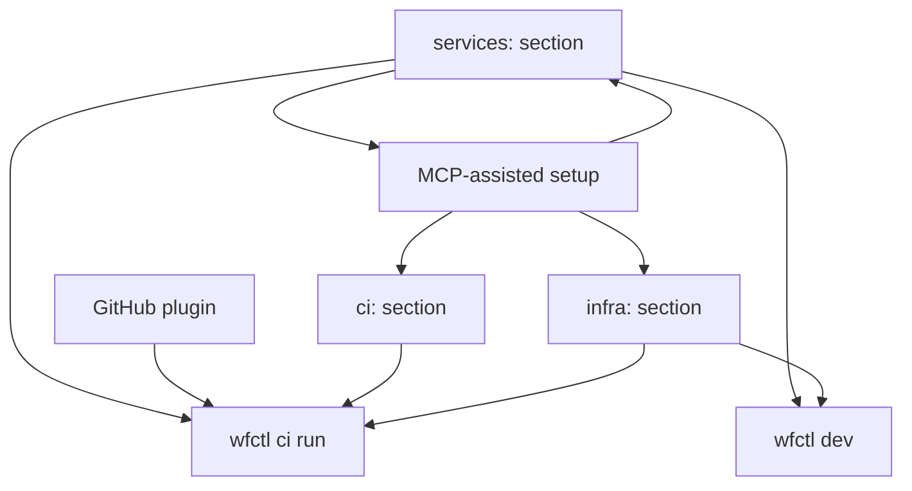

# Platform Vision: GitHub Integration, Universal CI, Multi-Service Architecture

**Date:** 2026-03-28
**Status:** Draft
**Scope:** workflow engine, wfctl CLI, workflow-plugin-github, MCP server

## Overview

Five interconnected features that transform the workflow engine from "config-driven application framework" into a "full-lifecycle platform for building, deploying, and operating multi-service applications."



## Feature 1: Rich GitHub Plugin

### Goal
Expand workflow-plugin-github from 3 steps + 1 module to comprehensive GitHub API coverage.

### Implementation
- Replace custom HTTP client with `google/go-github/v69` SDK
- Add GitHub App authentication (installation tokens, not just PATs)

### New Step Types

| Step | Purpose |
|------|---------|
| `step.gh_pr_create` | Create a pull request |
| `step.gh_pr_merge` | Merge a pull request |
| `step.gh_pr_review` | Request/submit PR review |
| `step.gh_pr_comment` | Comment on a PR |
| `step.gh_issue_create` | Create an issue |
| `step.gh_issue_close` | Close an issue |
| `step.gh_issue_label` | Add/remove labels |
| `step.gh_release_create` | Create a GitHub release |
| `step.gh_release_upload` | Upload release assets |
| `step.gh_repo_dispatch` | Trigger repository_dispatch event |
| `step.gh_deployment_create` | Create a deployment + deployment status |
| `step.gh_secret_set` | Set a repository/org secret (encrypted) |
| `step.gh_graphql` | Execute arbitrary GraphQL queries |

### New Module Types

| Module | Purpose |
|--------|---------|
| `github.app` | GitHub App authentication — manages installation tokens, auto-refreshes |
| `github.webhook` | Enhanced webhook receiver — validates signatures, routes by event type |

## Feature 2: MCP-Assisted Setup

### Goal
Leverage the existing wfctl MCP server so users' AI assistants (Claude Code, Cursor, etc.) can interactively configure their workflow YAML — CI steps, infra, secrets, deployment targets, service topology.

### How It Works
The wfctl MCP server already exposes tools like `list_module_types`, `list_step_types`, `validate_config`, `get_module_schema`. We extend it with:

### New MCP Tools

| Tool | Purpose |
|------|---------|
| `mcp.scaffold_ci` | Given app description, generate ci: section with build/test/deploy steps |
| `mcp.scaffold_infra` | Given infrastructure needs (DB type, cache, queue), generate infra: section |
| `mcp.scaffold_service` | Given service description, generate a service definition with modules + pipelines |
| `mcp.add_secret_config` | Configure secret management for a specific provider (Vault, AWS SM, env) |
| `mcp.add_deployment_target` | Add a deployment environment (staging, production) with provider config |
| `mcp.detect_infra_needs` | Analyze existing modules → suggest what infra is needed |
| `mcp.validate_service_topology` | Check that inter-service communication paths are valid |

### MCP Instructions
The MCP server provides a `workflow://docs/setup-guide` resource that AI assistants read. It contains:
- Step-by-step instructions for configuring a workflow app
- Decision trees: "If user needs a database, ask which provider → suggest module config"
- Common patterns: "API + worker + scheduler" → standard service topology
- Secret management best practices per provider
- Environment promotion patterns (dev → staging → prod)

### User Experience
```
User → Claude Code: "Set up CI/CD for my Go app that uses PostgreSQL and deploys to AWS"
Claude Code → reads workflow://docs/setup-guide
Claude Code → calls mcp.detect_infra_needs (scans existing config)
Claude Code → calls mcp.scaffold_ci (generates ci: section)
Claude Code → calls mcp.scaffold_infra (generates infra: section for AWS + RDS)
Claude Code → asks user: "Where should Docker images be pushed? ECR or GitHub Packages?"
Claude Code → calls mcp.add_deployment_target (adds AWS ECS deployment)
Claude Code → calls mcp.add_secret_config (configures AWS Secrets Manager)
Claude Code → calls mcp.validate_service_topology
Claude Code → presents the generated YAML for user approval
```

### Bubbletea TUI Fallback
For users without AI assistants, `wfctl init --wizard` provides a rich Bubbletea TUI that walks through the same decision tree manually. The TUI reuses the same logic as the MCP tools.

## Feature 3: `wfctl ci run` — Universal CI Runner

### Goal
A single command that reads the workflow config's `ci:` section and handles the entire build-test-deploy lifecycle. CI platform YAML becomes a thin, unchanging bootstrap.

### YAML Schema

```yaml
ci:
  # Build phase — what artifacts to produce
  build:
    binaries:
      - name: server
        path: ./cmd/server
        os: [linux]
        arch: [amd64, arm64]
        ldflags: "-s -w -X main.version=${VERSION}"
    containers:
      - name: api
        dockerfile: Dockerfile
        registry: ${CONTAINER_REGISTRY}
        tag: ${VERSION}
    assets:
      - name: ui
        build: npm run build
        path: ui/dist

  # Test phase — what to validate
  test:
    unit:
      command: go test ./... -race
      coverage: true
    integration:
      command: go test ./tests/integration/ -tags=integration
      needs: [postgres, redis]  # ephemeral deps spun up for testing
    e2e:
      command: npx playwright test
      needs: [server]  # start the server for E2E

  # Deploy phase — per-environment deployment
  deploy:
    environments:
      staging:
        provider: aws-ecs  # or kubernetes, digitalocean, etc.
        cluster: staging-cluster
        pre_deploy:
          - step.iac_plan
          - step.iac_apply
        strategy: rolling
        health_check:
          path: /healthz
          timeout: 30s
      production:
        provider: aws-ecs
        cluster: prod-cluster
        requires_approval: true
        strategy: blue-green
        health_check:
          path: /healthz
          timeout: 60s

  # Infrastructure — what this app needs to run
  infra:
    provision: true  # false = "infra already exists, just deploy"
    state_backend: s3
    resources:
      - type: database.postgres
        name: app-db
        config:
          instance_class: db.t3.medium
          storage: 50
      - type: cache.redis
        name: app-cache
      - type: messaging.nats
        name: app-nats

  # Secrets — where secrets come from and how they're managed
  secrets:
    provider: aws-secrets-manager
    rotation:
      enabled: true
      interval: 30d
    mappings:
      DATABASE_URL: app-db-connection-string
      REDIS_URL: app-cache-url
      STRIPE_KEY: stripe-api-key
```

### Bootstrap YAML (generated once by `wfctl ci init`)

```yaml
# .github/workflows/ci.yml — generated by wfctl, never manually edited
name: CI/CD
on:
  push:
    branches: [main]
  pull_request:
    branches: [main]

jobs:
  build-test:
    runs-on: ubuntu-latest
    steps:
      - uses: actions/checkout@v4
      - uses: GoCodeAlone/setup-wfctl@v1
      - run: wfctl ci run --phase build,test
        env:
          GITHUB_TOKEN: ${{ secrets.GITHUB_TOKEN }}

  deploy-staging:
    needs: build-test
    if: github.ref == 'refs/heads/main'
    runs-on: ubuntu-latest
    environment: staging
    steps:
      - uses: actions/checkout@v4
      - uses: GoCodeAlone/setup-wfctl@v1
      - run: wfctl ci run --phase deploy --env staging
        env:
          AWS_ACCESS_KEY_ID: ${{ secrets.AWS_ACCESS_KEY_ID }}
          AWS_SECRET_ACCESS_KEY: ${{ secrets.AWS_SECRET_ACCESS_KEY }}

  deploy-production:
    needs: deploy-staging
    if: github.ref == 'refs/heads/main'
    runs-on: ubuntu-latest
    environment: production
    steps:
      - uses: actions/checkout@v4
      - uses: GoCodeAlone/setup-wfctl@v1
      - run: wfctl ci run --phase deploy --env production
        env:
          AWS_ACCESS_KEY_ID: ${{ secrets.AWS_ACCESS_KEY_ID }}
          AWS_SECRET_ACCESS_KEY: ${{ secrets.AWS_SECRET_ACCESS_KEY }}
```

### What `wfctl ci run` Does

```
wfctl ci run --phase build,test
  1. Parse workflow config → extract ci: section
  2. Build phase:
     - Compile binaries (cross-platform if specified)
     - Build container images
     - Build frontend assets
  3. Test phase:
     - Spin up ephemeral dependencies (postgres, redis for integration tests)
     - Run unit tests
     - Run integration tests
     - Run E2E tests
     - Tear down ephemeral deps
  4. Report results (GitHub Check Run if token available)

wfctl ci run --phase deploy --env staging
  1. Parse workflow config → extract ci.deploy.environments.staging
  2. If ci.infra.provision == true:
     - Run IaC plan → apply for this environment
     - Track state in configured backend
  3. Fetch/inject secrets from configured provider
  4. Deploy using configured strategy (rolling/blue-green/canary)
  5. Run health checks
  6. Report deployment status (GitHub Deployment if token available)
```

## Feature 4: Multi-Service Architecture (services: section)

### Goal
A single workflow repo can define multiple services with explicit boundaries, inter-service communication, and independent scaling.

### YAML Schema

```yaml
# Top-level: defines the entire application as a set of services
services:
  gameserver:
    description: "Multiplayer game server — horizontally scalable"
    binary: ./cmd/gameserver
    scaling:
      min: 2
      max: 20
      metric: connections_per_instance
      target: 100
    modules:
      - name: game-engine
        type: gameserver.engine
        config: { ... }
      - name: ws-server
        type: websocket.server
        config: { port: 9090 }
    pipelines:
      game-loop: { ... }
    expose:
      - port: 9090
        protocol: websocket

  control-plane-api:
    description: "Control plane REST API"
    binary: ./cmd/control-api
    scaling:
      replicas: 1
    modules:
      - name: http-server
        type: http.server
        config: { address: ":8080" }
      - name: router
        type: http.router
      - name: db
        type: database.postgres
    expose:
      - port: 8080
        protocol: http

  control-plane-worker:
    description: "Background job processor"
    binary: ./cmd/worker
    scaling:
      replicas: 3
    modules:
      - name: nats-sub
        type: messaging.nats
        config: { subjects: ["jobs.*"] }
    pipelines:
      process-job: { ... }

  control-plane-scheduler:
    description: "Cron-based task scheduler"
    binary: ./cmd/scheduler
    scaling:
      replicas: 1
    modules:
      - name: scheduler
        type: scheduler.modular
        config: { ... }

# Inter-service communication
mesh:
  transport: nats
  discovery: kubernetes  # kubernetes | consul | static | dns
  nats:
    url: nats://nats:4222
    cluster_id: app-cluster

  # Declared communication paths (used for validation + network policy generation)
  routes:
    - from: control-plane-api
      to: control-plane-worker
      via: nats
      subject: "jobs.process"
    - from: control-plane-scheduler
      to: control-plane-worker
      via: nats
      subject: "jobs.scheduled"
    - from: gameserver
      to: control-plane-api
      via: http
      endpoint: /api/v1/game-events

# Shared infrastructure (all services use these)
infrastructure:
  nats:
    type: messaging.nats
    config:
      url: nats://nats:4222
  postgres:
    type: database.postgres
    config:
      dsn: ${DATABASE_URL}
```

### Service Boundaries
- Each `services.<name>` compiles to a **separate binary**
- Services can reference shared `infrastructure:` modules by name
- The `mesh.routes` section declares how services communicate — used for:
  - Validation ("service A sends to subject X, does service B subscribe to X?")
  - Network policy generation (Kubernetes NetworkPolicy, security groups)
  - Service mesh configuration (Istio, Linkerd)
  - Local development wiring

### Relationship to Existing Config
- A service's `modules:` + `pipelines:` + `workflows:` sections work exactly like the existing single-service config
- `services:` is a new top-level key that wraps multiple service configs
- Existing single-service configs (no `services:` key) continue to work as-is
- `wfctl validate` understands both single-service and multi-service configs

## Feature 5: `wfctl dev` — Local Development Cluster

### Goal
One command to run the full multi-service application locally for development.

### How It Works

```bash
wfctl dev up                    # Start all services
wfctl dev up --service api      # Start only the API service + its deps
wfctl dev down                  # Stop everything
wfctl dev logs                  # Tail all service logs
wfctl dev logs --service worker # Tail one service
wfctl dev status                # Show service health
wfctl dev restart api           # Restart one service
```

### Implementation

`wfctl dev up` reads the workflow config and:

1. **Infrastructure layer**: Starts shared deps (NATS, Postgres, Redis) via Docker containers
2. **Service layer**: For each service, either:
   - **Docker mode** (default): Builds and runs container images
   - **Process mode** (`--local`): Compiles Go binaries and runs them as local processes
   - **Minikube mode** (`--k8s`): Deploys to local minikube cluster using the same manifests CI would use
3. **Mesh layer**: Configures inter-service communication (NATS subjects, HTTP endpoints, port-forwards)
4. **Dev tools**: Sets up hot-reload (watches Go files, rebuilds on change), log aggregation, health dashboard

### Docker Compose Generation
For simple cases, `wfctl dev` generates a `docker-compose.dev.yml` under the hood:

```yaml
# Auto-generated by wfctl dev — DO NOT EDIT
services:
  nats:
    image: nats:latest
    ports: ["4222:4222"]
  postgres:
    image: postgres:16
    environment:
      POSTGRES_DB: app
    ports: ["5432:5432"]
  gameserver:
    build: { context: ., dockerfile: Dockerfile, target: gameserver }
    depends_on: [nats, postgres]
    ports: ["9090:9090"]
  control-plane-api:
    build: { context: ., dockerfile: Dockerfile, target: control-api }
    depends_on: [nats, postgres]
    ports: ["8080:8080"]
  control-plane-worker:
    build: { context: ., dockerfile: Dockerfile, target: worker }
    depends_on: [nats]
  control-plane-scheduler:
    build: { context: ., dockerfile: Dockerfile, target: scheduler }
    depends_on: [nats]
```

## Dogfooding Plan

Use these features to manage GoCodeAlone's own repos:

### Phase 1: workflow repo itself
- Add `ci:` section to workflow's own config
- Replace the current `release.yml` (200+ lines of GitHub Actions YAML) with `wfctl ci run`
- Use `step.gh_release_create` + `step.gh_repo_dispatch` instead of third-party actions

### Phase 2: Multi-service apps (ratchet, buymywishlist)
- Add `services:` section to ratchet-cli (daemon + CLI + gRPC)
- Add `services:` section to buymywishlist (API server + BMW plugin)
- Use `wfctl dev up` for local development

### Phase 3: Full IaC lifecycle
- Add `ci.infra` sections for apps deployed to AWS (buymywishlist, workflow-cloud)
- Use `wfctl ci run --phase deploy --env production` for real deployments
- Replace manual minikube deployments with `wfctl dev up --k8s`

## Implementation Order

1. **GitHub plugin expansion** (1-2 days) — go-github SDK, 15 new steps
2. **ci: section schema + wfctl ci run** (3-5 days) — build/test phases first, deploy later
3. **MCP setup tools** (2-3 days) — scaffold_ci, scaffold_infra, scaffold_service
4. **services: section schema** (3-5 days) — multi-service config parsing, validation
5. **wfctl dev up** (3-5 days) — docker-compose generation, process mode
6. **wfctl ci run deploy phase** (5-7 days) — IaC integration, secret injection, deployment strategies
7. **Bubbletea TUI wizard** (2-3 days) — wraps MCP tool logic in interactive TUI
8. **Dogfooding** (ongoing) — apply to GoCodeAlone repos incrementally
