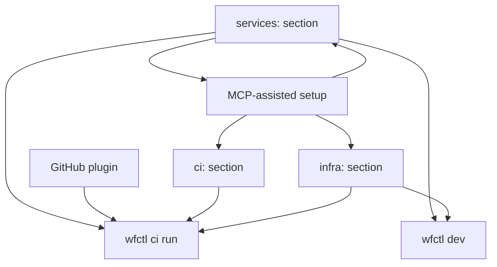

# Platform Vision: GitHub Integration, Universal CI, Multi-Service Architecture

**Date:** 2026-03-28
**Status:** Draft
**Scope:** workflow engine, wfctl CLI, workflow-plugin-github, MCP server

## Overview

Five interconnected features that transform the workflow engine from "config-driven application framework" into a "full-lifecycle platform for building, deploying, and operating multi-service applications."



## Feature 1: Rich GitHub Plugin

### Goal
Expand workflow-plugin-github from 3 steps + 1 module to comprehensive GitHub API coverage.

### Implementation
- Replace custom HTTP client with `google/go-github/v69` SDK
- Add GitHub App authentication (installation tokens, not just PATs)

### New Step Types

| Step | Purpose |
|------|---------|
| `step.gh_pr_create` | Create a pull request |
| `step.gh_pr_merge` | Merge a pull request |
| `step.gh_pr_review` | Request/submit PR review |
| `step.gh_pr_comment` | Comment on a PR |
| `step.gh_issue_create` | Create an issue |
| `step.gh_issue_close` | Close an issue |
| `step.gh_issue_label` | Add/remove labels |
| `step.gh_release_create` | Create a GitHub release |
| `step.gh_release_upload` | Upload release assets |
| `step.gh_repo_dispatch` | Trigger repository_dispatch event |
| `step.gh_deployment_create` | Create a deployment + deployment status |
| `step.gh_secret_set` | Set a repository/org secret (encrypted) |
| `step.gh_graphql` | Execute arbitrary GraphQL queries |

### New Module Types

| Module | Purpose |
|--------|---------|
| `github.app` | GitHub App authentication — manages installation tokens, auto-refreshes |
| `github.webhook` | Enhanced webhook receiver — validates signatures, routes by event type |

## Feature 2: MCP-Assisted Setup

### Goal
Leverage the existing wfctl MCP server so users' AI assistants (Claude Code, Cursor, etc.) can interactively configure their workflow YAML — CI steps, infra, secrets, deployment targets, service topology.

### How It Works
The wfctl MCP server already exposes tools like `list_module_types`, `list_step_types`, `validate_config`, `get_module_schema`. We extend it with:

### New MCP Tools

| Tool | Purpose |
|------|---------|
| `mcp.scaffold_ci` | Given app description, generate ci: section with build/test/deploy steps |
| `mcp.scaffold_infra` | Given infrastructure needs (DB type, cache, queue), generate infra: section |
| `mcp.scaffold_service` | Given service description, generate a service definition with modules + pipelines |
| `mcp.add_secret_config` | Configure secret management for a specific provider (Vault, AWS SM, env) |
| `mcp.add_deployment_target` | Add a deployment environment (staging, production) with provider config |
| `mcp.detect_infra_needs` | Analyze existing modules → suggest what infra is needed |
| `mcp.validate_service_topology` | Check that inter-service communication paths are valid |

### MCP Instructions
The MCP server provides a `workflow://docs/setup-guide` resource that AI assistants read. It contains:
- Step-by-step instructions for configuring a workflow app
- Decision trees: "If user needs a database, ask which provider → suggest module config"
- Common patterns: "API + worker + scheduler" → standard service topology
- Secret management best practices per provider
- Environment promotion patterns (dev → staging → prod)

### User Experience
```
User → Claude Code: "Set up CI/CD for my Go app that uses PostgreSQL and deploys to AWS"
Claude Code → reads workflow://docs/setup-guide
Claude Code → calls mcp.detect_infra_needs (scans existing config)
Claude Code → calls mcp.scaffold_ci (generates ci: section)
Claude Code → calls mcp.scaffold_infra (generates infra: section for AWS + RDS)
Claude Code → asks user: "Where should Docker images be pushed? ECR or GitHub Packages?"
Claude Code → calls mcp.add_deployment_target (adds AWS ECS deployment)
Claude Code → calls mcp.add_secret_config (configures AWS Secrets Manager)
Claude Code → calls mcp.validate_service_topology
Claude Code → presents the generated YAML for user approval
```

### Bubbletea TUI Fallback
For users without AI assistants, `wfctl init --wizard` provides a rich Bubbletea TUI that walks through the same decision tree manually. The TUI reuses the same logic as the MCP tools.

## Feature 3: `wfctl ci run` — Universal CI Runner

### Goal
A single command that reads the workflow config's `ci:` section and handles the entire build-test-deploy lifecycle. CI platform YAML becomes a thin, unchanging bootstrap.

### YAML Schema

```yaml
ci:
  # Build phase — what artifacts to produce
  build:
    binaries:
      - name: server
        path: ./cmd/server
        os: [linux]
        arch: [amd64, arm64]
        ldflags: "-s -w -X main.version=${VERSION}"
    containers:
      - name: api
        dockerfile: Dockerfile
        registry: ${CONTAINER_REGISTRY}
        tag: ${VERSION}
    assets:
      - name: ui
        build: npm run build
        path: ui/dist

  # Test phase — what to validate
  test:
    unit:
      command: go test ./... -race
      coverage: true
    integration:
      command: go test ./tests/integration/ -tags=integration
      needs: [postgres, redis]  # ephemeral deps spun up for testing
    e2e:
      command: npx playwright test
      needs: [server]  # start the server for E2E

  # Deploy phase — per-environment deployment
  deploy:
    environments:
      staging:
        provider: aws-ecs  # or kubernetes, digitalocean, etc.
        cluster: staging-cluster
        pre_deploy:
          - step.iac_plan
          - step.iac_apply
        strategy: rolling
        health_check:
          path: /healthz
          timeout: 30s
      production:
        provider: aws-ecs
        cluster: prod-cluster
        requires_approval: true
        strategy: blue-green
        health_check:
          path: /healthz
          timeout: 60s

  # Infrastructure — what this app needs to run
  infra:
    provision: true  # false = "infra already exists, just deploy"
    state_backend: s3
    resources:
      - type: database.postgres
        name: app-db
        config:
          instance_class: db.t3.medium
          storage: 50
      - type: cache.redis
        name: app-cache
      - type: messaging.nats
        name: app-nats

  # Secrets — where secrets come from and how they're managed
  secrets:
    provider: aws-secrets-manager
    rotation:
      enabled: true
      interval: 30d
    mappings:
      DATABASE_URL: app-db-connection-string
      REDIS_URL: app-cache-url
      STRIPE_KEY: stripe-api-key
```

### Bootstrap YAML (generated once by `wfctl ci init`)

```yaml
# .github/workflows/ci.yml — generated by wfctl, never manually edited
name: CI/CD
on:
  push:
    branches: [main]
  pull_request:
    branches: [main]

jobs:
  build-test:
    runs-on: ubuntu-latest
    steps:
      - uses: actions/checkout@v4
      - uses: GoCodeAlone/setup-wfctl@v1
      - run: wfctl ci run --phase build,test
        env:
          GITHUB_TOKEN: ${{ secrets.GITHUB_TOKEN }}

  deploy-staging:
    needs: build-test
    if: github.ref == 'refs/heads/main'
    runs-on: ubuntu-latest
    environment: staging
    steps:
      - uses: actions/checkout@v4
      - uses: GoCodeAlone/setup-wfctl@v1
      - run: wfctl ci run --phase deploy --env staging
        env:
          AWS_ACCESS_KEY_ID: ${{ secrets.AWS_ACCESS_KEY_ID }}
          AWS_SECRET_ACCESS_KEY: ${{ secrets.AWS_SECRET_ACCESS_KEY }}

  deploy-production:
    needs: deploy-staging
    if: github.ref == 'refs/heads/main'
    runs-on: ubuntu-latest
    environment: production
    steps:
      - uses: actions/checkout@v4
      - uses: GoCodeAlone/setup-wfctl@v1
      - run: wfctl ci run --phase deploy --env production
        env:
          AWS_ACCESS_KEY_ID: ${{ secrets.AWS_ACCESS_KEY_ID }}
          AWS_SECRET_ACCESS_KEY: ${{ secrets.AWS_SECRET_ACCESS_KEY }}
```

### What `wfctl ci run` Does

```
wfctl ci run --phase build,test
  1. Parse workflow config → extract ci: section
  2. Build phase:
     - Compile binaries (cross-platform if specified)
     - Build container images
     - Build frontend assets
  3. Test phase:
     - Spin up ephemeral dependencies (postgres, redis for integration tests)
     - Run unit tests
     - Run integration tests
     - Run E2E tests
     - Tear down ephemeral deps
  4. Report results (GitHub Check Run if token available)

wfctl ci run --phase deploy --env staging
  1. Parse workflow config → extract ci.deploy.environments.staging
  2. If ci.infra.provision == true:
     - Run IaC plan → apply for this environment
     - Track state in configured backend
  3. Fetch/inject secrets from configured provider
  4. Deploy using configured strategy (rolling/blue-green/canary)
  5. Run health checks
  6. Report deployment status (GitHub Deployment if token available)
```

## Feature 4: Multi-Service Architecture (services: section)

### Goal
A single workflow repo can define multiple services with explicit boundaries, inter-service communication, and independent scaling.

### YAML Schema

```yaml
# Top-level: defines the entire application as a set of services
services:
  gameserver:
    description: "Multiplayer game server — horizontally scalable"
    binary: ./cmd/gameserver
    scaling:
      min: 2
      max: 20
      metric: connections_per_instance
      target: 100
    modules:
      - name: game-engine
        type: gameserver.engine
        config: { ... }
      - name: ws-server
        type: websocket.server
        config: { port: 9090 }
    pipelines:
      game-loop: { ... }
    expose:
      - port: 9090
        protocol: websocket

  control-plane-api:
    description: "Control plane REST API"
    binary: ./cmd/control-api
    scaling:
      replicas: 1
    modules:
      - name: http-server
        type: http.server
        config: { address: ":8080" }
      - name: router
        type: http.router
      - name: db
        type: database.postgres
    expose:
      - port: 8080
        protocol: http

  control-plane-worker:
    description: "Background job processor"
    binary: ./cmd/worker
    scaling:
      replicas: 3
    modules:
      - name: nats-sub
        type: messaging.nats
        config: { subjects: ["jobs.*"] }
    pipelines:
      process-job: { ... }

  control-plane-scheduler:
    description: "Cron-based task scheduler"
    binary: ./cmd/scheduler
    scaling:
      replicas: 1
    modules:
      - name: scheduler
        type: scheduler.modular
        config: { ... }

# Inter-service communication
mesh:
  transport: nats
  discovery: kubernetes  # kubernetes | consul | static | dns
  nats:
    url: nats://nats:4222
    cluster_id: app-cluster

  # Declared communication paths (used for validation + network policy generation)
  routes:
    - from: control-plane-api
      to: control-plane-worker
      via: nats
      subject: "jobs.process"
    - from: control-plane-scheduler
      to: control-plane-worker
      via: nats
      subject: "jobs.scheduled"
    - from: gameserver
      to: control-plane-api
      via: http
      endpoint: /api/v1/game-events

# Shared infrastructure (all services use these)
infrastructure:
  nats:
    type: messaging.nats
    config:
      url: nats://nats:4222
  postgres:
    type: database.postgres
    config:
      dsn: ${DATABASE_URL}
```

### Service Boundaries
- Each `services.<name>` compiles to a **separate binary**
- Services can reference shared `infrastructure:` modules by name
- The `mesh.routes` section declares how services communicate — used for:
  - Validation ("service A sends to subject X, does service B subscribe to X?")
  - Network policy generation (Kubernetes NetworkPolicy, security groups)
  - Service mesh configuration (Istio, Linkerd)
  - Local development wiring

### Relationship to Existing Config
- A service's `modules:` + `pipelines:` + `workflows:` sections work exactly like the existing single-service config
- `services:` is a new top-level key that wraps multiple service configs
- Existing single-service configs (no `services:` key) continue to work as-is
- `wfctl validate` understands both single-service and multi-service configs

## Feature 5: `wfctl dev` — Local Development Cluster

### Goal
One command to run the full multi-service application locally for development.

### How It Works

```bash
wfctl dev up                    # Start all services
wfctl dev up --service api      # Start only the API service + its deps
wfctl dev down                  # Stop everything
wfctl dev logs                  # Tail all service logs
wfctl dev logs --service worker # Tail one service
wfctl dev status                # Show service health
wfctl dev restart api           # Restart one service
```

### Implementation

`wfctl dev up` reads the workflow config and:

1. **Infrastructure layer**: Starts shared deps (NATS, Postgres, Redis) via Docker containers
2. **Service layer**: For each service, either:
   - **Docker mode** (default): Builds and runs container images
   - **Process mode** (`--local`): Compiles Go binaries and runs them as local processes
   - **Minikube mode** (`--k8s`): Deploys to local minikube cluster using the same manifests CI would use
3. **Mesh layer**: Configures inter-service communication (NATS subjects, HTTP endpoints, port-forwards)
4. **Dev tools**: Sets up hot-reload (watches Go files, rebuilds on change), log aggregation, health dashboard

### Docker Compose Generation
For simple cases, `wfctl dev` generates a `docker-compose.dev.yml` under the hood:

```yaml
# Auto-generated by wfctl dev — DO NOT EDIT
services:
  nats:
    image: nats:latest
    ports: ["4222:4222"]
  postgres:
    image: postgres:16
    environment:
      POSTGRES_DB: app
    ports: ["5432:5432"]
  gameserver:
    build: { context: ., dockerfile: Dockerfile, target: gameserver }
    depends_on: [nats, postgres]
    ports: ["9090:9090"]
  control-plane-api:
    build: { context: ., dockerfile: Dockerfile, target: control-api }
    depends_on: [nats, postgres]
    ports: ["8080:8080"]
  control-plane-worker:
    build: { context: ., dockerfile: Dockerfile, target: worker }
    depends_on: [nats]
  control-plane-scheduler:
    build: { context: ., dockerfile: Dockerfile, target: scheduler }
    depends_on: [nats]
```

## Feature 6: Environment & Secrets Management

### Goal
Detect, configure, and manage environment variables and secrets across environments — from local dev through production — with provider-agnostic abstraction and secure lifecycle management.

### Environment Configuration (environments: section)

```yaml
environments:
  local:
    provider: docker          # docker | minikube | process
    env_vars:
      LOG_LEVEL: debug
      DATABASE_URL: postgres://localhost:5432/app
    secrets_provider: env     # secrets come from env vars in local dev

  staging:
    provider: aws-ecs
    region: us-east-1
    env_vars:
      LOG_LEVEL: info
      APP_ENV: staging
    secrets_provider: aws-secrets-manager
    secrets_prefix: staging/myapp/

  production:
    provider: aws-ecs
    region: us-east-1
    env_vars:
      LOG_LEVEL: warn
      APP_ENV: production
    secrets_provider: aws-secrets-manager
    secrets_prefix: prod/myapp/
    approval_required: true
```

### Secret Detection from Config

`wfctl secrets detect` scans the workflow config and identifies values that should be secrets:

**Auto-detected patterns:**
- `dsn:` or `DATABASE_URL` containing credentials → secret
- `apiKey:`, `api_key:`, `token:`, `secret:` field names → secret
- `${STRIPE_KEY}`, `${AWS_SECRET_ACCESS_KEY}` env var references → secret
- Module configs for `auth.jwt` (signing keys), `auth.oauth2` (client secrets), integrations (API keys) → secrets
- Any value matching regex patterns: API key formats, connection strings with passwords

**Output:**
```bash
$ wfctl secrets detect
Detected secrets in workflow config:

  modules.database.config.dsn          → DATABASE_URL (connection string with credentials)
  modules.stripe.config.secretKey      → STRIPE_SECRET_KEY (API key)
  modules.auth-jwt.config.signingKey   → JWT_SIGNING_KEY (cryptographic key)
  modules.nats.config.token            → NATS_TOKEN (auth token)

  Recommended: Store these in your secrets provider.
  Run: wfctl secrets init --provider aws-secrets-manager
```

### Secrets Lifecycle

```yaml
secrets:
  provider: aws-secrets-manager  # aws-secrets-manager | vault | do-secrets |
                                  # github-secrets | gcp-secret-manager | env
  config:
    region: us-east-1
    # Provider-specific config

  # Declare all secrets the app needs
  entries:
    - name: DATABASE_URL
      description: "PostgreSQL connection string"
      rotation:
        enabled: true
        interval: 90d
        strategy: dual-credential  # rotate without downtime

    - name: STRIPE_SECRET_KEY
      description: "Stripe API secret key"
      rotation:
        enabled: false  # manual rotation via Stripe dashboard

    - name: JWT_SIGNING_KEY
      description: "HMAC signing key for JWT tokens"
      rotation:
        enabled: true
        interval: 30d
        strategy: graceful  # old key valid for 24h after rotation

    - name: NATS_TOKEN
      description: "NATS cluster authentication token"
      rotation:
        enabled: true
        interval: 7d
```

### wfctl secrets Commands

```bash
# Initialize secrets provider for an environment
wfctl secrets init --provider aws-secrets-manager --env production

# Set a secret value (interactive — never in CLI args or logs)
wfctl secrets set DATABASE_URL --env production
> Enter value: [hidden input]
> ✓ Stored in aws-secrets-manager as prod/myapp/DATABASE_URL

# Set from a file (for certificates, keys)
wfctl secrets set TLS_CERT --env production --from-file ./certs/server.pem

# List configured secrets and their status
wfctl secrets list --env production
  DATABASE_URL        ✓ set  (last rotated: 2026-03-15, next: 2026-06-13)
  STRIPE_SECRET_KEY   ✓ set  (manual rotation)
  JWT_SIGNING_KEY     ✓ set  (last rotated: 2026-03-01, next: 2026-03-31)
  NATS_TOKEN          ✗ NOT SET

# Rotate a secret
wfctl secrets rotate JWT_SIGNING_KEY --env production

# Sync secrets between environments (copies structure, not values)
wfctl secrets sync --from staging --to production
  Will create 4 secret entries in production (values must be set separately)

# Validate all required secrets are present for an environment
wfctl secrets validate --env production
  ✓ DATABASE_URL: present
  ✓ STRIPE_SECRET_KEY: present
  ✓ JWT_SIGNING_KEY: present
  ✗ NATS_TOKEN: MISSING — run: wfctl secrets set NATS_TOKEN --env production
```

### Provider Abstraction

All secrets providers implement the same interface:

| Provider | Backend | Auth | Notes |
|----------|---------|------|-------|
| `aws-secrets-manager` | AWS Secrets Manager | IAM role or access key | Best for AWS deployments |
| `vault` | HashiCorp Vault | Token, AppRole, or Kubernetes auth | Best for multi-cloud |
| `gcp-secret-manager` | GCP Secret Manager | Service account | Best for GCP deployments |
| `do-secrets` | DigitalOcean App Platform env vars | DO API token | Simple, no rotation |
| `github-secrets` | GitHub Actions secrets | GitHub token | CI-only, not for runtime |
| `env` | Environment variables | N/A | Local development only |
| `file` | Encrypted file (age/sops) | age key or GPG | Git-storable secrets |

## Feature 7: Networking, Ports & Exposure

### Goal
Detect required ports from config, manage external exposure, generate network policies, support tunnel-based access for local deployments.

### Port Detection

`wfctl` automatically detects all ports from the workflow config:

```bash
$ wfctl ports list
Detected ports from workflow config:

  Service          Module           Port    Protocol   Exposure
  ─────────────────────────────────────────────────────────────
  api              http.server      8080    HTTP       public (routes defined)
  api              websocket        9090    WebSocket  public
  worker           messaging.nats   4222    NATS       internal (mesh only)
  -                database.postgres 5432   TCP        internal
  -                cache.redis      6379    TCP        internal
  api              observability    9090    HTTP       internal (metrics)
  api              health.checker   8081    HTTP       internal (health)

  External ports needed: 8080 (HTTP), 9090 (WebSocket)
  Internal ports (no external access): 4222, 5432, 6379, 8081, 9090/metrics
```

### Port Mapping Configuration

```yaml
networking:
  # External-facing ports — these need ingress/load balancer
  ingress:
    - service: api
      port: 8080
      external_port: 443     # defaults to same as internal if not set
      protocol: https
      tls:
        provider: letsencrypt  # letsencrypt | manual | acm | cloudflare
        domain: api.myapp.com
    - service: api
      port: 9090
      external_port: 443
      protocol: wss
      path: /ws               # WebSocket upgrade path

  # Network policies — which services can talk to what
  policies:
    - from: api
      to: [postgres, redis, nats]
    - from: worker
      to: [postgres, nats]
    - from: scheduler
      to: [nats]
    # Default: deny all not explicitly listed

  # DNS configuration
  dns:
    provider: cloudflare      # cloudflare | route53 | do-dns | manual
    zone: myapp.com
    records:
      - name: api
        type: A
        target: ${LOAD_BALANCER_IP}
```

### Local Exposure Options

For local development (minikube, docker), users often need to expose services to the internet:

```yaml
environments:
  local:
    provider: minikube
    exposure:
      method: tailscale       # tailscale | cloudflare-tunnel | ngrok | port-forward
      tailscale:
        funnel: true          # expose via Tailscale Funnel (HTTPS)
        hostname: dev-api     # dev-api.tail1234.ts.net
      # OR
      cloudflare_tunnel:
        tunnel_name: myapp-dev
        domain: dev.myapp.com
      # OR
      ngrok:
        domain: myapp.ngrok.io
      # OR (simplest — just port-forward, no internet exposure)
      port_forward:
        api: 8080:8080
        ws: 9090:9090
```

### wfctl dev Networking

```bash
# Start with Tailscale Funnel exposure
wfctl dev up --expose tailscale
  ✓ api available at https://dev-api.tail1234.ts.net
  ✓ ws available at wss://dev-api.tail1234.ts.net/ws

# Start with Cloudflare Tunnel
wfctl dev up --expose cloudflare
  ✓ api available at https://dev.myapp.com

# Start with simple port-forward (no internet exposure)
wfctl dev up
  ✓ api available at http://localhost:8080
  ✓ ws available at ws://localhost:9090
```

## Feature 8: Infrastructure Security

### Goal
Generate and enforce security configurations for infrastructure — network policies, IAM roles, TLS, firewall rules — derived from the workflow config.

### Security Configuration

```yaml
security:
  # TLS everywhere — enforce encrypted communication
  tls:
    internal: true            # mutual TLS between services
    external: true            # TLS for all ingress
    provider: letsencrypt     # letsencrypt | vault-pki | manual | acm
    min_version: "1.2"

  # Network isolation
  network:
    default_policy: deny      # deny-all, then explicitly allow
    # Auto-generated from mesh.routes + networking.policies

  # IAM / service identity
  identity:
    provider: kubernetes      # kubernetes (service accounts) | aws-iam | vault
    per_service: true         # each service gets its own identity
    # Used for: secrets access, cloud API calls, inter-service auth

  # Runtime protection
  runtime:
    read_only_filesystem: true
    no_new_privileges: true
    run_as_non_root: true
    drop_capabilities: [ALL]
    add_capabilities: [NET_BIND_SERVICE]  # only if ports < 1024

  # Scanning
  scanning:
    container_scan: true      # scan container images for vulnerabilities
    dependency_scan: true     # scan go.mod / package.json for known CVEs
    sast: false               # static analysis (optional, slow)
```

### wfctl security Commands

```bash
# Audit the current config for security issues
wfctl security audit
  ✓ TLS configured for all external endpoints
  ✓ Network policies restrict inter-service communication
  ⚠ database.postgres has no connection encryption (add tls: true to config)
  ✗ JWT signing key uses HMAC-SHA256 — consider RSA or EdDSA for production
  ✗ No rate limiting on public endpoints

# Generate Kubernetes NetworkPolicies from mesh.routes
wfctl security generate-network-policies --output k8s/network-policies.yaml

# Generate IAM roles/policies from infrastructure needs
wfctl security generate-iam --provider aws --output infra/iam.tf
```

## Feature 2 (Expanded): MCP-Assisted Setup Guides

### Complete Setup Flows

The MCP server provides structured setup flows as resources. Each flow is a decision tree the AI assistant follows:

### Flow 1: Infrastructure Setup (`workflow://guides/infra-setup`)

```
1. "What cloud provider are you using?"
   → AWS | GCP | DigitalOcean | Local (minikube/docker) | Existing cluster

2. If AWS:
   "Do you need us to provision infrastructure, or connect to existing?"
   → Provision new (→ IaC flow)
   → Connect to existing (→ Connection flow)

3. IaC Flow:
   a. Detect needed resources from modules: (database.postgres → RDS, cache.redis → ElastiCache, etc.)
   b. "Your app needs: PostgreSQL, Redis, NATS. Shall I configure these for AWS?"
   c. Generate ci.infra section with resources, state backend, IAM
   d. "What instance sizes? (t3.micro for dev, t3.medium for prod — I'll set sensible defaults)"
   e. Generate environment-specific overrides

4. Connection Flow:
   a. "What's your ECS cluster name?" (or EKS, or EC2 instances)
   b. "Where is your container registry?" → ECR | GitHub Packages | DockerHub
   c. "How do you access the cluster?" → IAM role | kubeconfig | SSH
   d. Generate deploy section with connection details

5. For BOTH flows:
   a. Detect required secrets from config
   b. "I found 4 values that should be secrets: DATABASE_URL, STRIPE_KEY, JWT_SECRET, NATS_TOKEN"
   c. "Where should secrets be stored?" → AWS Secrets Manager | Vault | GitHub Secrets
   d. Generate secrets section
   e. "Run `wfctl secrets set <name> --env <env>` for each secret"
```

### Flow 2: CI/CD Setup (`workflow://guides/ci-setup`)

```
1. "What CI platform?" → GitHub Actions | GitLab CI | Jenkins | CircleCI | Other
2. "What does your build produce?" → Binary | Container | Both | npm package
3. "What tests do you run?" → Unit | Integration (needs DB?) | E2E (needs browser?)
4. "What environments?" → Just production | Staging + Production | Dev + Staging + Production
5. "Deployment strategy?" → Rolling | Blue-green | Canary
6. Generate ci: section
7. Generate platform bootstrap YAML (e.g., .github/workflows/ci.yml)
8. "Run `wfctl ci init` to create the bootstrap file"
```

### Flow 3: Deployment Setup (`workflow://guides/deployment-setup`)

```
1. Detect services from config (single service or multi-service?)
2. For each service:
   a. Detect exposed ports → prompt for external port mapping
   b. Detect protocol (HTTP, WebSocket, gRPC) → suggest ingress configuration
   c. Detect health check endpoints → configure health checks
3. "How should your app be reached from the internet?"
   → Load balancer (cloud) | Ingress controller (k8s) | Tailscale Funnel | Cloudflare Tunnel | Direct IP
4. "Do you need a custom domain?" → Configure DNS
5. "Do you need TLS?" → Let's Encrypt | ACM | Manual cert | Cloudflare (auto)
6. Generate networking: section
7. Generate security: section with sensible defaults
8. Detect if rate limiting is needed (public HTTP endpoints) → suggest config
```

### Flow 4: Secrets Setup (`workflow://guides/secrets-setup`)

```
1. Run `wfctl secrets detect` to find values that should be secrets
2. For each detected secret:
   a. Confirm it should be a secret (user might disagree)
   b. Classify: API key | Database credential | Signing key | Token | Certificate
3. "Where should secrets be stored?"
   → Provider selection based on deployment target
4. For each environment:
   a. Generate secrets entries with rotation policies
   b. Provide commands to set values:
      "Run these commands to configure your secrets:
       wfctl secrets set DATABASE_URL --env staging
       wfctl secrets set DATABASE_URL --env production
       wfctl secrets set STRIPE_SECRET_KEY --env staging
       ..."
5. For secrets that can't be set via CLI (e.g., GitHub Secrets for the bootstrap workflow):
   "You need to manually configure these in GitHub → Settings → Secrets:
    - AWS_ACCESS_KEY_ID: Your AWS access key for deployments
    - AWS_SECRET_ACCESS_KEY: Your AWS secret key
    These are needed by the CI bootstrap to run wfctl"
```

### New MCP Tools (expanded)

| Tool | Purpose |
|------|---------|
| `mcp.scaffold_ci` | Generate ci: section from description |
| `mcp.scaffold_infra` | Generate infra: section from detected needs |
| `mcp.scaffold_service` | Generate a service definition |
| `mcp.scaffold_environment` | Generate environment config (env vars, secrets, provider) |
| `mcp.scaffold_networking` | Generate networking section from detected ports |
| `mcp.scaffold_security` | Generate security section with best practices |
| `mcp.add_secret_config` | Configure secret management for a provider |
| `mcp.add_deployment_target` | Add a deployment environment |
| `mcp.detect_infra_needs` | Analyze modules → suggest infrastructure |
| `mcp.detect_secrets` | Scan config for values that should be secrets |
| `mcp.detect_ports` | Scan config for exposed ports |
| `mcp.validate_service_topology` | Check inter-service communication paths |
| `mcp.validate_secrets` | Check all required secrets are configured per environment |
| `mcp.validate_networking` | Check port mappings, ingress, TLS configuration |
| `mcp.generate_bootstrap` | Generate CI platform bootstrap YAML |

## Dogfooding Plan

Use these features to manage GoCodeAlone's own repos.

### Phase 1: workflow repo itself
- Add `ci:` section to workflow's own config
- Replace the current `release.yml` (200+ lines of GitHub Actions YAML) with `wfctl ci run`
- Use `step.gh_release_create` + `step.gh_repo_dispatch` instead of third-party actions

### Phase 2: Multi-service apps (ratchet, buymywishlist)
- Add `services:` section to ratchet-cli (daemon + CLI + gRPC)
- Add `services:` section to buymywishlist (API server + BMW plugin)
- Use `wfctl dev up` for local development

### Phase 3: Full IaC lifecycle
- Add `ci.infra` sections for apps deployed to AWS (buymywishlist, workflow-cloud)
- Use `wfctl ci run --phase deploy --env production` for real deployments
- Replace manual minikube deployments with `wfctl dev up --k8s`

### Dogfooding Reference: BuyMyWishlist Migration

Step-by-step guide for converting buymywishlist to use the full platform:

#### Current State
- workflow-server binary + bmw-plugin gRPC binary (2 services)
- PostgreSQL database
- React UI built with Vite
- Deployed to minikube via manual `kubectl` + Tailscale sidecar for external access
- ConfigMap for app.yaml, env vars for secrets
- Manual docker build → minikube image load → kubectl rollout

#### Target State

```yaml
# buymywishlist/app.yaml (workflow config)

services:
  api:
    binary: ./cmd/server
    modules:
      - name: http-server
        type: http.server
        config: { address: ":8080" }
      # ... existing modules ...
    plugins:
      - ./bmwplugin    # local gRPC plugin
    expose:
      - port: 8080
        protocol: http

environments:
  local:
    provider: minikube
    exposure:
      method: tailscale
      tailscale:
        funnel: true
        hostname: bmw-dev
    env_vars:
      LOG_LEVEL: debug

  production:
    provider: minikube   # still minikube for now
    exposure:
      method: tailscale
      tailscale:
        serve_config: true
        hostname: bmw

ci:
  build:
    binaries:
      - name: server
        path: ./cmd/server
        os: [linux]
        arch: [arm64]
        env: { CGO_ENABLED: "0" }
      - name: bmw-plugin
        path: ./bmwplugin
        os: [linux]
        arch: [arm64]
        env: { CGO_ENABLED: "0" }
    containers:
      - name: bmw-app
        dockerfile: Dockerfile.prebuilt
        registry: local    # minikube local registry
    assets:
      - name: ui
        build: cd ui && npm run build
        path: ui/dist
  test:
    unit:
      command: go test ./...
  deploy:
    environments:
      production:
        provider: kubernetes
        namespace: bmw
        strategy: rolling

infrastructure:
  postgres:
    type: database.postgres
    config:
      dsn: ${DATABASE_URL}

secrets:
  provider: env   # for now — migrate to Vault later
  entries:
    - name: DATABASE_URL
    - name: JWT_SECRET
    - name: STRIPE_SECRET_KEY

networking:
  ingress:
    - service: api
      port: 8080
      external_port: 443
      protocol: https
      tls:
        provider: tailscale   # Tailscale Funnel provides TLS
```

#### Migration Steps (for an agent to execute)

```bash
# 1. Local development
wfctl dev up                    # starts postgres + api + bmw-plugin
                                # Tailscale Funnel exposes HTTPS automatically

# 2. Build and deploy
wfctl ci run --phase build      # cross-compile binaries, build UI, build container
wfctl ci run --phase deploy --env production  # deploy to minikube namespace

# 3. Secret management
wfctl secrets detect            # finds DATABASE_URL, JWT_SECRET, STRIPE_SECRET_KEY
wfctl secrets set DATABASE_URL --env production
wfctl secrets set JWT_SECRET --env production

# 4. Health check
wfctl dev status                # shows service health, port mappings, Tailscale URLs
```

## Implementation Order

### Tier 1: Foundation (enables everything else)
1. **GitHub plugin expansion** — go-github SDK, 15 new steps, GitHub App auth
2. **ci: section schema** — config parsing, validation, `wfctl ci run --phase build,test`
3. **environments: section schema** — per-environment config, env var management
4. **secrets: section schema** — detection, provider abstraction, `wfctl secrets` commands

### Tier 2: Core Platform (self-sufficient)
5. **services: section schema** — multi-service config parsing, validation, binary targets
6. **networking: section schema** — port detection, ingress configuration, TLS
7. **security: section schema** — network policies, IAM, runtime protection
8. **wfctl ci run deploy phase** — IaC integration, secret injection, deployment strategies

### Tier 3: Developer Experience
9. **wfctl dev up** — docker-compose generation, process mode, minikube mode
10. **Local exposure** — Tailscale Funnel, Cloudflare Tunnel, ngrok integration
11. **MCP setup tools** — all scaffold/detect/validate tools + setup guide resources
12. **Bubbletea TUI wizard** — wraps MCP tool logic in interactive TUI

### Tier 4: Dogfooding & Polish
13. **Dogfood: workflow repo** — replace release.yml with wfctl ci run
14. **Dogfood: buymywishlist** — full migration (local dev, build, deploy, secrets)
15. **Dogfood: ratchet-cli** — multi-service config (daemon + CLI)
16. **CI platform abstraction** — GitLab CI, Jenkins bootstrap generation (beyond GitHub)
