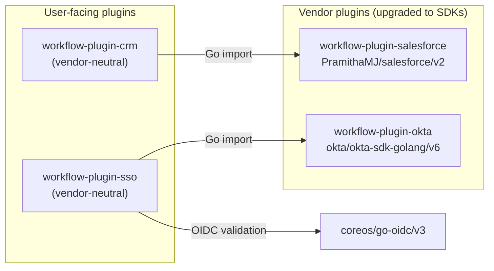
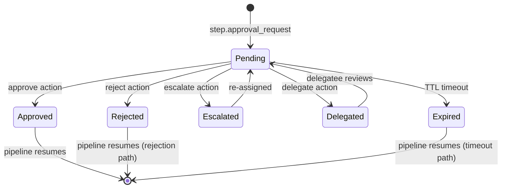

# Enterprise Expansion Design

**Date:** 2026-04-02
**Status:** Draft
**Scope:** `workflow-plugin-crm`, `workflow-plugin-erp`, `workflow-plugin-vectorstore`, `workflow-plugin-sso`, `workflow-plugin-audit`, `workflow-plugin-approval`

## Overview

Six new external gRPC plugins that extend the workflow engine with enterprise data integration (CRM, ERP), AI retrieval infrastructure (vector stores), governance and identity (SSO, audit logging), and human-in-the-loop business process management (approval workflows). Each plugin follows the established external plugin pattern: separate Go module, `plugin.json` manifest, `sdk.Serve()` entry point, `internal/` implementation.

**Target users:** Enterprise teams building CRM-integrated pipelines, RAG-powered applications, compliance-audited workflows, and approval-gated business processes.

## Architecture

### Plugin Dependency Graph

```mermaid
graph TD
    subgraph "New Plugins"
        CRM["workflow-plugin-crm<br/><i>crm.provider</i>"]
        ERP["workflow-plugin-erp<br/><i>erp.provider</i>"]
        VS["workflow-plugin-vectorstore<br/><i>vectorstore.provider</i>"]
        SSO["workflow-plugin-sso<br/><i>sso.oidc</i>"]
        AUD["workflow-plugin-audit<br/><i>audit.collector + audit.sink.*</i>"]
        APR["workflow-plugin-approval<br/><i>approval.engine</i>"]
    end

    subgraph "Existing Engine Components"
        SM[statemachine.engine]
        EB[EventBus]
        S3[storage.s3 / artifact S3]
        AUTH[auth.oauth2 / auth.jwt]
        AI[ai plugin / step.ai_complete]
        DB[database.workflow]
        SF[workflow-plugin-salesforce]
        OKTA[workflow-plugin-okta]
    end

    subgraph "External SDKs"
        PRAM["PramithaMJ/salesforce/v2"]
        PINE["pinecone-io/go-pinecone/v5"]
        MILV["milvus-io/milvus/client"]
        OIDC["coreos/go-oidc/v3"]
        AWSS["aws/aws-sdk-go-v2"]
    end

    CRM --> PRAM
    CRM -.->|"coexists with"| SF
    ERP -->|"OData HTTP"| SAP["SAP S/4HANA"]
    VS --> PINE
    VS --> MILV
    SSO --> OIDC
    SSO -.->|"extends"| AUTH
    SSO -.->|"coexists with"| OKTA
    AUD --> EB
    AUD --> AWSS
    AUD -.->|"reuses patterns"| S3
    APR --> SM
    APR --> DB
```



### Approach: One Plugin Per Domain

Each plugin is a standalone gRPC binary following the `workflow-plugin-template` pattern. Plugins communicate with the engine via the external SDK interfaces (`PluginProvider`, `ModuleProvider`, `StepProvider`). No cross-plugin dependencies at compile time — runtime composition happens through the pipeline and EventBus.

### Relationship to Existing Plugins

| New Plugin | Existing Plugin | Relationship |
|---|---|---|
| `workflow-plugin-crm` | `workflow-plugin-salesforce` (72 steps) | CRM **depends on** the Salesforce plugin as a Go library. The Salesforce plugin's provider satisfies the CRM `SalesforceAdapter`. Users choose: CRM for portability, Salesforce for deep vendor access. |
| `workflow-plugin-sso` | `workflow-plugin-okta` (113 steps), built-in `auth.oauth2` | SSO **depends on** the Okta plugin for Okta management operations. Uses `go-oidc/v3` for OIDC validation. `auth.oauth2` handles code flows (complementary). |
| `workflow-plugin-audit` | Built-in `storage.s3`, EventBus | Audit subscribes to the existing EventBus and writes to S3 using existing AWS SDK patterns. |
| `workflow-plugin-approval` | Built-in `statemachine.engine`, `database.workflow` | Approval builds a domain-specific state machine on top of the existing state machine module. |

### SDK Evaluation & Existing Plugin Upgrades

Both `workflow-plugin-salesforce` and `workflow-plugin-okta` currently use custom-rolled HTTP clients (`net/http`). This means handwritten OAuth flows, no retry/backoff, no typed errors, and manual JSON handling. Mature SDKs exist for both and should be adopted — the goal is battle-tested code where features and bugs have already been addressed, not rolling our own and introducing more bugs or missing features.

| Plugin | Current Approach | Recommended SDK | Justification |
|---|---|---|---|
| `workflow-plugin-salesforce` | Custom `salesforceClient` struct, manual OAuth2, manual `http.Do()` | **`github.com/PramithaMJ/salesforce/v2`** | Production-ready: retry with exponential backoff, typed errors (`IsNotFoundError`, `IsRateLimitError`, `IsAuthError`), SOQL/SOSL builder pattern, Bulk API 2.0 with `WaitForCompletion`, Composite API, Analytics, Tooling, Chatter, Apex REST, API Limits monitoring. Eliminates hundreds of lines of handwritten HTTP plumbing. |
| `workflow-plugin-okta` | Custom `OktaClient` struct, manual `oktaGet/Post/Put/Delete` helpers | **`github.com/okta/okta-sdk-golang/v6`** | Official SDK, auto-generated from Okta's OpenAPI spec. Handles pagination, rate limiting, retry, caching. Covers all Okta management APIs with type-safe structs. Current custom client has no rate limiting or pagination. |
| `workflow-plugin-erp` (new) | N/A | **Custom OData v4 HTTP client** | No Go SDK exists for SAP. SAP Cloud SDK is Java/JavaScript only. Community OData Go libraries are unmaintained and not SAP-specific. Custom client is the only viable path — but we build a reusable `odata` package, not throwaway code. |

**Upgrade path:** The salesforce and okta plugins should be migrated to their respective SDKs as a prerequisite (Phase 0) before the CRM and SSO plugins depend on them. This ensures the CRM and SSO plugins inherit SDK-quality code from day one.

### Provider Dependency Model

New plugins import existing plugins as **Go library dependencies** (compile-time), not runtime cross-process calls. The existing plugin exports its provider/client at the package level, and the new plugin wraps it behind a vendor-neutral interface.



To enable this, each vendor plugin must **export a public client API** at the top-level package (not locked in `internal/`). The refactoring moves core client types and the provider interface to an exported `salesforce` / `okta` package, while `internal/` retains the gRPC plugin wiring, step implementations, and module registration.

---

## Plugin 1: CRM (`workflow-plugin-crm`)

**Repository:** `GoCodeAlone/workflow-plugin-crm` (from `workflow-plugin-template`)

Vendor-neutral CRM operations. First provider: **Salesforce** via `github.com/PramithaMJ/salesforce/v2`.

### Why a Separate CRM Plugin?

The existing `workflow-plugin-salesforce` exposes 72 Salesforce-specific steps (SOQL, SOSL, Apex, Chatter, etc.). The CRM plugin provides a higher-level, vendor-agnostic interface: `step.crm_query` instead of `step.salesforce_query`. Teams that need deep Salesforce-specific features use the Salesforce plugin directly; teams that want CRM portability use this one.

### Dependency Model

The CRM plugin **imports `workflow-plugin-salesforce` as a Go library dependency**. The Salesforce plugin exports its client/provider at the package level (after the Phase 0 SDK migration to `PramithaMJ/salesforce/v2`). The CRM plugin's `SalesforceAdapter` wraps the exported Salesforce provider to implement the vendor-neutral `CRMProvider` interface. This means:

- Bug fixes and features added to the Salesforce plugin automatically benefit CRM users
- No duplicate HTTP/SDK code — the CRM adapter is a thin mapping layer
- Both plugins can still be loaded independently in the engine

### CRM Provider Interface

```go
type CRMProvider interface {
    Connect(ctx context.Context, config ProviderConfig) error
    Disconnect(ctx context.Context) error
    CreateRecord(ctx context.Context, objectType string, fields map[string]any) (*RecordResult, error)
    UpdateRecord(ctx context.Context, objectType, id string, fields map[string]any) error
    UpsertRecord(ctx context.Context, objectType, externalIDField, externalID string, fields map[string]any) (*RecordResult, error)
    DeleteRecord(ctx context.Context, objectType, id string) error
    GetRecord(ctx context.Context, objectType, id string, fields []string) (map[string]any, error)
    Query(ctx context.Context, query string) (*QueryResult, error)
    Search(ctx context.Context, search string) (*SearchResult, error)
    BulkOperation(ctx context.Context, op BulkOp) (*BulkResult, error)
    DescribeObject(ctx context.Context, objectType string) (*ObjectDescription, error)
    GetLimits(ctx context.Context) (*APILimits, error)
}
```

The `SalesforceAdapter` implements `CRMProvider` by delegating to the Salesforce plugin's exported client (which uses `PramithaMJ/salesforce/v2` under the hood):

### Module Types

| Module | Purpose | Key Config |
|---|---|---|
| `crm.provider` | CRM connection | `provider: salesforce`, `auth: {type: oauth_refresh, clientId, clientSecret, refreshToken}`, `apiVersion: "59.0"` |

### Step Types

| Step | Purpose | Key Config |
|---|---|---|
| `step.crm_create_record` | Create a record | `module`, `objectType: Account`, `fields: {Name: "Acme"}` |
| `step.crm_update_record` | Update by ID | `module`, `objectType`, `id`, `fields` |
| `step.crm_upsert_record` | Upsert by external ID | `module`, `objectType`, `externalIdField`, `externalId`, `fields` |
| `step.crm_delete_record` | Delete by ID | `module`, `objectType`, `id` |
| `step.crm_get_record` | Get single record | `module`, `objectType`, `id`, `fields: [Name, Industry]` |
| `step.crm_query` | Query records | `module`, `query: "SELECT Id, Name FROM Account WHERE Industry = 'Tech'"` |
| `step.crm_search` | Full-text search | `module`, `search: "FIND {Acme} IN NAME FIELDS RETURNING Account(Id, Name)"` |
| `step.crm_bulk_import` | Bulk create/upsert | `module`, `objectType`, `operation: upsert`, `data`, `externalIdField` |
| `step.crm_describe` | Describe object schema | `module`, `objectType` |
| `step.crm_limits` | Check API usage | `module` |

### Directory Structure

```
workflow-plugin-crm/
├── cmd/workflow-plugin-crm/main.go
├── internal/
│   ├── plugin.go              # PluginProvider, ModuleProvider, StepProvider
│   ├── crm.go                 # CRMProvider interface + types
│   ├── module_provider.go     # crm.provider module
│   ├── salesforce_adapter.go  # Wraps workflow-plugin-salesforce's exported client
│   ├── step_record.go         # CRUD steps
│   ├── step_query.go          # Query + search steps
│   ├── step_bulk.go           # Bulk import step
│   └── step_describe.go       # Describe + limits steps
├── plugin.json
├── go.mod                     # depends on workflow-plugin-salesforce + workflow SDK
└── .goreleaser.yaml
```

---

## Plugin 2: ERP (`workflow-plugin-erp`)

**Repository:** `GoCodeAlone/workflow-plugin-erp` (from `workflow-plugin-template`)

Enterprise resource planning integration. First provider: **SAP S/4HANA** via OData REST APIs.

### SDK Evaluation

**No Go SDK exists for SAP S/4HANA.** SAP Cloud SDK supports Java and JavaScript only. Community Go OData libraries (`denizayd/open-odata`, `raphaelmeyer/odata4go`) are unmaintained and not SAP-specific. SAP's own recommendation for non-Java/JS platforms is to consume their OData REST APIs directly with native HTTP clients.

Custom OData client is justified here, but we build a **reusable `odata` package** (not throwaway code) — generic OData v4 CRUD, `$filter/$select/$expand`, `$batch`, metadata parsing — that could serve future ERP providers (Oracle, Microsoft Dynamics) if they also expose OData APIs.

### ERP Provider Interface

```go
type ERPProvider interface {
    Connect(ctx context.Context, config ProviderConfig) error
    Disconnect(ctx context.Context) error
    ReadEntity(ctx context.Context, entitySet string, key map[string]any, opts ReadOpts) (map[string]any, error)
    CreateEntity(ctx context.Context, entitySet string, data map[string]any) (map[string]any, error)
    UpdateEntity(ctx context.Context, entitySet string, key, data map[string]any) error
    DeleteEntity(ctx context.Context, entitySet string, key map[string]any) error
    Query(ctx context.Context, entitySet string, opts QueryOpts) (*QueryResult, error)
    BatchRequest(ctx context.Context, ops []BatchOperation) (*BatchResult, error)
    CallFunction(ctx context.Context, name string, params map[string]any) (map[string]any, error)
    GetMetadata(ctx context.Context) (*ODataMetadata, error)
}
```

### Module Types

| Module | Purpose | Key Config |
|---|---|---|
| `erp.provider` | ERP connection | `provider: sap`, `baseUrl: https://sap-host/sap/opu/odata4/sap/`, `auth: {type: oauth2, tokenUrl, clientId, clientSecret}` |

### Step Types

| Step | Purpose | Key Config |
|---|---|---|
| `step.erp_read_entity` | Read a business entity | `module`, `entitySet: A_BusinessPartner`, `key: {BusinessPartner: "1000"}`, `expand: [to_Address]` |
| `step.erp_create_entity` | Create a business entity | `module`, `entitySet`, `data` |
| `step.erp_update_entity` | Update (PATCH) | `module`, `entitySet`, `key`, `data` |
| `step.erp_delete_entity` | Delete | `module`, `entitySet`, `key` |
| `step.erp_query` | Query with OData filters | `module`, `entitySet`, `filter`, `select`, `expand`, `orderBy`, `top`, `skip` |
| `step.erp_batch` | OData $batch request | `module`, `operations: [{method, entitySet, key, data}]`, `atomicGroup: true` |
| `step.erp_function_import` | Call function import | `module`, `function: CalculatePrice`, `params` |
| `step.erp_metadata` | Get service metadata | `module` → outputs: entity sets, entity types, properties |

### Directory Structure

```
workflow-plugin-erp/
├── cmd/workflow-plugin-erp/main.go
├── internal/
│   ├── plugin.go
│   ├── erp.go                 # ERPProvider interface + types
│   ├── module_provider.go     # erp.provider module
│   ├── sap_adapter.go         # SAP OData implementation
│   ├── sap_auth.go            # SAP OAuth2 + CSRF token handling
│   ├── odata_client.go        # Generic OData v4 HTTP client
│   ├── step_entity.go         # CRUD steps
│   ├── step_query.go          # Query step
│   ├── step_batch.go          # Batch step
│   └── step_function.go       # Function import step
├── plugin.json
├── go.mod
└── .goreleaser.yaml
```

---

## Plugin 3: Vector Store (`workflow-plugin-vectorstore`)

**Repository:** `GoCodeAlone/workflow-plugin-vectorstore` (from `workflow-plugin-template`)

Abstracted vector database access for RAG pipelines and semantic search. Two providers:

- **Pinecone** (managed) via `github.com/pinecone-io/go-pinecone/v5/pinecone` — official SDK with gRPC data plane + REST control plane
- **Milvus** (self-hosted) via `github.com/milvus-io/milvus/client` — the current official Go client (the older `milvus-sdk-go/v2` repo is deprecated)

### Vector Store Provider Interface

```go
type VectorStoreProvider interface {
    Connect(ctx context.Context, config ProviderConfig) error
    Disconnect(ctx context.Context) error
    Upsert(ctx context.Context, index string, vectors []Vector) (*UpsertResult, error)
    Query(ctx context.Context, index string, req QueryRequest) (*QueryResult, error)
    Fetch(ctx context.Context, index string, ids []string) ([]Vector, error)
    Delete(ctx context.Context, index string, req DeleteRequest) error
    CreateIndex(ctx context.Context, spec IndexSpec) error
    DeleteIndex(ctx context.Context, name string) error
    ListIndexes(ctx context.Context) ([]IndexInfo, error)
    DescribeIndex(ctx context.Context, name string) (*IndexStats, error)
}

type Vector struct {
    ID       string         `json:"id"`
    Values   []float32      `json:"values"`
    Metadata map[string]any `json:"metadata,omitempty"`
}

type QueryRequest struct {
    Vector    []float32      `json:"vector"`
    TopK      int            `json:"topK"`
    Filter    map[string]any `json:"filter,omitempty"`
    Namespace string         `json:"namespace,omitempty"`
}
```

### Module Types

| Module | Purpose | Key Config |
|---|---|---|
| `vectorstore.provider` | Vector DB connection | `provider: pinecone\|milvus`, `apiKey`, `environment`, `index` (Pinecone) or `address`, `database`, `collection` (Milvus) |

### Step Types

| Step | Purpose | Key Config |
|---|---|---|
| `step.vector_upsert` | Upsert vectors + metadata | `module`, `index\|collection`, `vectors: [{id, values, metadata}]` |
| `step.vector_query` | Similarity search | `module`, `index`, `vector`, `topK: 10`, `filter`, `namespace` |
| `step.vector_fetch` | Fetch vectors by ID | `module`, `index`, `ids: [...]` |
| `step.vector_delete` | Delete vectors | `module`, `index`, `ids` or `filter` or `deleteAll: true` |
| `step.vector_create_index` | Create index | `module`, `name`, `dimension: 1536`, `metric: cosine\|euclidean\|dotproduct` |
| `step.vector_delete_index` | Delete index | `module`, `name` |
| `step.vector_list_indexes` | List indexes | `module` |
| `step.vector_describe_stats` | Get index stats | `module`, `index` → outputs: dimension, count, namespaces |

### Directory Structure

```
workflow-plugin-vectorstore/
├── cmd/workflow-plugin-vectorstore/main.go
├── internal/
│   ├── plugin.go
│   ├── vectorstore.go          # VectorStoreProvider interface + types
│   ├── module_provider.go      # vectorstore.provider module
│   ├── pinecone_adapter.go     # Pinecone (go-pinecone/v5)
│   ├── milvus_adapter.go       # Milvus (milvus/client)
│   ├── step_upsert.go
│   ├── step_query.go
│   ├── step_fetch.go
│   ├── step_delete.go
│   └── step_index.go           # Index management steps
├── plugin.json
├── go.mod
└── .goreleaser.yaml
```

---

## Plugin 4: SSO (`workflow-plugin-sso`)

**Repository:** `GoCodeAlone/workflow-plugin-sso` (from `workflow-plugin-template`)

Enterprise SSO via OpenID Connect middleware. Supports **Microsoft Entra ID** and **Okta** (and any OIDC-compliant IdP) through the standard `github.com/coreos/go-oidc/v3` library.

### Dependency Model

The SSO plugin **imports `workflow-plugin-okta` as a Go library dependency** for Okta-specific management operations (user lookup, group membership, etc.). For OIDC token validation, it uses `go-oidc/v3` — a standards-based library that works with any OIDC provider including both Entra ID and Okta. After the Phase 0 SDK migration, the Okta plugin will use `okta/okta-sdk-golang/v6` internally, and the SSO plugin inherits that quality.

### Relationship to Existing Auth

| Existing | SSO Plugin |
|---|---|
| `auth.oauth2` module — handles OAuth2 authorization code flow (Google, GitHub, generic OIDC) | `sso.oidc` — enterprise OIDC token validation middleware with multi-provider discovery, group/role claim mapping, and session management |
| `workflow-plugin-okta` — Okta management API (users, groups, policies, 113 steps) | SSO focuses on **authentication flow**, not Okta admin operations |

### Module Types

| Module | Purpose | Key Config |
|---|---|---|
| `sso.oidc` | OIDC middleware | `providers: [{name: entra, issuer: "https://login.microsoftonline.com/{tenant}/v2.0", clientId, clientSecret, scopes}, {name: okta, issuer: "https://{domain}.okta.com", ...}]`, `claimMapping: {roles: "groups", email: "preferred_username"}`, `sessionTTL: 8h` |

### Step Types

| Step | Purpose | Key Config |
|---|---|---|
| `step.sso_validate_token` | Validate OIDC token against provider | `module`, `token` (or from request header), `provider: entra\|okta\|auto` → outputs: `claims`, `valid`, `userId` |
| `step.sso_get_user_info` | Fetch OIDC userinfo endpoint | `module`, `accessToken`, `provider` → outputs: `name`, `email`, `groups`, `roles` |
| `step.sso_check_groups` | Assert user membership | `module`, `token`, `requiredGroups: [engineering, admin]` → outputs: `authorized`, `matchedGroups` |
| `step.sso_refresh_token` | Refresh access token | `module`, `refreshToken`, `provider` → outputs: `accessToken`, `expiresIn` |

### Directory Structure

```
workflow-plugin-sso/
├── cmd/workflow-plugin-sso/main.go
├── internal/
│   ├── plugin.go
│   ├── oidc.go                 # OIDCProvider interface + multi-provider registry
│   ├── module_oidc.go          # sso.oidc module (provider discovery, JWKS caching)
│   ├── entra_provider.go       # Entra ID specifics (tenant, v2.0 endpoint)
│   ├── okta_provider.go        # Wraps workflow-plugin-okta's exported client for mgmt ops
│   ├── generic_provider.go     # Generic OIDC (any compliant IdP)
│   ├── claims.go               # Claim mapping + group/role extraction
│   ├── step_validate.go
│   ├── step_userinfo.go
│   ├── step_groups.go
│   └── step_refresh.go
├── plugin.json
├── go.mod                      # depends on workflow-plugin-okta + go-oidc/v3 + workflow SDK
└── .goreleaser.yaml
```

---

## Plugin 5: Audit (`workflow-plugin-audit`)

**Repository:** `GoCodeAlone/workflow-plugin-audit` (from `workflow-plugin-template`)

Captures workflow lifecycle events from the EventBus and writes immutable audit logs to configurable sinks (S3, database). Designed for SOC 2 / HIPAA compliance trails.

### Architecture

The audit collector subscribes to the existing `modular/eventbus/v2` lifecycle topics (`workflow.started`, `workflow.completed`, `step.started`, `step.completed`, `step.failed`, `pipeline.started`, `pipeline.completed`). Events are buffered, enriched with correlation IDs and actor context, then flushed to configured sinks asynchronously — never blocking the primary execution path.

### Module Types

| Module | Purpose | Key Config |
|---|---|---|
| `audit.collector` | EventBus subscriber + enrichment | `topics: ["workflow.*", "step.*", "pipeline.*"]`, `bufferSize: 1000`, `flushInterval: 5s`, `enrichment: {includeStepOutput: false, includePipelineContext: true}` |
| `audit.sink.s3` | S3 audit log sink | `bucket`, `prefix: audit/`, `region`, `partitionBy: date`, `format: jsonl\|parquet`, `compression: gzip` |
| `audit.sink.db` | Database audit log sink | `connection`, `table: audit_events`, `retention: 90d` |

### Step Types

| Step | Purpose | Key Config |
|---|---|---|
| `step.audit_query` | Query audit logs | `sink`, `timeRange: {from, to}`, `filter: {workflowId, actor, eventType}`, `limit` |
| `step.audit_export` | Export audit logs | `sink`, `timeRange`, `format: csv\|jsonl`, `destination` |
| `step.audit_annotate` | Add metadata to audit context | `key`, `value` — enriches all subsequent events in this execution |

### Directory Structure

```
workflow-plugin-audit/
├── cmd/workflow-plugin-audit/main.go
├── internal/
│   ├── plugin.go
│   ├── collector.go            # EventBus subscriber, buffering, enrichment
│   ├── module_collector.go     # audit.collector module
│   ├── module_sink_s3.go       # audit.sink.s3 module
│   ├── module_sink_db.go       # audit.sink.db module
│   ├── sink.go                 # AuditSink interface
│   ├── event.go                # AuditEvent struct + serialization
│   ├── step_query.go
│   ├── step_export.go
│   └── step_annotate.go
├── plugin.json
├── go.mod
└── .goreleaser.yaml
```

---

## Plugin 6: Approval (`workflow-plugin-approval`)

**Repository:** `GoCodeAlone/workflow-plugin-approval` (from `workflow-plugin-template`)

Human-in-the-loop workflow suspension and resumption. Suspends pipeline execution at an approval gate, persists state to the database, and resumes when a human acts via webhook.

### Architecture

Built on the existing `statemachine.engine` and `database.workflow` modules. When a pipeline hits `step.approval_request`, the plugin:

1. Creates an approval record in the database (pending state)
2. Publishes a notification event to the EventBus (for Slack/email/webhook integration)
3. Returns a `suspended` status with a continuation token
4. The engine persists the pipeline execution state

When the approver acts (via HTTP webhook → `trigger.approval_webhook`):

1. The trigger validates the token and records the decision
2. The state machine transitions: `pending` → `approved` / `rejected` / `escalated`
3. The pipeline resumes from the suspension point with the decision in context

### Approval State Machine



### Module Types

| Module | Purpose | Key Config |
|---|---|---|
| `approval.engine` | Approval workflow engine | `database: my-db`, `webhookPath: /api/approvals`, `defaultTTL: 72h`, `notifyTopic: approval.requested`, `escalationRules: [{afterHours: 24, to: manager}]` |

### Step Types

| Step | Purpose | Key Config |
|---|---|---|
| `step.approval_request` | Create approval request (suspends pipeline) | `module`, `title`, `description`, `approvers: [user@example.com]`, `requiredApprovals: 1`, `ttl: 48h`, `metadata` |
| `step.approval_check` | Check approval status (non-blocking) | `module`, `requestId` → outputs: `status`, `decisions`, `pending` |
| `step.approval_decide` | Record decision (for programmatic use) | `module`, `requestId`, `decision: approve\|reject`, `actor`, `comment` |
| `step.approval_list` | List pending approvals | `module`, `approver`, `status: pending`, `limit` |
| `step.approval_escalate` | Manually escalate | `module`, `requestId`, `to: [manager@example.com]`, `reason` |

### Trigger Types

| Trigger | Purpose | Key Config |
|---|---|---|
| `trigger.approval_webhook` | HTTP webhook for approval actions | `path: /api/approvals/:id/decide`, `auth: jwt` |

### Directory Structure

```
workflow-plugin-approval/
├── cmd/workflow-plugin-approval/main.go
├── internal/
│   ├── plugin.go
│   ├── approval.go             # ApprovalEngine interface + types
│   ├── module_engine.go        # approval.engine module
│   ├── store.go                # Database persistence (approval records)
│   ├── state_machine.go        # State transitions (uses statemachine patterns)
│   ├── trigger_webhook.go      # trigger.approval_webhook
│   ├── step_request.go         # Creates request + suspends pipeline
│   ├── step_check.go
│   ├── step_decide.go
│   ├── step_list.go
│   └── step_escalate.go
├── plugin.json
├── go.mod
└── .goreleaser.yaml
```

---

## Validation Scenarios

### Scenario 1: AI-Powered Lead Enrichment with Human Approval

A new lead event enters via webhook trigger. The pipeline queries the LLM (`step.ai_complete`) to score the lead. High-scoring leads sync to Salesforce automatically via `step.crm_create_record`. Ambiguous leads pause at `step.approval_request`, which fires a Slack notification. A manager clicks the approval webhook link, and the pipeline resumes to complete the CRM sync.

```yaml
pipelines:
  - name: lead-enrichment
    trigger:
      type: http
      config:
        method: POST
        path: /api/leads
    steps:
      - name: score-lead
        type: step.ai_complete
        config:
          prompt: "Score this lead 1-10: {{ .trigger.body | toJson }}"
          model: claude-sonnet

      - name: route
        type: step.conditional
        config:
          condition: "${ int(steps.score_lead.output.score) >= 7 }"
          then: sync-to-crm
          else: request-approval

      - name: request-approval
        type: step.approval_request
        config:
          module: approvals
          title: "Review ambiguous lead: {{ .trigger.body.company }}"
          approvers: ["sales-manager@company.com"]
          ttl: 24h

      - name: check-decision
        type: step.conditional
        config:
          condition: "${ steps.request_approval.output.decision == 'approved' }"
          then: sync-to-crm
          else: log-rejected

      - name: sync-to-crm
        type: step.crm_create_record
        config:
          module: salesforce
          objectType: Lead
          fields:
            Company: "{{ .trigger.body.company }}"
            Email: "{{ .trigger.body.email }}"
            LeadScore__c: "{{ .steps.score_lead.output.score }}"
```

**Validates:** CRM adapter data mapping, human-in-the-loop suspension/resumption, cross-plugin composition.

### Scenario 2: Secure RAG Pipeline with Compliance Auditing

An internal support chatbot receives a user query. The SSO plugin validates the Entra ID token. The pipeline creates an embedding and queries Pinecone for context documents. The audit plugin silently captures all lifecycle events to S3.

```yaml
modules:
  - name: sso
    type: sso.oidc
    config:
      providers:
        - name: entra
          issuer: "https://login.microsoftonline.com/${TENANT_ID}/v2.0"
          clientId: "${ENTRA_CLIENT_ID}"
          clientSecret: "${ENTRA_CLIENT_SECRET}"

  - name: vectors
    type: vectorstore.provider
    config:
      provider: pinecone
      apiKey: "${PINECONE_API_KEY}"

  - name: audit-collector
    type: audit.collector
    config:
      topics: ["workflow.*", "step.*"]
      bufferSize: 500
      flushInterval: 3s

  - name: audit-s3
    type: audit.sink.s3
    config:
      bucket: "${AUDIT_BUCKET}"
      region: us-east-1
      prefix: "chatbot-audit/"
      format: jsonl
      compression: gzip

pipelines:
  - name: rag-query
    trigger:
      type: http
      config:
        method: POST
        path: /api/chat
    steps:
      - name: validate-token
        type: step.sso_validate_token
        config:
          module: sso
          provider: entra

      - name: check-groups
        type: step.sso_check_groups
        config:
          module: sso
          token: "{{ .steps.validate_token.output.accessToken }}"
          requiredGroups: ["support-agents"]

      - name: embed-query
        type: step.ai_complete
        config:
          prompt: "Generate a search query for: {{ .trigger.body.question }}"
          model: claude-haiku

      - name: search-docs
        type: step.vector_query
        config:
          module: vectors
          index: support-docs
          vector: "{{ .steps.embed_query.output.embedding }}"
          topK: 5

      - name: generate-answer
        type: step.ai_complete
        config:
          prompt: |
            Answer based on these documents:
            {{ .steps.search_docs.output.matches | toJson }}
            Question: {{ .trigger.body.question }}
          model: claude-sonnet
```

**Validates:** Pinecone SDK integration, OIDC token validation, EventBus async audit streaming without blocking the LLM request path.

---

## Phased Delivery

### Phase 0: Existing Plugin SDK Upgrades (prerequisite)
- Migrate `workflow-plugin-salesforce` from custom HTTP client to `PramithaMJ/salesforce/v2`
- Migrate `workflow-plugin-okta` from custom HTTP client to `okta/okta-sdk-golang/v6`
- Both plugins export their client/provider at the package level (move core types out of `internal/`)
- Maintain full backward compatibility — all existing step types continue to work

### Phase 1: CRM + Approval (core business workflow)
- `workflow-plugin-crm` with Salesforce adapter (PramithaMJ SDK)
- `workflow-plugin-approval` with state machine, webhook trigger, database persistence
- Validation Scenario 1 (lead enrichment)

### Phase 2: Vector Store + SSO (AI + security)
- `workflow-plugin-vectorstore` with Pinecone + Milvus adapters
- `workflow-plugin-sso` with Entra ID + Okta via go-oidc/v3
- Validation Scenario 2 (RAG pipeline)

### Phase 3: ERP + Audit (enterprise compliance)
- `workflow-plugin-erp` with SAP OData adapter
- `workflow-plugin-audit` with EventBus collector + S3/DB sinks

### Phase 4: Integration testing + workflow-scenarios
- `workflow-scenarios/` Docker-based integration tests for all 6 plugins
- Cross-plugin scenario tests
- Performance benchmarks for audit throughput and vector query latency

---

## Registry Manifests

### CRM

```yaml
name: crm
version: "0.1.0"
description: "Vendor-neutral CRM integration (Salesforce)"
type: external
tier: community
license: MIT
repository: GoCodeAlone/workflow-plugin-crm
capabilities:
  moduleTypes: [crm.provider]
  stepTypes: [step.crm_create_record, step.crm_update_record, step.crm_upsert_record, step.crm_delete_record, step.crm_get_record, step.crm_query, step.crm_search, step.crm_bulk_import, step.crm_describe, step.crm_limits]
```

### ERP

```yaml
name: erp
version: "0.1.0"
description: "Enterprise ERP integration (SAP S/4HANA)"
type: external
tier: community
license: MIT
repository: GoCodeAlone/workflow-plugin-erp
capabilities:
  moduleTypes: [erp.provider]
  stepTypes: [step.erp_read_entity, step.erp_create_entity, step.erp_update_entity, step.erp_delete_entity, step.erp_query, step.erp_batch, step.erp_function_import, step.erp_metadata]
```

### Vector Store

```yaml
name: vectorstore
version: "0.1.0"
description: "Vector database integration (Pinecone, Milvus)"
type: external
tier: community
license: MIT
repository: GoCodeAlone/workflow-plugin-vectorstore
capabilities:
  moduleTypes: [vectorstore.provider]
  stepTypes: [step.vector_upsert, step.vector_query, step.vector_fetch, step.vector_delete, step.vector_create_index, step.vector_delete_index, step.vector_list_indexes, step.vector_describe_stats]
```

### SSO

```yaml
name: sso
version: "0.1.0"
description: "Enterprise SSO via OpenID Connect (Entra ID, Okta)"
type: external
tier: community
license: MIT
repository: GoCodeAlone/workflow-plugin-sso
capabilities:
  moduleTypes: [sso.oidc]
  stepTypes: [step.sso_validate_token, step.sso_get_user_info, step.sso_check_groups, step.sso_refresh_token]
```

### Audit

```yaml
name: audit
version: "0.1.0"
description: "Compliance audit logging (EventBus → S3/DB)"
type: external
tier: community
license: MIT
repository: GoCodeAlone/workflow-plugin-audit
capabilities:
  moduleTypes: [audit.collector, audit.sink.s3, audit.sink.db]
  stepTypes: [step.audit_query, step.audit_export, step.audit_annotate]
```

### Approval

```yaml
name: approval
version: "0.1.0"
description: "Human-in-the-loop approval workflows"
type: external
tier: community
license: MIT
repository: GoCodeAlone/workflow-plugin-approval
capabilities:
  moduleTypes: [approval.engine]
  stepTypes: [step.approval_request, step.approval_check, step.approval_decide, step.approval_list, step.approval_escalate]
  triggerTypes: [trigger.approval_webhook]
```
