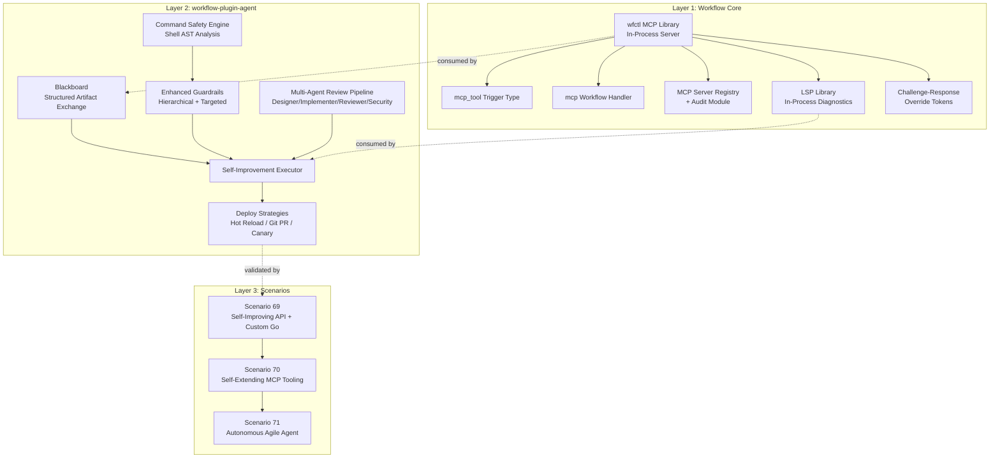

# Self-Improving Agentic Workflow — Design Document

**Date:** 2026-04-13
**Status:** Approved
**Repos:** `workflow`, `workflow-plugin-agent`, `workflow-scenarios`

## Problem Statement

Workflow applications powered by LLM agents (via workflow-plugin-agent) currently treat their own configuration as static. Agents can execute tasks within pipelines but cannot inspect, modify, validate, or redeploy their own Workflow configuration. This limits the potential for autonomous self-improvement — agents that can identify deficiencies in their own application and iteratively fix them.

The goal is to enable an **optional, guardrailed self-improvement loop** where agents can:
1. Inspect their own Workflow config via MCP tools
2. Propose changes (app config, IaC, custom code)
3. Validate changes via wfctl + LSP
4. Get reviewed by other agents (multi-model, multi-role)
5. Deploy changes safely (hot reload, git PR, or canary)
6. Iterate based on results

## Architecture: Layered Approach



## Layer 1: Workflow Core Changes

### 1a. In-Process wfctl MCP Library

Extract the existing `mcp/` package into a reusable library. Today it only runs via `wfctl mcp` (CLI subprocess). The new `NewInProcessServer()` constructor returns an MCP server wired directly to the engine — no HTTP, no subprocess, no port.

```go
// mcp/library.go
func NewInProcessServer(eng *engine.Engine, opts ...Option) *Server

// Options
func WithPluginDir(dir string) Option
func WithRegistryDir(dir string) Option
func WithDocFile(path string) Option
func WithAuditLog(logger *slog.Logger) Option
func WithEngine(eng *engine.Engine) Option  // Already exists, reuse
```

The server satisfies a new `MCPProvider` interface registered in the modular service registry, so any module (including external plugins via gRPC) can look it up by name.

**All 25+ existing wfctl MCP tools** become available in-process: `validate_config`, `template_validate_config`, `inspect_config`, `modernize`, `scaffold_*`, `diff_configs`, `detect_secrets`, `detect_ports`, `generate_schema`, `get_module_schema`, `get_step_schema`, `list_*`, `api_extract`, `manifest_analyze`, `contract_generate`, `generate_github_actions`, `compat_check`, `registry_search`, `get_template_functions`, `validate_template_expressions`, `infer_pipeline_context`, `get_config_examples`, `get_config_skeleton`, `detect_infra_needs`, `detect_project_features`.

**Testing:** Each tool must have a test verifying in-process invocation produces identical results to CLI invocation. Test file: `mcp/library_test.go`.

### 1b. New Trigger Type: `mcp_tool`

Allows any existing pipeline to be exposed as an MCP tool by adding a trigger:

```yaml
triggers:
  analyze_logs:
    type: mcp_tool
    config:
      tool_name: analyze_logs
      description: "Analyze application logs for anomalies"
      parameters:
        - name: timeframe
          type: string
          required: true
        - name: severity
          type: string
          enum: [info, warn, error]
```

When the MCP server receives a `tools/call` for `analyze_logs`, it invokes the pipeline, passes args as trigger data, and returns the pipeline output as the tool result.

Implementation: `module/trigger_mcp_tool.go` + factory registration in the triggers plugin.

### 1c. New Workflow Handler Type: `mcp`

For cases where a dedicated MCP tool namespace is preferred over individual triggers:

```yaml
workflows:
  self_improve:
    type: mcp
    config:
      server_name: self_improve
      log_tool_calls: true
    routes:
      validate_config:
        pipeline: validate_proposed_config
        description: "Validate a proposed YAML config change"
      diff_config:
        pipeline: diff_current_vs_proposed
        description: "Show diff between current and proposed config"
```

Implementation: `handlers/mcp_handler.go` + factory registration in `engine.go`.

### 1d. MCP Server Registry & Audit Module

New module type `mcp.registry`:

```yaml
modules:
  mcp_audit:
    type: mcp.registry
    config:
      log_on_init: true          # Log all registered MCP tools at startup
      expose_admin_api: true     # GET /admin/mcp/servers, GET /admin/mcp/tools
      audit_tool_calls: true     # Log every tool invocation with args/result
```

Centralizes discovery of all MCP servers (in-process wfctl, workflow-defined via triggers/handlers, external via plugin MCP clients). Provides the admin/audit interface.

Implementation: `module/mcp_registry.go`.

### 1e. LSP as In-Process Library

The existing `lsp/` package runs via `workflow-lsp-server` (stdio). Expose key functions as a library:

```go
// lsp/library.go
func DiagnoseContent(content string, pluginDir string) []Diagnostic
func Complete(content string, line, col int, pluginDir string) []CompletionItem
func Hover(content string, line, col int, pluginDir string) *HoverResult
```

These can be wrapped as MCP tools (`mcp:lsp:diagnose`, `mcp:lsp:complete`, `mcp:lsp:hover`) via the `mcp_tool` trigger or directly by the agent plugin.

### 1f. Challenge-Response Override Tokens

When a guardrail rejects a change, wfctl generates a deterministic **challenge token** — a 3-word passphrase derived from the rejection context.

**Generation:** `HMAC-SHA256(admin_secret, rejection_hash || time_bucket_1h)` → first 3 words from BIP39 wordlist.

**Usage across environments:**

| Environment | Override Method |
|-------------|----------------|
| Local CLI | `wfctl deploy --override anchor-forest-seven` |
| GitHub Actions | PR comment: `/wfctl-override anchor-forest-seven` |
| GitHub Workflow Dispatch | Input field: `override_token` |
| API call | Header: `X-Workflow-Override: anchor-forest-seven` |

**Properties:**
- **Single-use:** Bound to specific rejection hash. Change the diff → new token.
- **Time-bucketed:** 1-hour expiry, no stale env vars.
- **Auditable:** Every override logged with who, when, what, why.
- **No shell access needed:** Works through PR comments, dispatch inputs, API.
- **Deterministic:** Same rejection → same token within time bucket for verification.

New `wfctl ci validate` subcommand runs all validation checks (immutability, schema, templates, LSP, diff) and accepts `--override` for CI environments.

Implementation: `cmd/wfctl/override.go`, `validation/challenge.go`.

### 1g. Documentation

New documentation in `docs/`:
- `docs/self-improvement.md` — Feature overview, getting started guide
- `docs/mcp-tools-reference.md` — Complete MCP tool reference (all in-process tools)
- `docs/guardrails-guide.md` — Guardrails configuration guide with examples
- `docs/self-improvement-tutorial.md` — Step-by-step tutorial for enabling self-improvement
- Updates to `DOCUMENTATION.md` for new module/trigger/handler types

## Layer 2: workflow-plugin-agent Changes

### 2a. Blackboard (Structured Artifact Exchange)

New coordination mechanism pulled up from ratchet orchestrator patterns. The blackboard is a shared workspace where agents in a review pipeline post typed artifacts.

```go
// orchestrator/blackboard.go
type Blackboard struct {
    db     *sql.DB
    sseHub *SSEHub
}

type Artifact struct {
    ID        string
    Phase     string         // "design", "implement", "review", "security", "approve"
    AgentID   string
    Type      string         // "config_diff", "validation_report", "iac_plan",
                             // "review_findings", "approval_decision", "yaml_config"
    Content   map[string]any // Structured data
    Tags      []string       // For filtering
    CreatedAt time.Time
}

func (b *Blackboard) Post(ctx context.Context, artifact Artifact) error
func (b *Blackboard) Read(ctx context.Context, phase string, artifactType string) ([]Artifact, error)
func (b *Blackboard) ReadLatest(ctx context.Context, phase string) (*Artifact, error)
func (b *Blackboard) Subscribe(phase string) <-chan Artifact  // SSE-backed
```

SQLite-backed, SSE broadcast on new artifacts. New step types:
- `step.blackboard_post` — Post artifact to blackboard
- `step.blackboard_read` — Read artifacts from a phase

### 2b. Enhanced Guardrails Module

Module type `agent.guardrails` with hierarchical, targeted configuration:

```yaml
modules:
  guardrails:
    type: agent.guardrails
    config:
      # Global defaults
      defaults:
        enable_self_improvement: true
        enable_iac_modification: false
        require_human_approval: true
        require_diff_review: true
        max_iterations_per_cycle: 5
        deploy_strategy: git_pr

        # MCP tool access (glob patterns)
        allowed_tools:
          - "mcp:wfctl:validate_*"
          - "mcp:wfctl:inspect_*"
          - "mcp:wfctl:list_*"
          - "mcp:wfctl:get_*"
          - "mcp:lsp:*"
        blocked_tools:
          - "mcp:wfctl:modernize"

        # Command sandbox
        command_policy:
          mode: allowlist
          allowed_commands:
            - "go build"
            - "go test"
            - "go vet"
            - "wfctl validate"
            - "wfctl inspect"
            - "docker build"
            - "docker run"
          blocked_patterns:
            - "rm -rf *"
            - "curl * | sh"
            - "chmod 777"
          enable_static_analysis: true
          block_pipe_to_shell: true
          block_script_execution: true
          max_command_length: 4096

      # Immutable config sections
      immutable_sections:
        - path: "modules.guardrails"
          override: challenge_token
        - path: "modules.mcp_audit"
          override: challenge_token
        - path: "security.*"
          override: challenge_token

      # Per-scope overrides (most specific wins)
      scopes:
        - match:
            provider: "ollama/*"
          rules:
            enable_iac_modification: false
            max_iterations_per_cycle: 3
        - match:
            team: "review_team"
          rules:
            allowed_tools:
              - "mcp:wfctl:diff_*"
              - "mcp:wfctl:detect_*"
            command_policy:
              mode: disabled
        - match:
            agent: "security_reviewer"
          rules:
            enable_iac_modification: false
            require_human_approval: true
        - match:
            model: "gemma-4-*"
          rules:
            max_iterations_per_cycle: 3

      # Human override system
      override:
        mechanism: challenge_token
        admin_secret_env: "WORKFLOW_ADMIN_SECRET"
        fallback: approval_chain
        approval_chain:
          - role: admin
            timeout_minutes: 120
```

**Scope matching order:** agent > team > model > provider > defaults. Most specific match wins.

### 2c. Command Safety Engine

Uses `mvdan.cc/sh` (Go shell parser) for static analysis of all commands before execution:

```go
// safety/command_analyzer.go
type CommandAnalyzer struct {
    blockedPatterns    []glob.Glob
    allowedCommands    []string
    blockPipeToShell   bool
    blockScriptExec    bool
    enableStaticAnalysis bool
}

type CommandVerdict struct {
    Safe       bool
    Reason     string
    Risks      []Risk
    ParsedTree *syntax.File
}

type Risk struct {
    Type        string // "destructive", "pipe_to_shell", "script_execution",
                       // "encoded_command", "variable_expansion", "chained_dangerous"
    Description string
    Position    syntax.Pos
}
```

**Detection capabilities:**
- Direct destructive commands (`rm -rf`, `mkfs`, `dd`, `truncate`)
- Pipe-to-shell (`curl | sh`, `wget -O- | bash`, `python -c`)
- Script writing + execution (`echo > script.sh && bash script.sh`)
- Encoded/obfuscated (`base64 -d | sh`, `$'\x72\x6d'`)
- Chained dangerous via `&&`, `||`, `;`
- Variable expansion tricks
- Here-doc injection
- Process substitution (`<(curl ...)`)

The trust engine's existing `EvaluateCommand()` delegates to this analyzer.

### 2d. Multi-Agent Review Pipeline

Formalized as a reusable pipeline pattern. Each phase is an `step.agent_execute` with different provider/model/role:

**Roles:**
1. **Designer** — Analyzes current state, proposes changes
2. **Implementer** — Takes design, produces complete valid config + code
3. **Reviewer** — Validates correctness, performance, best practices
4. **Security Reviewer** — Checks for security issues (different provider for bias reduction)
5. **Approver** — Final gate (human-in-the-loop or automated based on guardrails)

Agents communicate via blackboard artifacts. Each agent gets:
- Structured artifacts from previous phases (via `input_from_blackboard`)
- A summary of prior agents' reasoning injected into system prompt (hybrid handoff)
- MCP tools scoped by guardrails for their role

### 2e. Self-Improvement Step Types

| Step | Purpose |
|------|---------|
| `step.blackboard_post` | Post structured artifact to blackboard |
| `step.blackboard_read` | Read artifacts from a phase |
| `step.self_improve_validate` | Run full validation suite (wfctl + LSP + immutability check) |
| `step.self_improve_diff` | Generate forced diff (app config + IaC), post to blackboard |
| `step.self_improve_deploy` | Execute deploy strategy (hot_reload / git_pr / canary) |
| `step.lsp_diagnose` | Run LSP diagnostics on YAML content |
| `step.http_request` | Hit API endpoints (agent tests its own running app) |

### 2f. Deploy Strategies

**`step.self_improve_deploy`** supports three strategies:

1. **hot_reload** — Write new config file, trigger `modular.ReloadOrchestrator()` via configwatcher. Fastest loop, suitable for local dev.

2. **git_pr** — Create branch, commit config + code changes, push, create PR via `gh` CLI or GitHub API. CI runs wfctl validation. Human or auto-merge based on guardrails.

3. **canary** — Docker: spin up new container with proposed config alongside current, run health checks, promote or rollback. Cloud: leverage IaC provider blue/green deployment (existing `step.deploy_blue_green`, `step.deploy_rolling`, `step.deploy_canary` in workflow).

Each strategy runs the mandatory pre-deploy validation gate first.

### 2g. Pre-Deploy Validation Gate (Mandatory)

Before any deploy executes:

1. **Immutability check** — Compare old config vs proposed, reject if immutable sections modified (unless challenge token provided)
2. **wfctl validate --strict** — Full schema validation
3. **wfctl template validate** — Template expression validation
4. **LSP diagnostics** — Zero errors required
5. **Diff generation** — Full diff logged and posted to blackboard
6. **IaC plan** (if IaC modified) — Show planned infrastructure changes
7. **Command audit** — Verify no dangerous commands in any dynamic components

If any check fails, deploy is rejected and the error output is returned to the agent for iteration.

## Layer 3: Scenarios

### Scenario 69: Self-Improving API (Config + Custom Go Code)

**Premise:** A basic task CRUD API. Agent must add FTS5 search, pagination, rate limiting, and structured logging — including custom Go code via Yaegi dynamic component.

**Starting config:** Basic SQLite-backed task CRUD (4 endpoints).

**Agent goal:**
> "This API serves a growing user base. Add: (1) full-text search on task titles and descriptions using SQLite FTS5, (2) pagination with cursor-based navigation, (3) rate limiting per client IP, (4) structured JSON request logging with response times. Implement search ranking as a custom Go module using Yaegi. Validate all changes, deploy, and verify with integration tests."

**Real infrastructure:**
- Docker Compose: Ollama (pulling `gemma4`) + workflow app + PostgreSQL
- Local git repo for tracking changes
- Each deploy strategy tested

**Tests:**
- Gherkin features: config modification, custom code, deploy strategies, guardrails, iteration
- Config validation via wfctl
- E2E: start base app → agent improves → verify improvements work
- Guardrail tests: verify immutability enforcement, command safety
- Agent interacts with its own running app (HTTP requests to verify endpoints)

### Scenario 70: Self-Extending MCP Tooling

**Premise:** Same base app. Agent creates new MCP tools as workflow pipelines, then uses them.

**Agent goal:**
> "Create an MCP tool called `task_analytics` that computes task completion rates, average time-to-completion, and bottleneck identification. Define it as a workflow pipeline exposed via the mcp_tool trigger. Then use the new tool to analyze the current task data and propose workflow optimizations based on the analytics."

**Tests:**
- Gherkin features: MCP tool creation, tool usage, multi-iteration, guardrails
- Verify new MCP tool registers and is callable
- Verify agent uses its own tool in subsequent iterations
- Config validation throughout

### Scenario 71: Autonomous Agile Agent

**Premise:** Same base app. Agent has full autonomy to audit and improve the application iteratively, like an agile team running sprints.

**Agent goal:**
> "You are in full control of this application's design and evolution. Audit the current state, identify missing features, gaps, and improvements. Plan and execute iterative improvements as an agile team would — each iteration should be a deployable increment. Interact with the running application to verify functionality. Continue improving until you believe the application is production-ready."

**Key requirements:**
- Agent performs multiple deploy iterations (minimum 3 cycles)
- Each iteration tracked in local git repo with meaningful commit messages
- Agent hits its own API endpoints to verify functionality
- Agent runs `wfctl api extract` to generate/update OpenAPI spec
- Agent runs its own test suite after each deploy
- Iteration log captured: what was changed, why, what was verified
- Test validates the git history shows meaningful progression
- Test validates each iteration's deploy was successful
- Test validates the final application has more capabilities than the starting point

**Real infrastructure:** Same as scenario 69 (Ollama + Gemma 4, Docker, local git).

## Testing Strategy

### Unit Tests (per-repo)

**workflow:**
- `mcp/library_test.go` — Each tool via in-process vs CLI produces same result
- `module/trigger_mcp_tool_test.go` — MCP tool trigger registration and invocation
- `handlers/mcp_handler_test.go` — MCP workflow handler routing
- `module/mcp_registry_test.go` — Registry discovery, admin API, audit logging
- `lsp/library_test.go` — In-process LSP diagnostics/completion/hover
- `validation/challenge_test.go` — Challenge token generation, verification, expiry
- `cmd/wfctl/ci_validate_test.go` — CI validation with override support

**workflow-plugin-agent:**
- `orchestrator/blackboard_test.go` — Post, read, subscribe, SSE broadcast
- `orchestrator/guardrails_test.go` — Hierarchical scope matching, glob patterns, immutability
- `safety/command_analyzer_test.go` — All bypass vectors (pipes, scripts, encoding, chaining)
- `orchestrator/step_self_improve_*_test.go` — Each step type
- `orchestrator/deploy_*_test.go` — Each deploy strategy

### Integration Tests (scenarios)

**Scenario 69:** Config validation → e2e self-improvement loop → deploy verification
**Scenario 70:** MCP tool creation → usage → iteration
**Scenario 71:** Multi-iteration autonomous improvement → git history → endpoint verification

All scenarios use:
- Real Ollama + Gemma 4 (Docker)
- Real config validation (wfctl)
- Real git operations (local repo)
- Real HTTP requests to running app
- Real Docker or minikube deployment

## Dependencies

### New External Dependencies

**workflow:**
- None new (existing `mark3labs/mcp-go` for MCP protocol)
- BIP39 wordlist embedded (no external dep, ~2KB)

**workflow-plugin-agent:**
- `mvdan.cc/sh/v3` — Shell parser for command safety analysis (MIT, well-maintained, ~15K stars)
- No other new external dependencies

### Internal Dependencies

- `workflow` v0.3.57+ (with MCP library, trigger, handler, registry)
- `workflow-plugin-agent` v0.8.0+ (with blackboard, guardrails, self-improvement)
- `modular` v1.12.4 (existing, for configwatcher auto-reload)

## Risk Mitigation

| Risk | Mitigation |
|------|------------|
| Agent modifies guardrails | Immutable sections with challenge-token override |
| Agent bypasses via sub-agents | Command safety analyzer covers all execution paths |
| Agent writes destructive scripts | Shell AST analysis + script execution blocking |
| Deadlock (human can't override) | Challenge-response tokens work in CLI, CI, API — no shell needed |
| Model produces invalid YAML | Mandatory wfctl + LSP validation gate before any deploy |
| Canary deploy fails | Automatic rollback on health check failure |
| Token limits in multi-agent review | Structured artifacts (not shared conversation) keep each agent's context bounded |
| Stale challenge tokens forgotten | 1-hour time-bucket expiry, deterministic regeneration |
