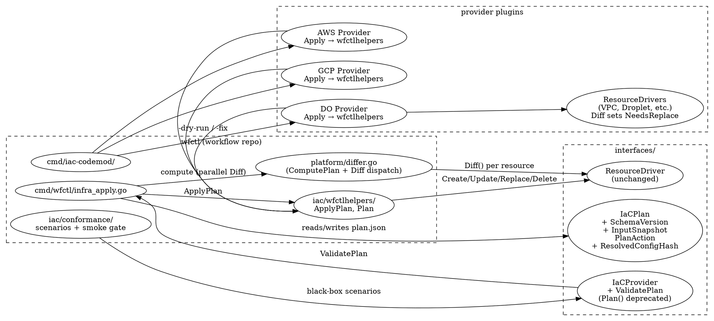

# IaC Root-Cause Fixes + Provider Conformance Suite — Design

**Status:** Revision 1 (post adversarial review #1 — addresses 2 Critical + 8 Important + 6 Minor findings)
**Authors:** Claude (Jon's instruction)
**Forcing function:** core-dump's 12-hour self-hosted-PG deploy iteration (2026-05-03) surfaced compounding wfctl + workflow-plugin-digitalocean gaps that aren't surface bugs — they're missing semantic guarantees.

## Problem

Eight root-cause issues block production deploys against any provider plugin, not just DigitalOcean. Surface workarounds exist for each but each adds operational complexity. The user's mandate is explicit: **fix the deeper root problems in wfctl + the DO plugin so future providers (AWS, GCP, Azure already exist as real plugins, not stubs) inherit correct behavior; extract the hard cases into a provider-conformance suite so regressions are caught at PR time.**

The 8 issues:

| Issue | Symptom | Root cause |
|---|---|---|
| A | `error: plan stale: config hash mismatch` (no diagnostic) | `IaCPlan` carries raw `ResourceSpec.Config`, not post-substitution; apply has no way to print which env-var key changed |
| B | State outputs lag after plugin upgrade; `infra_output: <vpc>.id` fails with `field "id" not found in outputs` | Apply skips Read on unchanged resources → state.outputs stays at older plugin's schema |
| C | Plugin Diff returns `NeedsReplace=true` but apply calls driver `Update()` (which godo Droplet rejects) | `platform.ComputePlan` doesn't call `ResourceDriver.Diff`; `Action="replace"` is in the enum docstring but never emitted; provider `Apply` switch has no `case "replace"` |
| D | DO API rejects `vpc.id` with "Apps in region nyc can only connect to VPCs in nyc1" — passed plan/security-check/alignment | No mechanism for plan-time cross-resource constraint validation |
| E | Downstream module's `${SECRET}` substitution sees empty during apply because `syncInfraOutputSecrets` runs POST-apply | Secret resolution happens in one batch after all resources are created, not per-module dependency-ordered |
| F | Same as B framed differently: state-output schema migration on plugin upgrade | No automatic refresh when plugin's Outputs map evolves |
| G | `protected: true` rejects all replace-required plans even when the operator wants the replace (e.g. region migration of an empty resource) | `--allow-protected-prune` (workflow PR #519) is all-or-nothing |
| H | Each provider plugin has its own driver tests (CRUD + Diff); wfctl's behavior across these scenarios isn't tested per-provider | No shared conformance suite — providers can re-introduce any of A-G silently |

### Latent bugs incidentally surfaced (review #1 Critical #2)

The investigation revealed two latent bugs that the design must address explicitly:

1. **Delete-via-Apply state leakage.** `platform.ComputePlan` emits `delete` actions today (`platform/differ.go:54-69`), but `DOProvider.Apply` has no `case "delete"` (`workflow-plugin-digitalocean/internal/provider.go:194-235`); deletes fall to `default: unknown action`. wfctl's apply path then unconditionally removes state for delete-named resources after Apply returns regardless of whether the cloud resource was actually deleted (`cmd/wfctl/infra_apply.go:435-440`). Today, a `wfctl infra apply` plan containing a delete silently leaves the cloud resource alive while pruning state. **W-3 fixes this by adding `case "delete"` to `wfctlhelpers.ApplyPlan`** — operators relying on the current (broken) behavior MUST be alerted via the W-3 PR description and conformance scenario `Scenario_DeleteActionInApplyInvokesDriverDelete`.

2. **Plan-time gRPC cost regression risk in W-3.** Calling `provider.ResourceDriver(spec.Type).Diff(ctx, spec, current)` per existing resource adds N gRPC roundtrips per plan render (every external plugin uses `remoteResourceDriver` per `cmd/wfctl/deploy_providers.go:642-678`). For 50+ resources, plan render becomes slow + structpb-corruption-interactions with BC-2 (precedent design `2026-04-28-iac-plugin-review-design.md`) can silently regress W-3's whole purpose. Mitigation specified in W-3 below.

## Approach

**Approach 3 (chosen): Refactor `IaCProvider` semantics in-place + ship the conformance suite as proof of correctness + provide codemod tooling so the per-plugin migration is mechanical.**

Two alternatives considered + rejected with explicit cost-benefit:

### Approach 1 — Surgical patches per issue
Eight independent bugfix PRs, no cross-cutting refactor.

**Trade-off**: fast individual reviews; no enforced contract; a new provider can re-introduce any gap. **Rejected** — violates the user's "build benefits all providers" mandate.

### Approach 2 — `IaCPlannerV2` interface alongside V1
The user's second message named "iacplannerv2" — this design originally pivoted away too quickly. Re-examining now per review #1 Important finding:

| Dimension | Approach 2 (V1+V2 dual) + codemods | Approach 3 (in-place) + codemods |
|---|---|---|
| Per-plugin PR count | 1 PR per plugin (V2 implementation) | 1 PR per plugin (codemod-applied) |
| Wfctl-side maintenance | Two interfaces forever; adapter shim per gap | Single interface; helpers package |
| Migration safety | Old plugins keep running V1 during migration | Flag-day for plugin upgrade — but codemod produces same correctness |
| Conformance enforcement | Test V2 only; V1 plugins exempt → silent drift on legacy | Test the single interface; no exempt path |
| User mandate "build benefits all providers" | Yes, IF all providers migrate; deferred V1 plugins skip the benefit | Yes, immediately for all 4 providers |
| Long-tail edge cases | Bugs accumulate in V1 wrapper for plugins that don't migrate | None — single code path |

**Why Approach 3 strictly dominates Approach 2 in this context**: codemods give the same migration ergonomics either way. The difference is what happens AFTER migration. Approach 2 leaves V1 supported indefinitely; we keep paying for the adapter layer + risk silent V1 divergence. Approach 3 deletes V1 once the codemod runs — single code path forever, conformance suite is the regression net. The user said "build these fixes the right way" + "core-dump is in no rush" → flag-day is acceptable.

If the user later disagrees and wants V1/V2 dual, the in-place refactor is reversible by un-applying the codemods + restoring `provider.Plan()` body. Direction is auditable.

### What changes (Approach 3 detail)

The design has 9 components: 8 issue fixes + 1 cross-cutting test/migration infrastructure.

#### W-1: `IaCPlan` schema extension + per-action diagnostic (issue A)

Add to `interfaces/iac_state.go`:

```go
type IaCPlan struct {
    // ... existing fields ...
    DesiredHash       string  // existing — unchanged
    SchemaVersion     int     // NEW — bumped when on-disk plan format changes (W-5 also bumps)
    InputSnapshot     map[string]string  // NEW — env-var name → 16-hex-char (64-bit) sha256 prefix of value
}

type PlanAction struct {
    // ... existing fields ...
    ResolvedConfigHash string  // NEW — per-action SHA-256 of POST-substitution Config
                                // (was discussed as IaCPlan-level; per-action enables per-resource diagnostic)
}
```

Apply re-computes per-action `ResolvedConfigHash` at apply-time using the SAME substitution pipeline used at plan-time. Mismatch detection:

```
error: plan stale: 1 resource's resolved config differs since plan
  resource: coredump-staging-app
  hint: plan ran at 14:18Z without STAGING_PG_PASSWORD; apply at 14:20Z had it set
        env vars referenced by this resource that changed:
          STAGING_PG_PASSWORD: fingerprint a3f1c89d4e617923 (plan) → b7e2406d8c91c5f1 (apply)
        rerun `wfctl infra plan` to refresh
```

**InputSnapshot fingerprint length** (review #1 Important #6 — was 8 hex / 32 bits, feasible reverse-lookup for low-entropy secrets like `random_hex 8` = 64 bits): bumped to **16 hex chars (64 bits preimage resistance)**. No real cost difference vs 8 chars. Plus:

- Wfctl validate-time check: warn if any repo using `wfctl infra plan` lacks `**/plan.json` in `.gitignore`
- `InputSnapshot` marked sensitive in state-store schema; logging filters apply
- Plan output strips InputSnapshot from human-readable summary (only the diagnostic on mismatch shows fingerprints)

#### W-2: `wfctl infra refresh-outputs` + cheap apply-time refresh (issues B, F)

**Two mechanisms, intentionally complementary:**

a. **Cheap apply-time refresh** — `runInfraApply` adds an `outputs-only refresh` pre-step before computing the plan. For each tracked resource: call `Read`, compare returned Outputs to `state.outputs`, write to state ONLY if any field differs (or new field appears). Cost: one Read API call per tracked resource per apply.

  **Cost analysis (review #1 Important):** for a 50-resource staging deploy, 50 cloud Read calls. DO API rate limit is 5000/hour/account → ~70 deploys/hour worth of headroom for refresh alone. AWS API limits per-service. Mitigation: **parallel Reads with bounded concurrency (default 8 concurrent, configurable via `WFCTL_REFRESH_CONCURRENCY`)**; per-Read 5s timeout; partial failure logs but doesn't block plan (state stays at last-known value for failed Reads).

b. **Standalone command** for emergency state recovery — `wfctl infra refresh-outputs --env staging` does the same thing as (a) but as a one-shot. Useful when an operator needs to surface current Outputs to a downstream consumer (e.g. `wfctl infra outputs --module X.field`) without performing an apply.

Neither path invokes `Update` or `Replace`; both are read-only at the cloud level + may write to state.

Distinction from existing `wfctl infra apply --refresh` (workflow PR #519): that command is **drift reconciliation** — re-reads + tries to reconcile config drift via Update calls. Refresh-outputs is **read-only** — re-reads + persists Outputs only, never invokes Update/Replace.

#### W-3: `Replace` action + ComputePlan refactor + ApplyPlan helper (issue C)

The single biggest refactor.

**`platform.ComputePlan` calls Diff per existing resource:**

```go
// New signature: takes provider so it can dispatch Diff to drivers
func ComputePlan(ctx context.Context, provider IaCProvider, desired []ResourceSpec, current []ResourceState) (IaCPlan, error)
```

For each existing resource, `ComputePlan` calls `provider.ResourceDriver(spec.Type).Diff(ctx, spec, currentOut)`:
- `!NeedsUpdate && !NeedsReplace` → skip
- `NeedsReplace=true OR any FieldChange.ForceNew=true` → emit `Action="replace"` with Changes
- otherwise → emit `Action="update"` with Changes

**Plan-time gRPC cost mitigation** (review #1 Critical #1):
- **Bounded-concurrency parallel Diff** (default 8 concurrent, configurable via `WFCTL_PLAN_DIFF_CONCURRENCY`). For 50 resources at 50ms gRPC roundtrip each = 312ms wall time at concurrency 8.
- **Diff cache** keyed by `(plugin-version, resource-type, sha256(spec.Config), sha256(current.Outputs))`. Stored at `~/.cache/wfctl/diff/`. Cache hit skips gRPC roundtrip. For an operator iterating `wfctl infra plan` while authoring config, second run hits cache for unchanged resources.
- **Conformance scenario `Scenario_DiffSurvivesGRPCRoundTrip`** (variant of precedent BC-2 / `Scenario_StructpbBoundary_DiffSurvivesRoundTrip`) — runs against actual `remoteResourceDriver` wrapper, NOT in-process driver. Catches structpb-corruption interactions where typed-slice Outputs at Create time arrive nil at in-process Diff after gRPC.
- **Sequencing constraint**: W-3 gates on each plugin's BC-2 audit being closed (per precedent `2026-04-28-iac-plugin-review-design.md`). Plugins with open BC-2 findings cannot opt into the new ComputePlan path until their Outputs marshalling is verified gRPC-safe.

**`wfctlhelpers.ApplyPlan(ctx, provider, plan)` shared helper:**

```go
// New package: workflow/iac/wfctlhelpers/
func ApplyPlan(ctx context.Context, p interfaces.IaCProvider, plan *interfaces.IaCPlan) (*interfaces.ApplyResult, error)
```

Handles all 4 actions:
- `create` → `driver.Create(ctx, spec)`
- `update` → `driver.Update(ctx, ref, spec)`
- `replace` → `driver.Delete(ctx, ref)` then `driver.Create(ctx, spec)` with state checkpoint between (intermediate marker so a mid-replace failure leaves state recoverable)
- `delete` → `driver.Delete(ctx, ref)` (the case absent in DOProvider today — see Latent Bugs above)

**Cascade replace + ProviderID propagation** (resolves review #1 Important #4 / author doubt #3):

Replace expands into a sub-plan: `[delete-dep1, delete-dep2, replace-target, create-dep1, create-dep2]`. Topological + reverse-topological ordering already exists in `platform/differ.go`.

**Critical addition**: when `replace-target` Create completes, its new ProviderID writes to a per-apply substitution map (`replaceIDMap`). Subsequent dependent `create-depN` actions resolve `${MODULE.id}` references against this map AT APPLY TIME (not just plan time). The dependent's effective config differs from the plan's pre-computed config in ONE field (the parent's ID); we log a single-line WARN noting the auto-update and proceed.

This is implemented as part of W-5's per-module substitution pipeline (it's the same mechanism — substituting late-binding values JIT). W-5's section spells out the implementation; this section names the dependency.

**Bugs incidentally fixed by W-3** (must call out in W-3 PR description):
- Delete-via-Apply state leakage (latent bug #1 above)
- ForceNew fields silently downgraded to Update (issue C itself)

**Conformance scenarios for W-3:**
- `Scenario_NeedsReplaceTriggersReplaceAction` — driver Diff returns NeedsReplace=true → Plan emits Action=replace → Apply does Delete+Create
- `Scenario_DeleteActionInApplyInvokesDriverDelete` — plan with delete action → Apply calls driver.Delete → cloud resource gone
- `Scenario_DiffSurvivesGRPCRoundTrip` — typed Outputs at Create survive gRPC roundtrip without corruption at Diff time
- `Scenario_ReplaceCascadePreservesDependents` — module A is replaced; module B (depends on A) is deleted first, A is replaced, B is recreated, B's resolved config sees A's NEW ProviderID via replaceIDMap

#### W-4: `Provider.ValidatePlan` hook + R-A10 align rule (issue D)

New optional method on `interfaces.IaCProvider`:

```go
// ValidatePlan runs provider-specific cross-resource constraint checks against
// a finalized plan. Returns diagnostics; non-fatal (Severity == Warning) are
// shown in plan output, fatal (Severity == Error) block apply.
//
// Optional: providers that don't implement it return nil (no diagnostics).
ValidatePlan(plan *IaCPlan) []Diagnostic
```

`cmd/wfctl/infra_align_rules.go` gains `checkRA10_provider_validate_plan(ctx)` that calls `provider.ValidatePlan(plan)` for each provider and surfaces results as align findings.

**Cross-provider constraint examples** (review #1 Minor #2 — was DO-only):

| Provider | Example constraint |
|---|---|
| DO | App Platform `region: nyc` → `vpc_ref` must reference VPC with `region: nyc1` (the bug we hit) |
| DO | App Platform `region: sfo` → `vpc_ref` must be `sfo2` or `sfo3` |
| AWS | Security Group rule referencing source SG ID — both must be in same VPC |
| AWS | Subnet `availability_zone` must be in the parent VPC's region |
| GCP | Regional load-balancer backend service requires regional NEG (not zonal/global) |
| Azure | NSG attached to NIC must be in same region as the VNet |
| Azure | Storage Account `account_kind: BlobStorage` only supports specific replication types |

These are illustrative; the design doesn't require shipping all of them in W-4. Each provider plugin ships its own ValidatePlan implementation per its known constraints. Conformance scenario `Scenario_CrossResourceConstraintRejection` is generic — provider supplies its own constraint-violating fixture.

**Why a hook on the provider rather than a manifest schema (DSL):** the constraint matrix for each cloud is provider-specific knowledge. A schema would be premature abstraction. The provider knows its own rules; wfctl just asks. (Considered: extracting to DSL later if 4+ providers converge on common constraint patterns. Not now.)

#### W-5: Per-module infra_output JIT secret resolution + ProviderID propagation (issue E + W-3 cascade)

Today (`cmd/wfctl/infra.go:1111-1141`):

```
runInfraApply:
  resolveSecrets(all)   ← ${SECRET} substitution happens for all modules at once
  Plan
  Apply (creates resources)
  syncInfraOutputSecrets   ← infra_output secrets resolved here, after apply
```

After:

```
runInfraApply:
  Plan (against best-known state — infra_output secrets may be empty initially;
        plan.SchemaVersion bumped to mark JIT-style)
  ApplyPlan iterates plan.Actions:
    for each action:
      resolveJITSubstitutions(action.Resource, replaceIDMap, syncedInfraOutputs)
        ← resolves ${SECRET} for any infra_output where source module
          has already been applied this run; AND resolves ${MODULE.id}
          against replaceIDMap from W-3 cascade Replace
      execute action with newly-resolved values in env
  Final syncInfraOutputSecrets (sync to GH for next run)
```

**Plan format compatibility** (review #1 Important #2 — rollback): `IaCPlan.SchemaVersion int` introduced in W-1 is bumped by W-5. Older wfctl reading a JIT-style plan rejects with:

```
error: plan was generated by a newer wfctl (schema version 2);
       this binary only supports schema version 1.
       run `wfctl infra plan` with the current binary to regenerate.
```

This makes W-5 rollback safe — operator gets a clear message instead of silent hash mismatch.

**Plan output operator audit** (review #1 Important): plan output annotates each action with substitution variables it WILL resolve at apply time:

```
plan: 3 actions
  create coredump-staging-vpc (infra.vpc)
  create coredump-staging-pg (infra.droplet)
    will resolve at apply: ${STAGING_PG_PASSWORD} (infra-output)
  update coredump-staging (infra.container_service)
    will resolve at apply: ${STAGING_PG_HOST} ← from coredump-staging-pg.private_ip
                           ${STAGING_VPC_UUID} ← from coredump-staging-vpc.id
```

Operator sees what apply will fill in, even though plan can't compute the values yet.

**Mid-apply restart safety** (review #1 Minor #6): JIT resolution reads from STATE (which is written per-resource on success) and from `replaceIDMap` (in-memory, this-apply only). On restart after partial apply, state has the just-applied resource's outputs; JIT re-reads them. Naturally idempotent.

**Edge case — circular reference**: Module A's `${B_OUTPUT}` referencing Module B's `${A_OUTPUT}` → rejected at plan time (cycle in resolution graph).

**Partial-cascade discovery** (review #1 Important #3): ComputePlan batch-discovers ALL protected-dependent blockers in one pass (not one-at-a-time). Error message lists the entire cascade with copy-paste-ready flag value:

```
error: plan would require replacing 3 protected resources:
  coredump-staging-vpc      (region nyc3 → nyc1)
  coredump-staging-pg-data  (region nyc3 → nyc1)
  coredump-staging-pg       (cascade dependent — vpc_uuid changed)
to authorize, re-run with:
  --allow-replace=coredump-staging-vpc,coredump-staging-pg-data,coredump-staging-pg
```

#### W-6: Per-resource `--allow-replace` flag (issue G)

Apply gains `--allow-replace=name1,name2,...` (multi-value). At plan-action evaluation:

```go
if (action.Action == "replace" || action.Action == "delete") && isProtected(action.Resource) {
    if !inAllowReplaceList(action.Resource.Name) {
        return fmt.Errorf("resource %q is protected: true and would be %sd; pass --allow-replace=%s to override",
            action.Resource.Name, action.Action, action.Resource.Name)
    }
}
```

Existing `--allow-protected-prune` (PR #519) becomes a synonym for "all protected resources are allowed to be pruned this apply" — equivalent to listing every protected resource in `--allow-replace`. The new flag is the recommended one for production (intent-explicit per resource).

**Cross-team coordination story** (review #1 Important): for organizations where dependent resources have different owners, the plan output (W-5) prints the FULL cascade list including dependents. Owners coordinate by sharing the `--allow-replace=...` flag value before apply. This isn't a wfctl-enforced workflow (organizational); design only ensures the information needed for coordination is surfaced at plan time.

#### W-7: Conformance suite at `iac/conformance/` + smoke gate (issue H)

New package `iac/conformance/` (NOT under `plugin/sdk/iaclint/` — see W-8 for package boundary fix):

```
iac/conformance/
  scenarios.go        # public Run(t, Config) entry point
  scenarios_test.go   # in-tree self-tests using a fake provider
  scenario_*.go       # one file per scenario
  mocks/              # shared mock provider/driver helpers
  README.md           # how a provider plugin imports + runs the suite
```

Public API:
```go
package conformance

type Config struct {
    Provider func() interfaces.IaCProvider
    SkipScenarios map[string]string  // per-scenario opt-out with reason
    SmokeOnly     bool                // PR-time fast subset
    LiveCloud     bool                // permit cloud-required scenarios
}

func Run(t *testing.T, cfg Config)
```

Each provider's `_test.go`:
```go
//go:build conformance

func TestConformance(t *testing.T) {
    conformance.Run(t, conformance.Config{
        Provider: func() interfaces.IaCProvider { return digitalocean.NewProvider() },
        SmokeOnly: testing.Short(),  // -short flag → smoke gate only
        LiveCloud: os.Getenv("CONFORMANCE_LIVE_CLOUD") == "1",
    })
}
```

**Smoke gate** (review #1 Important #8 — conformance bit-rot): one cloud-bound scenario per provider runs on every PR (not just nightly):

| Provider | Smoke scenario | Resource | Cleanup |
|---|---|---|---|
| DO | `Scenario_NeedsReplaceTriggersReplaceAction` | `s-1vcpu-512mb-10gb` Droplet | `t.Cleanup` force-delete + verify |
| AWS | (same pattern) | `t4g.nano` EC2 | `t.Cleanup` |
| GCP | (same pattern) | `e2-micro` Compute | `t.Cleanup` |
| Azure | (same pattern) | `Standard_B1ls` VM | `t.Cleanup` |

Constraints:
- Per-PR ephemeral OIDC creds (not long-lived secrets in CI)
- Resource lifetime ≤5 min
- Force-cleanup in `t.Cleanup` even if test panics
- Cost cap: ≤$0.01/PR/provider (~$0.10/PR all 4 providers)
- Smoke runs ONLY on PRs touching the plugin OR `iac/`/`platform/` paths in workflow (not every workflow PR)

Full conformance scenarios (run nightly):

1. `Scenario_NeedsReplaceTriggersReplaceAction` (smoke gate; cloud-required)
2. `Scenario_DeleteActionInApplyInvokesDriverDelete` (cloud-required)
3. `Scenario_DiffSurvivesGRPCRoundTrip` (mock-only — exercises remoteResourceDriver wrapper)
4. `Scenario_OutputsRefreshDetectsNewFields` (mock-only)
5. `Scenario_PlanStaleDiagnostic` (mock-only)
6. `Scenario_CrossResourceConstraintRejection` (mock-only — provider supplies fixture)
7. `Scenario_InfraOutputCrossModuleResolution` (cloud-required for full coverage; mock variant for PR-time)
8. `Scenario_ProtectedReplaceWithoutOverride` (mock-only)
9. `Scenario_ProtectedReplaceWithOverride` (cloud-required)
10. `Scenario_OutputsConsistencyAcrossReadCycles` (cloud-required — load-bearing for refresh-outputs)
11. `Scenario_ReplaceCascadePreservesDependents` (cloud-required — most complex)

#### W-8: Codemod tooling at `cmd/iac-codemod/` (cross-cutting migration)

User asked: "for the refactor/migration ... think about if there's codemods or similar we can introduce". Per Approach 3, per-plugin Plan/Apply refactor across 4 providers needs mechanical tooling.

**Package boundary fix** (review #1 Important #7 + Minor #3):

| Concern | Package | Boundary |
|---|---|---|
| Driver-level test helpers (existing, per BC-1..BC-8 from precedent) | `plugin/sdk/iaclint/` | unchanged |
| Provider-level scenarios (this design) | `iac/conformance/` | NEW |
| Code-rewrite CLI (this design) | `cmd/iac-codemod/` | NEW (NOT under iaclint) |
| Source-code marker for codemod opt-out | `// wfctl:skip-plan-codemod` | NEW (clearly a codemod-tool concern) |

`cmd/iac-codemod/` built using `golang.org/x/tools/go/analysis/passes` framework. Modes:

- `cmd/iac-codemod/refactor-plan` — Detects `func (p *XProvider) Plan(...)` body matching the configHash compare pattern; replaces body with `return wfctlhelpers.Plan(ctx, p, desired, current)`.
- `cmd/iac-codemod/refactor-apply` — Detects the create/update switch in `Apply`; replaces with `return wfctlhelpers.ApplyPlan(ctx, p, plan)`.
- `cmd/iac-codemod/add-validate-plan` — Detects providers missing `ValidatePlan`; inserts no-op stub.
- `cmd/iac-codemod/remove-plan` — REMOVES `Plan()` method from providers post-deprecation (see W-9 below). Default mode is dry-run report; `-fix` applies.
- `cmd/iac-codemod/lint` — Static checks (no rewrite): `AssertPlanDelegatesToHelper`, `AssertApplyDelegatesToHelper`, `AssertDiffSetsNeedsReplaceForForceNew`, `AssertProviderImplementsValidatePlan`. Extends PR #512's iaclint matchers but in a new package.

**Dry-run-by-default safety** (review #1 Critical #1 sub-finding): every codemod defaults to dry-run report mode; `-fix` flag opts into mutation. Reports show:
- Per-file: which functions match the codemod pattern + would be rewritten
- Per-file: which functions DON'T match (might be intentional divergence — flagged for review)
- Recommended `// wfctl:skip-plan-codemod` markers for non-canonical providers

**Workspace migration runner**:
```sh
# Make target in workflow/Makefile
migrate-providers:
    @for p in workflow-plugin-{aws,gcp,azure,digitalocean}; do \
      cd $$WORKSPACE/$$p && \
      go run github.com/GoCodeAlone/workflow/cmd/iac-codemod refactor-plan -dry-run . | tee codemod-report.md && \
      echo "Review codemod-report.md and add // wfctl:skip-plan-codemod to any opt-out functions, then re-run with -fix"; \
    done
```

Two-step (dry-run → review → -fix) avoids the silent-corruption risk surfaced in review #1 Critical #1.

#### W-9: Deprecate `IaCProvider.Plan()` (review #1 Important #5)

Today `provider.Plan()` is dead code (no caller in `cmd/wfctl` or `platform`); wfctl exclusively uses `platform.ComputePlan`. After W-3, providers exclusively delegate Apply to `wfctlhelpers.ApplyPlan`.

W-3 marks `IaCProvider.Plan()` as deprecated:

```go
// Deprecated: Plan was never called by wfctl; platform.ComputePlan is the
// canonical planner. Existing implementations may be removed via
// `cmd/iac-codemod/remove-plan`. Will be removed from IaCProvider in v0.21.
Plan(ctx context.Context, desired []ResourceSpec, current []ResourceState) (*IaCPlan, error)
```

The codemod `remove-plan` removes the method body from each plugin (after maintainer review). v0.21 removes `Plan()` from the interface entirely.

**Why deprecate rather than delete in W-3**: gives plugin maintainers one minor-version cycle to migrate. Conformance suite tests the new contract (no `Plan()` call); existing plugins keep compiling.

### Sequencing (review #1 Minor #4 corrected)

Critical sequencing change: **W-7 (conformance) MUST land before any P-* PR** so the per-plugin codemod migration has scenarios to run against.

| PR | Repo | Scope | Depends on |
|---|---|---|---|
| W-1 | workflow | `IaCPlan.InputSnapshot` + `PlanAction.ResolvedConfigHash` + `IaCPlan.SchemaVersion`; plan-stale diagnostic upgrade (#1) | — |
| W-2 | workflow | `wfctl infra refresh-outputs` + cheap apply-time refresh (#2); bounded concurrency | W-1 |
| W-3 | workflow | Replace action — `ComputePlan` calls Diff + emits replace; `wfctlhelpers.ApplyPlan` shared helper; delete-via-Apply fix; gRPC concurrency + cache (#3) | W-1, W-2; per-plugin BC-2 audit closed |
| W-4 | workflow | `Provider.ValidatePlan` interface method + R-A10 align rule (#4) | W-3 |
| W-5 | workflow | Per-module infra_output JIT secret resolution + ProviderID propagation (#5); SchemaVersion bump | W-3 |
| W-6 | workflow | `--allow-replace=<names>` flag (#6); partial-cascade batch discovery | W-3 |
| W-7 | workflow | `iac/conformance/` package + smoke gate (#7) | W-3, W-4, W-5, W-6 (so all scenarios are testable) |
| W-8 | workflow | `cmd/iac-codemod/` (codemod tooling, dry-run default) | W-3, W-4 |
| W-9 | workflow | `IaCProvider.Plan()` deprecation marker | W-3 |
| P-DO, P-AWS, P-GCP, P-AZ | each plugin | Run codemod; collapse Plan/Apply; implement `ValidatePlan`; add conformance test | W-7 + W-8 |
| C-1 | core-dump | Bump wfctl + plugin pins; revert tactical workarounds in deploy.yml; complete the staging-PG migration to `nyc1` (region was the original blocker) | P-DO |

W-1..W-9 are workflow PRs (sequenced as shown). P-* runs after W-7 + W-8 in parallel. C-1 closes the core-dump deploy iteration.

### Tests

Per the verification-per-change-class table in `writing-plans/SKILL.md`:

- W-1 (schema extension + diagnostic): unit tests for hash compute + diagnostic format + InputSnapshot fingerprint length
- W-2 (refresh): unit tests for state-write-only-on-diff invariant; concurrency test
- W-3 (replace): conformance scenarios `NeedsReplaceTriggersReplaceAction`, `DeleteActionInApplyInvokesDriverDelete`, `DiffSurvivesGRPCRoundTrip`, `ReplaceCascadePreservesDependents`; topology test; concurrency stress test
- W-4 (ValidatePlan): conformance scenario `CrossResourceConstraintRejection`
- W-5 (JIT secret resolution): conformance scenario `InfraOutputCrossModuleResolution` + cycle-detect test + restart-mid-apply test + SchemaVersion-rollback rejection test
- W-6 (--allow-replace): conformance scenarios `ProtectedReplaceWithoutOverride` + `ProtectedReplaceWithOverride`; partial-cascade batch test
- W-7 (conformance + smoke gate): self-tests for each scenario using fake provider; smoke gate cost-cap test; cleanup-on-panic test
- W-8 (codemod): golden-file tests for each codemod across multiple plugin shapes (canonical, with-batch-optimization, with-mock-injection); dry-run-output snapshot test
- W-9 (deprecation): build-time test that `// Deprecated:` marker is present
- P-* (per-plugin migration): conformance suite must pass; existing driver tests unchanged

For runtime-affecting changes (W-2, W-3, W-5, P-*), the verification step includes runtime-launch-validation: build the plugin binary, run a representative apply against an ephemeral test provider, confirm exit 0 + expected state writes.

### Architecture diagram



## Assumptions

1. **Driver `Diff` is faithful** — providers correctly set `NeedsReplace` and `FieldChange.ForceNew` in their Diff implementations. **Falsity:** wfctl emits wrong action class. **Mitigation:** conformance scenario `NeedsReplaceTriggersReplaceAction` + codemod lint `AssertDiffSetsNeedsReplaceForForceNew` + smoke gate runs on every relevant PR.

2. **Driver `Read` is deterministic per resource** — calling Read twice on an unchanged resource returns identical Outputs. **Falsity:** state thrash on every refresh-outputs cycle. **Mitigation:** conformance scenario `OutputsConsistencyAcrossReadCycles`.

3. **Cross-resource constraints expressible per-provider in Go** — DO/AWS/GCP/Azure can each express their constraint matrix in `ValidatePlan`. **Falsity:** some constraint requires cross-provider coordination (rare). **Mitigation:** ValidatePlan returns `[]Diagnostic` — generic; provider can compute anything. If 4+ providers converge on common patterns, extract DSL later.

4. **`InputSnapshot` 16-hex (64-bit) fingerprint resists targeted reverse-lookup** — preimage attack on 64 bits requires 2^63 work expected. Even for low-entropy secrets the attacker would need the snapshot file AND a candidate value to verify. **Falsity:** a sophisticated targeted attacker with both inputs can verify a guess. **Mitigation:** plan.json marked sensitive; gitignore-check at validate time; logging filters strip InputSnapshot from traces.

5. **Per-module JIT secret resolution + ProviderID propagation doesn't break determinism** — secrets resolved JIT either come from durable state (just-applied resource's outputs) or from the in-apply replaceIDMap (deterministic for this apply). **Falsity:** a non-deterministic Read could return different outputs across JIT calls. **Mitigation:** assumption #2 covers this.

6. **Replace cascade order — delete-dependents → delete-target → replace-target → create-dependents — is the right pattern** for the workloads we deploy. Trade-off: brief unavailability of dependents during the replace cycle. **Falsity:** zero-downtime replace requires blue-green orchestration which this design doesn't address. **Mitigation:** documented limitation; out of scope for this design.

7. **Conformance suite cloud-bound smoke gate is affordable** — ≤$0.01/PR/provider × 4 providers = ≤$0.04/PR. At 50 PRs/week = $2/week ≈ $100/year. **Falsity:** PR volume ramps 10x or providers add expensive smoke resources. **Mitigation:** smoke gate runs ONLY on PRs touching the plugin OR `iac/`/`platform/` paths; explicit cost cap config; revisit at the 10x-PR milestone.

8. **Codemod can mechanically refactor canonical Plan/Apply switch statements** — providers with idiosyncratic Plan/Apply use `// wfctl:skip-plan-codemod` opt-out. Codemod default mode is dry-run report (review-then-fix), not silent mutation. **Falsity:** codemod misses an idiom and silently corrupts a non-canonical provider that didn't add the opt-out. **Mitigation:** dry-run default + per-file diff report + golden-file tests across multiple known plugin shapes.

9. **Existing plugins (DO, AWS, GCP, Azure) have closed BC-2 (structpb-boundary) audit before W-3 lands** — if a plugin's Outputs contain typed slices that corrupt across gRPC, in-process Diff sees nil and silently misclassifies. **Falsity:** a plugin's BC-2 audit is incomplete; W-3 makes the bug worse (now it affects plan classification, not just runtime). **Mitigation:** W-3 sequencing constraint — gates per-plugin migration on BC-2 audit closed for that plugin (per precedent design `2026-04-28-iac-plugin-review-design.md`).

10. **AWS/GCP/Azure provider plugins are actively used or will be in foreseeable future** — if they're orphaned, the per-plugin PRs are wasted effort. **Falsity:** the migration becomes 4 PRs of refactor with no consumer. **Mitigation:** workflow has shipped these plugins (per Explore agent's report); even if not in production today, they're the obvious onboarding path for new clouds. Per-plugin PR cost is bounded (codemod-driven). If user signals "abandon AWS/GCP/Azure", reduce scope.

## Top doubts (for adversarial review #2 to attack — review #1's doubts addressed above)

1. **Diff cache invalidation correctness** — keying by `(plugin-version, resource-type, sha256(spec.Config), sha256(current.Outputs))` should cover all inputs to Diff. But if a Diff implementation depends on an environment variable or a side-channel (e.g. cloud rate-limit-aware backoff that returns different DiffResult under load), cache returns stale. Mitigation: document Diff invariants in the conformance contract; scenario `Scenario_DiffPureFunction` could enforce.

2. **`replaceIDMap` thread safety** — if W-3 parallel Diff and W-5 JIT substitution share state, the per-apply mutex needs to be explicit. Worth specifying in implementation but not load-bearing for design correctness.

3. **Smoke gate failure rate from cloud flakes** — DO/AWS/GCP/Azure APIs occasionally return 5xx; the smoke gate could become a flaky PR-blocker. Mitigation: 2-attempt retry with exponential backoff in the smoke runner; fail only after both attempts.

## Rollback

This design changes runtime semantics for every IaC apply (W-3 is the largest behavior change). Rollback strategy per PR:

- **W-1, W-4, W-6, W-9** are additive (new fields/methods/commands; no behavior change to existing code paths). Roll back by unmerging.
- **W-2** (apply-time refresh): pre-step is opt-in via `WFCTL_REFRESH_OUTPUTS` env var initially (default off in v0.20.x; default on in v0.21.x). Rollback = unset the env or revert.
- **W-3** (Replace action) is the most invasive — rollback requires reverting `platform.ComputePlan` to no-Diff behavior + reverting plugin Apply switches. **Plugin PRs (P-DO, etc.) depend on W-3 — must roll back together.** `wfctlhelpers.ApplyPlan` stays available even during rollback so plugins can choose to migrate later.
- **W-5** (per-module JIT) changes apply ordering AND plan format. Rollback = bump wfctl back to a binary with `IaCPlan.SchemaVersion <= N`. Older binary REJECTS newer plans with a clear "regenerate this plan" error (per W-1's SchemaVersion check) — operator regenerates plan with old binary, applies safely. Avoids silent hash mismatch corruption.
- **W-7, W-8** are tooling — roll back by unmerging.

For each W-PR, the PR description includes a "Rollback" section pointing at the inverse commit + any required env-var or schema-version state. **Reverse codemod is NOT promised** (review #1 Minor #5) — plugin rollback is manual revert; conformance suite catches incorrect rollback.

For post-W-3 rollback in production: if a deploy detects unexpected replace behavior (e.g. operator missed `--allow-replace`), the operator can:
1. Cancel apply mid-flight (signal handling per cmd/wfctl/main.go ctx cancellation)
2. Re-run plan to confirm desired state
3. Either add `--allow-replace` or revert the config change

If the deploy completed an unintended replace, recovery requires manual cloud restoration (out of scope — same as today's accidental destroy).

## Out of scope

- AWS/GCP/Azure provider feature parity beyond the conformance fix (the user said "core-dump is in no rush" but didn't ask for new resource types in non-DO providers; we ONLY refactor existing Plan/Apply).
- New resource types in DO plugin (those are downstream of this design).
- DO Managed Postgres support for AGE (orthogonal — DO product limitation).
- Removing `apply --refresh` flag (workflow PR #519). Complementary; refresh-outputs is read-only, apply --refresh is drift reconciliation. Both stay.
- Zero-downtime replace orchestration (blue-green-style); current design has dependent unavailability window during cascade replace.
- Cross-team protected-replace coordination as a wfctl-enforced workflow; design only ensures the cascade information is surfaced at plan time.

## Decision record

This design is a candidate for ADR (Architecture Decision Record) per `recording-decisions/SKILL.md`:

- Divergence from precedent (current ComputePlan never calls Diff)
- Non-trivial trade-off between ≥3 plausible approaches (Approach 1 surgical patches, Approach 2 V1+V2 dual, Approach 3 in-place refactor — explicitly compared in Approach section)
- Cross-skill structural change (introduces conformance suite as a new test class; deprecates an interface method)

ADR added at `decisions/<NNNN>-iac-conformance-and-replace.md` in the same commit as the writing-plans handoff.

## Changelog

- **Revision 1 (2026-05-03)**: Addresses adversarial review #1 — 2 Critical (W-3 gRPC cost + delete-via-Apply latent bug), 8 Important (Approach 2 cost-benefit, plan-format-version, partial-cascade discovery, ProviderID cascade propagation, Plan() deprecation, InputSnapshot fingerprint length, package boundaries, conformance smoke gate), 6 Minor (terminology, ValidatePlan examples, codemod marker, sequencing, reverse codemod scope, JIT restart). Added W-9 (Plan() deprecation). Renamed `cmd/iaclint/codemod/` → `cmd/iac-codemod/`. Bumped InputSnapshot fingerprint to 16 hex / 64 bits. Made codemod default mode dry-run.
