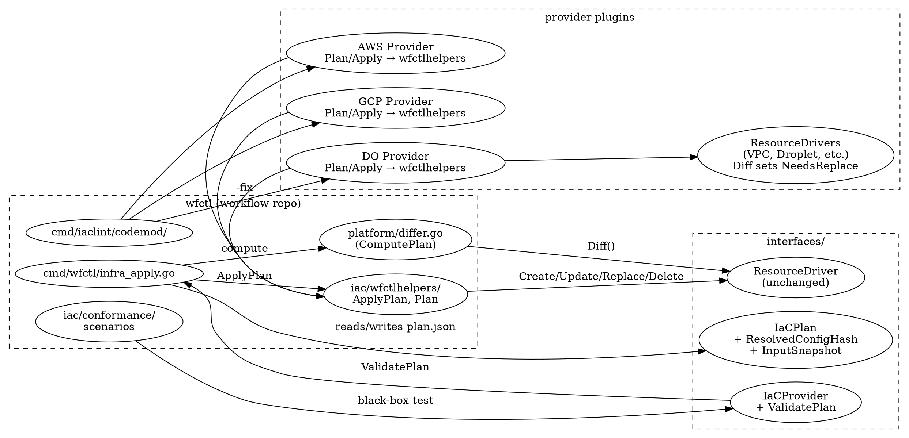

# IaC Root-Cause Fixes + Provider Conformance Suite — Design

**Status:** Draft for adversarial review
**Authors:** Claude (Jon's instruction)
**Forcing function:** core-dump's 12-hour self-hosted-PG deploy iteration (2026-05-03) surfaced compounding wfctl + workflow-plugin-digitalocean gaps that aren't surface bugs — they're missing semantic guarantees.

## Problem

Eight root-cause issues block production deploys against any provider plugin, not just DigitalOcean. Surface workarounds exist for each but each adds operational complexity. The user's mandate is explicit: **fix the deeper root problems in wfctl + the DO plugin so future providers (AWS, GCP, Azure already exist as real plugins, not stubs) inherit correct behavior; extract the hard cases into a provider-conformance suite so regressions are caught at PR time.**

The 8 issues:

| Issue | Symptom | Root cause |
|---|---|---|
| A | `error: plan stale: config hash mismatch` (no diagnostic) | `IaCPlan` carries raw `ResourceSpec.Config`, not post-substitution; apply has no way to print which env-var key changed |
| B | State outputs lag after plugin upgrade; `infra_output: <vpc>.id` fails with `field "id" not found in outputs` | Apply skips Read on unchanged resources → state.outputs stays at older plugin's schema |
| C | Plugin Diff returns `NeedsReplace=true` but apply calls driver `Update()` (which godo Droplet rejects) | `platform.ComputePlan` doesn't call `ResourceDriver.Diff`; `Action="replace"` is in the enum docstring but never emitted; provider `Apply` switch has no `case "replace"` |
| D | DO API rejects `vpc.id` with "Apps in region nyc can only connect to VPCs in nyc1" — passed plan/security-check/alignment | No mechanism for plan-time cross-resource constraint validation |
| E | Downstream module's `${SECRET}` substitution sees empty during apply because `syncInfraOutputSecrets` runs POST-apply | Secret resolution happens in one batch after all resources are created, not per-module dependency-ordered |
| F | Same as B framed differently: state-output schema migration on plugin upgrade | No automatic refresh when plugin's Outputs map evolves |
| G | `protected: true` rejects all replace-required plans even when the operator wants the replace (e.g. region migration of an empty resource) | `--allow-protected-prune` (workflow PR #519) is all-or-nothing |
| H | Each provider plugin has its own driver tests (CRUD + Diff); wfctl's behavior across these scenarios isn't tested per-provider | No shared conformance suite — providers can re-introduce any of A-G silently |

## Approach

**Approach 3 (chosen): Refactor `IaCProvider` semantics in-place + ship the conformance suite as proof of correctness + provide codemod tooling so the per-plugin migration is mechanical.**

Two alternatives considered + rejected:

- **Approach 1 — Surgical patches per issue.** Eight independent bugfix PRs, no cross-cutting refactor. Trade-off: fast individual reviews, but no enforced contract; a new provider can re-introduce any gap. **Rejected** — violates the user's "build benefits all providers" mandate.
- **Approach 2 — New `IaCPlannerV2` interface alongside V1.** Existing providers keep V1; new ones implement V2. Trade-off: cleanest separation, but two interfaces to maintain; long tail of V1 edge-case divergence. **Rejected** — Go's lack of inheritance makes the V1/V2 adapter awkward; codemods make in-place refactor cheap enough that the cost-benefit favors a single canonical interface.

### What changes

The design has 9 components: 8 issue fixes + 1 cross-cutting test/migration infrastructure.

#### 1. `IaCPlan` schema extension (issue A)

Add to `interfaces/iac_state.go`:

```go
type IaCPlan struct {
    // ... existing fields ...

    // ResolvedConfigHash is a SHA-256 of every resource's POST-substitution
    // Config. Apply re-computes this and rejects if mismatched against the
    // raw ConfigHash; the diagnostic prints which resources differ.
    ResolvedConfigHash string `json:"resolved_config_hash,omitempty"`

    // InputSnapshot records every env var name read during ${VAR} substitution
    // along with a value-fingerprint (first 8 chars of sha256(value)). Apply
    // re-computes inputs, compares fingerprints, and prints exact key diffs.
    // Names alone aren't enough — same key with different value would mismatch
    // hash but match name set.
    InputSnapshot map[string]string `json:"input_snapshot,omitempty"`
}
```

Apply's "plan stale" diagnostic upgrades from:
```
error: plan stale: config hash mismatch (run wfctl infra plan again)
```
to:
```
error: plan stale: 1 input changed since plan
  STAGING_PG_PASSWORD: fingerprint a3f1c89d (plan) → b7e2406d (apply)
  hint: ensure all env vars referenced by infra.yaml are exported to both
        the Plan and Apply steps. Plan ran at 14:18Z without STAGING_PG_PASSWORD;
        Apply at 14:20Z had it set.
```

The fingerprint is 8 hex chars (32 bits), low collision risk for a typo-detection use case but no value-leak.

#### 2. `wfctl infra refresh-outputs` + cheap apply-time refresh (issues B, F)

**Two mechanisms, intentionally complementary:**

a. **Cheap apply-time refresh** — `runInfraApply` adds an `outputs-only refresh` pre-step before computing the plan. For each tracked resource: call `Read`, compare returned Outputs to `state.outputs`, write to state ONLY if any field differs (or new field appears). Cost: one API call per resource per apply. Eliminates the entire `outputsSchemaVersion` mechanism considered earlier — refresh is just-in-time, no schema version bookkeeping.

b. **Standalone command** for emergency state recovery — `wfctl infra refresh-outputs --env staging` does the same thing as (a) but as a one-shot. Useful when an operator needs to surface current Outputs to a downstream consumer (e.g. `wfctl infra outputs --module X.field`) without performing an apply.

Neither path invokes `Update` or `Replace`; both are read-only at the cloud level + may write to state.

Distinction from existing `wfctl infra apply --refresh` (workflow PR #519): that command is **drift reconciliation** — re-reads + tries to reconcile config drift via Update calls. Refresh-outputs is **read-only** — re-reads + persists Outputs only, never invokes Update/Replace.

#### 3. `Replace` action: ComputePlan + ApplyHelper (issue C)

The single biggest refactor.

**`platform.ComputePlan` calls Diff per existing resource:**

```go
// Pseudocode
for _, spec := range desired {
    if cur, exists := currentMap[spec.Name]; !exists {
        actions = append(actions, PlanAction{Action: "create", Resource: spec})
    } else {
        driver, err := provider.ResourceDriver(spec.Type)
        if err != nil {
            return nil, fmt.Errorf("plan %s: %w", spec.Name, err)
        }
        currentOut := outputsToResourceOutput(cur)
        diff, err := driver.Diff(ctx, spec, currentOut)
        if err != nil {
            return nil, fmt.Errorf("diff %s: %w", spec.Name, err)
        }
        switch {
        case !diff.NeedsUpdate && !diff.NeedsReplace:
            // skip
        case diff.NeedsReplace || hasForceNew(diff.Changes):
            actions = append(actions, PlanAction{
                Action: "replace", Resource: spec, Current: &cur, Changes: diff.Changes,
            })
        default:
            actions = append(actions, PlanAction{
                Action: "update", Resource: spec, Current: &cur, Changes: diff.Changes,
            })
        }
    }
}
```

Note `ComputePlan`'s signature gains a `provider IaCProvider` parameter (currently doesn't have one). Existing callers updated to thread the provider through.

**`wfctlhelpers.ApplyPlan(ctx, provider, plan)` shared helper:**

```go
// New package: workflow/iac/wfctlhelpers/
func ApplyPlan(ctx context.Context, p interfaces.IaCProvider, plan *interfaces.IaCPlan) (*interfaces.ApplyResult, error) {
    result := &interfaces.ApplyResult{PlanID: plan.ID}
    for _, action := range plan.Actions {
        d, err := p.ResourceDriver(action.Resource.Type)
        if err != nil { result.AddError(action, err); continue }
        var out *interfaces.ResourceOutput
        switch action.Action {
        case "create": out, err = d.Create(ctx, action.Resource)
        case "update":
            ref := refFromCurrent(action)
            out, err = d.Update(ctx, ref, action.Resource)
        case "replace":
            // Delete-current-then-create-new. Wraps a state-checkpoint
            // around each step so a mid-replace failure leaves state in a
            // recoverable shape.
            ref := refFromCurrent(action)
            if err = d.Delete(ctx, ref); err != nil { result.AddError(action, err); continue }
            result.RecordIntermediate(action, "deleted")
            out, err = d.Create(ctx, action.Resource)
            // If Create fails, state shows the resource as gone — operator
            // can re-run apply to retry the Create only. The intermediate
            // marker tells wfctl on next apply that this resource is in
            // half-replaced state.
        case "delete":
            ref := refFromCurrent(action)
            err = d.Delete(ctx, ref)
        default:
            err = fmt.Errorf("unknown action %q", action.Action)
        }
        if err != nil { result.AddError(action, err); continue }
        if out != nil { result.Resources = append(result.Resources, *out) }
    }
    // Post-apply: propagate replaced resources' new IDs into still-referencing
    // resources. If module B references coredump-staging-pg.private_ip and
    // coredump-staging-pg was just replaced, B's secret fingerprint changes
    // and B will plan as needing-update on next apply. We do NOT auto-update
    // B in this same apply — that would violate the plan-was-reviewed
    // invariant. The next plan/apply cycle picks it up.
    return result, nil
}
```

**Provider implementations collapse**: `DOProvider.Apply` becomes:
```go
func (p *DOProvider) Apply(ctx context.Context, plan *interfaces.IaCPlan) (*interfaces.ApplyResult, error) {
    return wfctlhelpers.ApplyPlan(ctx, p, plan)
}
```
~60 lines → 3 lines. Same collapse for AWS/GCP/Azure providers.

**Replace ordering** (topological): `platform.ComputePlan` already does topo-sort for create/update (deps-first) and reverse-topo for delete (dependents-first). Replace inherits BOTH: dependents are deleted first (reverse-topo), then the target is replaced, then dependents are recreated (topo). This requires Replace to expand into a sub-plan: `[delete-dep1, delete-dep2, replace-target, create-dep1, create-dep2]`. The expansion happens in ComputePlan, surfaced as an indented sub-action list in the plan output for operator review.

**Critical edge case — protected dependents.** If the target is protected and has a `--allow-replace` override but its dependents are also protected without overrides, the plan FAILS at plan time (not apply time). Operator must add overrides for every protected resource in the replace cascade.

#### 4. `Provider.ValidatePlan(plan) []Diagnostic` hook + R-A10 align rule (issue D)

New optional method on `interfaces.IaCProvider`:

```go
// ValidatePlan runs provider-specific cross-resource constraint checks against
// a finalized plan. Returns diagnostics; non-fatal (Severity == Warning) are
// shown in plan output, fatal (Severity == Error) block apply.
//
// Optional: providers that don't implement it return nil (no diagnostics).
ValidatePlan(plan *IaCPlan) []Diagnostic
```

DO plugin implements it for known constraints:
- App Platform `region: nyc` → `vpc_ref` must reference VPC with `region: nyc1`
- App Platform `region: sfo` → `vpc_ref` must reference VPC with `region: sfo2 or sfo3`
- (Future: managed_database `trusted_sources type=app` requires App in same project)

`cmd/wfctl/infra_align_rules.go` gains `checkRA10_provider_validate_plan(ctx)` that calls `provider.ValidatePlan(plan)` for each provider and surfaces results as align findings. Slots into the existing R-A1..R-A9 dispatch.

Why a hook on the provider rather than a manifest schema (DSL): the constraint matrix for each cloud is provider-specific knowledge. A schema would be premature abstraction. The provider knows its own rules; wfctl just asks.

#### 5. Per-module infra_output secret resolution (issue E)

Today (`cmd/wfctl/infra.go:1111-1141`):

```
runInfraApply:
  resolveSecrets(all)   ← ${SECRET} substitution happens for all modules at once
  Plan
  Apply (creates resources)
  syncInfraOutputSecrets   ← infra_output secrets resolved here, after apply
```

Problem: a downstream module that references `${UPSTREAM_OUTPUT}` sees empty during its own create.

After:

```
runInfraApply:
  Plan (against best-known state — infra_output secrets may be empty initially)
  ApplyPlan iterates plan.Actions:
    for each action:
      resolveJITSecretsForModule(action.Resource)  ← resolves any infra_output
                                                     secrets whose source modules
                                                     have already been applied
                                                     this run
      execute action with newly-resolved secrets in env
  Final syncInfraOutputSecrets (sync to GH for next run)
```

Plan-time gets a "best effort" plan — it can't know an upstream resource's output yet. Apply-time fills in the gap as resources come up. This requires `IaCPlan.PerModuleSubstitutionDeferred bool` flag (default true for new plans) so apply knows to do JIT substitution.

**Edge case — circular reference.** Module A's `${B_OUTPUT}` referencing Module B's `${A_OUTPUT}` is rejected at plan time (graph cycle in dependencies).

#### 6. Per-resource `--allow-replace` flag (issue G)

Apply gains `--allow-replace=name1,name2,...` (multi-value, comma-separated). At plan-action evaluation:

```go
if action.Action == "replace" || action.Action == "delete" {
    if isProtected(action.Resource) && !inAllowReplaceList(action.Resource.Name) {
        return fmt.Errorf("resource %q is protected: true and would be %sd; pass --allow-replace=%s to override",
            action.Resource.Name, action.Action, action.Resource.Name)
    }
}
```

Existing `--allow-protected-prune` (PR #519) becomes a synonym for "all protected resources are allowed to be pruned this apply" — equivalent to listing every protected resource in `--allow-replace`. The new flag is the recommended one for production (intent-explicit per resource).

#### 7. Conformance suite at `workflow/iac/conformance/` (issue H)

New package `iac/conformance/` with:

```
iac/conformance/
  scenarios.go        # public Run(t, Config) entry point
  scenarios_test.go   # in-tree self-tests using a fake provider
  scenario_*.go       # one file per scenario
  mocks/              # shared mock provider/driver helpers
  README.md           # how a provider plugin imports + runs the suite
```

Public API:
```go
package conformance

type Config struct {
    Provider func() interfaces.IaCProvider
    // Whether to skip scenarios that require live cloud calls. Set true in
    // PR-time CI (no creds); false in nightly + tag-time CI.
    SkipCloudCalls bool
    // Per-scenario opt-out for known-not-applicable cases (with reason).
    SkipScenarios map[string]string
}

func Run(t *testing.T, cfg Config)
```

Each provider's `_test.go`:
```go
//go:build conformance

func TestConformance(t *testing.T) {
    conformance.Run(t, conformance.Config{
        Provider: func() interfaces.IaCProvider { return digitalocean.NewProvider() },
        SkipCloudCalls: testing.Short(),
    })
}
```

Initial scenario coverage (one scenario file each):

1. **`Scenario_NeedsReplaceTriggersReplaceAction`** — desired spec with field marked ForceNew, plus existing state. Plan must emit Action=replace; Apply must do Delete+Create.
2. **`Scenario_OutputsRefreshDetectsNewFields`** — state has Outputs from plugin v1; Read returns Outputs from plugin v2 with a new field. Apply's pre-step refresh must persist the new field without invoking Update.
3. **`Scenario_PlanStaleDiagnostic`** — plan with env var X; apply with env var X changed. Error must name the changed key.
4. **`Scenario_CrossResourceConstraintRejection`** — desired plan that violates a provider constraint (region mismatch). `ValidatePlan` must surface a fatal diagnostic; align must FAIL.
5. **`Scenario_InfraOutputCrossModuleResolution`** — module B's config references module A's output. Plan applies A first → B sees A's output during its own create.
6. **`Scenario_ProtectedReplaceWithoutOverride`** — protected resource with NeedsReplace; plan must FAIL with hint to use `--allow-replace=<name>`.
7. **`Scenario_ProtectedReplaceWithOverride`** — same plan with `--allow-replace`; succeeds.
8. **`Scenario_OutputsConsistencyAcrossReadCycles`** — Read-after-Create must return Outputs that match Create's Outputs (the consistency invariant — load-bearing for refresh-outputs).
9. **`Scenario_ReplaceCascadePreservesDependents`** — module A is replaced; module B (depends on A) is deleted first, A is replaced, B is recreated, and B's resolved config sees A's new ID.

The suite extends `plugin/sdk/iaclint/` (PR #512) static matchers with runtime scenarios. `iaclint` catches structural bugs at compile/test time; conformance catches behavioral gaps at integration time. Complementary.

**Cloud-call gating**: each scenario declares `RequiresCloud: bool`. Default CI run (PR-time) sets `SkipCloudCalls: true` → only runs scenarios that work with mock providers. Nightly CI runs the full suite with creds. This keeps PR-time cycles fast and avoids burning DO/AWS/GCP credits on every PR.

#### 8. Codemod tooling at `cmd/iaclint/codemod/` (cross-cutting migration)

User asked: "for the refactor/migration ... think about if there's codemods or similar we can introduce to help along migrations". Since Approach 3 mandates a per-plugin Plan/Apply refactor across 4 providers, codemod tooling is essential.

Built using `golang.org/x/tools/go/analysis/passes` framework with `-fix` mode (well-precedented Go ecosystem pattern):

- `cmd/iaclint/codemod/refactor-plan` — Detects `func (p *XProvider) Plan(...)` body matching the configHash compare pattern; replaces body with `return wfctlhelpers.Plan(ctx, p, desired, current)`.
- `cmd/iaclint/codemod/refactor-apply` — Detects the create/update switch in `Apply`; replaces with `return wfctlhelpers.ApplyPlan(ctx, p, plan)`.
- `cmd/iaclint/codemod/add-validate-plan` — Detects providers missing `ValidatePlan`; inserts no-op stub `func (p *XProvider) ValidatePlan(*interfaces.IaCPlan) []interfaces.Diagnostic { return nil }`.
- `cmd/iaclint/codemod/lint` — Static checks (no rewrite): `AssertPlanDelegatesToHelper`, `AssertApplyDelegatesToHelper`, `AssertDiffSetsNeedsReplaceForForceNew`, `AssertProviderImplementsValidatePlan`. Extends PR #512's matchers.

**Workspace migration runner**:
```sh
# Make target in workflow/Makefile
migrate-providers:
    @for p in workflow-plugin-{aws,gcp,azure,digitalocean}; do \
      cd $$WORKSPACE/$$p && \
      go run github.com/GoCodeAlone/workflow/cmd/iaclint/codemod refactor-plan -fix . && \
      go run github.com/GoCodeAlone/workflow/cmd/iaclint/codemod refactor-apply -fix . && \
      go run github.com/GoCodeAlone/workflow/cmd/iaclint/codemod add-validate-plan -fix . && \
      go test -tags=conformance ./...; \
    done
```

A maintainer runs this once across the workspace; each plugin gets a self-contained PR with the codemod-generated diff + conformance suite verification.

**Limitation**: codemods only handle the canonical pattern. Providers with idiosyncratic Plan/Apply (intentional divergence) are flagged for manual review by `lint`. Doc explicitly says: "if your provider has custom Plan/Apply for legitimate reasons, opt out by adding `// iaclint:skip-plan-codemod` above the function."

### Sequencing

The 9 components can ship as 7 PRs in 2 repos plus per-plugin PRs:

| PR | Repo | Scope |
|---|---|---|
| W-1 | workflow | Add `IaCPlan.ResolvedConfigHash` + `InputSnapshot` schema; plan-stale diagnostic upgrade (#1) |
| W-2 | workflow | `wfctl infra refresh-outputs` + cheap apply-time refresh (#2) |
| W-3 | workflow | Replace action — `ComputePlan` calls Diff + emits replace; `wfctlhelpers.ApplyPlan` shared helper (#3) |
| W-4 | workflow | `Provider.ValidatePlan` interface method + R-A10 align rule (#4) |
| W-5 | workflow | Per-module infra_output JIT secret resolution (#5) |
| W-6 | workflow | `--allow-replace=<names>` flag (#6) |
| W-7 | workflow | `iac/conformance/` package + `cmd/iaclint/codemod/` (#7, #8) |
| P-DO | workflow-plugin-digitalocean | Run codemod; collapse Plan/Apply; implement `ValidatePlan` for DO region constraints; add conformance test |
| P-AWS, P-GCP, P-AZ | each plugin | Same codemod treatment |
| C-1 | core-dump | Bump wfctl + plugin pins; revert tactical workarounds in deploy.yml; complete the staging-PG migration to `nyc1` (region was the original blocker) |

W-1..W-7 are sequential in workflow. P-* runs in parallel against the new contracts.

### Tests

Per the verification-per-change-class table in `writing-plans/SKILL.md`:

- W-1 (schema extension + diagnostic): unit tests for hash compute + diagnostic format
- W-2 (refresh): unit tests for state-write-only-on-diff invariant
- W-3 (replace): conformance scenario `NeedsReplaceTriggersReplaceAction` + topology test
- W-4 (ValidatePlan): conformance scenario `CrossResourceConstraintRejection`
- W-5 (JIT secret resolution): conformance scenario `InfraOutputCrossModuleResolution` + cycle-detect test
- W-6 (--allow-replace): conformance scenarios `ProtectedReplaceWithoutOverride` + `ProtectedReplaceWithOverride`
- W-7 (conformance + codemod): self-tests for each scenario using a fake provider; codemod golden-file tests
- P-* (per-plugin migration): conformance suite must pass; existing driver tests unchanged

For runtime-affecting changes (W-2, W-3, W-5, P-*), the verification step includes runtime-launch-validation: build the plugin binary, run a representative apply against an ephemeral test provider, confirm exit 0 + expected state writes.

### Architecture diagram



## Assumptions

1. **Driver `Diff` is faithful** — providers correctly set `NeedsReplace` and `FieldChange.ForceNew` in their Diff implementations. **Falsity:** wfctl emits wrong action class; e.g. update when replace was needed. **Mitigation:** conformance scenario 1 + codemod lint `AssertDiffSetsNeedsReplaceForForceNew`. Existing `iaclint` (PR #512) already tests for some of this.

2. **Driver `Read` is deterministic per resource** — calling Read twice on an unchanged resource returns identical Outputs. **Falsity:** state thrash on every refresh-outputs cycle; cheap apply-time refresh writes garbage. **Mitigation:** conformance scenario 8 (`OutputsConsistencyAcrossReadCycles`).

3. **Plugin manifest is the right place for cross-resource constraints — REVISED to runtime hook.** Self-challenge surfaced that DSL was speculative YAGNI. Providers expose constraints via `ValidatePlan(plan) []Diagnostic`. **Falsity:** constraints can't be expressed for some provider class. **Mitigation:** the hook returns arbitrary diagnostics; providers can compute anything.

4. **`InputSnapshot` of `{name: sha256-prefix(value)}` doesn't leak secrets** — 8-char (32-bit) prefix has ~4B possible values; reverse-lookup is feasible only if the attacker has both the snapshot AND a candidate set of values to test. Diagnostic prints only the **key name**, never the fingerprint hex. Fingerprint is only used for internal compare. **Falsity:** if an attacker has the plan.json file (which they shouldn't — it's CI-internal), they could test guesses against the fingerprint. **Mitigation:** plan.json is treated as semi-sensitive (gitignored, not in build artifacts); short fingerprint reduces leak surface vs full hash.

5. **Per-module JIT secret resolution doesn't break determinism** — secrets like `random_hex` are generated once + persisted; `infra_output` resolution reads from current state. JIT just changes WHEN, not WHAT. **Falsity:** a secret generator with mutating side effects could trigger the side effect at unexpected times. **Mitigation:** existing `secrets.generate` already has skip-if-exists semantics; per-module ordering doesn't bypass it.

6. **Replace cascade order — delete-dependents → delete-target → create-target → create-dependents — is the right pattern**. Trade-off: brief unavailability of dependents during the replace cycle. **Falsity:** cascade orphans (dependent created with reference to old-and-now-deleted target). **Mitigation:** topological + reverse-topological sort already in `platform/differ.go`; conformance scenario 9 verifies dependent-recreated-with-new-ID.

7. **Conformance suite runs without cloud creds via mock providers** — most scenarios can use `iaclint` mock fixtures + scenario-specific fake driver implementations. Cloud-required scenarios opt in via `RequiresCloud: true`. **Falsity:** some scenarios genuinely need cloud (e.g. live region constraint validation). **Mitigation:** `Config.SkipCloudCalls` honored; nightly CI runs full suite with creds.

8. **Codemod can mechanically refactor canonical Plan/Apply switch statements** — providers with idiosyncratic Plan/Apply (intentional divergence) are flagged via `// iaclint:skip-plan-codemod`. **Falsity:** codemod silently corrupts a non-canonical provider. **Mitigation:** golden-file tests for codemod input/output across multiple known plugin shapes; lint flags "codemod would change this file" before -fix is applied.

## Top doubts (for adversarial review to attack)

1. **Codemod scope limit unclear** — a provider with custom Plan/Apply that intentionally diverges (e.g. for batch-API optimization) might be silently broken. The `// iaclint:skip-plan-codemod` marker is a manual opt-out; what if the maintainer doesn't know to add it? The codemod should output a per-file dry-run report for review BEFORE applying.

2. **Conformance suite cloud-call gating risks bit-rot** — if PR-time CI skips cloud-required scenarios, those scenarios only run in nightly. Bugs landing between nightly cycles aren't caught at PR time. Mitigation idea: a single "smoke" cloud scenario per provider runs on every PR (using a per-PR-ephemeral resource); the rest opt out at PR time.

3. **Replace-cascade dependent-update step assumes wfctl can compute new IDs into still-referencing resources before they fail** — but the current design creates dependents in a SECOND apply cycle (after the replace is committed to state), not in-line. This means there's a window where the App's `vpc_ref` points at the OLD VPC ID for one apply cycle. In practice this means an extra apply is needed to settle. Should we make replace-cascade dependent-recreation in-line with the same apply (single transaction)? That requires resolving secrets per-action, not per-module — possibly forcing the full secret pipeline rebuild.

## Rollback

This design changes runtime semantics for every IaC apply (issue C is the largest behavior change). Rollback strategy:

- W-1, W-2, W-4, W-6, W-7 are additive (new fields/methods/commands; no behavior change to existing code paths). Roll back by unmerging.
- W-3 (Replace action) is the most invasive — rollback requires reverting `platform.ComputePlan` to no-Diff behavior + reverting plugin Apply switches. Plugin PRs (P-DO, etc.) depend on W-3 — must roll back together.
- W-5 (per-module JIT secret resolution) changes apply ordering — rollback requires switching back to batch post-apply. Can be feature-flagged via `IaCPlan.PerModuleSubstitutionDeferred bool` (already in design); old-behavior plans set false.

For each W-PR, the PR description includes a "Rollback" section pointing at the inverse commit. Per-plugin P-PRs include a `wfctl plugin migrate-back-from-v0.X` codemod target.

If we roll back W-3 mid-flight (e.g. after P-DO has merged but before P-AWS), the plugins pinned to the helper API would still work — `wfctlhelpers.ApplyPlan` is just a Go function; reverting its callers happens at the plugin level. Workflow keeps the helper available for late-mover plugins to migrate.

## Out of scope

- AWS/GCP/Azure provider feature parity beyond the conformance fix (the user explicitly said "core-dump is in no rush" but didn't ask for new resource types in non-DO providers; we ONLY refactor existing Plan/Apply).
- New resource types in DO plugin (those are downstream of this design).
- DO Managed Postgres support for AGE (orthogonal — that's a DO product limitation).
- Removing the `apply --refresh` flag (workflow PR #519). It's complementary; refresh-outputs is read-only, apply --refresh is drift reconciliation. Both stay.

## Decision record

This design is a candidate for ADR (Architecture Decision Record) per `recording-decisions/SKILL.md` because it represents:

- Divergence from precedent (current ComputePlan never calls Diff)
- Non-trivial trade-off between ≥2 plausible approaches (Approach 1 surgical patches vs Approach 3 in-place refactor)
- Cross-skill structural change (introduces conformance suite as a new test class)

ADR will be added at `decisions/<NNNN>-iac-conformance-and-replace.md` in a follow-up commit if this design passes adversarial review.
