# Self-Improving Agentic Workflow

Self-improving agentic workflow enables Workflow applications to autonomously
evolve their own configuration, custom code, and behavior using LLM agents.
Agents inspect the running application, propose validated improvements, and
deploy them — all within configurable safety guardrails.

## Architecture

Three layers work together to enable self-improvement:

```mermaid
graph TB
    subgraph "Layer 1: Workflow Core"
        MCP["In-Process MCP Library\n(wfctl tools available in-process)"]
        LSP["LSP Server\n(YAML diagnostics)"]
        Reg["MCP Registry\n(mcp.registry module)"]
    end

    subgraph "Layer 2: workflow-plugin-agent"
        BB["Blackboard\n(shared artifact store)"]
        GR["Guardrails\n(agent.guardrails)"]
        Loop["Self-Improvement Loop\n(pipeline steps)"]
        CS["Command Safety\n(AST analysis)"]
    end

    subgraph "Layer 3: Scenarios / Applications"
        App["Running Application\n(HTTP + SQLite + ...)"]
        Agent["AI Agent\n(Ollama / OpenAI)"]
        Git["Local Git Repo\n(iteration history)"]
    end

    Agent -->|"MCP tool calls"| MCP
    Agent -->|"diagnose YAML"| LSP
    Agent -->|"propose config"| Loop
    Loop -->|"enforce safety"| GR
    GR -->|"check commands"| CS
    Loop -->|"post artifact"| BB
    Loop -->|"validate → diff → deploy"| App
    App -->|"commit"| Git
    MCP --> Reg
```



## Quick Start

Add self-improvement to any workflow application with three additions to your
config:

```yaml
# config/app.yaml
modules:
  # ... your existing modules ...

  - name: ai
    type: agent.provider
    config:
      provider: ollama
      model: gemma4
      base_url: http://ollama:11434
      max_tokens: 8192

  - name: guardrails
    type: agent.guardrails
    config:
      defaults:
        enable_self_improvement: true
        max_iterations_per_cycle: 5
        deploy_strategy: hot_reload
        command_policy:
          mode: allowlist
          allowed_commands: ["wfctl", "curl"]
          block_pipe_to_shell: true

pipelines:
  improve:
    trigger:
      type: http
      config:
        path: /improve
        method: POST
    steps:
      - name: designer
        type: step.agent_execute
        config:
          provider: ai
          system_prompt: "Improve the workflow config for better performance."
          tools:
            - "mcp:wfctl:validate_config"
            - "mcp:wfctl:inspect_config"
            - "mcp:lsp:diagnose"
      - name: post_design
        type: step.blackboard_post
        config:
          phase: design
          artifact_type: config_proposal
      - name: validate
        type: step.self_improve_validate
        config:
          validation_level: strict
      - name: diff
        type: step.self_improve_diff
        config: {}
      - name: deploy
        type: step.self_improve_deploy
        config:
          strategy: hot_reload
          config_path: /data/config/app.yaml
```

## Deploy Strategies

| Strategy | Description | Use Case |
|----------|-------------|----------|
| `hot_reload` | In-process config reload without restart | Development, low-risk changes |
| `git_pr` | Creates a git PR for human review before applying | Production, audit-required |
| `canary` | Routes a percentage of traffic to the new config | Gradual rollout, A/B testing |
| `blue_green` | Full swap with instant rollback capability | Zero-downtime deployments |

### Hot Reload (default)

```yaml
- name: deploy
  type: step.self_improve_deploy
  config:
    strategy: hot_reload
    config_path: /data/config/app.yaml
    # Optional: rollback on health check failure
    health_check_url: http://localhost:8080/healthz
    rollback_on_failure: true
```

### Git PR

```yaml
- name: deploy
  type: step.self_improve_deploy
  config:
    strategy: git_pr
    config_path: /data/config/app.yaml
    git:
      repo: /data/repo
      branch_prefix: "agent/improve-"
      commit_message: "agent: ${improvement_summary}"
      pr_title: "Agent improvement: ${improvement_summary}"
```

### Canary

```yaml
- name: deploy
  type: step.self_improve_deploy
  config:
    strategy: canary
    config_path: /data/config/app.yaml
    canary:
      initial_weight: 10     # 10% of traffic
      step_weight: 10        # Increment by 10% each step
      step_interval: "5m"    # Wait 5 minutes between steps
      success_threshold: 0.99 # Required success rate
      rollback_on_failure: true
```

## Safety Model

Self-improvement is governed by three safety layers:

### 1. Guardrails

Guardrails (`agent.guardrails`) define what an agent is allowed to do:

- **Tool scope:** Which MCP tools are accessible (`mcp:wfctl:*`, `mcp:lsp:*`)
- **Command policy:** Allowlist or denylist for shell commands with AST analysis
- **Immutable sections:** Config sections that cannot be modified without a challenge token
- **Iteration cap:** Maximum number of improvement cycles per trigger

See [Guardrails Guide](guardrails-guide.md) for full configuration reference.

### 2. Validation Gate

Every proposed change must pass `step.self_improve_validate` before deployment:

- YAML syntax check
- Schema validation via wfctl
- LSP diagnostics (zero errors required at `strict` level)
- Immutable section diff check
- Module dependency validation

### 3. Diff Review

`step.self_improve_diff` computes and records the semantic diff between current
and proposed configs. With `require_diff_review: true` in guardrails, the diff
is posted to the blackboard before deployment and audited.

## Blackboard

The blackboard is a shared artifact store for multi-agent coordination.
Each `step.blackboard_post` call stores an artifact with:

- `phase`: The pipeline phase (`design`, `review`, `deploy`)
- `artifact_type`: What the artifact represents (`config_proposal`, `diff`, `test_result`)
- `content`: The artifact payload

```yaml
- name: post_design
  type: step.blackboard_post
  config:
    phase: design
    artifact_type: config_proposal
```

Read artifacts back in later steps:

```yaml
- name: read_proposal
  type: step.blackboard_read
  config:
    phase: design
    artifact_type: config_proposal
```

## Iteration Tracking

Each improvement cycle is committed to a local git repository:

```bash
# In the agent container entrypoint
cd /data/repo
git init
git config user.email "agent@workflow.local"
git config user.name "Self-Improvement Agent"
cp /data/config/app.yaml .
git add app.yaml
git commit -m "initial: base application config"
```

After each iteration, the agent commits with a descriptive message. This
provides a full audit trail of every change the agent made.
