# Scheduler Workflow Architecture

This diagram visualizes the scheduler workflow with multiple cron schedulers and jobs.

## Scheduler Workflow Engine

## Job Execution Timeline

This shows when each job runs over a 24-hour period.

```mermaid
gantt
    title Job Execution Timeline (24-hour period)
    dateFormat HH:mm
    axisFormat %H:%M

    section Daily
    Data Cleanup + Report Generator :d1, 00:00, 1h

    section Hourly
    Health Check (repeats every hour) :h1, 00:00, 24h

    section Minutely
    System Stats (every minute) :m1, 00:00, 24h
```

| Schedule | Jobs | Cron Expression |
|----------|------|-----------------|
| **Daily** | Data Cleanup, Report Generator | `0 0 * * *` (midnight) |
| **Hourly** | Health Check | `0 * * * *` (top of each hour) |
| **Minutely** | System Stats | `* * * * *` (every minute) |
