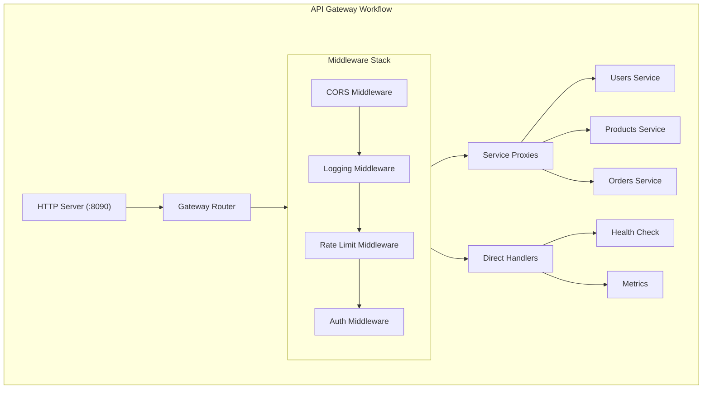
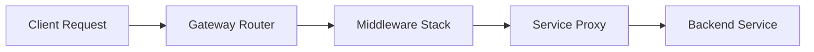

# API Gateway Architecture

This diagram visualizes the API gateway workflow with proxy routing to backend services.

## API Gateway Workflow

## Gateway Request Flow

This shows how a request flows through the gateway to backend services.

## Available Routes

### Public Endpoints

| Method | Endpoint | Description |
|--------|----------|-------------|
| `GET` | `/health` | Health check |
| `GET` | `/metrics` | Metrics (auth protected) |

### Protected Service Endpoints

| Method | Endpoint | Description |
|--------|----------|-------------|
| `GET/POST` | `/api/users` | User service |
| `GET/POST` | `/api/products` | Product service |
| `GET/POST` | `/api/orders` | Order service |
