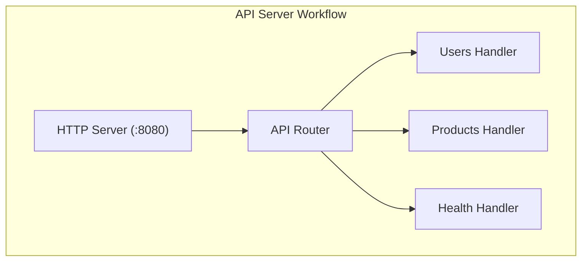
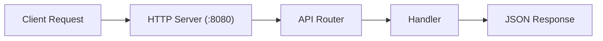

# API Server Architecture

This diagram visualizes the API server workflow with multiple endpoints.

## API Server Workflow

## API Endpoints

| Method | Endpoint | Description |
|--------|----------|-------------|
| `GET` | `/api/users` | Retrieve users |
| `POST` | `/api/users` | Create user |
| `GET` | `/api/products` | Retrieve products |
| `POST` | `/api/products` | Create product |
| `GET` | `/health` | Health check |

## Request Flow

This shows how a request flows through the system.

