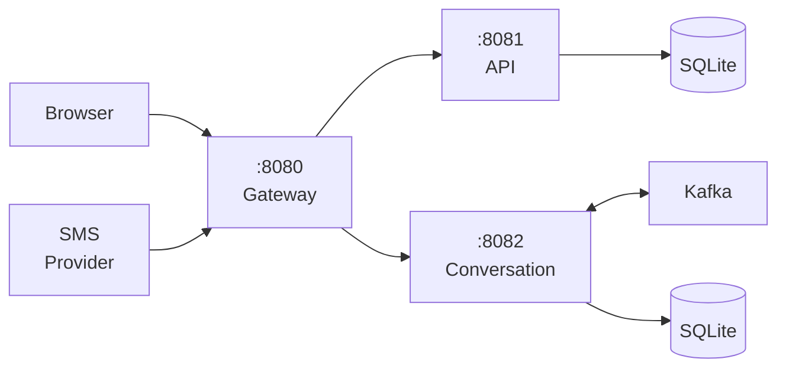
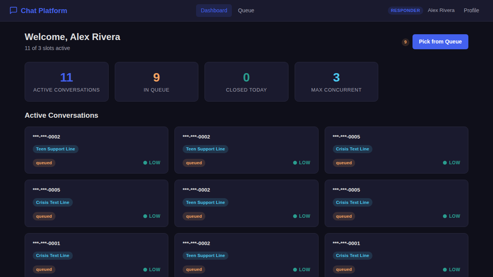
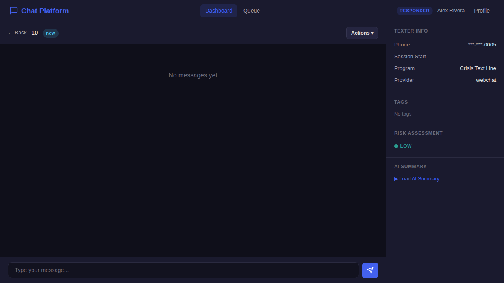
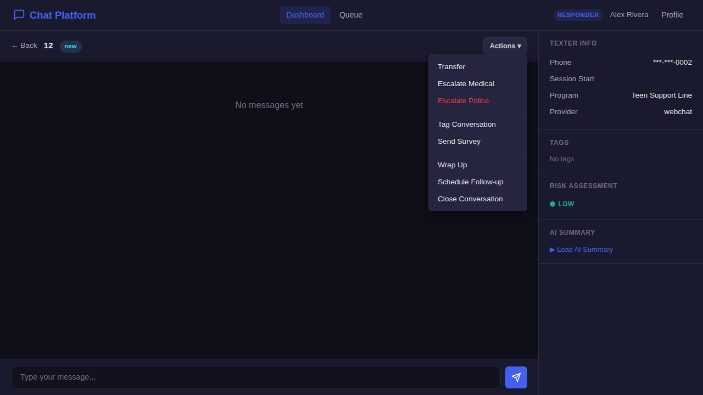
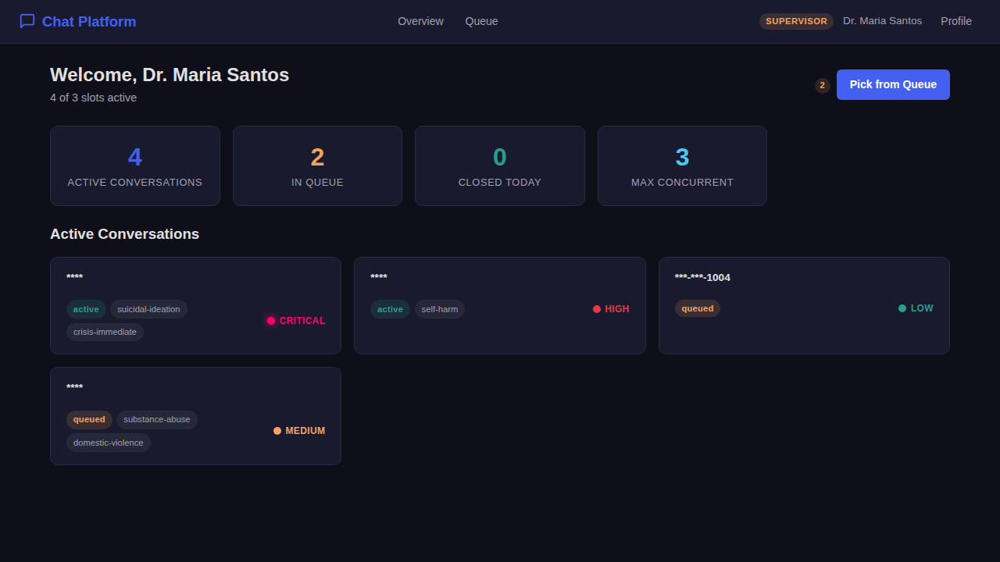
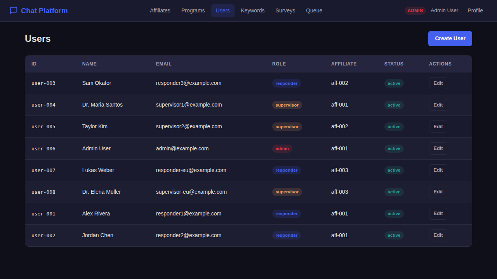
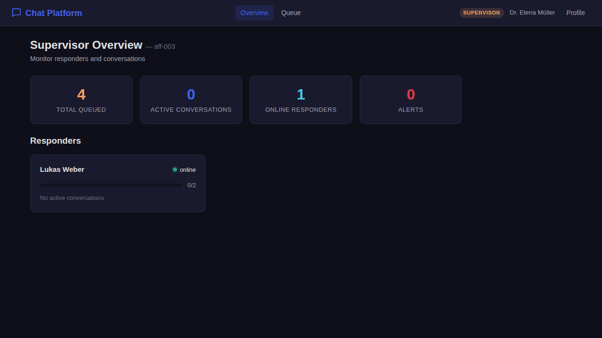

# Chat Platform

A text-based crisis and mental health support platform built on the [Workflow engine](https://github.com/GoCodeAlone/workflow). Supports multi-channel messaging (SMS, webchat), multi-tenant operation, real-time conversation management, risk assessment, and escalation protocols -- all configured through YAML with zero application code.

## Features

- **Multi-channel messaging**: Twilio SMS, AWS SNS/Pinpoint, partner webhooks, and browser webchat
- **Multi-tenant architecture**: Multiple affiliates and programs with isolated data and configuration
- **Conversation state machine**: 13-state lifecycle with automated transitions and processing hooks
- **Real-time chat**: Responder dashboard with live message threading and texter info sidebar
- **Risk assessment**: Automated risk tagging (self-harm, suicidal ideation, substance abuse, domestic violence, crisis)
- **Medical and police escalation**: Structured escalation protocols with supervisor notification
- **PII encryption**: AES-256 field-level encryption for all personally identifiable information
- **Entry/exit surveys**: Configurable surveys for outcomes tracking and quality improvement
- **AI-powered summaries**: Conversation summaries for warm handoffs and supervisor oversight
- **Follow-up scheduling**: Automated follow-up check-ins after conversation close
- **Queue management**: Per-program queues with health monitoring and alert thresholds
- **Role-based access**: Responder, Supervisor, and Admin roles with appropriate permissions
- **Observability**: Prometheus metrics and Grafana dashboards
- **Event-driven**: Apache Kafka for asynchronous event processing and audit logging
- **Hot-reloadable**: All business logic runs as dynamic Go components via Yaegi

## Quick Start

```bash
# Clone the workflow repository
git clone https://github.com/GoCodeAlone/workflow.git
cd workflow/example/chat-platform

# Start all services
docker compose --profile distributed up --build

# Open the platform
open http://localhost:8080
```

## Architecture



| Container | Purpose |
|-----------|---------|
| **Gateway** | Reverse proxy + SPA static file serving |
| **API** | Authentication, user management, platform CRUD |
| **Conversation** | State machine, message processing, provider integration |
| **Kafka** | Event bus (KRaft mode) |
| **Prometheus** | Metrics collection |
| **Grafana** | Dashboards and alerting |

## Demo Credentials

All accounts use password: `demo123`

| Email | Role | Affiliate |
|-------|------|-----------|
| `responder1@example.com` | Responder | Crisis Support International |
| `responder2@example.com` | Responder | Crisis Support International |
| `responder3@example.com` | Responder | Youth Mental Health Alliance |
| `supervisor1@example.com` | Supervisor | Crisis Support International |
| `supervisor2@example.com` | Supervisor | Youth Mental Health Alliance |
| `admin@example.com` | Admin | Crisis Support International |

## Simulating an Inbound SMS

```bash
# Send a Twilio-format SMS webhook
curl -X POST http://localhost:8080/api/webhooks/twilio \
  -d "From=%2B15551234567&To=%2B1741741&Body=HELLO&MessageSid=SM123"
```

## Documentation

| Document | Description |
|----------|-------------|
| [Architecture](docs/ARCHITECTURE.md) | System design, state machine, message flow diagrams, data model |
| [User Guide](docs/USER_GUIDE.md) | Persona walkthroughs, API reference, curl examples |
| [Mental Health Practices](docs/MENTAL_HEALTH_PRACTICES.md) | Risk assessment, escalation protocols, privacy, responder wellness |
| [Implementation Plan](PLAN.md) | Full specification used to build this platform |

## Screenshots

### Responder Dashboard


### Responder Chat with Actions
 

### Supervisor Overview


### Queue Health Monitoring


### Admin Configuration


### Multi-Affiliate (EU Region)


See [`docs/USER_GUIDE.md`](docs/USER_GUIDE.md) for a complete walkthrough with all 17 screenshots and a [video demo](docs/responder-demo.webm).

## Technology Stack

| Layer | Technology |
|-------|-----------|
| **Engine** | [Workflow](https://github.com/GoCodeAlone/workflow) (Go) |
| **Framework** | [CrisisTextLine/modular](https://github.com/CrisisTextLine/modular) |
| **Frontend** | Vanilla JS SPA (hash router, no framework) |
| **Database** | SQLite (per-service) |
| **Messaging** | Apache Kafka (KRaft mode) |
| **SMS** | Twilio, AWS SNS/Pinpoint, partner webhooks (simulated) |
| **Encryption** | AES-256 field-level PII encryption |
| **Auth** | JWT with role-based access control |
| **Observability** | Prometheus + Grafana |
| **Runtime** | Yaegi (dynamic Go component loading) |
| **Containers** | Docker Compose |
