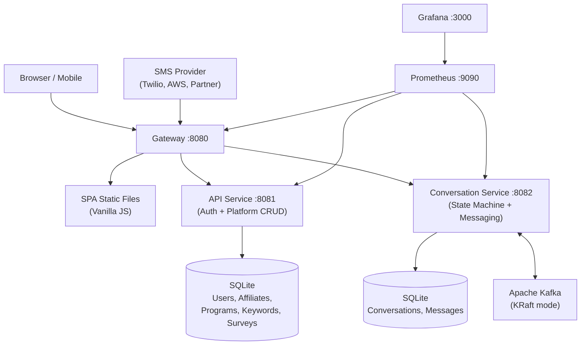
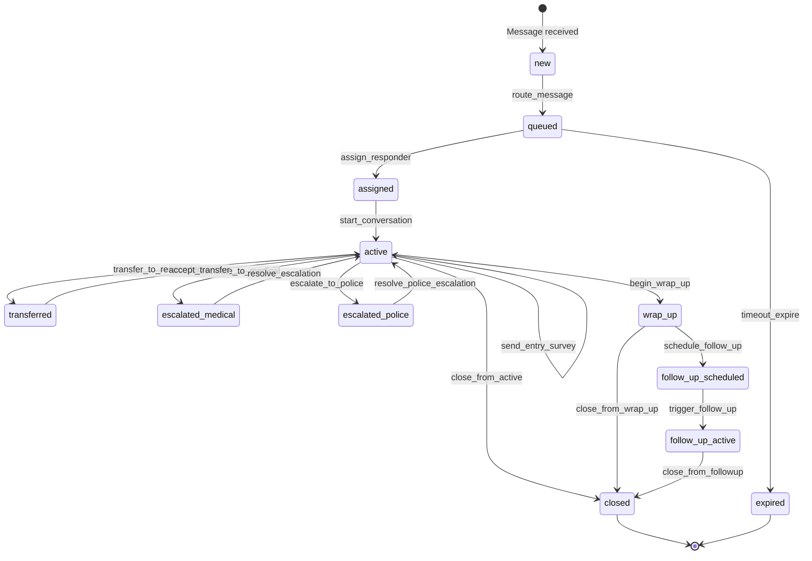
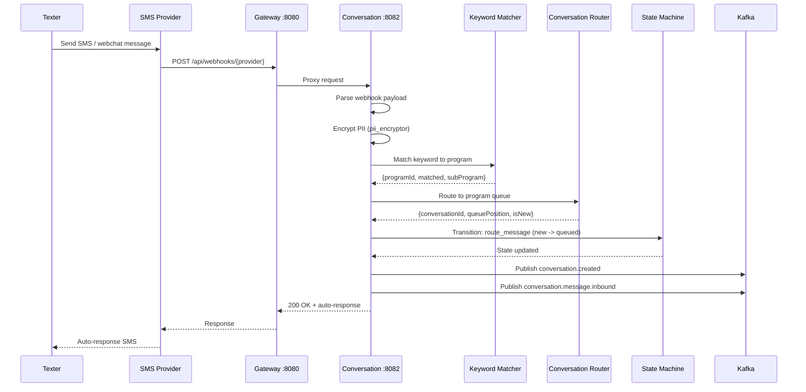
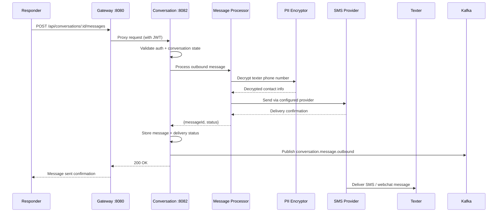
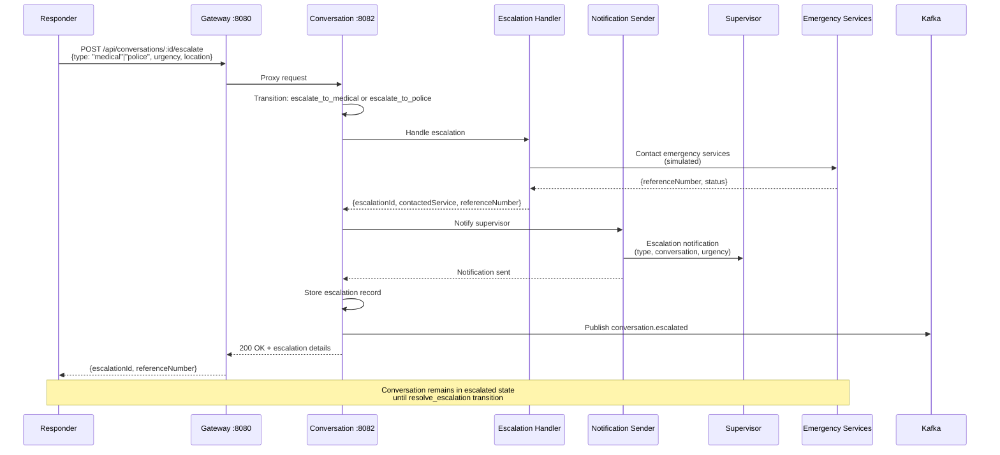
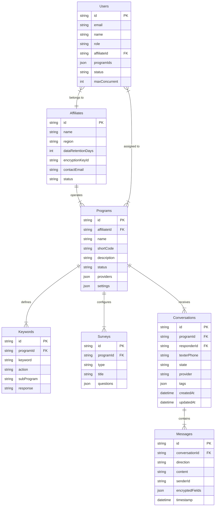

# Chat Platform Architecture

## Overview

The Chat Platform is a text-based crisis and mental health support system built entirely on the Workflow engine. It enables organizations (Affiliates) to operate support programs where texters reach out via SMS or webchat and are connected with trained responders in real time.

The platform supports:

- **Multi-channel messaging**: Twilio SMS, AWS SNS/Pinpoint, partner webhooks, and browser-based webchat
- **Multi-tenant operation**: Multiple affiliates, each with their own programs, responders, and data retention policies
- **Conversation lifecycle management**: A full state machine governing every conversation from intake through follow-up
- **Risk assessment and escalation**: Automated risk tagging with medical and police escalation protocols
- **PII protection**: Field-level AES-256 encryption for all personally identifiable information
- **Observability**: Prometheus metrics and Grafana dashboards for operational monitoring

All business logic is implemented as dynamic Go components loaded at runtime by the Workflow engine via Yaegi. Configuration is entirely YAML-driven -- no code changes are needed to deploy or reconfigure the platform.

---

## Container Architecture

The platform runs as a set of Docker containers orchestrated by Docker Compose.



### Service Descriptions

| Service | Port | Config | Responsibility |
|---------|------|--------|----------------|
| **Gateway** | 8080 | `gateway.yaml` | Reverse proxy, SPA static file serving, CORS, request-id middleware |
| **API** | 8081 | `api.yaml` | JWT authentication, user management, affiliate/program/keyword/survey CRUD |
| **Conversation** | 8082 | `conversation.yaml` | Conversation state machine, message processing, provider integration, Kafka events |
| **Kafka** | 9092 | Docker env | Event bus for asynchronous message routing (KRaft mode, no Zookeeper) |
| **Prometheus** | 9090 | `prometheus.yml` | Metrics collection from all services |
| **Grafana** | 3000 | Provisioned | Dashboards and alerting |

### Gateway Routing

The gateway proxies all `/api/*` requests to backend services based on path prefix:

| Path Prefix | Target |
|-------------|--------|
| `/api/auth/*`, `/api/affiliates/*`, `/api/programs/*`, `/api/users/*`, `/api/keywords/*`, `/api/surveys/*`, `/api/admin/*` | API service (`:8081`) |
| `/api/conversations/*`, `/api/messages/*`, `/api/queue/*`, `/api/webhooks/*`, `/api/webchat/*`, `/api/providers/*` | Conversation service (`:8082`) |
| `/` (everything else) | SPA static files with fallback to `index.html` |

---

## Conversation State Machine

Every conversation follows a well-defined lifecycle managed by the `conversation-lifecycle` state machine. States govern what actions are available, and transitions trigger processing hooks.



### States

| State | Description | Terminal | Error |
|-------|-------------|----------|-------|
| `new` | Initial message received, not yet routed | No | No |
| `queued` | In program queue, waiting for a responder | No | No |
| `assigned` | Responder assigned, conversation not yet active | No | No |
| `active` | Live conversation in progress | No | No |
| `transferred` | Being transferred to another responder | No | No |
| `escalated_medical` | Escalated to medical professional | No | No |
| `escalated_police` | Escalated to police/emergency services | No | No |
| `wrap_up` | Responder wrapping up; exit survey may be active | No | No |
| `follow_up_scheduled` | Follow-up check-in scheduled for later | No | No |
| `follow_up_active` | Follow-up conversation in progress | No | No |
| `closed` | Conversation ended normally | Yes | No |
| `expired` | Timed out or data retention policy applied | Yes | No |
| `failed` | Processing error | Yes | Yes |

### Transition Hooks

Each transition can trigger processing steps:

| Hook | Components | Purpose |
|------|-----------|---------|
| `step-route-message` | keyword_matcher, conversation_router | Match keyword to program, create/find conversation, place in queue |
| `step-assign` | notification_sender | Assign responder, generate AI summary for transfers |
| `step-start-convo` | message_processor | Log conversation start, trigger optional entry survey |
| `step-survey` | survey_engine | Present and collect entry or exit survey responses |
| `step-transfer` | ai_summarizer, notification_sender | Generate handoff summary, notify receiving responder |
| `step-accept-transfer` | notification_sender | Notify previous responder of acceptance |
| `step-escalate` | escalation_handler, notification_sender | Contact medical/police, notify supervisor |
| `step-wrap-up` | survey_engine, risk_tagger | Begin exit survey, generate final tags |
| `step-schedule-followup` | followup_scheduler | Create scheduled follow-up record |
| `step-trigger-followup` | message_processor | Send follow-up message to texter |
| `step-close` | data_retention | Check retention policy, final cleanup |

---

## Message Flow

### Inbound Message Flow

When a texter sends a message (SMS or webchat), the following sequence occurs:



### Outbound Message Flow

When a responder sends a message to the texter:



---

## Escalation Flow

When a responder determines a texter needs emergency services:



---

## Data Model



---

## Security

### PII Encryption

All personally identifiable information is encrypted at the field level using AES-256 before storage. The `pii_encryptor` component handles encryption and decryption transparently.

**Encrypted fields:**
- `phoneNumber` -- texter phone numbers
- `name` -- texter names (when provided)
- `messageBody` -- message content
- `address` -- location data (when provided during escalation)

Each affiliate has a unique `encryptionKeyId`. Keys are provided via the `ENCRYPTION_KEY` environment variable. In production, this should be sourced from a secrets manager.

### Authentication

- JWT-based authentication with configurable secret (`JWT_SECRET` environment variable)
- Login via `POST /api/auth/login` returns a signed JWT token
- All authenticated endpoints require `Authorization: Bearer <token>` header
- Role-based access control: `responder`, `supervisor`, `admin`
- Webhook endpoints (`/api/webhooks/*`) and webchat endpoints (`/api/webchat/*`) are unauthenticated

### Authorization by Role

| Resource | Responder | Supervisor | Admin |
|----------|-----------|------------|-------|
| Own conversations | Read/Write | Read-only | Read-only |
| Queue | Pick from queue | View all | View all |
| Other responders' conversations | No | Read-only | Read-only |
| Escalate | Yes | No (oversight) | No |
| Transfer | Yes | No | No |
| Affiliates CRUD | No | No | Yes |
| Programs CRUD | No | No | Yes |
| Users CRUD | No | No | Yes |
| Keywords CRUD | No | No | Yes |
| Surveys CRUD | No | No | Yes |

---

## Kafka Events

The conversation service publishes events to Kafka topics for asynchronous processing and audit logging.

| Topic | Published When | Payload |
|-------|---------------|---------|
| `conversation.created` | New conversation enters queue | conversationId, programId, provider, texterInfo |
| `conversation.assigned` | Responder picks up conversation | conversationId, responderId |
| `conversation.message.inbound` | Texter sends a message | conversationId, messageId, provider |
| `conversation.message.outbound` | Responder sends a message | conversationId, messageId, responderId |
| `conversation.transferred` | Conversation transferred | conversationId, fromResponder, toResponder, summary |
| `conversation.escalated` | Escalation triggered | conversationId, type, urgency, referenceNumber |
| `conversation.closed` | Conversation closed | conversationId, duration, tags, surveyCompleted |
| `conversation.followup.scheduled` | Follow-up scheduled | conversationId, scheduledFor |
| `conversation.followup.triggered` | Follow-up message sent | conversationId, followUpId |
| `conversation.survey.completed` | Survey submitted | conversationId, surveyId, type, responses |
| `conversation.tag.updated` | Tags modified | conversationId, tags, riskLevel |

---

## Configuration

The platform is configured through three YAML files in `configs/`:

### gateway.yaml

Defines the reverse proxy routing and SPA static file serving. No business logic.

```yaml
modules:
  - name: web-server
    type: http.server
    config:
      address: ":8080"
  - name: api-proxy
    type: http.simple_proxy
    config:
      targets:
        "/api/auth": "http://api:8081"
        "/api/conversations": "http://conversation:8082"
        # ... all route mappings
  - name: spa
    type: static.fileserver
    config:
      root: "../spa"
      spaFallback: true
```

### api.yaml

Defines authentication, platform CRUD, and user management. Uses SQLite persistence and JWT middleware.

Key modules: `http.server`, `http.router`, `jwt.auth`, `persistence.sqlite`, `persistence.crud`, `http.middleware.*`

### conversation.yaml

Defines the conversation state machine, message processing, provider integration, and Kafka messaging. This is the most complex configuration.

Key modules: `statemachine`, `messaging.kafka`, `persistence.sqlite`, `persistence.crud`, `dynamic.loader`, `scheduler`

### Environment Variables

| Variable | Service | Purpose |
|----------|---------|---------|
| `JWT_SECRET` | API, Conversation | Shared JWT signing secret |
| `ENCRYPTION_KEY` | API, Conversation | PII encryption key (32 characters) |
| `KAFKA_BROKERS` | Conversation | Kafka broker addresses (`kafka:9092`) |

---

## Observability

### Prometheus Metrics

Each service exposes a `/metrics` endpoint with the following namespaced metrics:

| Namespace | Metrics |
|-----------|---------|
| `chat_gateway` | Request count, latency, proxy errors |
| `chat_api` | Auth attempts, CRUD operations, error rates |
| `chat_conversation` | Message throughput, state transitions, queue depth, escalation count |

### Grafana Dashboards

Pre-provisioned dashboards are available at `http://localhost:3000` (default credentials: `admin`/`admin`):

- **Platform Overview**: Request rates, error rates, latency percentiles across all services
- **Conversation Metrics**: Active conversations, queue depth by program, average wait time, state distribution
- **Escalation Monitoring**: Escalation rate, type breakdown, resolution time

### Health Checks

Each service exposes:

| Endpoint | Purpose |
|----------|---------|
| `/healthz` | Liveness probe -- service is running |
| `/readyz` | Readiness probe -- service can accept traffic |
| `/metrics` | Prometheus-compatible metrics endpoint |

---

## Dynamic Components

All business logic is implemented as dynamic Go components in `components/`. These are loaded at runtime by the Workflow engine's Yaegi interpreter, enabling hot-reload without recompilation.

| Component | Purpose |
|-----------|---------|
| `twilio_provider` | Twilio SMS send/receive simulation |
| `aws_provider` | AWS SNS/Pinpoint SMS simulation |
| `partner_provider` | Partner webhook provider simulation |
| `webchat_handler` | Browser webchat session management |
| `conversation_router` | Route messages to correct program/queue |
| `keyword_matcher` | Match texter keywords to programs |
| `pii_encryptor` | AES-256 field-level PII encryption/decryption |
| `survey_engine` | Entry/exit survey management |
| `followup_scheduler` | Schedule follow-up check-ins |
| `escalation_handler` | Medical/police escalation handling |
| `ai_summarizer` | AI-powered conversation summaries |
| `risk_tagger` | Risk assessment and tagging |
| `data_retention` | Data retention policy enforcement |
| `message_processor` | Central inbound/outbound message processing |
| `notification_sender` | System notifications (queue alerts, escalations, transfers) |
