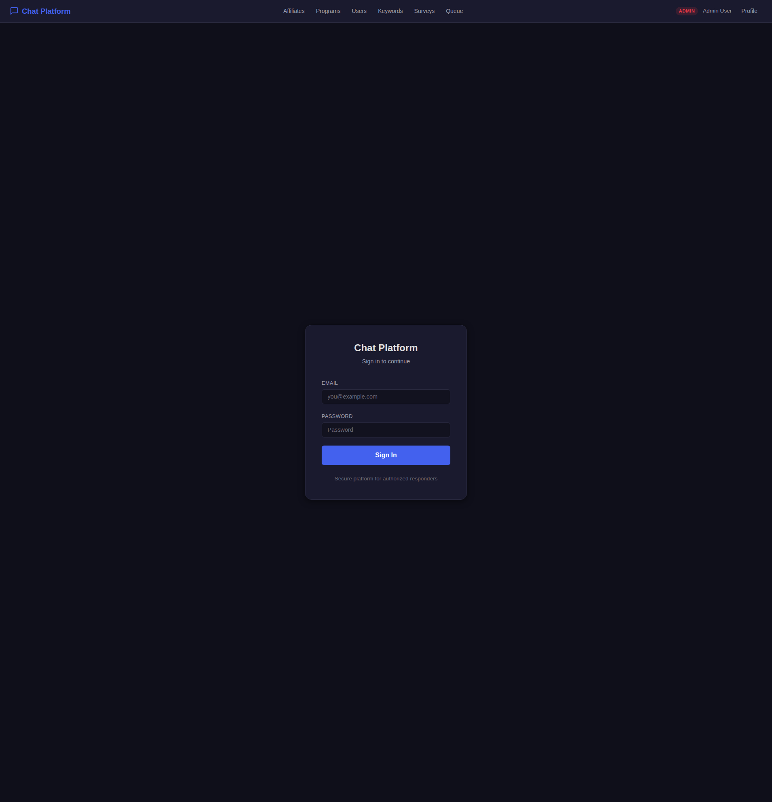
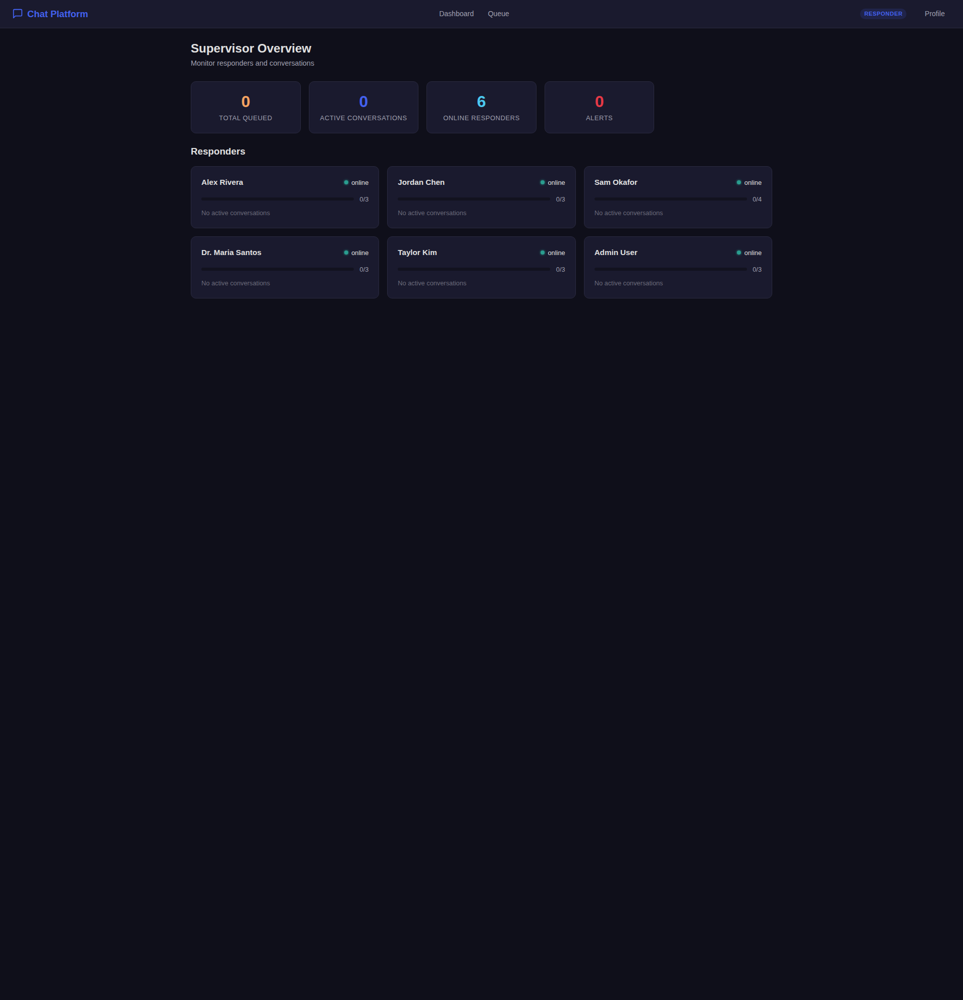
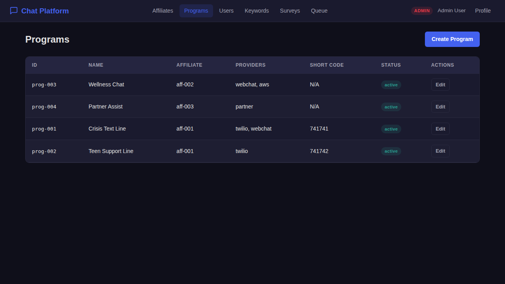

# Chat Platform User Guide

## Quick Start

### Running with Docker Compose (distributed mode)

```bash
cd workflow/example/chat-platform
docker compose --profile distributed up --build
```

This starts all services:

| Service | URL |
|---------|-----|
| **Platform SPA** | http://localhost:8080 |
| **Webchat Widget** | http://localhost:8080/webchat/widget.html |
| **Grafana Dashboards** | http://localhost:3000 |
| **Prometheus** | http://localhost:9090 |

### Running as a monolith (development)

```bash
cd workflow
go run ./cmd/server -config example/chat-platform/workflow.yaml
```

The monolith runs all services in a single process on port 8080 without Kafka.

---

## Demo Credentials

All demo accounts use the password `demo123`.

| Email | Name | Role | Affiliate | Programs |
|-------|------|------|-----------|----------|
| `responder1@example.com` | Alex Rivera | Responder | Crisis Support International | Crisis Text Line, Teen Support Line |
| `responder2@example.com` | Jordan Chen | Responder | Crisis Support International | Crisis Text Line |
| `responder3@example.com` | Sam Okafor | Responder | Youth Mental Health Alliance | Wellness Chat |
| `supervisor1@example.com` | Dr. Maria Santos | Supervisor | Crisis Support International | Crisis Text Line, Teen Support Line |
| `supervisor2@example.com` | Taylor Kim | Supervisor | Youth Mental Health Alliance | Wellness Chat |
| `admin@example.com` | Admin User | Admin | Crisis Support International | All (admin access) |

---

## Screenshots

| Page | Screenshot |
|------|-----------|
| Login |  |
| Responder Dashboard |  |
| Supervisor Dashboard |  |
| Queue Health |  |
| Admin - Affiliates |  |
| Admin - Programs |  |
| Admin - Users |  |
| Webchat Widget |  |

---

## Persona Walkthroughs

### Texter (SMS)

Texters interact with the platform by sending text messages to a program's short code.

1. **Initiate contact**: Text a keyword (e.g., `HELLO`, `HELP`, `CRISIS`, `TEEN`) to the program's short code (e.g., 741741).
2. **Receive auto-response**: The platform matches the keyword, routes to the correct program queue, and sends an immediate auto-response (e.g., "You've reached Crisis Support. A counselor will be with you shortly.").
3. **Entry survey**: Once a responder picks up, the texter may receive an entry survey asking how they are feeling.
4. **Conversation**: Exchange messages with the assigned responder. All messages are encrypted in transit and at rest.
5. **Exit survey**: When the conversation wraps up, the texter may receive a brief exit survey.
6. **Follow-up**: The platform may send a follow-up check-in at a scheduled time.

### Texter (Webchat)

1. Open the webchat widget at `http://localhost:8080/webchat/widget.html`
2. Type a message to start a session
3. The widget polls for new messages and displays the conversation in real time
4. No account or phone number required

### Responder

Responders handle live conversations with texters.

1. **Login**: Navigate to `http://localhost:8080` and log in with responder credentials. You will be redirected to `#/responder`.


2. **Dashboard**: The responder dashboard shows:
   - Active conversations you are handling
   - Number of conversations in the queue
   - A "Pick from Queue" button

3. **Pick from queue**: Click "Pick from Queue" to be assigned the next waiting conversation. The conversation transitions from `queued` to `assigned` and then to `active`.

4. **Chat view** (`#/responder/chat/:id`): The chat interface shows:
   - Message thread with timestamps
   - Text input to send messages
   - Texter info sidebar (provider, program, risk tags)
   - Action buttons in the sidebar

5. **Available actions**:

   | Action | Description |
   |--------|-------------|
   | **Send message** | Type and send a message to the texter |
   | **Transfer** | Transfer the conversation to another responder with an AI-generated summary |
   | **Escalate** | Escalate to medical or police emergency services |
   | **Tag** | Add tags/categories to the conversation (e.g., topic, risk level) |
   | **Survey** | Send an entry or exit survey to the texter |
   | **Wrap-up** | Begin closing the conversation, triggering exit survey and tag generation |
   | **Close** | Close the conversation after wrap-up |

6. **Transfer flow**: Click Transfer, select a reason. An AI summary is generated for the receiving responder. The conversation moves to `transferred` state until the new responder accepts.

7. **Escalation flow**: Click Escalate, select type (Medical or Police), provide urgency level and location if available. The supervisor is notified, and emergency services are contacted (simulated in demo mode).

### Supervisor

Supervisors oversee responders and monitor platform health.

1. **Login**: Navigate to `http://localhost:8080` and log in with supervisor credentials. You will be redirected to `#/supervisor`.


2. **Dashboard**: The supervisor dashboard shows:
   - List of responders with their status (online/offline)
   - Number of active conversations per responder
   - Queue health metrics (depth, wait time)

3. **Responder detail** (`#/supervisor/responder/:id`): View a specific responder's active conversations.

4. **Chat oversight** (`#/supervisor/chat/:id`): Read-only view of any conversation, including an AI-generated summary. Supervisors cannot send messages.

5. **Queue health** (`#/queue`): View per-program queue depths, average wait times, and alert thresholds.

### Admin

Admins configure the platform: affiliates, programs, users, keywords, and surveys.

1. **Login**: Navigate to `http://localhost:8080` and log in with admin credentials. You will be redirected to `#/admin/affiliates`.


2. **Affiliates** (`#/admin/affiliates`): Create, view, and edit affiliate organizations. Each affiliate has a name, region, data retention policy, and encryption key.

3. **Programs** (`#/admin/programs`): Create and configure programs within affiliates. Set providers (Twilio, AWS, partner, webchat), short codes, queue thresholds, and survey assignments.

4. **Users** (`#/admin/users`): Create and manage user accounts. Assign roles (responder, supervisor, admin), affiliate membership, and program access.

5. **Keywords** (`#/admin/keywords`): Define keyword routing rules. Each keyword maps to a program and sub-program with an auto-response message.

6. **Surveys** (`#/admin/surveys`): Create entry and exit survey templates with questions (scale, text, choice types).

---

## API Reference

All endpoints are accessed through the gateway at `http://localhost:8080`. Authenticated endpoints require the `Authorization: Bearer <token>` header.

### Authentication

#### Login

```bash
curl -X POST http://localhost:8080/api/auth/login \
  -H "Content-Type: application/json" \
  -d '{"email": "responder1@example.com", "password": "demo123"}'
```

Response:
```json
{
  "token": "eyJhbGciOiJIUzI1NiIs...",
  "user": {"id": "user-001", "name": "Alex Rivera", "role": "responder"}
}
```

#### Get Profile

```bash
curl http://localhost:8080/api/auth/profile \
  -H "Authorization: Bearer $TOKEN"
```

### Affiliates

```bash
# List affiliates
curl http://localhost:8080/api/affiliates \
  -H "Authorization: Bearer $TOKEN"

# Get affiliate by ID
curl http://localhost:8080/api/affiliates/aff-001 \
  -H "Authorization: Bearer $TOKEN"

# Create affiliate (admin only)
curl -X POST http://localhost:8080/api/affiliates \
  -H "Authorization: Bearer $TOKEN" \
  -H "Content-Type: application/json" \
  -d '{
    "name": "New Affiliate",
    "region": "US-Central",
    "dataRetentionDays": 180,
    "contactEmail": "admin@newaffiliate.org"
  }'
```

### Programs

```bash
# List programs
curl http://localhost:8080/api/programs \
  -H "Authorization: Bearer $TOKEN"

# Get program by ID
curl http://localhost:8080/api/programs/prog-001 \
  -H "Authorization: Bearer $TOKEN"

# Create program (admin only)
curl -X POST http://localhost:8080/api/programs \
  -H "Authorization: Bearer $TOKEN" \
  -H "Content-Type: application/json" \
  -d '{
    "name": "New Program",
    "affiliateId": "aff-001",
    "providers": ["twilio", "webchat"],
    "shortCode": "741743",
    "description": "A new support program",
    "settings": {
      "maxConcurrentPerResponder": 3,
      "queueAlertThreshold": 10
    }
  }'
```

### Users

```bash
# List users
curl http://localhost:8080/api/users \
  -H "Authorization: Bearer $TOKEN"

# Get user by ID
curl http://localhost:8080/api/users/user-001 \
  -H "Authorization: Bearer $TOKEN"

# Create user (admin only)
curl -X POST http://localhost:8080/api/users \
  -H "Authorization: Bearer $TOKEN" \
  -H "Content-Type: application/json" \
  -d '{
    "email": "newresponder@example.com",
    "name": "New Responder",
    "role": "responder",
    "affiliateId": "aff-001",
    "programIds": ["prog-001"],
    "maxConcurrent": 3,
    "password": "securepassword"
  }'
```

### Keywords

```bash
# List keywords
curl http://localhost:8080/api/keywords \
  -H "Authorization: Bearer $TOKEN"

# Create keyword (admin only)
curl -X POST http://localhost:8080/api/keywords \
  -H "Authorization: Bearer $TOKEN" \
  -H "Content-Type: application/json" \
  -d '{
    "programId": "prog-001",
    "keyword": "SOS",
    "action": "route_priority",
    "subProgram": "crisis-immediate",
    "response": "Help is on the way. Stay with us."
  }'
```

### Surveys

```bash
# List surveys
curl http://localhost:8080/api/surveys \
  -H "Authorization: Bearer $TOKEN"

# Create survey (admin only)
curl -X POST http://localhost:8080/api/surveys \
  -H "Authorization: Bearer $TOKEN" \
  -H "Content-Type: application/json" \
  -d '{
    "programId": "prog-001",
    "type": "exit",
    "title": "Session Review",
    "questions": [
      {"id": "q1", "text": "How do you feel now?", "type": "scale", "min": 1, "max": 5},
      {"id": "q2", "text": "Was this helpful?", "type": "choice", "options": ["Yes", "No"]}
    ]
  }'
```

### Conversations

```bash
# List conversations (filtered by role)
curl http://localhost:8080/api/conversations \
  -H "Authorization: Bearer $TOKEN"

# Get conversation detail
curl http://localhost:8080/api/conversations/conv-001 \
  -H "Authorization: Bearer $TOKEN"

# Send message (responder)
curl -X POST http://localhost:8080/api/conversations/conv-001/messages \
  -H "Authorization: Bearer $TOKEN" \
  -H "Content-Type: application/json" \
  -d '{"content": "I hear you. Can you tell me more about what you are feeling?"}'

# Assign conversation from queue
curl -X POST http://localhost:8080/api/conversations/conv-001/assign \
  -H "Authorization: Bearer $TOKEN"

# Transfer conversation
curl -X POST http://localhost:8080/api/conversations/conv-001/transfer \
  -H "Authorization: Bearer $TOKEN" \
  -H "Content-Type: application/json" \
  -d '{"reason": "Shift ending, warm handoff needed"}'

# Escalate conversation
curl -X POST http://localhost:8080/api/conversations/conv-001/escalate \
  -H "Authorization: Bearer $TOKEN" \
  -H "Content-Type: application/json" \
  -d '{"type": "medical", "urgency": "high", "location": "Seattle, WA"}'

# Begin wrap-up
curl -X POST http://localhost:8080/api/conversations/conv-001/wrap-up \
  -H "Authorization: Bearer $TOKEN"

# Close conversation
curl -X POST http://localhost:8080/api/conversations/conv-001/close \
  -H "Authorization: Bearer $TOKEN"

# Schedule follow-up
curl -X POST http://localhost:8080/api/conversations/conv-001/follow-up \
  -H "Authorization: Bearer $TOKEN" \
  -H "Content-Type: application/json" \
  -d '{"scheduledTime": "2026-02-14T10:00:00Z", "message": "Hi, just checking in. How are you doing today?"}'

# Add tag
curl -X POST http://localhost:8080/api/conversations/conv-001/tag \
  -H "Authorization: Bearer $TOKEN" \
  -H "Content-Type: application/json" \
  -d '{"tags": ["anxiety", "school-stress"]}'

# Submit survey response
curl -X POST http://localhost:8080/api/conversations/conv-001/survey \
  -H "Authorization: Bearer $TOKEN" \
  -H "Content-Type: application/json" \
  -d '{"surveyId": "survey-002", "responses": [{"id": "q1", "value": 4}, {"id": "q2", "value": "Yes"}]}'

# Get AI-generated summary
curl http://localhost:8080/api/conversations/conv-001/summary \
  -H "Authorization: Bearer $TOKEN"
```

### Queue

```bash
# Queue status by program
curl http://localhost:8080/api/queue \
  -H "Authorization: Bearer $TOKEN"

# Queue health metrics
curl http://localhost:8080/api/queue/health \
  -H "Authorization: Bearer $TOKEN"
```

### Providers

```bash
# List configured providers
curl http://localhost:8080/api/providers \
  -H "Authorization: Bearer $TOKEN"
```

---

## Simulating SMS

The platform accepts inbound SMS via webhook endpoints. Use these curl commands to simulate messages from different providers.

### Twilio Webhook

```bash
curl -X POST http://localhost:8080/api/webhooks/twilio \
  -H "Content-Type: application/x-www-form-urlencoded" \
  -d "From=%2B15551234567&To=%2B1741741&Body=HELLO&MessageSid=SM1234567890"
```

### AWS SNS/Pinpoint Webhook

```bash
curl -X POST http://localhost:8080/api/webhooks/aws \
  -H "Content-Type: application/json" \
  -d '{
    "Type": "Notification",
    "MessageId": "msg-aws-001",
    "Message": "{\"originationNumber\":\"+15559876543\",\"destinationNumber\":\"+1741741\",\"messageBody\":\"HELP\",\"messageKeyword\":\"HELP\"}"
  }'
```

### Partner Webhook

```bash
curl -X POST http://localhost:8080/api/webhooks/partner \
  -H "Content-Type: application/json" \
  -d '{
    "partnerId": "partner-001",
    "from": "+15555551234",
    "message": "WELLNESS",
    "timestamp": "2026-02-13T10:00:00Z",
    "metadata": {"region": "EU-West"}
  }'
```

---

## Webchat Widget Integration

The webchat widget is a standalone HTML page that can be embedded in any website.


### Direct Access

Open `http://localhost:8080/webchat/widget.html` in a browser.

### Embedding in a Website

```html
<iframe
  src="http://localhost:8080/webchat/widget.html"
  width="400"
  height="600"
  style="border: none; border-radius: 12px; box-shadow: 0 4px 20px rgba(0,0,0,0.3);"
  title="Support Chat">
</iframe>
```

### Floating Chat Button

```html
<div id="chat-widget" style="position: fixed; bottom: 20px; right: 20px; z-index: 9999;">
  <button onclick="toggleChat()" style="
    width: 60px; height: 60px; border-radius: 50%; border: none;
    background: #4f46e5; color: white; font-size: 24px; cursor: pointer;
    box-shadow: 0 4px 12px rgba(0,0,0,0.3);
  ">?</button>
  <iframe id="chat-frame" src="http://localhost:8080/webchat/widget.html"
    style="display: none; position: absolute; bottom: 70px; right: 0;
    width: 380px; height: 550px; border: none; border-radius: 12px;
    box-shadow: 0 4px 20px rgba(0,0,0,0.3);"
    title="Support Chat">
  </iframe>
</div>
<script>
function toggleChat() {
  const frame = document.getElementById('chat-frame');
  frame.style.display = frame.style.display === 'none' ? 'block' : 'none';
}
</script>
```

### Webchat API (for custom implementations)

```bash
# Send a message
curl -X POST http://localhost:8080/api/webchat/message \
  -H "Content-Type: application/json" \
  -d '{"sessionId": "web-session-001", "message": "I need someone to talk to"}'

# Poll for new messages
curl http://localhost:8080/api/webchat/poll/web-session-001
```
