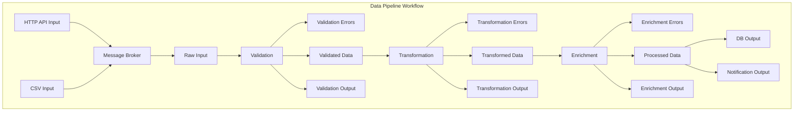

# Data Pipeline Architecture

This diagram visualizes the data processing pipeline workflow.

## Data Pipeline Workflow

## Data Flow in Pipeline

This shows how data flows through the pipeline stages.

