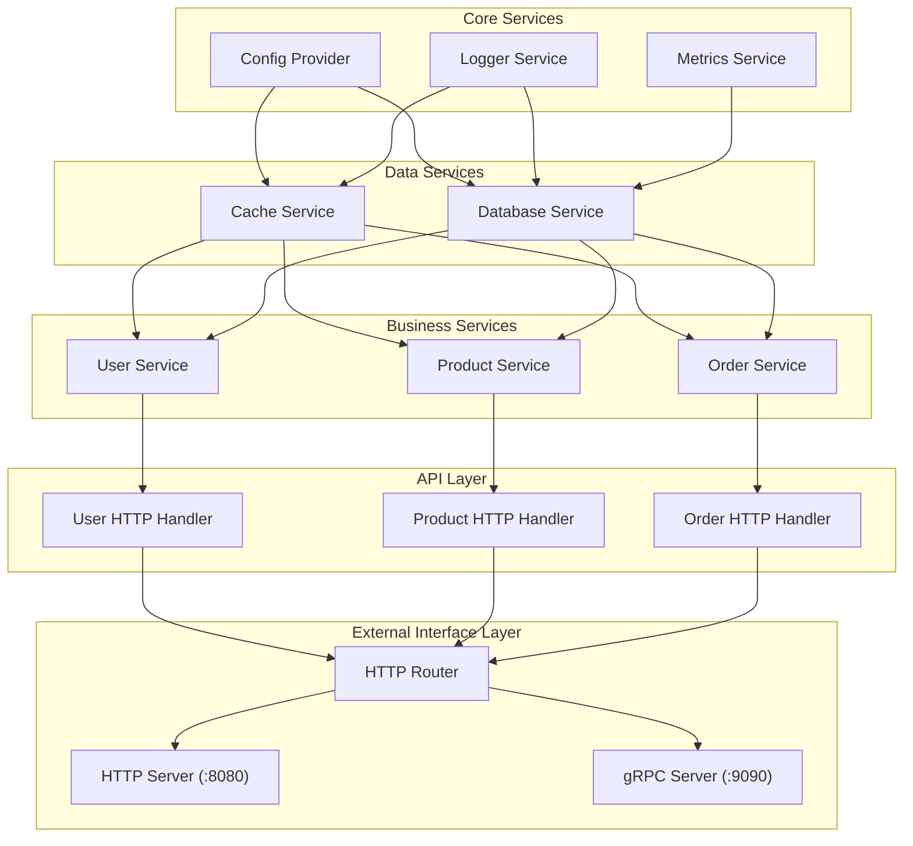
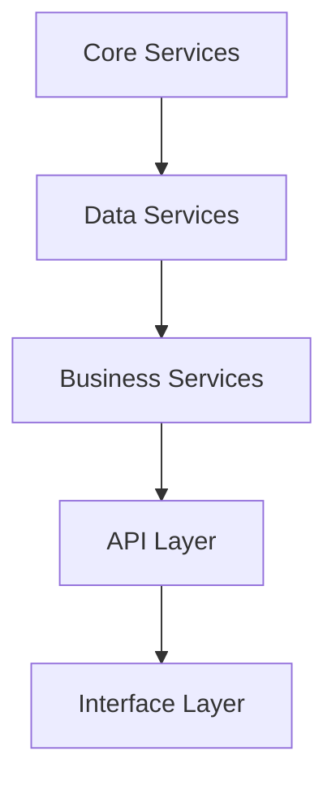

# Dependency Injection Architecture

This diagram visualizes the dependency relationships between services.

## Dependency Injection Example

## Service Dependency Hierarchy

Shows the hierarchical organization of service dependencies.

