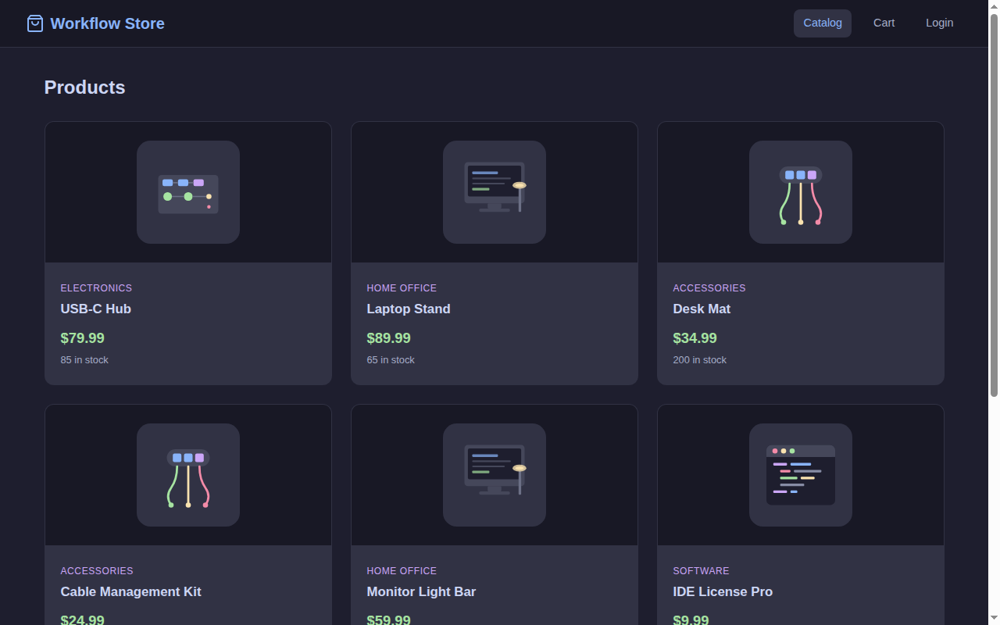
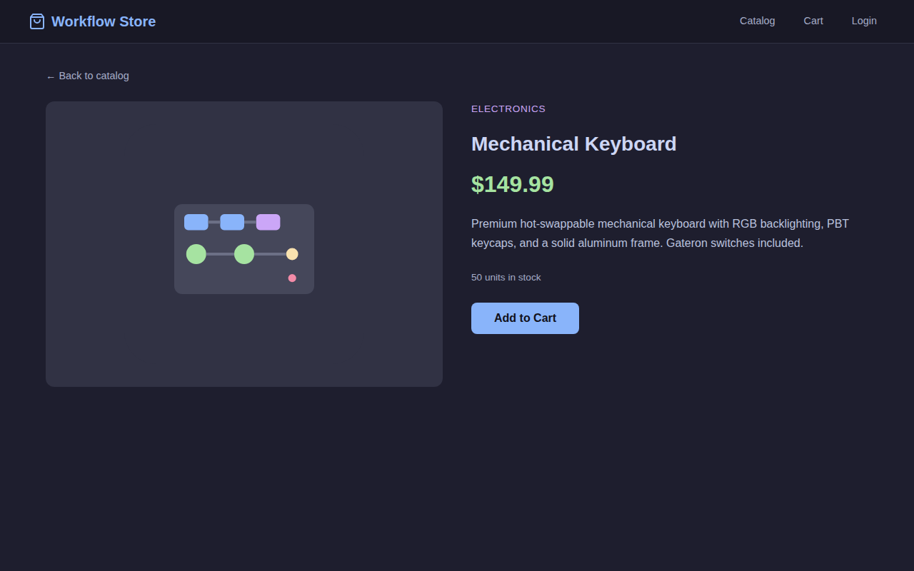
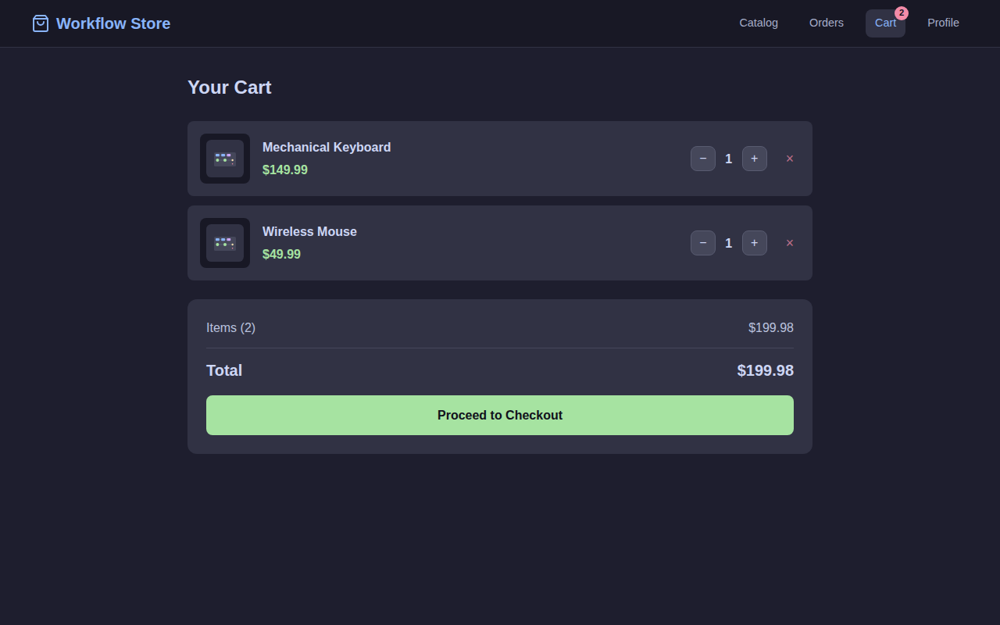
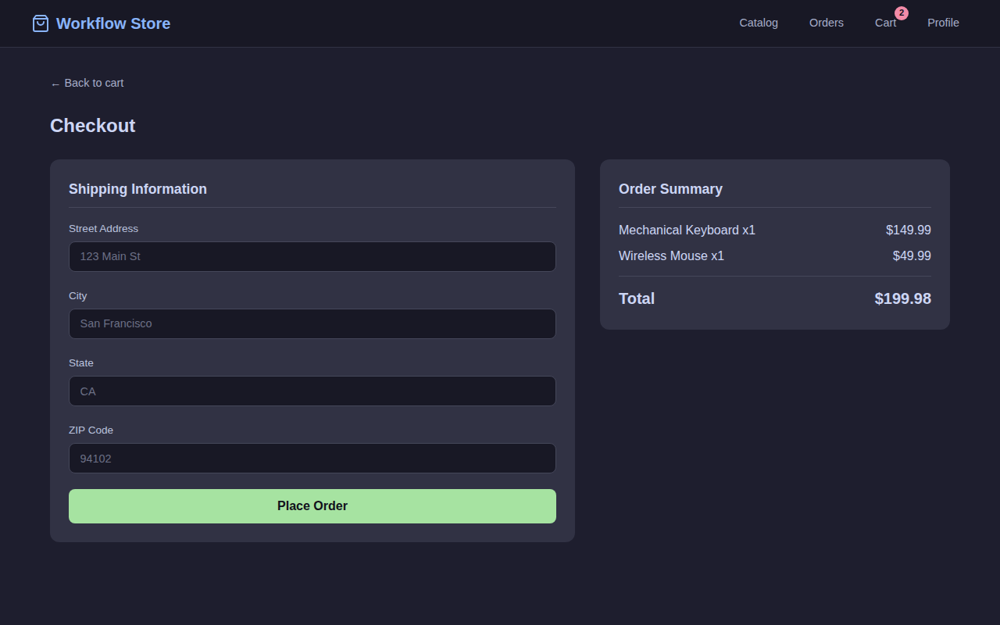
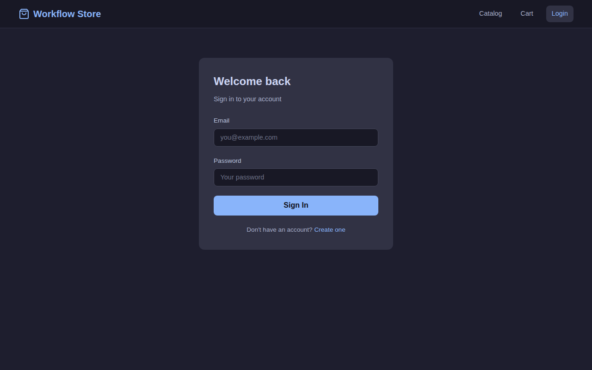
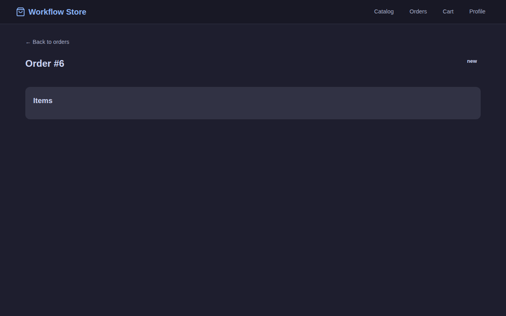

# Workflow Store -- E-Commerce Example Application

A complete e-commerce storefront built entirely from a single YAML configuration
file. No application code was written -- every component is a reusable Workflow
engine module wired together declaratively.

This demonstrates the Workflow engine as a **full application platform**: HTTP
serving, JWT authentication, REST APIs, a production-realistic order processing
pipeline with simulated third-party integrations, SQLite persistence, event-driven
messaging, Prometheus/Grafana observability, and a vanilla JS single-page
application -- all composed from 24 modules in one config file.

## Screenshots

| Catalog | Product Detail |
|---------|---------------|
|  |  |

| Cart | Checkout |
|------|----------|
|  |  |

| Login | Order Placed |
|-------|-------------|
|  |  |

## Quick Start

### Docker Compose (recommended)

Starts the store, Prometheus, and Grafana:

```bash
cd workflow
docker compose -f example/ecommerce-app/docker-compose.yml up --build
```

| Service | URL |
|---------|-----|
| Store | [http://localhost:8080](http://localhost:8080) |
| Prometheus | [http://localhost:9090](http://localhost:9090) |
| Grafana | [http://localhost:3000](http://localhost:3000) (admin/admin) |

### Bare Metal

```bash
cd workflow

# Build the server
go build -o server ./cmd/server

# Set a JWT signing secret
export JWT_SECRET="my-dev-secret"

# Run with the e-commerce config
./server -config example/ecommerce-app/workflow.yaml
```

Open [http://localhost:8080](http://localhost:8080).

### Try It Out

1. Browse the product catalog (no account required)
2. Click **Login** > **Create one** to register
3. Add products to your cart
4. Proceed to checkout, fill in shipping, and place an order
5. Watch the order progress through the processing pipeline under **Orders**
6. View Prometheus metrics at [http://localhost:8080/metrics](http://localhost:8080/metrics)

---

## Architecture

### System Diagram

```
                           +-----------------+
                           |   Browser SPA   |
                           |  (vanilla JS)   |
                           +--------+--------+
                                    |
                              HTTP :8080
                                    |
                 +------------------+------------------+
                 |            web-server               |
                 |          (http.server)               |
                 +--+-------------------+--+-----------+
                    |                   |  |
          +---------+------+     +------+--+--------+
          | static.fileserver|   |     router       |
          |    (SPA files)   |   |  (http.router)   |
          +------------------+   +------+-----------+
                                        |
                          +-------------+-------------+
                          |             |             |
                     cors + request-id + rate-limiter
                          |             |             |
                +---------+--+  +-------+---+  +-----+-------+
                | /api/auth/* |  |/api/products|  |/api/orders  |
                |  (auth.jwt) |  | (api.handler)|  |(api.handler)|
                +-------------+  +-------------+  +------+------+
                                                         |
                                                  auth-middleware
                                                         |
                                                  +------+------+
                                                  | orders-api  |
                                                  +------+------+
                                                         |
                                                +--------+--------+
                                                | statemachine     |
                                                | engine           |
                                                +--------+--------+
                                                         |
                        +----------------+---------------+---------------+
                        |                |               |               |
               +--------+------+ +------+------+ +------+------+ +-----+--------+
               | step-validate | | step-payment | | step-shipping| | notification |
               |(processing.   | |(processing.  | |(processing.  | | handler      |
               |  step)        | |  step)       | |  step)       | |              |
               +--------+------+ +------+------+ +------+------+ +--------------+
                        |                |               |
               +--------+------+ +------+------+ +------+------+
               | inventory-    | | payment-    | | shipping-   |
               | checker       | | processor   | | service     |
               | (dynamic)     | | (dynamic)   | | (dynamic)   |
               +---------------+ +-------------+ +-------------+
                                                         |
                                                +--------+--------+
                                                | messaging.broker |
                                                | (event pub/sub)  |
                                                +--------+--------+
                                                         |
                                                +--------+--------+
                                                |  persistence    |
                                                |  (SQLite)       |
                                                +-----------------+
```

### Module Inventory

All 24 modules are declared in `workflow.yaml`:

| Module | Type | Purpose |
|--------|------|---------|
| **HTTP Infrastructure** | | |
| `web-server` | `http.server` | Listens on `:8080`, serves all HTTP traffic |
| `router` | `http.router` | Routes `/api/*` requests to handlers |
| `cors` | `http.middleware.cors` | Allows cross-origin requests |
| `request-id` | `http.middleware.requestid` | Adds `X-Request-ID` to every response |
| `rate-limiter` | `http.middleware.ratelimit` | 300 req/min per client (burst 50) |
| **Authentication** | | |
| `auth` | `auth.jwt` | JWT register/login/profile with bcrypt passwords |
| `auth-middleware` | `http.middleware.auth` | Validates JWT Bearer tokens on protected routes |
| **API Handlers** | | |
| `products-api` | `api.handler` | Product catalog CRUD, seeded from JSON |
| `orders-api` | `api.handler` | Order CRUD, integrated with state machine |
| **State Machine** | | |
| `order-state` | `statemachine.engine` | Manages order state transitions with atomicity guarantees |
| **Persistence** | | |
| `order-db` | `database.workflow` | SQLite database (pure Go, no CGO) |
| `persistence` | `persistence.store` | Auto-persists workflow state, orders, and users |
| **Dynamic Components** (simulated integrations) | | |
| `inventory-checker` | `dynamic.component` | Simulates warehouse inventory check |
| `payment-processor` | `dynamic.component` | Simulates payment gateway (Stripe/PayPal) |
| `shipping-service` | `dynamic.component` | Simulates shipping label generation |
| `notification-sender` | `dynamic.component` | Simulates email/SMS notifications |
| **Processing Steps** (bridge: component -> state machine) | | |
| `step-validate` | `processing.step` | Runs inventory check with retry, fires validation_passed/failed |
| `step-payment` | `processing.step` | Runs payment with retry + compensation |
| `step-shipping` | `processing.step` | Runs shipping with retry + compensation |
| **Messaging** | | |
| `event-broker` | `messaging.broker` | In-memory event pub/sub for order events |
| `notification-handler` | `messaging.handler` | Reacts to order lifecycle events |
| **Observability** | | |
| `metrics` | `metrics.collector` | Prometheus-compatible metrics at `/metrics` |
| `health` | `health.checker` | `/healthz`, `/readyz`, `/livez` probes |
| **Static Files** | | |
| `spa` | `static.fileserver` | Serves the storefront SPA with fallback routing |

---

## Order Processing Pipeline

Orders progress through a production-realistic pipeline driven by three layers:
**state machine** (defines valid transitions), **processing steps** (bridge to
external services with retry), and **dynamic components** (simulate integrations).

### Pipeline Flow

```
POST /api/orders
       │
       ▼
  ┌─────────┐  start_validation   ┌────────────┐  validation_passed  ┌───────────┐
  │   new   │ ──────────────────> │ validating  │ ──────────────────> │ validated │
  └─────────┘                     └────────────┘                      └─────┬─────┘
       │                                │                                   │
  cancel_order                   validation_failed              event: order.validated
       │                                │                          start_payment
       ▼                                ▼                                   │
  ┌───────────┐                   ┌──────────┐                              ▼
  │ cancelled │                   │  failed  │                        ┌──────────┐
  └───────────┘                   └──────────┘                        │  paying  │
                                                                      └────┬─────┘
                                                              ┌────────────┤
                                                    payment_approved  payment_declined
                                                              │            │
                                                              ▼            ▼
                                                         ┌────────┐  ┌──────────────┐
                                                         │  paid  │  │payment_failed│
                                                         └───┬────┘  └──────────────┘
                                                             │           │
                                                   event: order.paid  retry_payment
                                                    start_shipping     (up to 2x)
                                                             │
                                                             ▼
                                                       ┌──────────┐
                                                       │ shipping │
                                                       └────┬─────┘
                                               ┌────────────┤
                                     shipping_confirmed  shipping_failed
                                               │            │
                                               ▼            ▼
                                          ┌─────────┐  ┌────────────┐
                                          │ shipped │  │ ship_failed│
                                          └────┬────┘  └────────────┘
                                               │           │
                                         deliver_order  retry_shipping
                                               │         (up to 2x)
                                               ▼
                                          ┌───────────┐
                                          │ delivered │  (final)
                                          └───────────┘
```

### What Each Dynamic Component Does

| Component | Simulates | Success Rate | Latency | Real-World Equivalent |
|-----------|-----------|:----------:|---------|----------------------|
| `inventory-checker` | Warehouse inventory lookup | 90% | 100-300ms | ShipBob, Fulfil.io API |
| `payment-processor` | Payment gateway charge | 85% approve, 10% decline, 5% timeout | 50-200ms | Stripe `POST /v1/charges`, PayPal Orders API |
| `shipping-service` | Shipping label generation | 95% | 200-500ms | EasyPost, ShipStation API |
| `notification-sender` | Email/SMS dispatch | 100% (best-effort) | 10-50ms | SendGrid, Twilio, AWS SNS |

### How Processing Steps Work

Each `processing.step` module:
1. Receives a `TransitionEvent` from the state machine hook
2. Calls the wrapped dynamic component via the `Executor` interface
3. Retries on transient errors (Go errors) with exponential backoff
4. On success: fires `successTransition` (e.g., `validation_passed`)
5. On permanent failure: fires `compensateTransition` (e.g., `payment_declined`)

```yaml
# Example: payment step configuration
- name: step-payment
  type: processing.step
  config:
    componentId: "payment-processor"     # Dynamic component to call
    successTransition: "payment_approved" # Transition on success
    compensateTransition: "payment_declined" # Transition on failure
    maxRetries: 2                         # Retry transient errors
    retryBackoffMs: 1000                  # 1s, 2s exponential backoff
    timeoutSeconds: 30                    # Per-attempt timeout
```

### Event-Driven Chaining

The pipeline chains automatically via event triggers in the YAML config:

```yaml
triggers:
  http:
    routes:
      - path: "/api/orders"
        method: "POST"
        workflow: "order-processing"
        action: "start_validation"          # POST creates order, starts validation
  event:
    subscriptions:
      - topic: "order.validated"
        workflow: "order-processing"
        action: "start_payment"             # Validation success -> start payment
      - topic: "order.paid"
        workflow: "order-processing"
        action: "start_shipping"            # Payment success -> start shipping
```

No Go code orchestrates this flow -- the YAML config and event system handle it.

---

## Persistence

Orders, users, and workflow state are persisted to SQLite via the `persistence.store`
module. Data survives server restarts.

```yaml
modules:
  - name: order-db
    type: database.workflow
    config:
      driver: "sqlite"
      dsn: "./data/ecommerce.db"

  - name: persistence
    type: persistence.store
    config:
      database: "order-db"
```

The SQLite driver is pure Go (`modernc.org/sqlite`) -- no CGO required, which allows
`CGO_ENABLED=0` builds for minimal Docker images.

---

## Observability

### Prometheus Metrics

The `metrics.collector` module exposes Prometheus-compatible metrics at `GET /metrics`:

- `module_operations_total` -- operation count by module, type, and status
- `module_operation_duration_seconds` -- operation latency histogram
- `workflow_instances_active` -- active workflow instances by type
- `http_requests_total` -- HTTP request count by method and path

### Grafana Dashboard

Docker Compose includes a pre-configured Grafana dashboard:

- Order processing rate (orders/minute)
- Processing step duration by stage (P95 latency)
- Step success/failure rates
- Active orders by state

Access at [http://localhost:3000](http://localhost:3000) after running `docker compose up`.

### Docker Compose Services

```yaml
services:
  store:       # E-commerce app on :8080
  prometheus:  # Metrics collection on :9090
  grafana:     # Dashboards on :3000
```

---

## API Reference

### Public Endpoints (no auth required)

| Method | Path | Description | Example Response |
|--------|------|-------------|-----------------|
| `GET` | `/` | Storefront SPA | HTML page |
| `GET` | `/api/products` | List all products | `[{"id":"prod-001","data":{...},"state":"active"}]` |
| `GET` | `/api/products/{id}` | Get single product | `{"id":"prod-001","data":{...},"state":"active"}` |
| `POST` | `/api/auth/register` | Create account | `{"token":"eyJ...","user":{...}}` |
| `POST` | `/api/auth/login` | Sign in | `{"token":"eyJ...","user":{...}}` |
| `GET` | `/healthz` | Health check | `{"status":"healthy","checks":{}}` |
| `GET` | `/readyz` | Readiness probe | `{"status":"ready"}` |
| `GET` | `/livez` | Liveness probe | `{"status":"alive"}` |
| `GET` | `/metrics` | Prometheus metrics | Prometheus text format |

### Protected Endpoints (JWT required)

| Method | Path | Description | Example Response |
|--------|------|-------------|-----------------|
| `GET` | `/api/auth/profile` | Get user profile | `{"id":"1","email":"...","name":"..."}` |
| `PUT` | `/api/auth/profile` | Update user name | `{"id":"1","name":"Updated"}` |
| `POST` | `/api/orders` | Place an order | `{"id":"1","data":{...},"state":"new"}` |
| `GET` | `/api/orders` | List orders | `[{"id":"1","data":{...},"state":"paid"}]` |
| `GET` | `/api/orders/{id}` | Get order detail | `{"id":"1","data":{...},"state":"shipped"}` |

### Example: Register + Place Order

```bash
# Register
TOKEN=$(curl -s -X POST http://localhost:8080/api/auth/register \
  -H 'Content-Type: application/json' \
  -d '{"email":"user@example.com","password":"secret123","name":"Alice"}' \
  | jq -r '.token')

# Browse products
curl -s http://localhost:8080/api/products | jq '.[0].data.name'

# Place an order (triggers full processing pipeline)
curl -s -X POST http://localhost:8080/api/orders \
  -H "Authorization: Bearer $TOKEN" \
  -H 'Content-Type: application/json' \
  -d '{
    "items": [{"productId":"prod-001","quantity":2}],
    "shipping": {"address":"123 Main St","city":"SF","state":"CA","zip":"94102"}
  }' | jq .

# Check order status (will progress through pipeline states)
curl -s http://localhost:8080/api/orders \
  -H "Authorization: Bearer $TOKEN" | jq '.[0].state'
```

---

## SPA (Single Page Application)

The storefront is a vanilla JavaScript SPA with no build step. It's served by the
`static.fileserver` module with SPA fallback routing (unmatched paths serve `index.html`).

### Pages

| Route | Page | Auth Required |
|-------|------|:------------:|
| `#/` | Product catalog grid | No |
| `#/product/{id}` | Product detail | No |
| `#/login` | Sign in form | No |
| `#/register` | Create account form | No |
| `#/cart` | Shopping cart | No |
| `#/checkout` | Shipping form + order summary | Yes |
| `#/orders` | Order history | Yes |
| `#/orders/{id}` | Order detail with processing timeline | Yes |
| `#/profile` | View/edit profile, sign out | Yes |

### Order Detail Timeline

The order detail page shows a visual processing timeline:

```
[Created] --> [Checking Inventory] --> [Processing Payment] --> [Shipping] --> [Delivered]
    V               V                        *  (current)
```

- Completed stages show green checkmarks
- The current stage pulses with a blue indicator
- Error states (payment_failed, ship_failed) show red with error details

---

## Seed Data

The `seed/products.json` file pre-populates the product catalog with 8 items.
Products are loaded automatically when the `products-api` module starts.

| ID | Product | Category | Price |
|----|---------|----------|-------|
| `prod-001` | Mechanical Keyboard | Electronics | $149.99 |
| `prod-002` | Wireless Mouse | Electronics | $49.99 |
| `prod-003` | USB-C Hub | Electronics | $79.99 |
| `prod-004` | Laptop Stand | Home Office | $89.99 |
| `prod-005` | Desk Mat | Accessories | $34.99 |
| `prod-006` | Cable Management Kit | Accessories | $24.99 |
| `prod-007` | Monitor Light Bar | Home Office | $59.99 |
| `prod-008` | IDE License Pro | Software | $9.99 |

---

## E2E Tests

The `e2e/` directory contains 23 Playwright tests covering all user flows:

```bash
# Run tests (requires server running on :8080)
cd example/ecommerce-app/e2e
npx playwright test --config playwright.config.ts
```

| Suite | Tests | Coverage |
|-------|:-----:|----------|
| `catalog.spec.ts` | 5 | Product grid, cards, detail, category badge, back nav |
| `auth.spec.ts` | 5 | Register, login, invalid password, profile CRUD, logout |
| `cart.spec.ts` | 5 | Add to cart, item display, quantity +/-, remove, empty state |
| `checkout.spec.ts` | 5 | Place order, order history, status, cart cleared, auth guard |
| `e2e-flow.spec.ts` | 3 | Full register-to-order flow, auth redirect, orders guard |

---

## Project Structure

```
example/ecommerce-app/
├── workflow.yaml           # Complete application configuration (24 modules)
├── Dockerfile              # Multi-stage build (golang:1.25 -> alpine:3.19)
├── docker-compose.yml      # Store + Prometheus + Grafana
├── README.md               # This file
├── seed/
│   └── products.json       # 8 seed products
├── components/             # Dynamic processing components (Yaegi-interpreted)
│   ├── inventory_checker.go
│   ├── payment_processor.go
│   ├── shipping_service.go
│   └── notification_sender.go
├── spa/                    # Vanilla JS storefront (no build step)
│   ├── index.html
│   ├── styles.css
│   ├── js/ (7 modules)
│   └── img/ (4 SVG icons)
├── e2e/                    # Playwright E2E tests (23 tests)
│   ├── playwright.config.ts
│   ├── helpers.ts
│   ├── catalog.spec.ts
│   ├── auth.spec.ts
│   ├── cart.spec.ts
│   ├── checkout.spec.ts
│   └── e2e-flow.spec.ts
├── data/                   # SQLite database (created at runtime)
├── observability/          # Prometheus + Grafana configuration
│   ├── prometheus.yml
│   └── grafana/
│       ├── provisioning/
│       │   ├── datasources/prometheus.yml
│       │   └── dashboards/dashboard.yml
│       └── dashboards/
│           └── ecommerce.json
└── docs/
    ├── failure-scenarios.md  # Failure path documentation
    ├── gap-analysis.md       # Production gap analysis
    ├── screenshot-catalog.png
    ├── screenshot-product.png
    ├── screenshot-login.png
    ├── screenshot-cart.png
    ├── screenshot-checkout.png
    └── screenshot-order.png
```

## Environment Variables

| Variable | Required | Default | Description |
|----------|:--------:|---------|-------------|
| `JWT_SECRET` | Yes | -- | Secret key for signing JWT tokens |

## What This Demonstrates

This example proves the Workflow engine can build **production-realistic applications**:

- **24 modules** wired together with zero Go code
- **Full auth flow** with bcrypt + JWT
- **REST API** with middleware chains (CORS, rate limiting, request IDs)
- **10-state order processing pipeline** with inventory, payment, and shipping stages
- **Dynamic components** simulating third-party integrations (loaded at runtime via Yaegi)
- **Processing steps** bridging external services to state machine with retry + compensation
- **State machine atomicity** -- handler runs before state commits, preventing half-committed states
- **SQLite persistence** -- orders and users survive server restarts
- **Event-driven architecture** -- processing stages chain via event triggers, not code
- **Prometheus metrics** exposed at `/metrics`, visualized in Grafana
- **Health/readiness probes** for container orchestration
- **23 E2E tests** validating every user flow

### What's Real vs. Simulated

| Layer | Implementation | Production Equivalent |
|-------|---------------|----------------------|
| HTTP/routing/auth | Real (Go modules) | Same, with TLS termination |
| State machine | Real (engine with atomicity) | Same, with distributed locking |
| Processing steps | Real (retry, compensation) | Same, add circuit breaker |
| Inventory check | Simulated (random 90% pass) | Real warehouse API |
| Payment | Simulated (random 85% approve) | Stripe/PayPal with PCI compliance |
| Shipping | Simulated (random 95% success) | EasyPost/ShipStation |
| Notifications | Logged to stdout | SendGrid/Twilio |
| Persistence | SQLite (single file) | PostgreSQL with replicas |
| Messaging | In-memory | Kafka/RabbitMQ |
| Monitoring | Local Prometheus + Grafana | Cloud-hosted with alerting |

See [docs/gap-analysis.md](docs/gap-analysis.md) for detailed production gap analysis
and [docs/failure-scenarios.md](docs/failure-scenarios.md) for failure path documentation.
