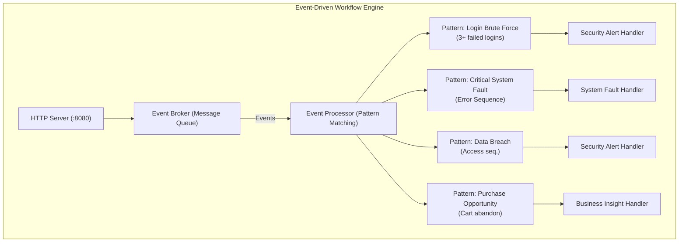
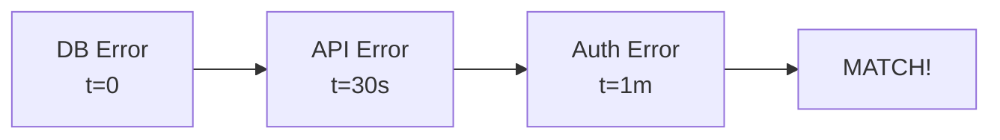
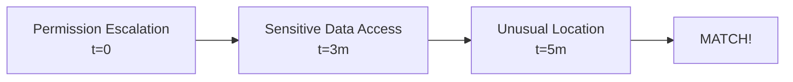

# Event-Driven Workflow Architecture

This diagram visualizes the complex event pattern processing system with its components.

## Event-Driven Workflow Engine

## Event Pattern Detection Example

This visualizes how the login brute force pattern is detected over time.

| Time | Event | Buffer | Pattern Match |
|------|-------|--------|---------------|
| 00:00 | `user.login.failed` | [1] | No match (< 3) |
| 00:01 | `user.login.failed` | [1,2] | No match (< 3) |
| 00:03 | `user.login.failed` | [1,2,3] | MATCH! (>= 3) |
| 00:04 | `user.login.failed` | [1,2,3,4] | MATCH! (>= 3) |
| ... | | | |
| 00:06 | [5 min window start] | | |
| 00:06 | [event 1 expires] | [2,3,4] | MATCH! (>= 3) |
| 00:07 | [event 2 expires] | [3,4] | No match (< 3) |

## Complex Event Pattern - Critical System Fault

This shows detection of an ordered sequence of events.

> Must occur within a 2-minute window.

## Complex Event Pattern - Data Breach

Shows detection of a potential data breach sequence.

> Must occur within a 10-minute window.
