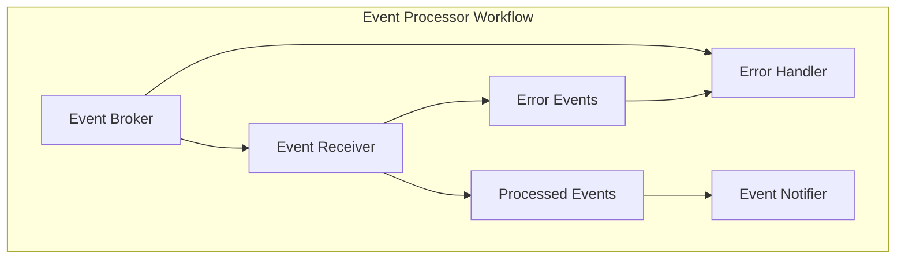
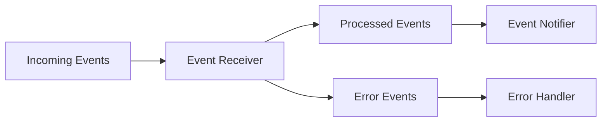

# Event Processor Architecture

This diagram visualizes the event processing workflow with multiple handlers.

## Event Processor Workflow

## Event Flow

This shows how events flow through the system.

