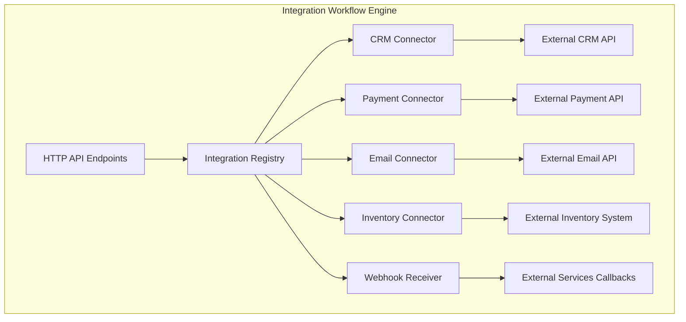
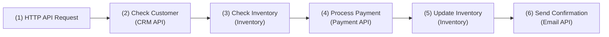
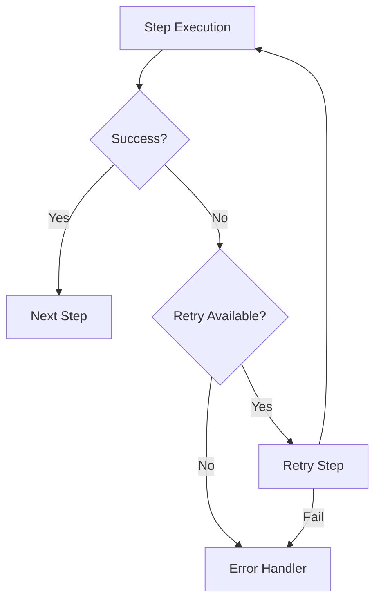
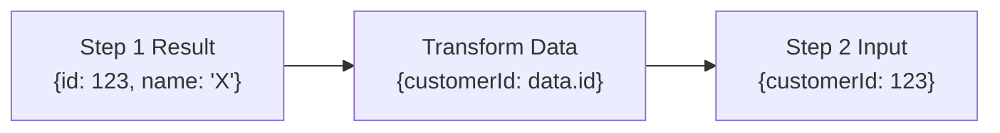

# Integration Workflow Architecture

This diagram visualizes the integration workflow with multiple third-party service connectors.

## Integration Workflow Engine

## Order Processing Integration Flow

This diagram shows the sequence of integration steps for processing an order.

## Integration Step with Retry Logic

This shows how retries work in the integration workflow.

## Data Transformation Between Steps

This shows how data is transformed between steps.

