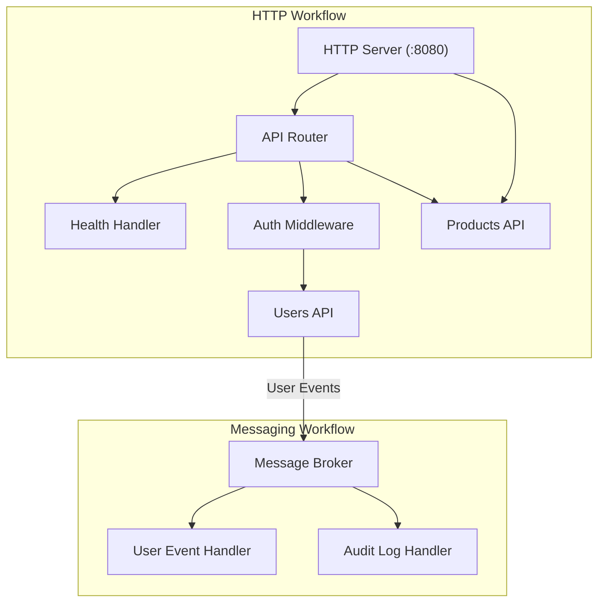
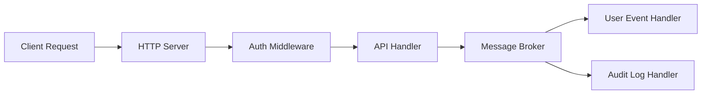

# Multi-Workflow Architecture

This diagram visualizes how multiple workflows (HTTP and messaging) work together.

## Multi-Workflow Engine

## Request Flow

This shows how a request flows through the system.

