# Scheduled Jobs Architecture

This diagram visualizes the scheduled jobs workflow with different schedulers.

## Scheduled Jobs Workflow

## Job Schedule Timeline

This shows when each job runs over a 24-hour period.

```mermaid
gantt
    title Job Schedule Timeline (24-hour period)
    dateFormat HH:mm
    axisFormat %H:%M

    section Daily
    Report Generation       :d1, 00:00, 1h

    section Hourly
    Data Cleanup (repeats every hour) :h1, 00:00, 24h

    section Minutely
    Health Check + Metrics (every minute) :m1, 00:00, 24h
```

| Schedule | Jobs | Cron Expression |
|----------|------|-----------------|
| **Daily** | Report Generation | `0 0 * * *` (midnight) |
| **Hourly** | Data Cleanup | `0 * * * *` (top of each hour) |
| **Minutely** | Health Check, Metrics Collection | `* * * * *` (every minute) |
