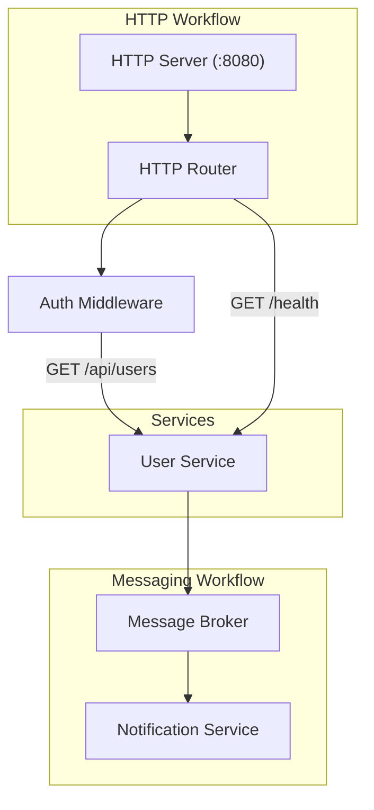
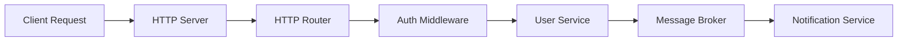

# Simple Workflow Architecture

This diagram visualizes a simple workflow with HTTP and messaging components.

## Simple Workflow Engine

## Request Flow

This shows how a request flows through the system.

