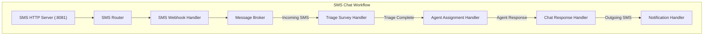
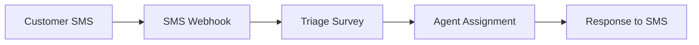

# SMS Chat Workflow Architecture

This diagram visualizes the SMS chat workflow with triage and agent assignment.

## SMS Chat Workflow

## SMS Chat Flow

This shows how messages flow through the SMS chat system.

