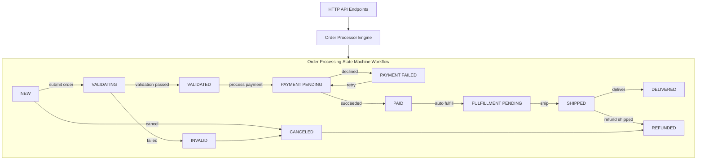
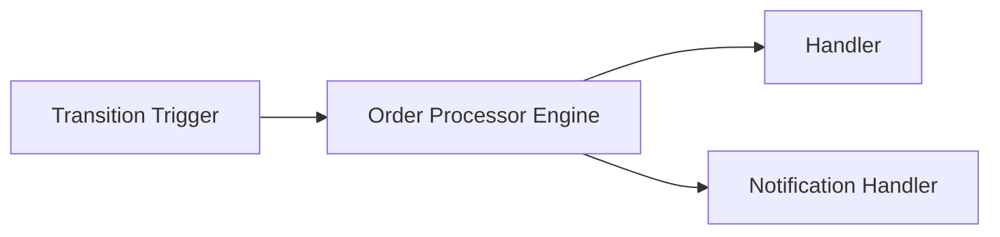
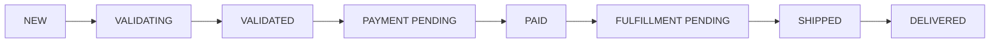
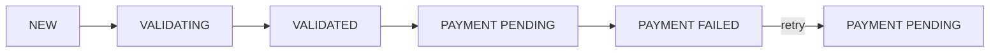

# State Machine Workflow Architecture

This diagram visualizes the order processing state machine workflow.

## State Machine Workflow Engine

## State Transition Triggers and Handlers

This shows how transitions trigger handlers in the order workflow.

## Example Transition Flow - Happy Path

Visualizes a normal order flow from creation to delivery.

## Example Transition Flow - Payment Failure with Retry

Shows how order handles payment failure with retry.

