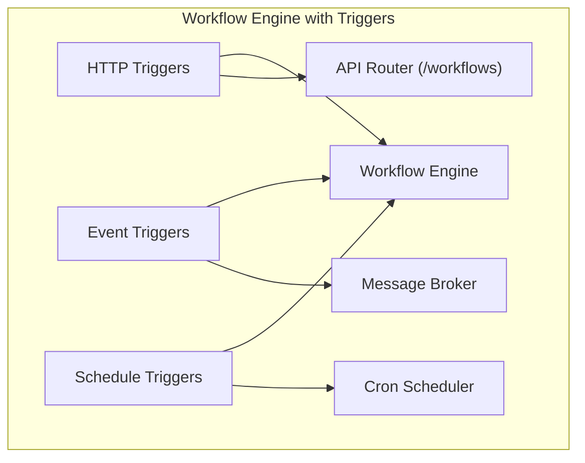
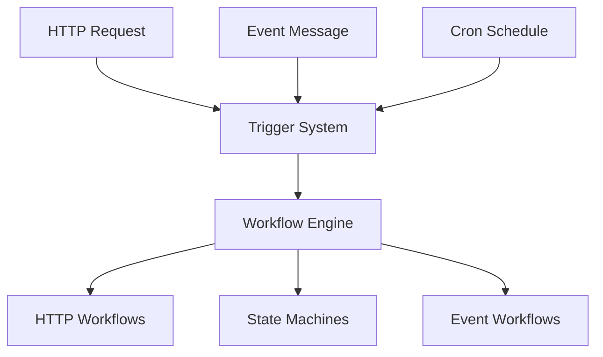
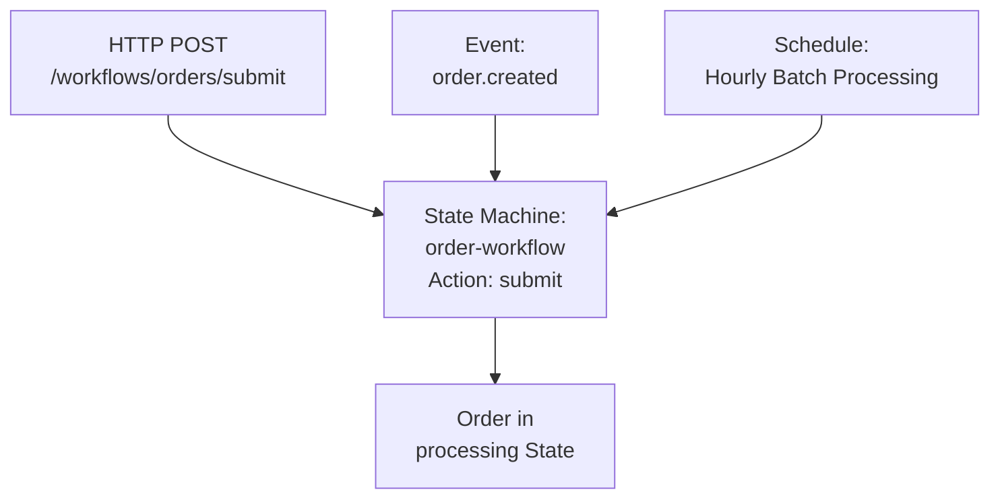

# Trigger-Based Workflow Architecture

This diagram visualizes how triggers connect to workflows.

## Workflow Engine with Triggers

## Workflow Execution Paths

This shows how different triggers initiate the same workflows.

## Example: Order Processing with Multiple Triggers

Shows how an order workflow can be initiated from multiple sources.

